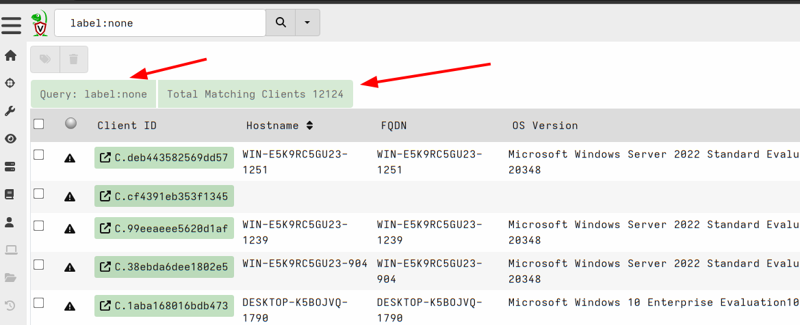
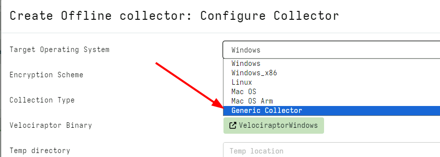
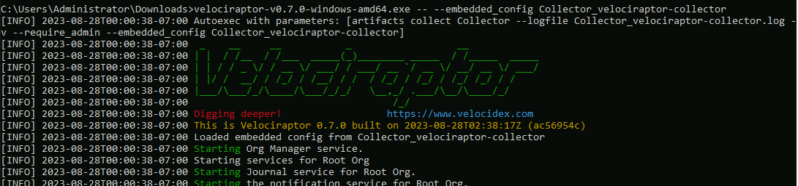

I am very excited to announce the latest Velociraptor release 0.7.0 is
now in release candidate status. Please test and report any issues on the Github issue board.

In this post I will discuss some of the interesting new features.

## GUI improvements

The GUI was updated in this release to improve user workflow and accessibility.

### Enhanced client search

In previous versions client information was written to the datastore
in individual files (one file per client record). This works ok as
long as the number of clients is not too large and the filesystem is
fast. As users are now deploying Velociraptor with larger deployment
sizes we were seeing some slow downs when the number of clients
exceeded 50k.

In this release the client index was rewritten to store all client
records in a single snapshot file, while managing this file in
memory. This approach allows client searching to be extremely quick
even for large numbers of clients well over 100k.

Additionally we are now able to display the total number of hits in
each search giving a more comprehensive indication of the total number
of clients.




### Paged table in Flows List

Velociraptor's collections view shows the list of collections from the
endpoint (or the server). Previously the GUI limited this view to 100
previous collections. This means that for heavily collected clients
it was impossible to view older collections (without custom VQL).

In this release the GUI was updated to include a paged table (with
suitable filtering and sorting capabilities) so all collections can be
accessed.


## VQL Plugins and artifacts


### Chrome artifacts

Added a leveldb parser and artifacts around Chrome Session
Storage. This allows to analyse data that is stored by Chrome locally
by various web apps.

### Lnk forensics

This release added a more comprehensive Lnk parser covering off on all
known Lnk file features.  You can access the Lnk file analysis using
the `Windows.Forensics.Lnk artifact.

### Direct S3 accessor

Velociraptor's accessors provide a way to apply the many plugins that
operate on files to other domains. In particular the glob() plugin
allows searching the accessors for filename patterns.

In this release Velociraptor adds an S3 accessor. This allows plugins
to directly operate on S3 buckets. In particular the glob() plugin can
be used to query bucket contents and read files from various
buckets. This capability opens the door for sophisticated automation
around S3 buckets.

### Volume Shadow Copies analysis

Window's Volume Shadow Service (VSS) creates a snapshot of the drive at
a point in time. Forensically, this is sometimes very helpful as it
captures a point in time view of the previous disk state (If the VSS
are still around when we perform our analysis).

Velociraptor provides access to the different VSS volumes via the
`ntfs` accessor, and many artifacts previously provided the ability to
report files that differed between VSS snapshots.

In the 0.7.0 release, Velociraptor adds the `ntfs_vss` accessor. This
accessor automatically considers different snapshots and deduplicates
files that are identical in different snapshots. This makes it much
easier to incorporate VSS analysis into your artifacts.

### The SQLiteHunter project

Many artifacts consist of parsing SQLite files. For example major
browsers use SQLite files heavily.

This release incorporates the SQLiteHunter artifact. A one stop shop
for finding and analyzing SQLite files such as browser artifacts and
OS internal files. Although the project started with SQLite files, it
now automates a lot of artifacts such as `WebCacheV01` parsing and the
Windows Search Service - aka `Windows.edb` (which are `ESE` based
parsers).

This one artifact combines and obsoletes many distinct older
artifacts.

More info at https://github.com/Velocidex/SQLiteHunter

### Glob plugin improvements

The `glob()` plugin is probably the most used plugin in VQL, as it
allows for the efficient search of filenames in the filesystem. While
the glob() plugin can accept a list of glob expressions so the
filesystem walk can be optimized as much as possible, it was
previously difficult to know why a particular reported file was
chosen.

In this release, the glob plugin reports the list of glob expressions
that caused the match to be reported. This allows callers to more
easily combine several file searches into the same plugin call.

### URL style paths

In very old versions of Velociraptor nested paths could be represented
as URL objects. Until now a backwards compatible layer was used to
continue supporting this behavior. In the latest release URL style
paths are no longer supported - use the `pathspec()` function to build
proper `OSPath` objects.

## Server improvements

Velociraptor offers automatic use of let's encrypt
certificates. However, Let's encrypt can only issue certificates for
port 443. This means that the frontend service (which is used to
communicate with clients) has to share the same port as the GUI port
(which is used to serve the GUI application). This makes it hard to
create firewall rules to filter access to the frontend and not to the
GUI when used in this configuration.

In the 0.7.0 release, Velociraptor offers the `GUI.allowed_cidr`
option. If specified, the list of CIDR addresses will specify the
source IP acceptable to the server for connections to the GUI
application (for example `192.168.1.0/24`).

This filtering only applies to the GUI and forms an additional layer
of security protecting the GUI application (in addition to the usual
authentication methods).

### Better handling of out of disk errors

Velociraptor can collect data very quickly and sometimes this can
results in a full disk. Previously a full disk error could cause file
corruption and data loss. In this release the server monitors its free
disk level and disables file writing when the disk is too full. This
avoids data corruption when the disk fills up. When space is freed the
server will automatically start writing again.

## The offline collector

The offline collected is a pre-configured binary which can be used to
automatically collect any artifacts into a ZIP file and optionally
upload the file to a remote system like a cloud bucket or SMB share.

Previously, Velociraptor would embed the configuration file into the
binary so it only needed to be executed (e.g. double clicked). While
this method is still supported on Windows, it turned out that on MacOS
this is no longer supported as binaries can not be modified after
build. Even on Windows, embedding the configuration will invalidate
the signature.

In this release a new type of collector is available `Generic`



This will embed the configuration into a shell script instead of the
Velociraptor binary. Users can then launch the offline collector using
the unmodified official binary by specifying the `--embedded_config`
flag:

```
velociraptor-v0.7.0-windows-amd64.exe -- --embedded_config Collector_velociraptor-collector
```



While the method is required for MacOS, it can also be used for
Windows in order to preserve the binary signature.

## Conclusions

There are many more new features and bug fixes in the latest
release.

If you like the new features, take [Velociraptor for a
spin](https://github.com/Velocidex/velociraptor)!  It is available
on GitHub under an open source license. As always please file issues
on the bug tracker or ask questions on our mailing list
[velociraptor-discuss@googlegroups.com](mailto:velociraptor-discuss@googlegroups.com)
. You can also chat with us directly on discord
[https://www.velocidex.com/discord](https://www.velocidex.com/discord)
.
