I am very excited to announce the latest Velociraptor release 0.7.1 is
now in release candidate status.

In this post I will discuss some of the interesting new features.

## GUI improvements

The GUI was updated in this release to improve user workflow and accessibility.

### Notebook improvements

Velociraptor uses `notebooks` extensively to facilitate collaboration,
and post processing. There are currently three types of notebooks:

1. Global Notebooks - these are available from the GUI sidebar and can
   be shared with other users for a collaborative workflow.
2. Collection notebooks - these are attached to specific collections
   and allow post processing the collection results.
3. Hunt notebooks - are attached to a hunt and allow post processing
   of the collection data from a hunt.

This release further develops the `Global notebooks` workflow as a
central place for collecting and sharing analysis results.

#### Templated notebooks

Many users use notebooks heavily to organize their investigation and
guide users on what to collect. While `Collection notebooks` and `Hunt
notebooks` can already include templates there was no way to customize
the default `Global notebook`.

In this release, we define a new type of Artifact of type `NOTEBOOK`
which allows a user to define a template for global notebooks.

In this example I will create such a template to help users gather
server information about clients. I click on the artifact editor in
the sidebar, then select `Notebook Templates` from the search
screen. I then edit the built in `Notebooks.Default` artifact.

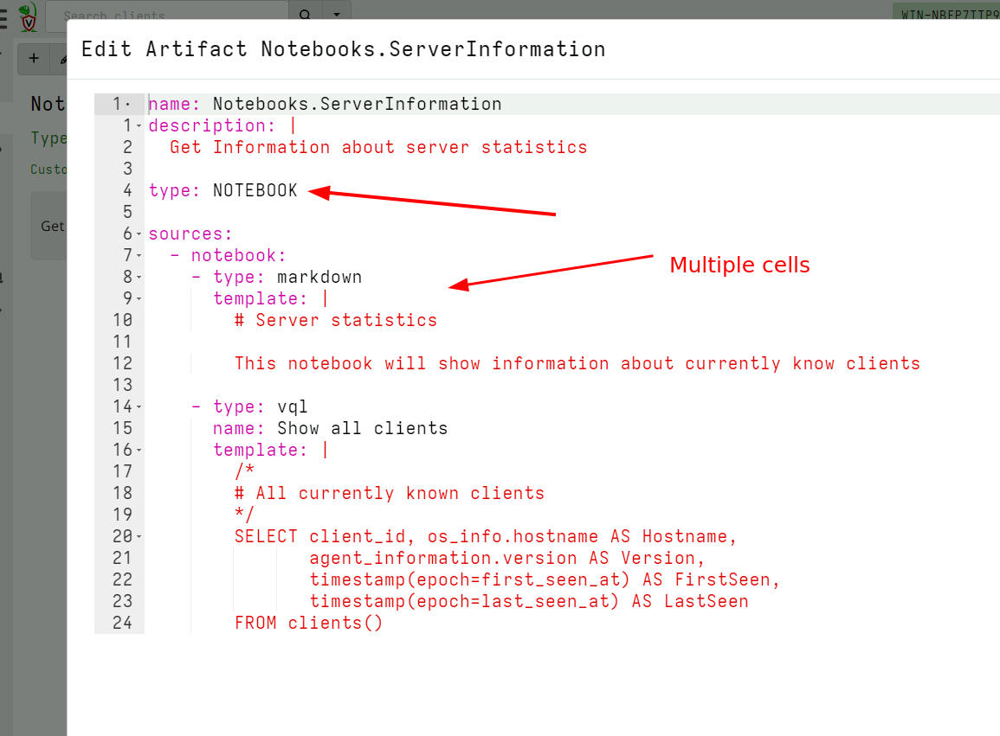

I can define multiple cells in the notebook. Cells can be of type
`vql`, `markdown` or `vql_suggestion`. I usually use the `markdown`
cells to write instructions for users of how to use my notebook, while
`vql` cells can run queries like schedule collections or preset hunts.

Next I select the `Global notebooks` in the sidebar and click the `New
Notebook` button. This brings up a wizard that allows me to create a
new global notebook. After filling in the name of the notebook and
electing which user to share it with, I can choose the template for
this notebook.

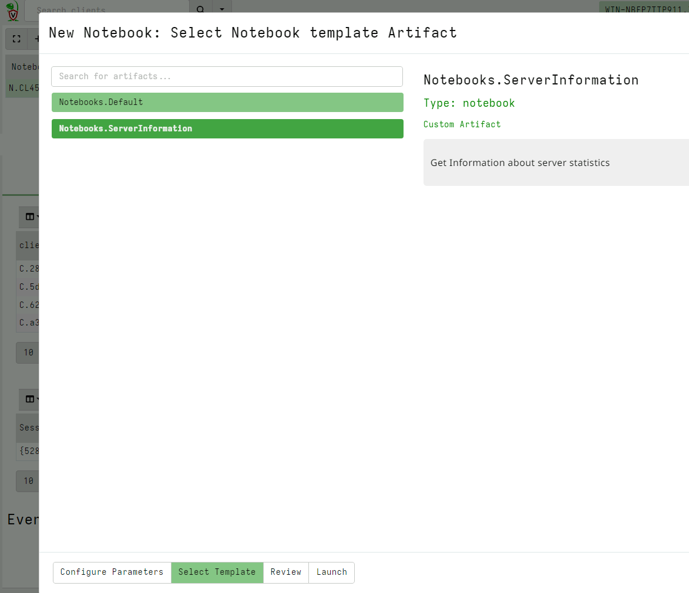

I can see my newly added notebook template and select it.

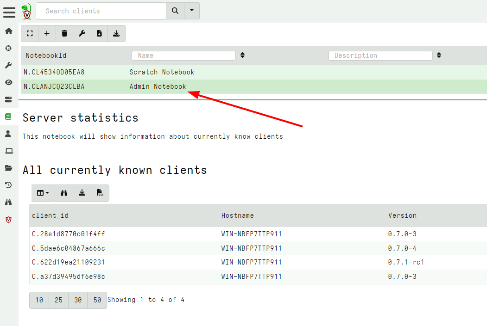

#### Copying notebook cells

In this release, Velociraptor allows copying of a cell from any
notebook to the Global notebooks. This facilitates a workflow where
users may filter, post process and identify interesting artifacts in
various hunt notebooks or specific collection notebooks, but then copy
the post processed cell into a central Global notebook for
collaboration.

For the next example, I collect the server artifact
`Server.Information.Clients` and post process the results in the
notebook to count the different clients by OS.

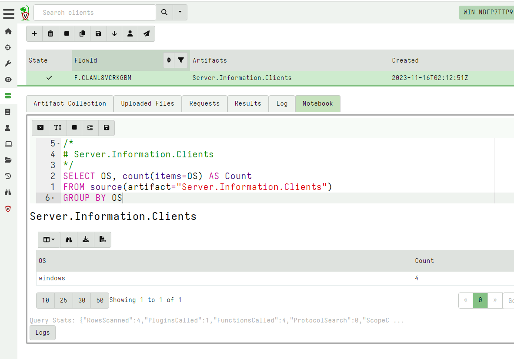

Now that I am happy with this query, I want to copy the cell to my
`Admin Notebook` which I created earlier.

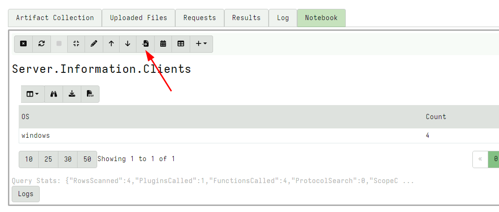

I can then select which `Global noteboook` to copy the cell into.

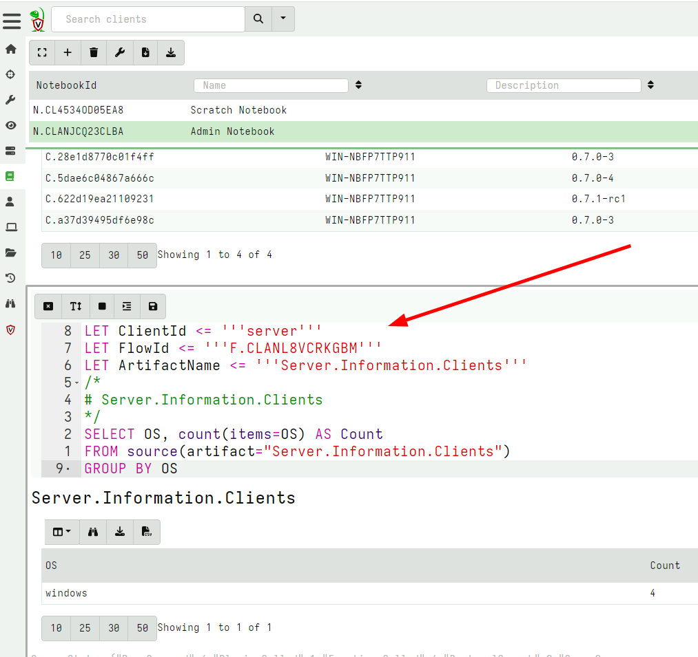

Velociraptor will copy the cell to the target notebook and add VQL
statements to still refer to the original collection. This allows
users of the global notebook to further refine the query if needed.

This work flow allows better collaboration between users.

### VFS Downloads

Velociraptor's VFS view is an interactive view of the endpoint's
filesystem. Users can navigate the remote filesystem using a familiar
tree based navigation and interactively fetch various files from the
endpoint.

Before the 0.7.1 release, the user was able to download and preview
individual files in the GUI but it was difficult to retrieve multiple
files downloaded into the VFS.

In the 0.7.1 release, there is a new GUI button to initiate a
collection from the VFS itself. This allows the user to download all
or only some of the files they had previously interactively downloaded
into the VFS.

For example consider the following screenshot that shows a few files
downloaded into the VFS.

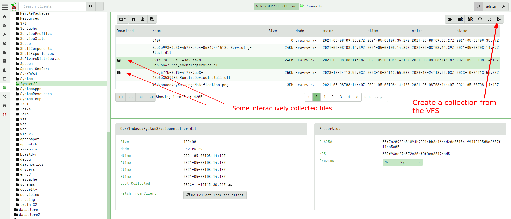

I can initiate a collection from the VFS - This is a server artifact
(similar to the usual File Finder artifacts) that simply traverses the
VFS with a glob uploading all files into a single collection.

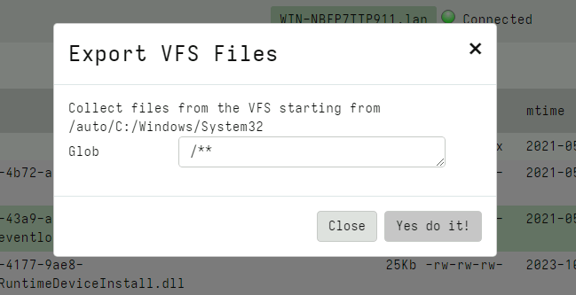

Using the glob I can choose to retrieve files with a particular
filename pattern (e.g. only executables) or all files.

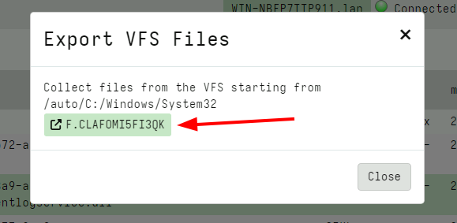

Finally the GUI shows a link to the collected flow where I can inspect
the files or prepare a download zip just like any other collection.


## New VQL plugins and capabilities

This release introduce an exciting new capability: `Built-in Sigma Support`.

### Built-in Sigma Support

Sigma is fast emerging as a popular standard for writing and
distributing detections. Sigma was originally designed as a portable
notation for multiple backend SIEM products: Detections expressed in
Sigma rules can be converted (compiled) into a target SIEM query
language (for example into Elastic queries) to run on the target SIEM.

Velociraptor is not really a SIEM in the sense that we do not usually
forward all events to a central storage location where large queries
can run on it. Instead, Velociraptor's philosophy is to bring the
query to the endpoint itself.

In Velociraptor, Sigma rules can directly be used on the endpoint,
without the need to forwards all the events off the system first! This
makes Sigma a powerful tool for initial triage:

* Apply a large number of Sigma rules on the local event log files.
* Those rules that trigger immediately surface potentially malicious
  activity for further scrutiny.

This can be done quickly and at scale to narrow down on potentially
interesting hosts during an IR. A great demonstration of this approach
can be seen in the Video [Live Incident Response with
Velociraptor](https://youtu.be/Q1IoGX--814?si=sRu1o7uAJqezjIwY&t=3858)
where Eric Capuano uses the `Hayabusa` tool deployed via Velociraptor to
quickly identify the attack techniques evident on the endpoint.

Previously we could only apply Sigma rules in Velociraptor by bundling
the `Hayabusa` tool - which presents a curated set of Sigma rules but
runs locally. In this release Sigma matching is done natively in
Velociraptor and therefore the [Velociraptor
Sigma](https://sigma.velocidex.com) project simply curates the same
rules that `Hayabusa` curates but does not require the `Hayabusa`
binary itself.

You can read the full [Sigma In Velociraptor]({}) blog post that
describes this feature in great detail, but here I will quickly show
how it can be used to great effect.

First I will import the set of curated Sigma rules from the
`Velociraptor Sigma` project by collecting the
`Server.Import.CuratedSigma` server artifact.


This will import a new artifact to my system with up to date Sigma
rules, divided into different `Status`, `Rule Level` etc. For this
example I will select the `Stable` rules at a `Critical Level`.

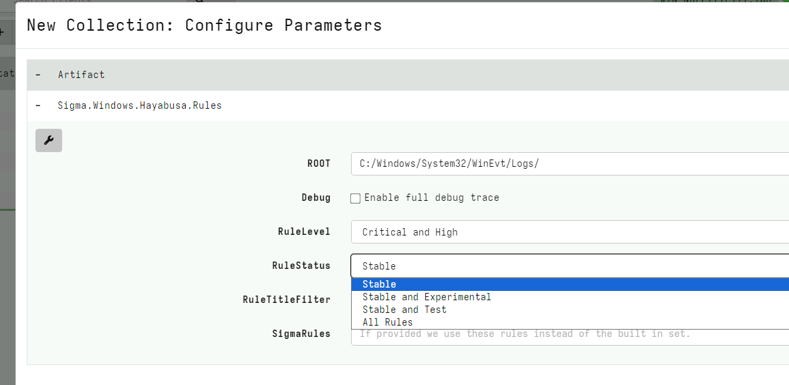

After launching the collection, the artifact will return all the
matching rules and their relevant events. This is a quick artifact
taking less than a minute on my test system. I immediately see
interesting hits.

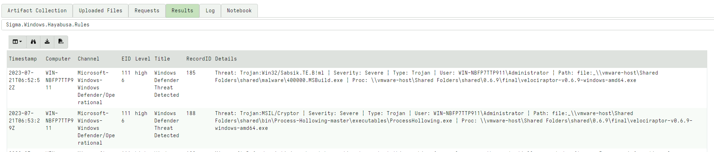

### Using Sigma rules for live monitoring

Sigma rules can be used on more than just log files. The Velociraptor
Sigma project also provides monitoring rules that can be used on live
systems for real time monitoring.

The `Velociraptor Hayabusa Live Detection` option in the Curated
import artifact will import an event monitoring version of the same
curated Sigma rules. After adding the rule to the client's monitoring
rules with the GUI, I can receive interesting events for matching
rules:

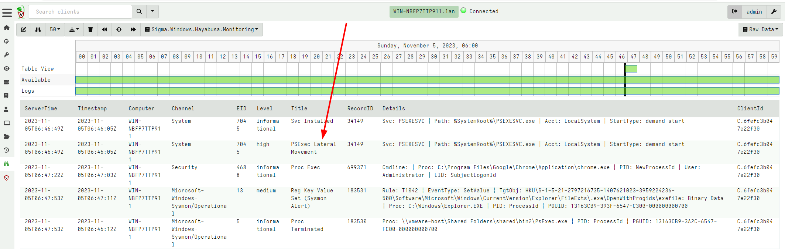


## Other improvements

### SSH/SCP accessor

Velociraptor normally runs on the end point and can directly collect
evidence from the endpoint. However, many devices on the network can
not install an endpoint agent - either because the operating system is
not supported (for example embedded versions of Linux) or due to
policy.

When we need to investigate such systems we often can only access them
by Secure Shell (SSH). In the 0.7.1 release, Velociraptor has an `ssh`
accessor which allows all plugins that normally use the filesystem to
transparently use SSH instead.

For example, consider the `glob()` plugin which searches for files.

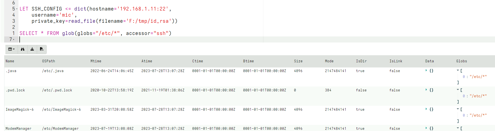

We can specify that the `glob()` use the `ssh` accessor to access the
remote system. By setting the `SSH_CONFIG` VQL variable, the accessor
is able to use the locally stored private key to be able to
authenticate with the remote system to access remote files.

We can combine this new accessor with the `remapping` feature to
reconfigure the VQL engine to substitute the `auto` accessor with the
`ssh` accessor when any plugin attempts to access files. This allows
us to transparently use the same artifacts that would access files
locally, but this time transparently will access these files over SSH:

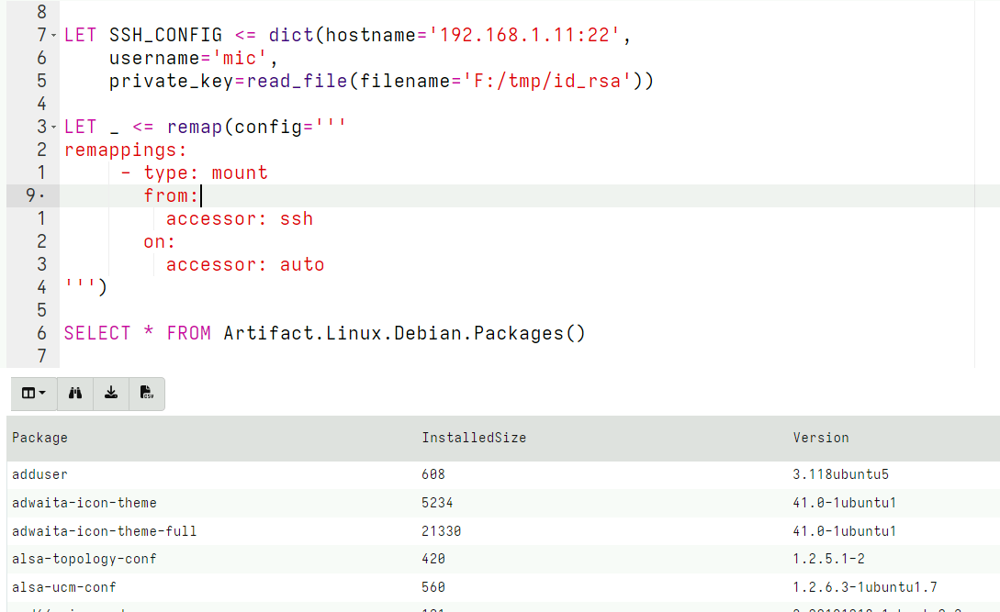

This example shows how to use the SSH accessor to investigate a debian
system and collect the `Linux.Debian.Packages` artifact from it over
SSH.


### Distributed notebook processing

While Velociraptor is very efficient and fast, and can support a large
number of endpoints connected to the server, many users told us that
on busy servers, running notebook queries can affect server
performance. This is because a notebook query can be quite intense
(e.g. Sorting or Grouping a large data set) and in the default
configuration the same server is collecting data from clients,
performing hunts, and also running the notebook queries.

This release allows notebook processors to be run in another
process. In Multi-Frontend configurations (also called Master/Minion
configuration), the Minion nodes will now offer to perform notebook
queries away from the master node. This allows this sudden workload to
be distributed to other nodes in the cluster and improve server and
GUI performance.

### ETW Multiplexing

Previous support for Event Tracing For Windows (ETW) was
rudimentary. Each query that called the `watch_etw()` plugin to
receive the event stream from a particular provider created a new ETW
session. Since the total number of ETW sessions on the system is
limited to 64, this used previous resources.

In 0.7.1 the ETW subsystem was overhauled with the ability to
multiplex many ETW watchers on top of the same session. The ETW
sessions are created and destroyed on demand. This allows us to more
efficiently track many more ETW providers with minimal impact on the
system.

Additionally the `etw_sessions()` plugin can show statistics for all
sessions currently running including the number of dropped events.

### Artifacts can be hidden in the GUI

Velociraptor comes with a large number of built in artifacts. This can
be confusing for new users and admins may want to hide artifacts in
the GUI.

You can now hide an artifact from the GUI using the
`artifact_set_metadata()` VQL function. For example the following
query will hide all artifacts which do not have `Linux` in their name.

```sql
SELECT *, artifact_set_metadata(hidden=TRUE, name=name)
FROM artifact_definitions()
WHERE NOT name =~ "Linux"
```

Only Linux related artifacts will now be visible in the GUI

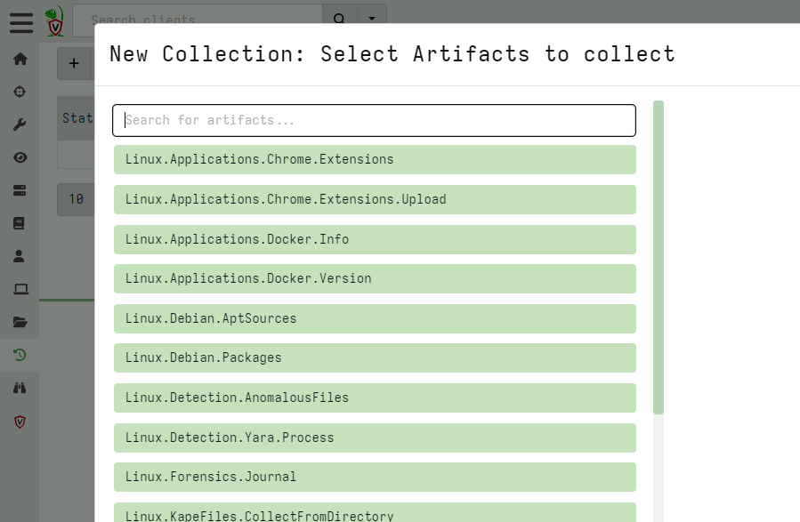

### Local encrypted storage for clients.

It is sometimes useful to write data locally on endpoints instead of
transferring the data to the server. For example, if the client is not
connected to the internet for long periods it is useful to write data
locally. Also useful is to write data in case we want to recover it
later during an investigation.

The downside of writing data locally on the endpoints is that this
data may be accessed if the endpoint is later compromised. If the data
contains sensitive information this can be used by an attacker. This
is also primarily the reason that Velociraptor does not write a log
file on the endpoint. Unfortunately this makes it difficult to debug
issues.

The 0.7.1 release introduces a secure local log file format. This
allows the Velociraptor client to write to the local disk in a secure
way. Once written the data can only be decrypted by the server.

While any data can be written to the encrypted local file, the
`Generic.Client.LocalLogs` artifact allows Velociraptor client logs to
be written at runtime.

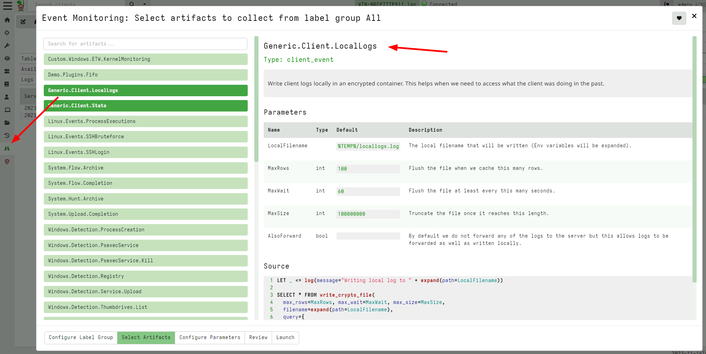

To read these locally stored logs I can fetch them using the
`Generic.Client.LocalLogsRetrieve` artifact to retrieve the encrypted
local file. The file is encrypted using the server's public key and
can only be decrypted on the server.

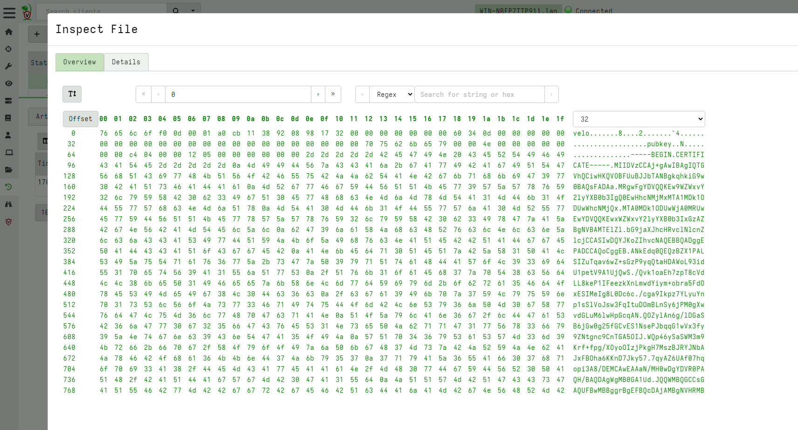

Once on the server, I can decrypt the file using the collection's
notebook which automatically decrypts the uploaded file.

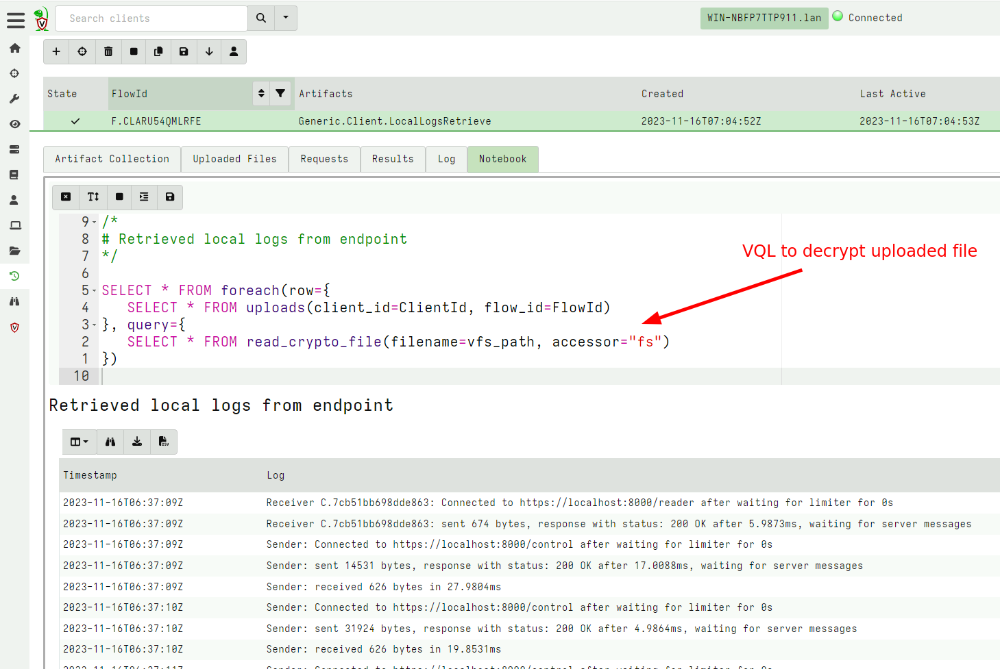

## Conclusions

There are many more new features and bug fixes in the latest release.

If you like the new features, take [Velociraptor for a
spin](https://github.com/Velocidex/velociraptor)!  It is available
on GitHub under an open source license. As always please file issues
on the bug tracker or ask questions on our mailing list
[velociraptor-discuss@googlegroups.com](mailto:velociraptor-discuss@googlegroups.com)
. You can also chat with us directly on discord
[https://www.velocidex.com/discord](https://www.velocidex.com/discord)
.
