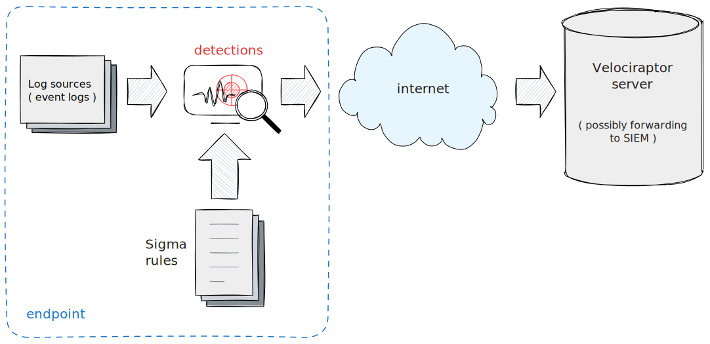
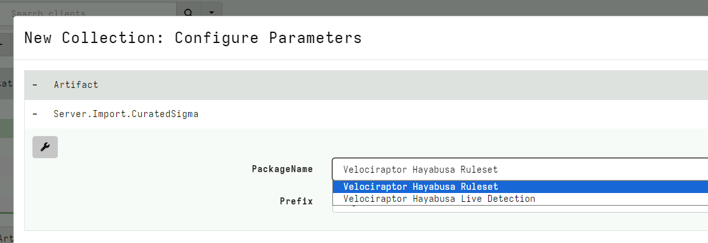
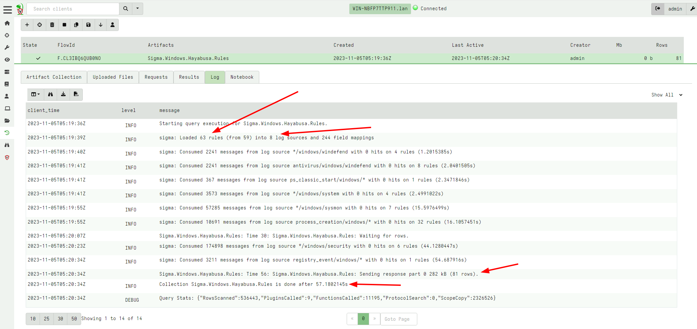
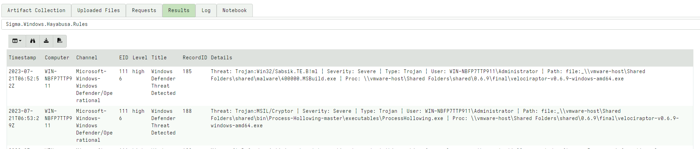
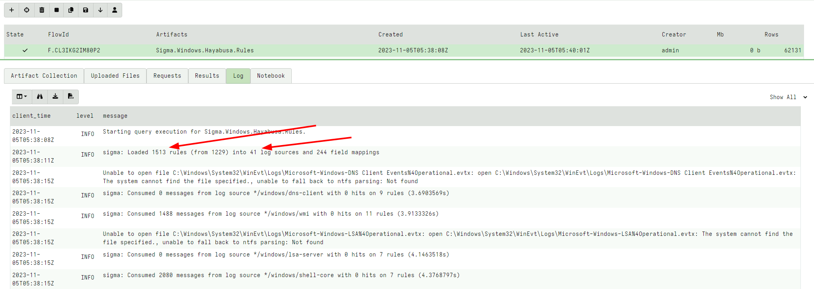
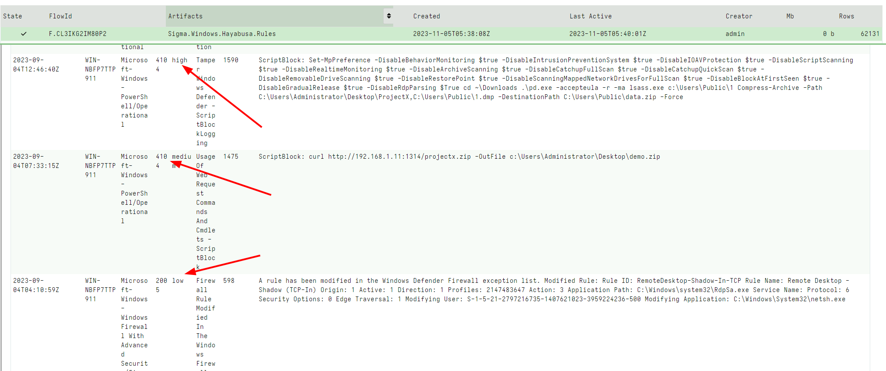
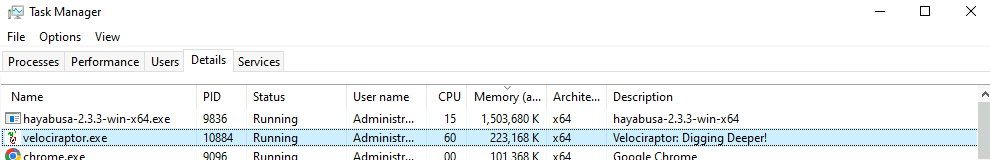
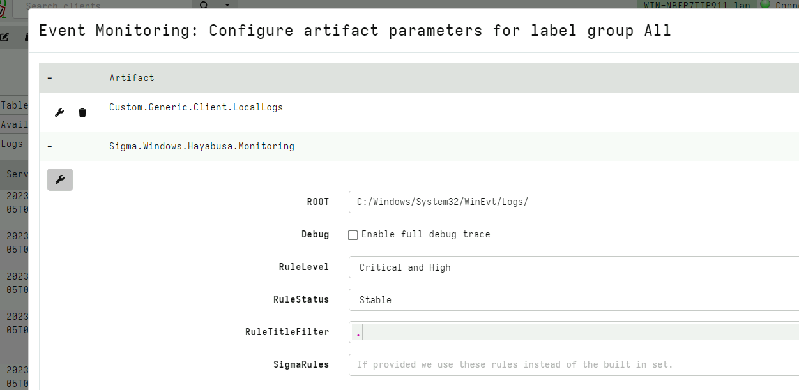
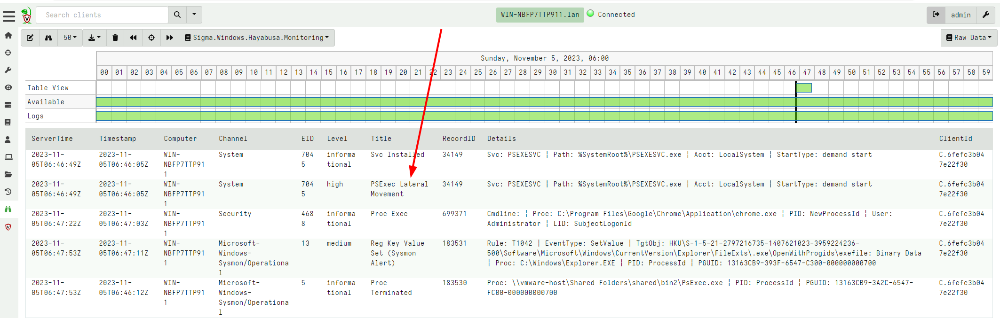

This page discusses how Sigma is implemented and used within
Velociraptor.


## What is Sigma?

Detection engineering is an evolving field with many practitioners
developing and evolving signatures rapidly, as new threats emerge and
better detection capabilities are introduced. However, much of the
time the specifics of how to write detection rules depend on the
underlying software and detection engine. For example, a particular
detection rule written to work on Elastic based SIEM is not easy to
port to a different platform (e.g. Splunk).

Sigma is an attempt to abstract away the specifics of the detection
engine into a generic high level signature description. The `Sigma
Rule`, theoretically, does not target a specific detection product,
but instead described high level concepts like process execution,
registry access etc.

By providing a high level taxonomy for practitioners, detection rules
can be exchanged with others in the community, even people using
different backend detection engines.

Traditionally, a Sigma rule is not directly usable by many backend
detection engines. Instead a `Sigma Compiler` transforms the Sigma
rule to a specific query in the backend's native query language. For
example a Sigma rule may be "compiled" into an Elastic Query, or
Splunk Query as needed.

While the full details of Sigma are described in the Main Sigma page
https://sigmahq.io/ , in this post we will discuss as a high level
those aspects of Sigma directly relevant to the Velociraptor
implementation.

## How is Sigma used traditionally?

Sigma was designed to write detection rules for traditional SIEM based
detection engines.


Such a system is shown above:

1. Log Sources like event logs are collected by an endpoint agent
2. Events are forwarded over the network to a SIEM or central data lake solution.
3. Sigma Rules are compiled into native queries against the SIEM solution
4. The SIEM or data lake implementation uncovers detections based on this query.

In practice, each SIEM product has a unique way of normalizing the
available data to fit within their own database schema. For example
the Elastic ecosystem uses the [Elastic Common Schema
(ECS)](https://www.elastic.co/guide/en/ecs/current/index.html). The
ECS schema converts from certain fields in the original event log file
to different field names within the ECS - for example the field
`System.TimeCreated.SystemTime` in the event log file is translated to
the field `@timestamp` by the Elastic agent for storage in the database.

{}

It is often hard to know exactly what the translation is supposed to
be because vendors attempt to normalize many different log sources to
the same schema. In the case of ECS the [reference
documentation](https://www.elastic.co/guide/en/ecs/current/ecs-field-reference.html)
is incredibly vague and we need to resort to reading the code to
figure out the exact field mappings to understand exactly where each
field is gathered from. Additionally, this translation is not always a
simple renaming, but sometimes involves a non-trivial transformation
by the Elastic agent which is not always well documented.

{}

## The Sigma rule

Sigma is designed to be a high level abstracted notation that can
cater for the differences between the backends. This is achieved by
defining yet another layer of abstraction over the original
events. Consider the following reduced Sigma rule ([The full rule here](https://github.com/Yamato-Security/hayabusa-rules/blob/main/sigma/builtin/taskscheduler/win_taskscheduler_lolbin_execution_via_task_scheduler.yml)):

```yaml
title: Scheduled Task Executed Uncommon LOLBIN
logsource:
    product: windows
    service: taskscheduler
detection:
    taskscheduler:
        Channel: Microsoft-Windows-TaskScheduler/Operational
    selection:
        EventID: 129
        Path|endswith:
            - \calc.exe
            - \cscript.exe
            - \mshta.exe
            - \mspaint.exe
            - \notepad.exe
            - \regsvr32.exe
            - \wscript.exe
    condition: taskscheduler and selection
```

Above we only included limited fields for the purpose of this discussion.

The rule triggers when the `TaskScheduler` event log file contains an
event id 129 [Task Scheduler launched
task](https://learn.microsoft.com/en-us/previous-versions/windows/it-pro/windows-server-2008-R2-and-2008/cc774964(v=ws.10))
and the process launched ends with one of the executables listed.

To actually match this rule, The Sigma compiler needs to perform two
mappings:

1. The `logsource` is ultimately mapped to the
   `C:/Windows/System32/WinEvt/Logs/Microsoft-Windows-TaskScheduler%4Operational.evtx`
   event log file or whatever table the backend SIEM uses to
   collect/store these events.
2. Each field referenced in the Sigma rule needs to be mapped to the
   field in the actual event. For example in this case the field
   `Path` needs to be translated to the field `EventData.Path` within
   the original event log, or whatever the specific SIEM uses to
   normalize that original field into its own database schema.

### Limitations of the Sigma format

By introducing yet another layer of abstraction over the original
event logs, the analyst needs to learn another taxonomy to reference
the underlying data they are interested in. For example, in the above
rule, the analyst wants to detect events found in the specific log
file on the endpoint, but needs to know that Sigma uses the
`logsource` specification with `product=windows,
service=taskscheduler` to actually refer to that file.

In real life, there is a natural trade off between forwarding more
events from the system (increasing detection capabilities) at the cost
of more network transmission, storage requirement and scaling the
backend database to handle the larger data sizes.

Typically this means that not **all** event logs are forwarded off the
machine, only those that are considered relevant or important are
forwarded. The exact choice of which event logs to forward depends on
both the choice of SIEM vendor and the specific configuration of the
SIEM involved.

For example, while there are a number of officially recognized [log
sources](https://sigmahq.io/docs/basics/log-sources.html) there is no
guarantee that the underlying SIEM actually forwards any of these
logs, and just like in the ECS example given above, there is no
directly documented mapping between the abstract log sources and the
actual files on disk.

To actually use the Sigma rule, we need to provide both the log source
mapping and field mapping to the sigma compiler.  Sigma is not
actually its own matching engine, but simply a translation layer
between an abstract format and the backend SIEM.

Sigma provides a set of compiler modules and field translations for a
number of popular backend SIEMs with varying capabilities and internal
schemas.

In practice, The Sigma rules need to be written with the target SIEM
solution in mind, as well as the specific configuration of the entire
system. For example, if a SIEM rule is written to use the [Sysmon
registry events (event ID
12,13,14)](https://learn.microsoft.com/en-us/sysinternals/downloads/sysmon)
there is no guarantee that these events are actually forwarded from
the endpoint into the SIEM (that depends on collection
considerations), or that the target SIEM even supports these event
types at all.

As an analyst writing Sigma rules, the additional layer of abstraction
might seem pointless - they need to think of their rule in a different
abstract terms to the SIEM that will actually be running these rules,
but at the same time need to know exactly what backend query will be
produced and if this query is even supported on their particular
SIEM. It is very easy to write a rule that simply will not work on
their particular backend SIEM because it uses some feature, log source
or event field that is simply not available.

### Advantages of Sigma

Despite these practical limitations, Sigma has grown in popularity in
recent years because it allows for easy exchange of detection rules
between users of different SIEM backends.

While not perfect, there is a reasonable chance that a Sigma rule
written with one backend SIEM in mind will also work on another,
providing it uses fairly common log sources and commonly collected
event types, and does not use too complicated operators.  This allows
Sigma to be an attractive choice for writing and developing detection
rules, especially for users who need to switch between many backend
systems all the time.


## How is Sigma implemented in Velociraptor?

Velociraptor is not a traditional SIEM and does not rely on a scalable
large backend data mining engine for querying collected data. Instead,
Velociraptor's power lies in its [Velociraptor Query
Language](https://docs.velociraptor.app/docs/vql/) which allows the
endpoint agent itself to query data directly on the endpoint.

This means that Velociraptor has access to all information available
on the endpoint without needing to rely on specific log forwarding
configuration. Instead, queries are run directly on the endpoint and
only matching events are forwarded to the server. This minimizes the
total amount of data that needs to be managed by the server to only
high value, relevant events that already match the Sigma rules.



The above figure outlines the Velociraptor Sigma workflow:

1. Sigma rules are synced to the endpoint via a Standard Velociraptor
   Collection and are applied to an internal Sigma rule matching
   engine.
2. The engine determines which log sources will be used based on the
   actual rule requirement. Parsing additional log sources is easy to
   implement via a VQL query.
3. Events are collected from the relevant local log sources (e.g. by
   parsing the relevant EVTX files) and are compared efficiently
   against the set of Sigma rules target each log source.
4. Only matches are forwarded to the cloud (tagged by the Sigma rules
   by severity levels - e.g. Critical, High, Medium)
5. The Velociraptor server only deals with high value events by
   writing to local storage or forwarding to a SIEM for
   alerting/escalation.

In this arrangement, the event volumes sent to the server are very
small because only post-filtered events are handled.

### The Sigma Velociraptor plugin

As explained above, Sigma is an abstract format which requires
implementations to provide a mapping between `log sources` and actual
concrete implementations of these sources. Before we can match any
Sigma rules in Velociraptor we need to teach Velociraptor how to map
between the log sources mentioned in a Sigma rule and a real VQL query
that will provide events from that source.

This mapping is created using the VQL `sigma_log_sources()`
function. The function receives a list of log source names and their
corresponding VQL queries.

For example, consider the following definition:

```sql
LET LogSources <= sigma_log_sources(
  `*/windows/taskscheduler`={
         SELECT * FROM parse_evtx(
          filename=ROOT+"/Microsoft-Windows-TaskScheduler%4Operational.evtx")
  },
)
```

When Velociraptor encounters the Sigma rule above it will look for a
defined log source with `category=*, product=windows,
service=taskscheduler` forming the following key
`*/windows/taskscheduler`

The second mapping described above is between the rules mentioned in
the Sigma rule and the underlying fields in the actual
event. Velociraptor implements these mapping definitions via `VQL
Lambda` functions.

For example consider the following field mapping definitions:

```sql
LET FieldMapping <= dict(
  Path="x=>x.EventData.Path"
)
```

When Velociraptor attempts to evaluate a field mentioned in the Sigma
rule, the Velociraptor Sigma engine will pass the event to this lambda
function to resolve the actual field required. This allows us to
implement any translation operation between Sigma fields and data
based on the event itself - including more complex enrichment
operators (more on that later!).

After defining the log sources and field mapping, we are ready to
match Sigma rules using the `sigma()` [VQL
plugin](http://docs.velociraptor.app/vql_reference/misc/sigma/).

This plugin receives a number of arguments:

* `rules`: A list of sigma rules to compile and match.
* `log_sources`: A log source object as obtained from the
  `sigma_log_sources()` VQL function described above.
* `field_mapping`: A dict containing a mapping between a rule field
  name and a VQL Lambda to get the value of the field from the
  event.
* `debug`: If enabled we emit all match objects with description of
  what would match.
* `rule_filter`: If specified we use this callback to filter the rules
  for inclusion.Lambda
* `default_details`: If specified we use this callback to determine a
  details column if the sigma rule does not specify it.

For an example of a simple Sigma based artifact, See the
`Windows.Sigma.EventLogs` artifact

## Managing a large repository of Sigma rules

The previous section described how Sigma rule matching is implemented
in Velociraptor, but in practice we typically have a large number of
Sigma rules, perhaps imported from external sources.

There are some challenges with Sigma and some rules are not written
precisely enough to work in Velociraptor. For example, Sigma rules may
reference non-existent log sources, or unknown fields that do not
correspond to anything in the standard field mappings.

For this reason it is best to manage a large Sigma rule set using a
specialized tool `velosigmac`. You can find this tool at
https://sigma.velocidex.com or
https://github.com/Velocidex/velociraptor-sigma-rules

The repository already contains a large number of rules from the Sigma
project as well as [Hayabusa
rules](https://github.com/Yamato-Security/hayabusa-rules), but you can
also add your own rules.

The `velosigmac` tool is controlled via a config file specifying the
various log sources and field mappings, and produces a zip file
containing a Velociraptor artifact.

You can import the curated Sigma rules automatically by collecting the
`Server.Import.CuratedSigma` server artifact.



Currently there are two types of curated artifacts:

1. A Curated ruleset based on the Hayabusa rules. This artifact is a
   regular CLIENT type artifact that can be used to scan all EVTX
   files on the endpoint for rules matches.
2. An Event based monitoring artifact that once installed follows all
   EVTX files to alert on Sigma rule matches in real time.


## Sigma alerting via a CLIENT artifact

Velociraptor is not the only tool that can apply Sigma rules to a live
system. Previously Velociraptor was integrated with
[Hayabusa](https://github.com/Yamato-Security/hayabusa),
[Chainsaw](https://github.com/WithSecureLabs/chainsaw) for quick
triage using Sigma rules.

The ability to triage a system efficiently using Sigma rules allows
first responders to quickly isolate the machines that need further
investigation. In this regard the Sigma rules do not have to be
perfect - they just need to indicate those machines requiring further
work.

By applying a standard set of Sigma signatures to a large numbers of
machines we can identify the interesting hosts quickly. An excellent
demonstration of this technique can be seen in the Video [Live
Incident Response with
Velociraptor](https://youtu.be/Q1IoGX--814?si=sRu1o7uAJqezjIwY&t=3858)
where Eric Capuano uses the Hayabusa tool deployed via Velociraptor to
quickly identify the attack techniques evident on the endpoint.

Now that Sigma is built into the Velociraptor engine itself, using
these signatures is much more efficient. Simple collect the artifact
imported earlier and collect it from the host in question, or start a
hunt for all hosts.


The artifact has a number of configurable settings:
1. `RuleLevel` specifies which rules to include. Including lower level
   rules may detect interesting events but will also increase the
   false positive rate.
2. `RuleStatus` specifies which rule status to include - stable rules
   are more tested and less likely to produce false positives.

In the example below I collected `Critical and High` level rules. It
is instructive to see the query log:



As can be seen the artifact selects 63 rules based on the Rule Level
and Status parameters. These rules end up referencing only 8 log
sources, so Velociraptor will only look at 8 log files - the largest
of these of these is the `System` log which contains 178k events.

Overall, Velociraptor found 81 hits on these Sigma rules in 57
seconds, and immediately we can see some critical information:



Let's select `All Rules` with a status of `Stable and Experimental`



This time, there are 1500 rules matching 41 different log sources. The
additional work required makes Velociraptor take 117 seconds now and
it returns over 62 thousand hits!


The number of hits is too large to manually review, so I typically
just want to know which rules were matched by stacking on the rule
Title:

```sql
SELECT * FROM source(artifact="Sigma.Windows.Hayabusa.Rules")
GROUP BY Title
```

This reduces the number of rows to 62. I can immediately see
interesting hits, even though they may be at low or informational
level.




Typically for this type of collection, I tend to apply most of the
rules because I can post process the hits later on the server, but you
might want to collect only critical rules at first to reduce the
amount of work the Velociraptor client needs to perform.


Using Sigma rules for rapid triage is a particularly attractive
technique as shown above. Previously Velociraptor supported Sigma via
pushing and launching the Hayabusa tool to the endpoint, and
collecting the results from it.

So what advantages are there for natively supporting Sigma withing
Velociraptor?

1. By supporting the rules natively, we can control execution more
   closely. In particular, Velociraptor's CPU and memory controls can
   only work when Velociraptor itself is doing the work. By shelling
   out to an external tool we have no control over how many resources
   Hayabusa is using on the endpoint. Having Sigma as a built in
   capability allows Velociraptor to limit CPU utilization in order to
   minimize the impact on the endpoint.

2. Velociraptor is much more efficient than Hayabusa. Typically
   Velociraptor can match the same number of rules approximately 5
   times faster. However, the most important difference is the much
   reduced memory requirements. In my testing, Hayabusa typically uses
   about 1-2Gb of memory on the endpoint vs. about 200-300mb used by
   Velociraptor, making Hayabusa too risky to deploy very widely.



# Sigma alerting via real time monitoring artifacts

Velociraptor's VQL queries are streaming queries. This means they
deliver rows as soon as they become available, while the query itself
does not have to terminate. This facility is called [`Client
Monitoring` or `Event`
queries](https://docs.velociraptor.app/docs/client_monitoring/).

Since the built-in Sigma matching engine is also streaming and
asynchronous, it is also possible to use event queries for log
sources.

The `Velociraptor Hayabusa Live Detection` option in the Curated
import artifact will import an event monitoring version of the same
curated Sigma rules. I can configure the artifact in the usual way.



This time the endpoint will forward detection events to the server in
real time.



In the above I can see immediately suspicious use of `PSExec` in real
time!

# Conclusions

While Sigma itself is not a matching engine, it presents a convenient
abstraction over other matching engines. Integrating a Sigma matching
engine within Velociraptor allows users to add easy to read and
maintainable rules specifically designed for detection. The built in
Sigma matching engine is extremely fast while being built on top of
VQL.

This makes is flexible - it is possible to add arbitrary logs sources
from any VQL query. For example log sources based on ETW are already
in the works. This engine can efficiently match thousands of rules on
the endpoint, either in real time, or from historical sources.

Sigma presents a lot of opportunities to extend the detection
capabilities when running directly on the endpoint. Unlike using Sigma
as an interface to a SIEM where we are really at the mercy of the log
sources and fields that are forwarded by the collection agent and the
SIEM, Sigma rules on the endpoint can refer to any log source - be it
an event log or other more traditional sources of evidence, such as
Volatile information like process information, registry keys or
networking information.
