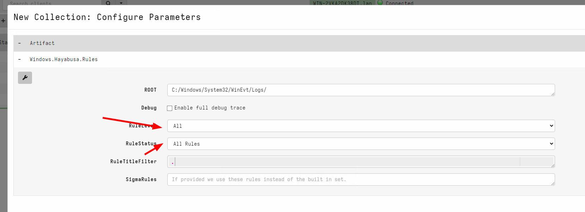
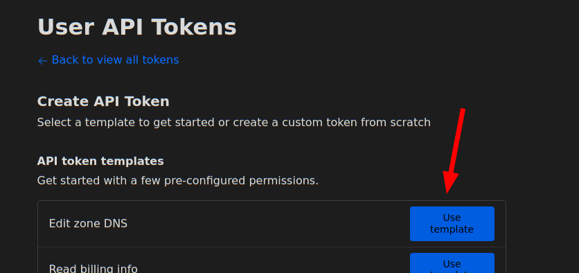

I am very excited to announce that the latest Velociraptor release
0.72 is now available. You can also watch a video walkthrough of this
post here https://www.youtube.com/watch?v=FwmFYmTQxeA

In this post I will discuss some of the interesting new features.

## Version scheme update

Traditionally Velociraptor followed the GRR version format and that
has 4 numbers - so we had 0.6.5 and then if we needed to do a patch
release we would do 0.6.5-1 etc.

It turns out this is not compatible with Semantic Versioning exactly
which needs to have exactly 3 versions: a `MAJOR` version, a `MINOR`
version and a `PATCH` version. This causes problems with packaging
systems which expect semantic versioning like that for example `RPM`,
`DEB` or `MSI`. We also use Semantic Versioning internally to compare
versions (for example to determine if we should upgrade a Tool
definition )

So in this release we are taking the brave step of conforming with
Semantic Versioning more correctly and officially dropping the second
dot to have a `MAJOR` version of 0, a `MINOR` version of 72 and then
`PATCH` releases after that (starting with 0).

That means our next version will be `0.72.0` and if we need to release
patches after the release it will be `0.72.1` , `0.72.2` etc.

## EWF Support

Velociraptor has introduced the ability to analyze dead disk images in
the past. Although we don't need to analyze disk images very often,
the need comes up occasionally.

While previously Velociraptor only supported analysis of DD images
(AKA "Raw images"). Most people use a standard acquisition software to
acquire the image which uses the common EWF format to compress the
image.

In this release, Velociraptor supports EWF (AKA E01) format using the
`ewf` accessor. This allows Velociraptor to analyze E01 image sets.

To analyse dead disk images use the following steps:

1. Create a remapping configuration that maps the disk accessors into
   the E01 image. This automatically diverts VQL functions that look
   at the filesystem into the image instead of using the host's
   filesystem. In this release you can just point the
   `--add_windows_disk` option to the first disk of the EWF disk set
   (the other parts are expected to be in the same directory and will
   be automatically loaded).

   The following creates a remapping file by recognizing the windows
   partition in the disk image.

   ```sh
   $ velociraptor-v0.72-rc1-linux-amd64  deaddisk \
      --add_windows_disk=/tmp/e01/image.E01 /tmp/remapping.yaml -v
   ```

2. Next we launch a client with the remapping file. This causes any
   VQL queries that access the filesystem to come from the image
   instead of the host. Other than that the client looks like a
   regular client and will connect to the Velociraptor server just
   like any other client. To ensure that this client is unique you can
   override the writeback location (where the client id is stored) to
   a new file.

   ```sh
   $ velociraptor-v0.72-rc1-linux-amd64  --remap /tmp/remapping.yaml \
      --config ~/client.config.yaml client -v \
      --config.client-writeback-linux=/tmp/remapping.writeback.yaml
   ```


## Allow remapping clients to use SSH accessor

Sometimes we can not deploy the Velociraptor client on a remote
system. For example, it might be an edge device like an embedded Linux
system or it may not be directly supported by Velociraptor.

In 0.7.1, Velociraptor introduced the `ssh` accessor which allows VQL
queries to use a remote `ssh` connection to access remote files.

This release added the ability to apply remapping in a similar way to
the dead disk image method above to run a `Virtual Client` which
connects to the remote system via SSH and emulates filesystem access
over the `sftp` protocol.

To use this feature you can write a remapping file that maps the ssh
accessor instead of the `file` and `auto` accessors:

```yaml
remappings:
- type: permissions
  permissions:
  - COLLECT_CLIENT
  - FILESYSTEM_READ
  - READ_RESULTS
  - MACHINE_STATE
- type: impersonation
  os: linux
  hostname: RemoteSSH
- type: mount
  scope: |
    LET SSH_CONFIG <= dict(hostname='localhost:22',
      username='test',
      private_key=read_file(filename='/home/test/.ssh/id_rsa'))

  from:
    accessor: ssh

  "on":
    accessor: auto
    path_type: linux

- type: mount
  scope: |
    LET SSH_CONFIG <= dict(hostname='localhost:22',
      username='test',
      private_key=read_file(filename='/home/test/.ssh/id_rsa'))

  from:
    accessor: ssh

  "on":
    accessor: file
    path_type: linux
```

Now you can start a client with this remapping file to virtualize
access to the remote system via SSH.

```
$ velociraptor-v0.72-rc1-linux-amd64  --remap /tmp/remap_ssh.yaml \
   --config client.config.yaml client -v \
   --config.client-writeback-linux=/tmp/remapping.writeback_ssh.yaml \
   --config.client-local-buffer-disk-size=0
```


## GUI Changes

The GUI has been improved in this release.

### Inbuilt Stacking support

One very common task in DFIR is
[stacking](https://www.youtube.com/watch?v=nJNMLxmq9w8). This is a
powerful technique to quickly understand what had happened on the
endpoint and what is normal (and by extension unusual) on an endpoint.

While Velociraptor has always been able to do stacking within a post
processing notebook by using the `GROUP BY` VQL operator to count the
number of occurrences broken by category. When the user wanted to
actually see all those items, they needed to run a second VQL query to
filter only those items. This made it cumbersome and inefficient to
review large numbers of groups.

In the latest release, stacking is built right into the GUI for fast
and efficient operation. I will demonstrate how to use it with the
example of the Velociraptor Sigma artifacts.

For this example, assume I approach a new endpoint and I really don't
know where to start - is this a suspicious endpoint? Is it normal?

First I will import the Sigma artifacts into my server. The
Velociraptor Sigma project maintains this artifact at
https://sigma.velocidex.com


I will import the `Velociraptor Hayabusa Ruleset` which allows me to
apply the rules maintained by the [Hayabusa
project](https://github.com/Yamato-Security/hayabusa) to static event
log files on the endpoint. The ruleset is extensive and rules are
broken down by rule level and rule status. However in this case I want
to try out all the rules - including very noisy ones because I want to
get an overview of what might have happened on this endpoint.



The Hayabusa ruleset is extensive and might collect many false
positives. In this case it took around 6 minutes to apply the rules on
all the event log files and returned over 60k hits from about 4200
rules.

Generally it is impractical to review every single hit, so we
typically rely on Stacking the results using a query like

```vql
SELECT *, count() AS Count
FROM source(artifact="Windows.Hayabusa.Rules")
GROUP BY Title ORDER BY Count DESC
```


We immediately see that almost half the rules are triggered by
informational DNS queries, but if we wanted to look at those we would
have to issue another query

```vql
SELECT *
FROM source(artifact="Windows.Hayabusa.Rules")
WHERE Title =~ "DNS Query"
```

In this release, stacking is built directly into the GUI making it a
lot easier to work with. The way this works is by performing the
stacking operation at the same time as sorting a column.

I will stack by Title by clicking the sort icon at the top of the column


Once the column is sorted, a stacking icon will appear next to
it. Clicking on that icon will display the stacking dialog view. This
view shows the different unique values of the selected column and the
total number of items of that value. In our case it shows the total
number of times the specific rule has fired.


Clicking the icon in each row seeks the table immediately to view all
the rows with the same `Title` value. In this case I want to quickly
view the hits from the `Windows Defender Threat Detected` rule.


Using this technique I can quickly review the most interesting rules
and their corresponding hits directly in the GUI without needing to
recalculate anything.


### Undo/Redo for notebook cells

Velociraptor offers an easy way to experiment and explore data with
VQL queries in the notebook interface. Naturally exploring the data
requires going back and forth between different VQL queries.

In this release, Velociraptor keeps several versions of each VQL cell
(by default 5) so as users explore different queries they can easily
undo and redo queries. This makes exploring data much quicker as you
can go back to a previous version instantly.


### Hunt view GUI is now paged

Previously hunts were presented in a table with limited size. In this
release, the hunt table is paged and searchable/sortable. This brings
the hunts table into line with the other tables in the interface and
allows an unlimited number of hunts to be viewable in the system.


## Secret Management

Many Velociraptor plugins require secrets to operate. For example, the
`ssh` accessor requires a private key or password to log into the
remote system. Similarly the `s3` or `smb` accessors requires
credentials to upload to the remote file servers. Many connections
made over the `http_client()` plugin require authorization - for
example an API key to send `Slack` messages or query remote services
like `Virus Total`.

Previously plugins that required credentials needed those credentials
to be passed as arguments to the plugin. For example, the
[upload_s3()](https://docs.velociraptor.app/vql_reference/plugin/upload_s3/)
plugin requires AWS S3 credentials to be passed in as parameters.

This poses a problem for the Velociraptor artifact writer - how to
safely provide the credentials to the VQL query in a way that does not
expose them to every user of the Velociraptor GUI? If the credentials
are passed as parameters to the artifact then they are visible in the
query logs and request etc.

This release introduces `Secrets` as a first class concept within
VQL. A `Secret` is a specific data object (key/value pairs) given a
name which is used to configure credentials for certain plugins:

1. A Secret has a `name` which we use to refer to it in plugins.
2. Secrets have a `type` to ensure their data makes sense to the
   intended plugin. For example a secret needs certain fields for
   consumption by the `s3` accessor or the `http_client()` plugin.
3. Secrets are shared with certain users (or are public). This
   controls who can use the secret within the GUI.
4. The GUI is careful to not allow VQL to read the secrets
   directly. The secrets are used by the VQL plugins internally and
   are not exposed to VQL users (like notebooks or artifacts).

Let's work through an example of how Secrets can be managed within
Velociraptor. In this example we store credentials for the `ssh`
accessor to allow users to `glob()` a remote filesystem within the
notebook.

First I will select `manage server secrets` from the welcome page.


Next I will choose the `SSH PrivateKey` secret type and add a new
secret.


This will use the secret template that corresponds to the SSH private
keys. The acceptable fields are shown in the GUI and a validation VQL
condition is also shown for the GUI to ensure that the secret is
properly populated. I will name the secret `DevMachine` to remind me
that this secret allows access to my development system. Note that the
hostname requires both the IP address (or dns name) and the port.


Next I will share the secrets with some GUI users


I can view the list of users that are able to use the secret within
the GUI


Now I can use the new secret by simply referring to it by name:


Not only is this more secure but it is also more convenient since we
don't need to remember the details of each secret to be able to use
it. For example, the `http_client()` plugin will fill the URL field,
headers, cookies etc directly from the secret without us needing to
bother with the details.

{}

Although `secrets` are designed to control access to the raw
credential by preventing users from directly accessing the secrets'
contents, those secrets are still written to disk. This means that GUI
users with direct filesystem access can simply read the secrets from
the disk.

We recommend not granting untrusted users elevated server permissions
like `EXECVE` or `Filesystem Read` as it can bypass the security
measures placed on secrets.

{}


## Server improvements

### Implemented Websocket based communication mechanism

One of the most important differences between Velociraptor and some
older remote DFIR frameworks such as GRR is the fact that Velociraptor
maintains a constant, low latency connection to the server. This
allows Velociraptor clients to respond immediately without needing to
wait for polling on the server.

In order to enhance compatibility between multiple network
configurations, like MITM proxies, transparent proxies etc,
Velociraptor has stuck to simple HTTP based communications
protocols. To keep a constant connection, Velociraptor uses the long
poll method, keeping HTTP POST operations open for a long time.

However as the Internet evolves and newer protocols become commonly
used by major sites, the older HTTP based communication method has
proved more difficult to use. For example, we found that certain layer
7 load balancers interfere with the long poll method by introducing
buffering to the connection. This severely degrades communications
between client and server (Velociraptor falls back to a polling method
in this case).

On the other hand, modern protocols are more widely used, so we found
that modern load balancers and proxies already support standard low
latency communications protocol such as `Web Sockets`.

In this release, Velociraptor introduces support for websockets as a
communications protocol. The websocket protocol is designed for low
latency and low overhead continuous communications method between
clients and server (and is already used by e.g. most major social
media platforms). Therefore, this new method should be better
supported by network infrastructure as well as being more efficient.

To use the new websocket protocol, simply set the client's server URL
to have `wss://` scheme:

```yaml
Client:
  server_urls:
  - wss://velociraptor.example.com:8000/
  - https://velociraptor.example.com:8000/
```

You can use both `https` and `wss` URLs at the same time, Velociraptor
will switch from one to the other scheme if one becomes unavailable.

### Dynamic DNS providers

Velociraptor has the capability to adjust DNS records by itself (AKA
Dynamic DNS). This saves users the hassle of managing a dedicated
dynamic DNS service such as `ddclient`).

Traditionally we used Google Domains as our default Dynamic DNS
provider, but Google has decided to shut down this service abruptly
forcing us to switch to alternative providers.

The 0.72 release has now switched to `CloudFlare` as our default
preferred Dynamic DNS provider. We also added `noip.com` as a second
option.

Setting up CloudFlare as your preferred dynamic DNS provider requires
the following steps:

1. Sign into CloudFlare and buy a domain name.
2. go to https://dash.cloudflare.com/profile/api-tokens to generate an
   API token. Select `Edit Zone DNS` in the API Token templates.




You will require the "Edit" permission on Zone DNS and include the
specific zone name you want to manage. The zone name is the domain you
purchased for example "example.com". You will be able to set the
hostname under that domain, e.g. "velociraptor.example.com"


Using this information you can now create the dyndns configuration:

```yaml
Frontend:
  ....
  dyn_dns:
    type: cloudflare
    api_token: XXXYYYZZZ
    zone_name: example.com
```

Make sure the Frontend.Hostname field is set to the correct hostname
to update - for example

```yaml
Frontend:
  hostname: velociraptor.example.com
```

This is the hostname that will be updated.

### Enhanced proxy support

Velociraptor is often deployed into complex enterprise networks. Such
networks are often locked down with complicated controls (such as MITM
inspection proxies or automated proxy configurations) which
Velociraptor needs to support.

Velociraptor already supports MITM proxies but previously had
inflexible proxy configuration. The proxy could be set or unset but
there was no finer grained control over which proxy to choose for
different URLs. This makes it difficult to deploy on changing
network topologies (such as roaming use).

The 0.72 release introduces more complex proxy condition
capabilities. It is now possible to specify which proxy to use for
which URL based on a set of regular expressions:

```yaml
Client:
  proxy_config:
    http: http://192.168.1.1:3128/
    proxy_url_regexp:
      "^https://www.google.com/": ""
      "^https://.+example.com": "https://proxy.example.com:3128/"
```

The above configuration means to:
1. By default connect to `http://192.168.1.1:3128/` for all URLs
   (including `https`)
2. Except for `www.google.com` which will be connecting to directly.
3. Any URLs in the `example.com` domain will be forwarded through
   `https://proxy.example.com:3128`

This proxy configuration can apply to the `Client` section or the
`Frontend` section to control the server's configuration.

Additionally, Velociraptor now supports a `Proxy Auto Configuration
(PAC)` file. If a `PAC` file is specified, then the other
configuration directives are ignored and all configuration comes from
the PAC file. The PAC file can also be read from disk using the
`file://` URL scheme, or even provided within the configuration file
using a `data:` URL.

```yaml
Client:
  proxy_config:
    pac: http://www.example.com/wpad.dat
```

Note that the PAC file must obviously be accessible without a proxy.

### Automated backups

Velociraptor maintains some critical metadata in various files. In
this release we implemented an automated backup and restore
framework. This framework is able to backup some critical parts of the
server using the VQL plugins [backup()]({}) and [backup_restore()]({}), as well as periodically
(by default daily).

* Backup all users and ACLs
* Backup all hunt metadata
* Backup client metadata including labels, and other metadata.


## Other notable features

Other interesting improvements include

### Process memory access on MacOS

On MacOS we can now use proc_yara() to scan process memory. This
should work providing your TCT profile grant the `get-task-allow`,
`proc_info-allow` and `task_for_pid-allow` entitlements. For example
the following `plist` is needed at a minimum:

```xml
<!DOCTYPE plist PUBLIC "-//Apple//DTD PLIST 1.0//EN" "http://www.apple.com/DTDs/PropertyList-1.0.dtd">
<plist version="1.0">
<dict>
    <key>com.apple.springboard.debugapplications</key>
    <true/>
    <key>get-task-allow</key>
    <true/>
    <key>proc_info-allow</key>
    <true/>
    <key>task_for_pid-allow</key>
    <true/>
</dict>
</plist>
```

### Multipart uploaders to http_client()

Sometimes servers requires uploaded files to be encoded using the
`mutipart/form` method.  Previously it was possible to upload files
using the `http_client()` plugin by constructing the relevant request
in pure VQL string building operations.

However this approach is limited by available memory and is not
suitable for larger files. It is also non-intuitive for users.

This release adds the `files` parameter to the `http_client()`
plugin. This simplifies uploading multiple files and automatically
streams those files without memory buffering - allowing very large
files to be uploaded this way.

For example:

```vql
SELECT *
FROM http_client(
  url='http://localhost:8002/test/',
  method='POST',
  files=dict(file='file.txt', key='file', path='/etc/passwd', accessor="file")
)
```

Here the files can be an array of dicts with the following fields:

* file: The name of the file that will be stored on the server
* key: The name of the form element that will receive the file
* path: This is an OSPath object that we open and stream into the form.
* accessor: Any accessor required for the path.

### Yara plugin can now accept compiled rules

The `yara()` plugin was upgraded to use Yara Version 4.5.0 as well as
support compiled yara rules. You can compile yara rules with the
`yarac` compiler to produce a binary rule file. Simply pass the
compiled binary data to the `yara()` plugin's `rules` parameter.

{}

We do not recommend using compiled yara rule because of their
practical limitations:

1. The compiled rules can not portable and must be used on exactly the
   same version of the yara library as the compiler that created them
   (Currently 4.5.0)
2. Compiled yara rules are much larger than the text rules.

Compiled yara rules pose no benefit over text based rules, except
perhaps being more complex to decompile. This is primarily the reason
to use compiled rules - to try to hide the rules (e.g. from commercial
reasons).

{}

### The Registry Hunter is launched

As DFIR practitioners, the Windows registry is a treasure trove of
information. The Windows registry stores information about system
configuration and therefore we can use it to understand what software
was installed, how it was configured and hunt for mis-configuration or
deliberate compromises to achieve attacker persistence.

This release also introduces the Registry Hunter project - a unified
streamlined way to hunt for forensically relevant information through
the windows registry.

You can read more about [The registry hunter]({}) in our blog post.

## Conclusions

There are many more new features and bug fixes in the latest release.

If you like the new features, take [Velociraptor for a
spin](https://github.com/Velocidex/velociraptor)!  It is available
on GitHub under an open source license. As always please file issues
on the bug tracker or ask questions on our mailing list
[velociraptor-discuss@googlegroups.com](mailto:velociraptor-discuss@googlegroups.com)
. You can also chat with us directly on discord
[https://www.velocidex.com/discord](https://www.velocidex.com/discord)
.
