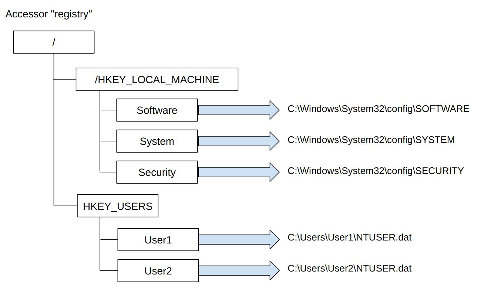
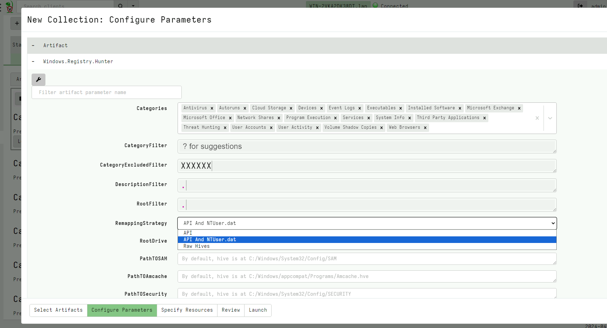
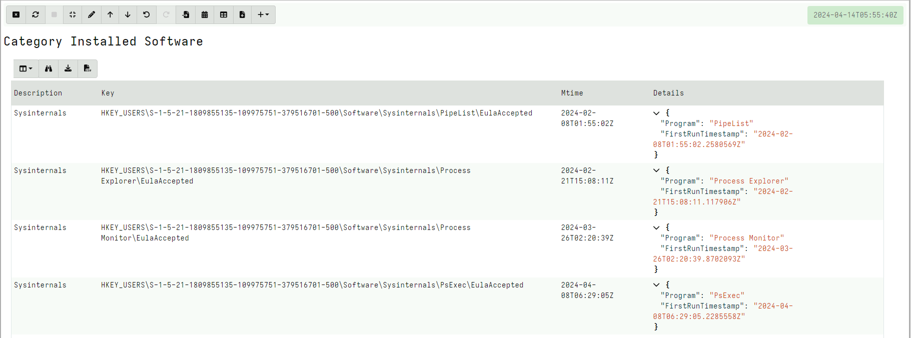
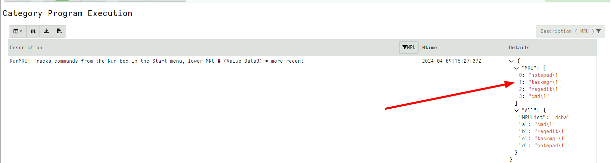
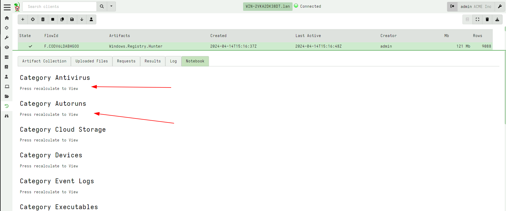
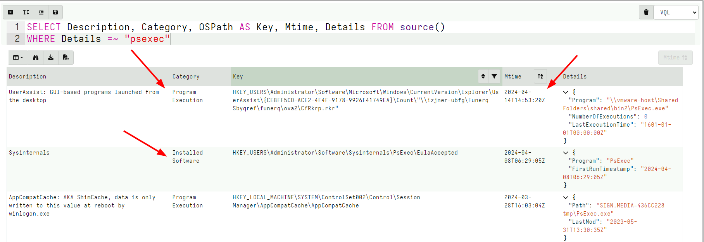

As DFIR practitioners, the Windows registry is a treasure trove of
information. The Windows registry stores information about system
configuration and therefore we can use it to understand what software
was installed, how it was configured and hunt for mis-configuration or
deliberate compromises to achieve attacker persistence.

There are many tools out there to extract forensically relevant
information from the registry. However, the problem is challenging:

1. The registry contains thousands of keys and values. While it is
   possible to manually examine relevant keys and values this is
   extremely time consuming and error prone.

2. Some of the values are encoded in non-obvious ways. For example, it
   is common for registry values to store times encoded as Unix epoch
   integers, Windows File Time integers or even encoded into binary
   encoded blobs. Since the registry is really intended for machine
   consumption it is not always easy to parse human readable
   information out of the values.

3. Often relevant information is spread across a number of keys and
   values. For a human examiner to make sense of the information, the
   information needs to be collected into a single entity.

4. Registry information does not have contextually significant
   explanation about what the values actually mean, and how
   significant they are in an investigation. Although this is left to
   the experience of the examiner, it is useful to attach some
   comments or description to the analysis.

## Velociraptor Artifacts

Velociraptor has been used to extract values from the windows registry
for a long time. In Velociraptor the registry is accessible via the
`registry` accessor (to access the registry via the APIs) and the
`raw_reg` accessor to parse raw registry hives. See [The Registry
Accessor]({}) to read more about how Velociraptor accesses the registry.

This allows Velociraptor to use simple `glob()` expressions to find
keys and values in the registry. For example in the
[Windows.Registry.Sysinternals.EulaCheck]({}) artifact we can search for evidence of running `Sysinternal
tools`. The following is a simplified query:

```vql
SELECT OSPath[-2] as ProgramName,
    lookupSID(sid=OSPath[1]) AS Username,
    OSPath.Dirname as Key,
    Mtime AS TimeAccepted,
    Data.value  AS EulaAccepted
FROM glob(globs='''HKEY_USERS\*\Software\Sysinternals\*\EulaAccepted''',
          accessor='registry')
```

This artifact works pretty well:

1. The artifact zeros in on the relevant values in the registry
   without user intervention - the investigator does not have to know
   or care where the relevant `Sysinternal Eula` values are.
2. The artifact decodes the values to interpret the user action (did
   the user accept the EULA?) and also maps the SID back to a
   username.
3. The artifact contains sufficient human description to elicit
   action - what does it mean if a user accepted the EULA? Is this
   fact relevant to the investigation?

While very effective, over time the number of registry artifacts in
Velociraptor has grown. From the point of view of the investigator it
is becoming more difficult to use:

- We need to remember many smaller artifacts that target the registry
  to collect.
- We need to consider the output separately for each artifact.

## Some problems with the above approach

You will notice that the above artifact searches the `NTUSERS`
hive. This hive contains each user's `ntuser.dat` file which is
mounted when the user logs in.

While the artifact works very well for currently logged users, it will
be unable to see any users who are currently not logged into the
system! This can cause a lot of evidence to be missed.

The problem here is that the registry is composed of different hives
and some hives may be mounted at different times. However, when we
analyze the registry we often want to access all hives!

When we use the API to access the registry, we could be missing hives
that are not currently mounted. Conversely when we use raw registry
parsing to only look at hive files we will be missing volatile keys
that are not always written to the hives.

In the specific case of `Windows.Registry.Sysinternals.EulaCheck` the
artifact also offers an alternate analysis method which looks at the
`ntuser.dat` files themselves. However this has to be added
specifically for each artifact.

## What do other tools do?

Investigator focused tools typically attempt to analyze the whole
registry. For example, `regripper` or `RECmd/Registry Explorer` present a
GUI to the registry and simply tag keys and values based on their
significance. This is very convenient for the investigator, as they
only need to run the analysis once then examine the output manually.

While this is effective for analyzing a small number of machines, it
can not be easily scaled to large hunts on thousands of machines where
we need a more machine readable output.

The `RECmd Batch` project is an interesting idea forward. It started
off as an automated Batch File to drive `RECmd/Registry Explorer`
analysis by only collecting relevant keys/value and tagging these with
category and description labels.

Here is an example `RECmd Batch` rule corresponding to the above artifact:

```
    -
        Description: Sysinternals
        HiveType: NTUSER
        Category: Installed Software
        KeyPath: SOFTWARE\Sysinternals\*
        ValueName: EulaAccepted
        Recursive: false
        Comment: |
           Displays all SysInternals Tools that had the EULA accepted,
           indicating either execution of the tool or the Registry values
           were added intentionally prior to execution
```

This rule attaches a description and category to the `EulaAccepted`
value and also includes how to find it. There is also a useful comment
to drive the investigator towards assessing the importance of these
findings.

The `RECmd Batch` format also has some basic registry interpretation
built in (such as `FILETIME` to interpret timestamps), but more
complex interpretation is deferred to `Registry Plugins` which are `C#
programs` specifically designed to interpret more complex keys or
values. The use of `C#` makes writing registry plugins less accessible
and more complex.

## So what do we actually want?

We wanted to have a single artifact that hunts the entire registry
quickly and efficiently:

1. Combining all the specific registry based artifacts into a single
   one so investigators don't have to remember all the different
   artifacts - a single shot collection should be all that is needed
   to cover all registry based evidence.
2. All relevant information should be grouped by `Category` and
   `Description`. The artifact should make it easy to zero in on
   specific categories depending on the investigator's needs.
3. Ideally group together related key/values for quick analysis - this
   is needed to remove the cognitive load on the investigator in
   reviewing thousands of related values.
3. The artifact should be collected in different contexts:
   * On a live system using the registry API.
   * Offline on a collection of Registry Hive Files
   * Automatically take care of subtleties such as `NTUser.dat` mounts
     (as described about).

This is what the registry hunter is all about!

## The Registry Hunter

The Registry Hunter project is maintained at
https://github.com/Velocidex/registry_hunter/ and contains a compiler
that combines a set of `Rules` into a final artifact. This allows
users to contribute specific rules targeting specific keys and value
in the registry.

### Remapping the registry hives

To make it easier to write Registry Hunter rules and also to make it
easier to apply those rules in different situations, we want to
present a unified view of the registry to rule authors. The rule
authors should not need to care about if a registry hive is mounted or
available.

In recent versions, Velociraptor implements a powerful mechanism to
`remap` accessors within the name space. You can read about [Remapping
Accessors]({}) to
understand how this is done.

The Registry Hunter artifact will map the relevant hives into the
`registry` accessor namespace using a number of different strategies.

The below diagram illustrates how the remapping works with the `Raw
Hives` strategy. In this configuration, the `registry` accessor is
remapped to using all the raw registry hives and does not use the API
at all.



The rules, however, don't really need to know about this - they just
assume they can access the whole registry using the `registry`
accessor. For example, when a rule accesses the key
`HKEY_USERS\Administrator\Software`, the key will be automatically
parsed from the `Software` hive at `C:\Users\Administrator\NTUSER.dat`

Depending on the remapping strategy some hives will be directly
accessible with the API, or remapped from raw registry hives:

* `API`: This strategy uses the API for most hives, except the
  `HKEY_LOCAL_MACHINE\Security` hive which is normally blocked with
  the API. Additionally, the `SAM` is mounted under `/SAM` and
  `Amcache` under `/Amcache` since these are not usually accessible
  via the API.
   * This strategy will not be able to see users who are not logged
     in, as it does not map the `ntuser.dat`.
   * Using the API is a bit faster than parsing the raw reg hives so
     this is recommended for frequent parsing or where performance is
     important.
* `API And NTUser.dat`: This strategy uses the API as above, except it
  also maps all the user's `ntuser.dat` files under the `/HKEY_USERS`
  key.
* `Raw Hives`: This strategy does not use the API, and instead maps
  all raw hives into the same `registry` accessor namespace.

The default remapping strategy is `API And NTUser.dat` which is
suitable for direct remote collections. If you are collecting this
artifact on a dead-disk mount you will need to use the `Raw Hives`
strategy to direct all registry API calls to raw registry parsing.

### Importing the latest version of the Registry Hunter artifact

To use the artifact you will need to import it into the server by
collecting the `Server.Import.RegistryHunter` server artifact. This
ensures you have the latest version.

### Collecting the artifact

When collecting the artifact from a remote system, you will be able to
select which rule categories to collect - by default all rules are
collected. The default remapping strategy is also selected here.




### The Rule format

Rules are specified as simple YAML clauses in a rule file. Here is the
rule that specifies the `SysInternals EULA` detection.

```yaml
- Author: Andrew Rathbun
  Description: Sysinternals
  Category: Installed Software
  Comment: Displays all SysInternals Tools that had the EULA accepted, indicating
    either execution of the tool or the Registry values were added intentionally prior
    to execution
  Glob: '*\SOFTWARE\Sysinternals\*\EulaAccepted'
  Root: HKEY_USERS
  Filter: NOT IsDir
  Details: |
    x=>dict(Program=x.OSPath[-2], FirstRunTimestamp=x.Mtime)
```

The search glob is split into a glob part and a `Root` part. The
`Root` refers to the place within the registry namespace where the
hive is mapped (more on this below).

The registry hunter will compile this rule into a similar query to

```vql
    SELECT Rule.Description AS Description,
           Rule.Category AS Category,
           OSPath, Mtime,
           eval(func=Metadata.Details) AS Details
    FROM glob(globs=Rule.Glob, root=Rule.Root, accessor="registry")
    WHERE eval(func=Rule.Filter)
```

This rule will search the provided glob expression on the provided
root directory looking for values (the filter `x=>NOT IsDir` captures
values and rejects keys).

Matching values will cause the `Details` function to be evaluated. The
`Details` field contains a VQL [lambda function]({}) that will be evaluated on the
found keys or values. The following values will be available:

- `x.OSPath` contains the OSPath of the matching registry key or value
- `x.Mtime` contains the Modification time of the key

The above example returns a dictionary documenting the program and
the modification time.



A more complex rule is the following which assembles the `Most
Recently Used` values in the `Run Box`:

```yaml
- Author: Andrew Rathbun
  Description: "RunMRU: Tracks commands from the Run box in the Start menu"
  Category: Program Execution
  Root: HKEY_USERS
  Glob: '*\Software\Microsoft\Windows\CurrentVersion\Explorer\RunMRU'
  Filter: x=>IsDir
  Preamble:
  - |
    LET CalculateMRU(OSPath) = SELECT GetValue(OSPath=OSPath + g1) AS value
        FROM parse_records_with_regex(accessor="data",
        file=GetValue(OSPath=OSPath + "MRUList"), regex="(.)")

  - |
    LET FetchKeyValues(OSPath) = to_dict(item={
      SELECT Name AS _key, Data.value AS _value
      FROM glob(globs="*", accessor="registry", root=OSPath)
    })

  Details: |
    x=>dict(MRU=CalculateMRU(OSPath=x.OSPath).value,
            All=FetchKeyValues(OSPath=x.OSPath))
```



The similar `RECmd Batch` rule actually relies on custom `C#` code to
reassemble the MRU lists. This is problematic in practice because we
would need to rebuild and redeploy compiled code to the
endpoint. Instead it is much more efficient to implement the
reassembly algorithm in VQL and include it directly in this rule.

The Registry Hunter does rely on specialized processing or specific
registry plugins and simply implements all the complex parsing
directly in VQL - allowing us to upgrade the parsers on demand without
needing to recompile any code.

Notice how the `Details` lambda rule is able to reference helper
functions defined in the `Preamble` section. This allows us to create
reusable VQL functions that can be used from many rules.

You can see many helpful VQL functions defined in the preamble of the
common rule sets.

## Presenting the results of the analysis

The Registry Hunter is designed to be a one shot, collect everything
type of artifact. This allows investigators to simply use it in all
cases and just view relevant results depending on their needs.

To facilitate this use, the artifact creates a custom notebook
breaking the results by category. The user can then begin examining
the hits for each category that is relevant to the case.



For example, suppose I was interested in anything that was related to
`PsExec`, I would write a notebook query of the form:

```sql
SELECT Description, Category, OSPath AS Key, Mtime, Details FROM source()
WHERE Details =~ "psexec"
```



This query will show all information that is vaguely related to
`PsExec`, we see a number of corroborating evidence from the different
Rules:

1. `Userassist`, `AppCompatCache` and `Sysinternals` rule all match
2. We can see when the program was initially installed, last used and
   other interesting information.
3. Note that here we collect multiple related results from multiple
   categories.

## Conclusions

The Registry Hunter is an unified artifact that compiles separate
rules hunting in the registry into a single, easy to collect and very
fast artifact. Long term we aim to consolidate all the discrete
registry based artifacts into this one artifact.

We would really love to hear feedback or see contributions to the
Registry Hunter through our GitHub repository
https://github.com/Velocidex/registry_hunter/ and issue board. But you
can start using it right now if you would love to test it.

{}

The Registry Hunter uses newer VQL features available since release
0.72 and so will only work on clients newer than that version.

{}
