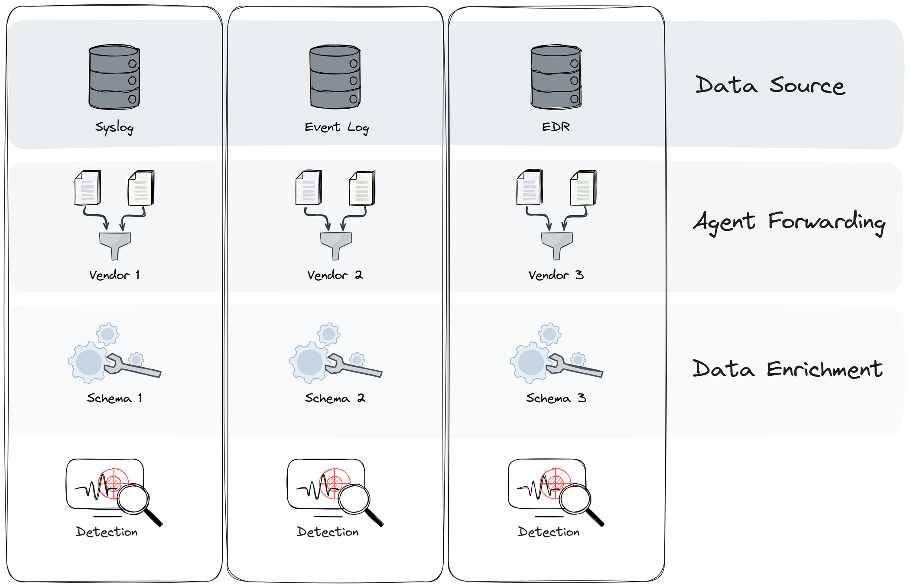
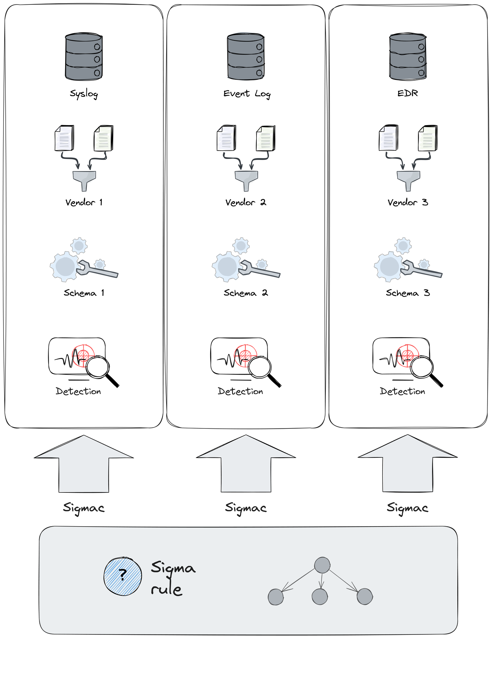
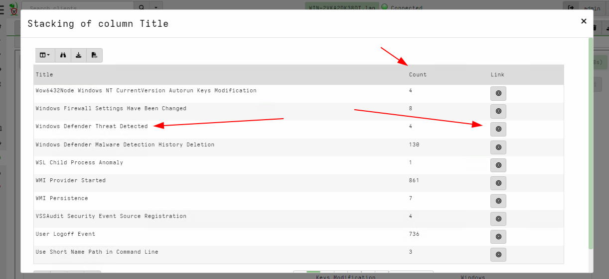
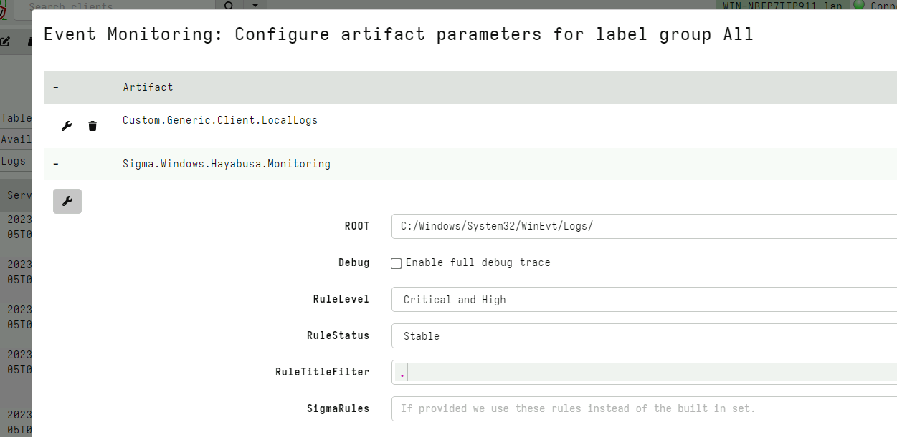

{}

This post accompanies the presentation [Advances in Detection Engineering](https://present.velocidex.com/presentations/2024-auscert-detection_engineering/index.html) presented at the annual [Auscert 2024 Conference](https://conference.auscert.org.au/program/) on the 24th May 2024

{}


As defenders, we rely on having an efficient and effective detection
capabilities so we can shut down attacks quickly before the damage is
done. To do this effectively, defenders rely on automated detection,
driven by specific rules. While there are many detection platforms
available with different ways of writing rules, there is a lot of
commonality in the type of rules that are needed for effective
detection - this new discipline is called "Detection Engineering".

## What is Detection Engineering?

While intrusion detection systems and tools have always been in use in
the enterprise space, it has only been a recent realization that tools
alone are not sufficient for effective detection. Organizations must
dedicate resources and expertise to specialists in tuning and
architecting effective detection system.

The discipline of `Detection Engineering` is a science of writing,
maintaining and testing detection rules and systems against an
evolving threat landscape. It is now considered an important integral
part for an effective and mature security program.

This blog post discusses some of the challenges in testing and
maintaining detection rules, specifically Sigma rules. We also cover
some emerging scenarios where detection engineering can be employed,
such as in Forensic Triage and wider Threat Hunting.

## Traditional SIEM based detection

Traditionally detection focuses on event logs as the main source of
information. Event logs are parsed and shipped from the endpoints to a
central data mining server where queries are run over the data.

For example, using the ELK stack, the Winlogbeats endpoint agent:

1. Parses certain raw event logs on the endpoint (For example Sysmon
   event log)

2. Applies normalization of fields (mostly renaming fields) to the
   Elastic Common Schema (ECS).

3. Forwards events to an Elastic Cluster.

4. Queries are run on the Elastic cluster using a specialized query
   language to detect anomalies.

Other stacks collect different sources, implement different
normalization process and have different query languages and dialects.

When comparing various detection technologies we can see that although
the basic principals are similar (collect logs, normalize logs into a
schema, forward to data mining system and then query the data) the
specifics are very different.



## The Sigma Rule format

Because each system is different, it is difficult to exchange
detection rules within the community. For example an Elastic query
might apply to those running the ELK stack but will not be applicable
to those running Splunk or another system.

The `Sigma` standard was designed to try to address the situation by
creating another layer of abstraction over the actual detection stack,
in order to facilitate rule exchange. The hope is that rules can be
immediately usable across different detection stacks.

This is achieved by defining an abstract YAML based format for writing
detection rules. These rules are then fed to specialized `Sigma
Compilers` to produce stack specific queries for difference SIEM
vendors.



Sigma addresses the differences between the detection stacks by
introducing abstractions at various levels:

* The differences in internal Schema normalization is addressed by
  abstracting field names. Rather than selecting a standard, well
  defined taxonomy of field names, Sigma leaves the precise fields
  allowed within a rule to the Sigma Compiler `Field Mapping`
  configuration.

* Different detection stacks collect different event logs. However,
  instead of specifying the precise event logs a rule applies to,
  Sigma defines an abstract `log source` which is mapped to the
  concrete source using the Sigma Compiler's `Log Source Mappings`.

This lack of rigorous definitions leads to inaccuracies and
compatibility problems as we shall see shortly, however let's first
examine a typical `Sigma Rule`:

```yaml
logsource:
    category: process_creation
    product: windows
detection:
    process_creation:
        EventID: 4688
        Channel: Security
    selection:
        -   CommandLine|contains|all:
                - \AppData\Roaming\Oracle
                - \java
                - '.exe '
        -   CommandLine|contains|all:
                - cscript.exe
                - Retrive
                - '.vbs '
    condition: process_creation and selection
```

### Log sources

Sigma rules are written to target certain events from particular log
sources. The Sigma rule specifies the log source in the `logsource`
section, breaking it by category, product and service etc.

This example rule specifies that it applies on events collected from
the `process_creation` log. But what does `process_creation` mean
exactly?  The [Sigma
documentation](https://sigmahq.io/docs/basics/log-sources.html) doesn't
really specify what that means.

Typically we can get process creation information for various sources,
for example `Sysmon Event ID 1` is a common source of process
creation. Similarly the Windows `Security Log` generates `Event ID
4688`. Of course we could always forward events from a local EDR or
other security software which records process execution, but the
rule's `logsource` section does not specify precisely what the event
log actually is.

### Field mappings

The above rule specifies a `detection` section. This section consists
of a condition which when satisfied, causes the rule to fire. The
above rule compares the command line to a number of strings. The rule
refers to the command line using the `CommandLine` field.

In practice, the event itself consists of various fields, but the
exact name of each field depends on the data normalization that takes
place at the sensor level. For example Elastic Common Schema
[normalizes](https://www.elastic.co/guide/en/ecs/current/ecs-process.html#field-process-command-line)
the `CommandLine` field to `process.command_line` in the ECS Schema.

Therefore `Sigma` uses a target-specific translation between abstract
Sigma fields to the actual field in the event record in the target
SIEM. This translation is called `Field Mapping` and depends on the
target detection stack used and its event normalization (and to some
extent its own configuration).

### Using Sigma Rules effectively

When using `Sigma rules` in practice, there are many false
positive. Usually the rules need to be tailored for the
environment. For example, in some environments running `PsExec` is a
common practice between system administrators and so alerting on
lateral movement using `PsExec` is going to be a false positive.

The detection engineer's main challenge is to understand what rules
can be ignored and how they can be bypassed. This takes a lot of
practice and experience.

Consider the following [Sigma
rule](https://github.com/Yamato-Security/hayabusa-rules/blob/dfcce330da37d49610f63f7923ba54dc5d930c9a/hayabusa/builtin/System/Sys_7045_Med_LateralMovement-PSEXEC.yml)
excerpt:

```yaml
title: PSExec Lateral Movement
logsource:
    product: windows
    service: system
detection:
    selection:
        Channel: System
        EventID: 7045
    selection_PSEXESVC_in_service:
        Service: PSEXESVC
    selection_PSEXESVC_in_path:
        ImagePath|contains: PSEXESVC
    condition: selection and (selection_PSEXESVC_in_service or selection_PSEXESVC_in_path)
```

This rule detects when a new service is created with the name
`PSEXESVC` or a service is created with that name included in the path.
While this is the default behavior of `PsExec` it is trivial to bypass this
rule. Viewing the [PsExec
Documentation](https://learn.microsoft.com/en-us/sysinternals/downloads/psexec)
we can see that the `-r` flag can change this service name to anything
while the filename itself can be changed as well.

An experienced detection engineer will recognize that better telemetry
can help detect when a program is renamed by using the
`OriginalFileName` field from Sysmon's process execution logs with [the following rule](https://github.com/SigmaHQ/sigma/blob/6412c1a02bb60e631c6d341f6fc41d6f3c507f98/rules/windows/process_creation/proc_creation_win_renamed_binary_highly_relevant.yml) excerpt:

```yaml
title: Potential Defense Evasion Via Rename Of Highly Relevant Binaries
author: Matthew Green - @mgreen27, Florian Roth (Nextron Systems), frack113
logsource:
    category: process_creation
    product: windows
detection:
    selection:
      - Description: 'Execute processes remotely'
      - Product: 'Sysinternals PsExec'
      - OriginalFileName:
          - 'psexec.exe'
```

This is an excellent example where additional information (in the form
of the executable's `VersionInformation` resource) gathered from the
endpoint can help improve detection efficiency significantly. We will
see below how adding more details to the collected data (perhaps
beyond the event log itself) can vastly improve the quality and
fidelity of detection rules.

As a second example, let's explore the use of hashes in detection
rules. Consider the [following
rule](https://github.com/SigmaHQ/sigma/blob/6412c1a02bb60e631c6d341f6fc41d6f3c507f98/deprecated/windows/driver_load_win_vuln_lenovo_driver.yml)
excerpt which detects the loading of a known vulnerable driver:

```yaml
title: Vulnerable Lenovo Driver Load
author: Florian Roth (Nextron Systems)
logsource:
    category: driver_load
        product: windows
detection:
    selection_sysmon:
        Hashes|contains:
        - 'SHA256=F05B1EE9E2F6AB704B8919D5071BECBCE6F9D0F9D0BA32A460C41D5272134ABE'
        - 'SHA1=B89A8EEF5AEAE806AF5BA212A8068845CAFDAB6F'
        - 'MD5=B941C8364308990EE4CC6EADF7214E0F'
    selection_hash:
        - sha256: 'f05b1ee9e2f6ab704b8919d5071becbce6f9d0f9d0ba32a460c41d5272134abe'
        - sha1: 'b89a8eef5aeae806af5ba212a8068845cafdab6f'
        - md5: 'b941c8364308990ee4cc6eadf7214e0f'
    condition: 1 of selection*
```

Attackers often load vulnerable drivers so they can exploit them to
gain access to kernel space. While it is well known that hashes are
usually a weak signal (because the attacker can trivially change the
file) in the case of loaded drivers, the driver must be signed to be
successfully inserted into the kernel.

This had led to a misconception that driver files cannot be
modified - otherwise their digital signature will be invalidated
making them unable to be loaded into the kernel.

Unfortunately this is not true - a signed binary file
can easily be modified in such as a way that it's authenticode hash
(which is signed) remains the same but its file hash changes. This is
because a file hash covers the entire file, while the authenticode
hash only covers selected regions of the binary. It is very easy to
modify a binary in those regions which are not covered by the
authenticode hash (usually some padding areas towards the end of the
file) while retaining its authenticode hash.

An experienced detection engineer is aware of this shortcoming and
would not use hashes directly in a Sigma rule. Instead [the following
rule](https://github.com/SigmaHQ/sigma/blob/6412c1a02bb60e631c6d341f6fc41d6f3c507f98/rules/windows/driver_load/driver_load_win_vuln_hevd_driver.yml)
may be used:

```yaml
title: Vulnerable HackSys Extreme Vulnerable Driver Load
author: Nasreddine Bencherchali (Nextron Systems)
logsource:
    product: windows
    category: driver_load
detection:
    selection_name:
        ImageLoaded|endswith: '\HEVD.sys'
    selection_sysmon:
        Hashes|contains:
        - 'IMPHASH=f26d0b110873a1c7d8c4f08fbeab89c5' # Version 3.0
        - 'IMPHASH=c46ea2e651fd5f7f716c8867c6d13594' # Version 3.0
    selection_other:
        Imphash:
        - 'f26d0b110873a1c7d8c4f08fbeab89c5' # Version 3.0
        - 'c46ea2e651fd5f7f716c8867c6d13594' # Version 3.0
    condition: 1 of selection*
```

This rule uses the `ImpHash` which is a hash of the import table of
the executable. Since the import table **is** covered within the
authenticode hash it is not possible to modify the binary in such a
way that its digital signature remains valid while the `ImpHash`
changes.

{}

Sadly Sysmon currently does not report the **Authenticode Hash** of
the binary which would be ideal as it can not be changed without
invalidating the signature and covers all the important parts of the
executable file. Currently Sysmon only reports file hashes (which are
easily changed) and `ImpHash` which can be easily changed as well
but will invalidate signature.

{}

## Sigma shortcomings

While Sigma rules are supposed to be directly usable between detection
stacks, by simply changing the compiler backend. However this is rarely the
case.  Because the Sigma standard is not well specified and lacks a
common taxonomy it is difficult to use a rule designed to operate on
the output of Sysmon event logs with a detection stack that only uses
System logs or EDR logs.

For example, in the above example rule, we see that the rule requires
the `Channel` to match `Security` and the `EventID` to match `4688` -
clearly this rule can only apply on the security event log
source. Replacing the log source with Sysmon provided events (which do
technically provide the `process_creation` log source) will simply
never fire this rule!

{}

Because the `logsource` section of the Sigma specification is not
really specific enough, most rules have a further `detection` clause
to better define the precise log source. Although technically it is
not always accurate to use that clause instead of the `logsource`
because the clause can be use in an arbitrary logical context, most of
the time it is a filter so can be taken as a substitute for the real
log source.

{}

The `logsource` section is simply redundant at best and misleading at
worst; a user can assume the rule will detect an attack when Sysmon
logs are available but this is simply not the case. It would be better
if Sigma rules were less ambiguous and simply contained precise log
source information.

There is also little error checking due to a lack of precise
taxonomy. A sigma rule can specify an unknown field that is simply not
present in the event but there is no way to know that the rule will
fail to match. Apart from the obvious problem of a rule specifying a
mis-typed field, the field may not be collected at all from the
endpoint.

The example above uses the `CommandLine` field of the System event
4688, however this is not always present! According to the [Microsoft
Documentation](https://learn.microsoft.com/en-us/windows-server/identity/ad-ds/manage/component-updates/command-line-process-auditing)
this field is only present sometimes:

>> In order to see the additions to event ID 4688, you must enable the
new policy setting: Include command line in process creation events.

Without knowledge of the endpoint policy in the specific deployment it
is impossible to know if this rule will ever fire.

The following example rule is invalid and exists within [the official
Sigma repository](https://github.com/SigmaHQ/sigma/blob/6412c1a02bb60e631c6d341f6fc41d6f3c507f98/rules/windows/create_remote_thread/create_remote_thread_win_susp_uncommon_source_image.yml):

```
title: Remote Thread Creation By Uncommon Source Image
logsource:
    product: windows
    category: create_remote_thread
detection:
    create_remote_thread:
        EventID: 8
        Channel: Microsoft-Windows-Sysmon/Operational
    selection:
        SourceImage|endswith:
            - \bash.exe
            - \cscript.exe
            ...
            - \wmic.exe
            - \wscript.exe
    filter_main_winlogon_1:
        SourceImage: C:\Windows\System32\winlogon.exe
        TargetImage:
            - C:\Windows\System32\services.exe
            - C:\Windows\System32\wininit.exe
            - C:\Windows\System32\csrss.exe
    filter_main_winlogon_2:
        SourceImage: C:\Windows\System32\winlogon.exe
        TargetParentImage: System
        TargetParentProcessId: 4
        ...
    condition: create_remote_thread and (selection and not 1 of filter_main_* and
        not 1 of filter_optional_*)
```

At first sight this looks like a good rule - It targets Sysmon process
execution logs (EventID 8) using a channel detection section (the
`logsource` section is as usual meaningless and should be
ignored). However on very close examination we can see this rule
references the fields `TargetParentProcessId` and
`TargetParentImage`. Consulting the [Sysmon
Documentation](https://learn.microsoft.com/en-us/sysinternals/downloads/sysmon#event-id-8-createremotethread)
we can see that there is no such field in the Sysmon output. Therefore
this rule will generally not work for standard Sysmon installs.

## On-endpoint detection

The previously described model relies on forwarding events from the
endpoint to a central location, where detection is actually made. This
approach is challenging in practice:

1. There is a trade-off between the volume and type of events relayed
   to the SIEM: On a typical Windows system there are hundreds of
   different event logs and event types. It is impossible to forward
   all events from the endpoint to the SIEM without increasing the
   network, storage and processing cost on the SIEM itself. A choice
   must be made of which events to forward.
2. Some of the normalization steps taken aim to reduce the total data
   transferred by removing some redundant fields from certain
   events. We have already seen before that `CommandLine` for Event ID
   4688 is an optional field which needs to be deliberately enabled in
   practice.

Detection capabilities are slowly migrating from a purely centralized
detection engine that processes forwarded events from the endpoint, to
more endpoint-focused detection capabilities where the endpoint can
autonomously enrich and respond to detection events. This allows the
endpoint to triage the events by applying detection rules on the
endpoint directly. Therefore only high value events are forwarded to
the SIEM.

## Case study: Velociraptor

Velociraptor is a powerful endpoint incident response and triaging
tool. At its core, Velociraptor uses the Velociraptor Query Languages
(VQL) to perform flexible triaging on the endpoint.

Recently, Velociraptor gained a native `sigma()` plugin, allowing the
endpoint agent to directly evaluate Sigma rules. A VQL artifact is
sent to the endpoint over the network containing several main
sections:

1. A set of `Sigma` rules to evaluate
2. A list of `logsource` queries to evaluate directly from the on disk
   event log files.
3. A mapping between Sigma rules and their corresponding event fields.


## Velociraptor curated rules

As described previously, it is difficult to directly use `Sigma` rules
without careful verification. The [Velociraptor Sigma
Project](https://sigma.velocidex.com/) implements a Velociraptor
artifact compiler which builds a VQL Artifact with a curated and
verified set of rules.

The compiler verifies the following things

1. Many rules do not have accurate `logsource` sections but instead
   specify the event log to be read in their first detection
   clause. Therefore the compiler overrides the `logsource` with a
   more accurate source based on the `detection` clause.

2. The compiler compares the known set of event fields to the set of
   fields specified in the Sigma rule and flags any rules which refer
   to unknown fields.

3. Remove rules with non-standard or unsupported Sigma modifiers.

The Velociraptor Sigma project curates a number of rule sets from
sources such as:

* [Hayabusa](https://github.com/Yamato-Security/hayabusa-rules) is a
  project to maintain Sigma rules for on endpoint analysis. Hayabusa is
  also a standalone engine to match the Sigma rules on the endpoint's
  event logs (similar to Velociraptor's `sigma()` plugin)
* [ChainSaw](https://github.com/WithSecureLabs/chainsaw) is a
  repository of Sigma rules with more of a focus on Linux systems.
* [SigmaHQ](https://github.com/SigmaHQ/sigma/) is the official rule
  repository of the Sigma project. These rules are cleaned up,
  corrected and included into the Hayabusa project rule sets.

## Using on-endpoint detection for Incident Response Triage

Traditional SIEM based detection has to balance a number of tradeoffs
like volume of logs collected, and number of false positives to reduce
SIEM analyst's churn.

However, Incident Response Triaging has a different set of
requirements. Usually the incident responder needs to understand what
happened on the system without really knowing what is normal. When
evaluating Sigma rules in the incident response context, it is ok to
have more false positives in favor of exposing more possibly
suspicious activity.

In the following example I collect the `Velociraptor Hayabusa Ruleset`
artifact from the endpoint. The ruleset is extensive and rules are
broken down by rule level and rule status. However in this case I want
to try out all the rules - including very noisy ones because I want to
get an overview of what might have happened on this endpoint.


The Hayabusa ruleset is extensive and might collect many false
positives. In this case it took around 6 minutes to apply the rules on
all the event log files and returned over 60k hits from about 4200
rules.

Generally it is impractical to review every single hit, so we
typically rely on Stacking the results. Within the Velociraptor GUI I
will stack by the Rule's `Title` by clicking the sort icon at the top
of the column


Once the column is sorted, a stacking icon will appear next to
it. Clicking on that icon will display the stacking dialog view. This
view shows the different unique values of the selected column and the
total number of items of that value. In our case it shows the total
number of times the specific rule has fired.



Clicking the icon in each row seeks the table immediately to view all
the rows with the same `Title` value. In this case I want to quickly
view the hits from the `Windows Defender Threat Detected` rule.


Using this technique I can quickly review the most interesting rules
and their corresponding hits directly in the GUI without needing to
recalculate anything. I can see what type of potentially suspicious
activity has taken place on the endpoint and identify outliers
quickly - despite the high false positive rate.


## Extending the capabilities of Sigma rules

The previous section demonstrated how Sigma can be used for rapid
triaging - The workflow is simple and effective, simply match a large
number of rules against the on-host event log files to quickly
identify and classify suspicious behavior.

This works much better than running the Sigma rules at the SIEM
because the SIEM does not receive all the events on the
endpoint. Having the ability to view more event sources can improve
our detection ability without concern for scalability of the SIEM or
increasing the amount of uploaded event traffic between the endpoint
and the detection platform.

But can we go further? Why stop at event logs at all? Being on the
endpoint directly actually provides access to a whole class of new data
sources which are far beyond the simple event logs collected by the
system. For example, we can directly examine registry keys, search for
and parse files on the endpoint and much more.

Consider the [following Velociraptor Sigma
rule](https://github.com/Velocidex/velociraptor-sigma-rules/blob/master/rules/vql/rclone.yml):

```yaml
title: Rclone
logsource:
    category: vql
    product: windows

detection:
    selection:
      "EventData|vql":
          x=>x.Files OR x.Registry

    condition: selection

vql: |
  x=>dict(EventData=dict(
    Files={
      SELECT OSPath, Size, read_file(filename=OSPath, length=100) AS Data
      FROM glob(globs=Path, accessor="auto")
    },
    Registry=to_dict(item={
      SELECT Name AS _key, Data.value AS _value
      FROM glob(globs=Key, accessor="registry")
    })))

vql_args:
    Path: C:\Users\*\AppData\Roaming\rclone\rclone.conf
    Key: HKEY_USERS\*\SOFTWARE\Microsoft\Windows NT\CurrentVersion\AppCompatFlags\Compatibility Assistant\Store\*rclone*
```

This rule uses the special `logsource` of type `vql` which allows the
event to be generated by running arbitrary VQL queries. In this case
the query looks at both the presence of a registry key **or** the
presence of a configuration file on the endpoint. If either of these
artifacts exist, the rule matches. Note that this rule goes above and
beyond event logs to directly look at system configuration.

Velociraptor has traditionally been used to collect forensic artifacts
for manual inspection. The ability to write detection rules against
forensic artifacts allows us to quickly triage the endpoint without
manually reviewing the forensic artifacts.

- Forensic artifacts paint the picture of **what happened on the
  endpoint** in as much detail as possible.
- Sigma rules quickly flag the obvious things on the endpoint **which
  are known to be bad**.

Therefore Forensic Sigma rules help to rapidly triage forensic
findings, they do not replace those but work in tandem with the
collection and analysis of forensic artifacts.


## Real Time Sigma alerting

Velociraptor's VQL language is fully asynchronous and can watch for
changes on the endpoint in real time. In Velociraptor's terminology we
can write [Event Monitoring Queries]({}).

Rather than parsing event log files as log sources for Sigma rule
matching, we can tweak the VQL slightly to feed real time events into
the Sigma rule matching. This allows us to apply Sigma rules on log
sources in real time - in effect creating real time detection rules.

The `Velociraptor Hayabusa Live Detection` option in the Curated
import artifact will import an event monitoring version of the same
curated Sigma rules. I can configure the artifact in the usual way.



This time the endpoint will forward detection events to the server in
real time.


In the above I can see immediately suspicious use of `PSExec` in real
time!


## Conclusions

This blog post explores the discipline of `Detection
Engineering`. Although this is not a new idea - people have been
refining and analysing detection rules since intrusion detection
systems were invented. By treating detection engineering as an art and
a science and dedicating specialist roles to it within an
organization, we can encourage and support this important role.

Detection Engineering is about maximizing detection efficacy given the
limitations of existing detection systems. We discussed the common
event collection feeding into a central SIEM architecture and how to
write detection rules for this architecture.

The Sigma rule format was designed to abstract the specifics of the
detection stack by presenting an abstract rule language. The hope was
that rules can be easily interchanged between different detection
stacks and so could be easily shared within the detection community.

However in practice the lack of rigor and well defined taxonomy in
Sigma makes porting rules between detection stacks error prone and
manual. Detection Engineers need to scrutinize rules to determine if
they are likely to work within their own environment. We discuss some
of the pitfalls to watch for when scrutinizing Sigma rules. We also
discussed how detection engineers can assess if a Sigma rule is
fragile and how it can be strengthened by utilizing more detailed log
sources.

Next we explored how Sigma rules can be applied on the endpoint itself
to access more log sources than are typically shipped to the SIEM. By
evaluating the rules directly on the endpoint, it is possible to use
Sigma rules for incident response triage purposes. I then demonstrate
the process of triage via Sigma rules using Velociraptor's built in
Sigma support and the Hayabusa ruleset by using stacking to rapidly
zero in on the suspicious activity.

How can we further improve detection efficacy? Why restrict ourselves
to event logs? Velociraptor's Sigma engine can use arbitrary VQL to
generate events from sources like registry keys, paths and many other
forensic artifacts. This allows detection rules to have unprecedented
reach.

Finally we looked at utilizing Sigma rules with real time event queries
allowing Velociraptor to alert in real time when Sigma rules match,
instead of having to post process events from the event log file.

If you like to try Sigma in Velociraptor, take [Velociraptor for a
spin](https://github.com/Velocidex/velociraptor)!  It is available on
GitHub under an open source license. As always please file issues on
the bug tracker or ask questions on our mailing list
[velociraptor-discuss@googlegroups.com](mailto:velociraptor-discuss@googlegroups.com)
. You can also chat with us directly on discord
[https://www.velocidex.com/discord](https://www.velocidex.com/discord)
.
