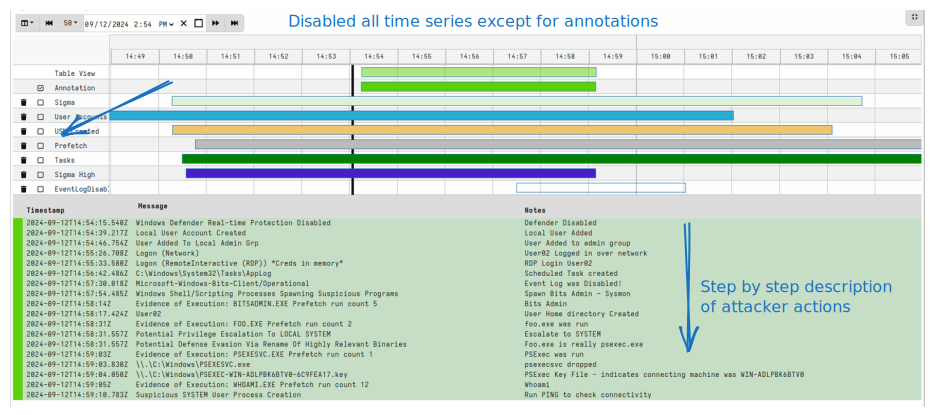
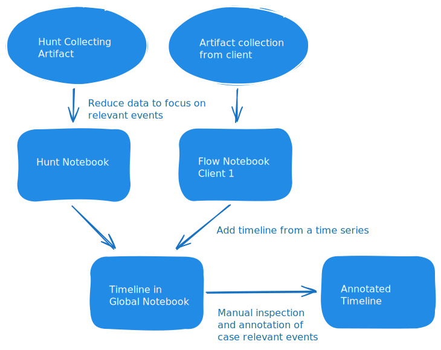

{}

This feature is available in the 0.73 release. You can
[Download it]({}) and provide valuable feedback.

{}

Digital forensics is about reconstructing what happened in the past
based on available artifacts. When applying Digital Forensics to an
incident response case, we try to follow the movements of the
adversary through the network and answer some common questions:

- What happened?
- When did it happen?
- What potential information was compromised?
- How can we harden the system to prevent this from happening again.

A very useful tool for every incident manager is to build a timeline
of relevant information. A timeline helps to communicate the sequence
of actions the adversary took. Additionally timelines help us to
identify the time period of interest to the specific case, so that we
can ignore other data that happened either before or after the
incident. In this way timelining is a useful triaging tool.

## An example timeline in an investigation.

Timelining an incident is an important part of many
investigations. Before I describe the timeline feature within
Velociraptor, it is important to understand how timelines are used
traditionally. After all, Velociraptor is simply a tool that makes the
workflow simpler, but ultimately the same general process is followed!

The simplest approach is to manually keep a spreadsheet of events and
timestamps, sorted by time. This approach does not require any
additional tools than a simple spreadsheet:

- `Analysis step`: The investigator identifies important events to
  annotate by analysing various forensic artifacts or even just
  interviewing people, looking at other sources of evidence like
  security video etc.

  The purpose of this step is to identify and isolate noteworthy
  events from the thousands of time relevant data typically
  encountered in an investigation.

- `Annotation step`: The investigator then simply writes a timestamp
  in one column, a message in the other column and any additional
  information in a third column.

  The purpose of this step is to assign semantic interpretation of
  noteworthy events to explain how they are relevant to the case.

An example of such a manual approach is

Timestamp | Message | Information|
----------|---------|------------|
2021-10-12 10:10Z | Suspect entered vehicle | source=Video surveillance, Vehicle_tag=`XYZ`, Suspect=Bob|
2021-10-12 11:05Z | Call Received | source=Call Log, Number=555-1234, Duration: 2min
2021-10-12 11:06Z | Vehicle crashed | source=Police Report, Place=I95 South, near exit 175

The above example is a typical investigation timeline:

* The timeline contains information from multiple sources. We call
  each entry in the table an `event`.
* Each source contains different types of information, but each event
  has some common fields:

  - `Timestamp`: This is when the event occurred (usually specified in a
    common timezone).
  - `Message`: A generic human readable message to explain what this
    event represents.
  - `Information`: This column contains any event specific
    information. Since this information can vary, the data is normally
    stored in the same column in some kind of structured way (e.g. a
    Key/Value format)

The above timeline helps us to explain what happened - we only see
relevant, annotated events (and a note relating these to the
case). This timeline adds support to the central theory of what
actually caused the accident - likely mobile phone use by the driver.

The important takeaways from this example are:

1. I combine events from different sources based on their timestamp.
2. Only important events to the case are annotated with a human
   readable note that relates them to the case.
3. The timeline helps support a certain theory or conclusion of what
   actually happened.

## Case study: Ransomware intrusion

To illustrate how a timeline can be used in a typical DFIR
investigation, let's consider a simple (if contrived) case study:
Ransomware deployment on an endpoint.

### Step 1: Create a global notebook

Velociraptor notebooks are interactive documents that can be shared
between a group of investigators. Each notebook consists of cells,
while cells can contain markdown text or VQL queries to evaluate.

I will start off by create a global notebook to hold the timeline.


### Step 2: Collect some artifacts!

In this case I will directly collect artifacts from the endpoint in
question. I search for the hostname and select it for interactive
triage.

Usually at the start of an incident I don't really know what happened
or where to start. I like to start of with some Sigma rules as curated
by the `Windows.Hayabusa.Rules` artifact. This artifact is maintained
by the separate [Velociraptor Curated
Sigma](https://sigma.velocidex.com) site. The artifact combines many
rules from the
[Hayabusa](https://github.com/Yamato-Security/hayabusa-rules) and
Sigma projects.

Sigma rules are a good place to start as they can indicate any
suspicious activity on an endpoint. Normally Sigma rules must balance
false positives with the probability of missing a detection. However,
in the triage context, I really want to see all rules - including ones
that are noisy and produce a lot of false positives.


Therefore in this case I will choose to evaluate **All** the rules on
the endpoint. The artifact will then evaluate all rules against each
local event log file.

This results in over 18,000 events - too many to manually review! I
will post process this collection by selecting the collection's
`Notebook` tab. This is a notebook that is created inside each
collection for post processing just that one collection results.


In this case I don't really want to review every single hit. I just
want to see what **kind** of rules matched to get an overview of what
happened. I can then drill down into each hit to identify the
important ones.

This type of processing is called `Stacking`. Velociraptor has an
inbuilt stacking feature within the GUI - it is available on any
table!


First I sort by one of the table columns - This will select the column
I want to stack on. In this case, I will sort by the Rule Title. Once
the table is sorted, the GUI shows the stacking button. Clicking the
stacking button shows the stacking overview for this table.


Stacking is a common technique to view aggregation of data quickly. I
allows us to see what **kind** of rules matches in this case, and how
many times they matched. We can then drill down on each of these
matches to see if they are relevant to the case.

In the above, I immediately see some interesting rules matched! Lets
consider the rule `Windows Defender Real-time Protection
Disabled`. This event matched twice in the logs but it is usually a
strong signal so I want to drill down on it.

If I click the Link icon in the stacking table, I will be able to
explore the specific times this rule matched.


I see a match in 2023 and one in 2024. In practice a lot of false
positives will occur, or even evidence of previous compromise
unrelated to the current incident! Reviewing these events at this
stage can help to put a timeline on the incident.

For our purposes we can narrow the time of interest to shortly before
`2024-09-12` and this helps us quickly focus on events after that time
(in a real case, I will be more exhaustive in checking for possible
earliest compromise)

I will then reduce the table to all events after `2024-09-12` by
adapting the cell's VQL query. In the initial stage I will only look
at high and critical level events, and remove rules which usually
produce too many false positives.

This reduces the number of events to consider from over 18,000 to
about 100 high confidence events that I can manually review.


### Adding to the timeline.

Velociraptor's timelines implementation streamlines and enables the
above described manual process. We still mostly follow the same
general pattern but within the GUI much of the maintainance of
timelines is made easier and reduces friction for the user.

First let's define some terms:

1. An `Event` represents something that happened at a point in
   time. All events contain the following fields:

   * A Timestamp is the time when the event occurred.
   * A Message is used to describe what the event is.
   * A Data field contains arbitrary data as key/value pairs -
     depending on where the event is coming from, this data will vary.

2. A `Timeline` is a series of `Events` with a name.

3. A `Supertimeline` is a collection of `Timelines` which allows us to
   interactively inspect all the timelines together. The GUI overlays
   all the events together into one UI and allows the user to enable
   or disable any specific timeline in order to focus on specific
   types of information.

4. An `Annotation` is a special `Timeline` within the `Supertimeline`
   that users can add specific messages to. The annotations can be
   hidden or shown as other timelines but the GUI provides a way to
   add/remove annotations by inspecting other events in other timelines.

The ultimate goal of the `Supertimeline` is to build a useful set of
`Annotations` from all the events in the different timelines so that a
report may be written from it. The annotations timeline is what we
refer to as the "investigative timeline" (Similar to the example
above).

Because the Annotations timeline is for user consumption, we only want
high value and high confidence events and not too many of them. We
don't expect hundreds or thousands of annotations! Ideally we can
export the annotations from a timeline analysis and present it as a
running commentary of what happened.

Let's add our Sigma analysis to the timeline. Within the Reduced Sigma
table, click `Add to Timeline`.


The `Add Timeline` dialog allows us to create a timeline, add it to a
supertimeline and configure how events are created from the current
table:

1. Selecting `Local Timeline` or `Global Timeline` allows me to select
   which `Supertimeline` I want to add this to. Global Timelines exist
   within the `Global Notebooks` (i.e. those created from a template
   and are visible from the notebook side bar).

   I will select the `Supertimeline` in the notebook I created
   earlier.

2. Next I will name the new `Timeline` to remind me where these events
   come from. This name will be used to remind me where the events I
   see come from. I will call this `Sigma` as this is the result of
   matching the sigma rules.

3. Before the events can be created I need to designate which is the
   Timestamp and Message column - Each event must have a `Timestamp`
   and a `Message` field, while the data field will consist of the
   rest of the event specific data.

### The timeline viewer

After the reduced Sigma timeline is added, I can see the timeline
notebook updated.


Following is a description of the UI:

1. The display is divided into a `Timeline Visualizer` at the top and
   a `Time table` at the bottom.
2. The `Timeline Visualizer` itself is divided into:
   * The `time navigator` at the top showing event times in UTC. You can
     drag and zoom to change the time scales, or click on the column
     headers to change the time resolution and zoom in and out of the
     time ranges.
   * Below the `time navigator` is the `Time Group Visualizer`. This
     shows the range of each time series as a color block. This color
     is also matched with the individual events shown in the timeline
     below.
   * Each time group represents a distinct time series which can be
     enabled or disabled. Disabling a time series hides it from the
     time table below, making it easier to examine only events from
     the enabled time series.
   * The `Time Cursor` can be moved by clicking within the `time
     navigator`. This controls which events are shown in the `Time
     Table` below.
3. The `Time Table` shows events from all enabled time series that
   occur after the `Time Cursor`.
   * Each event shows the `Timestamp`, `Message` and `Notes` columns
     as an overview row.
   * Clicking on the event overview shows all fields in the event.
   * Once the event is expanded, the event toolbar allows the user to
     annotate the event.


### Annotating an Event

When an event seems important, it can be annotated. Annotating an
event will copy it into a special time series within the
`Supertimeline` called `Annotation`.


The annotation should contain an explanation as to why this event is
relevant to the case.


The annotated event is added to a separate timeline, which may be
enabled or disabled similarly as the other time series. This allows us
to concentrate on the annotations separately from other time series.

### Adding further time series

As I collect other artifacts, I can get more information about the
case:

1. Collecting the `Windows.Sys.Users` artifact enumerates the local
   users on the system, and estimates the time that the user last
   logged into the system by reporting the Modified time on the User's
   profile registry keys and home directory modification time.

   I reduce the data to show the Home directory modification time
   (Last time the user logged into the account).

```vql
SELECT HomedirMtime, Name, Description, Data
FROM source(artifact="Windows.Sys.Users")
```

   I will use the `HomedirMtime` as the Timestamp column when adding
   this time series.

2. Collecting the `Windows.Forensics.Usn` artifact can reveal
   information about files created on the filesystem and their
   creation timestamp. This gives us an idea of what files were
   introduced into the system by the attackers.

   I reduce the data to show only created files in the time range of
   interest which have a full reconstructed path.

```vql
SELECT Timestamp, OSPath, Reason
FROM source(artifact="Windows.Forensics.Usn")
WHERE Timestamp > "2024-09-12"
  AND NOT OSPath =~ "Err"
  AND Reason =~ "CREATE"
```

3. Collecting the `Windows.Timeline.Prefetch` artifact reveals
   information about when executable files were run.

   I reduce the data to show any execution after the time of interest.

```vql
SELECT event_time, message, source
FROM source(artifact="Windows.Timeline.Prefetch")
WHERE event_time > "2024-09-12"
```

4. Collecting the `Windows.System.TaskScheduler` can reveal
   information about new scheduled tasks added to the
   system. Scheduled tasks are a common reinfection mechanism added by
   attackers. Scheduled tasks are defined in XML files in the
   `C:/Windows/System32/Tasks/` directory. We can use the modification
   time for these files to determine when they were last created or
   updated.

   I reduce the data to show any scheduled tasks with the modification
   times as the timeline's timestamp

```vql
SELECT Mtime, OSPath, Command
FROM source(artifact="Windows.System.TaskScheduler/Analysis")
WHERE Mtime > "2024-09-12"
```



### Exporting the annotations

Once we annotated the timeline we can export the annotations in a
table for reporting purposes. The `Timeline` notebook template
provides a second cell that when recalculated exports the `Annotation`
time series into a unique table.


I now can see what the attackers did. Once they logged in as
Administrator, they Disabled Windows Defender, Added a second admin
user account. Then they logged in as that account, created a scheduled
task for persistence, disabled the Bits client logs and then
downloaded `PsExec.exe` renamed to `foo.exe`. Finally the attackers
ran `whoami` and used ping to establish network connectivity.

### The Timeline workflow

To summarize, the general workflow is illustrated below



As we collect artifact from a group of hosts in a hunt, or
individually from specific clients, we post process the results in
order to identify high value events.

The aim is to reduce the total number of events that are added to the
timeline in order to make it easier to review them.

Ultimately the product of the timeline exercise is to simply obtain
the `Annotation` time series. This contains the manually reviewed and
annotated set of events to explain the progression of the incident.

## Integration with third party timelining tools

Since the timeline workflow is so central to DFIR there are a number
of popular timelining tools out there. Probably the most popular is
[Timesketch](hhttps://timesketch.org/) - a collaborative timeline
analysis tool developed by the DFIR team at Google.

Many people use Timesketch in conjunction with
[Plaso](https://github.com/log2timeline/plaso) which is a timeline
based analysis engine for forensic bulk files (e.g. event logs,
filesystem metadata etc). The two tools are usually used in a pipeline
where Plaso extracts many time related events from various triaged
artifacts, storing them in the Timesketch database. This usually
results in millions of events - for example each MFT entry contains 16
distinct timestamps, leading to 16 distinct timeline events.

In practice most of these events are not relevant and cloud the
analysis process by bombarding the user with many irrelevant
events. Users then use Timesketch itself to perform filtering and
analysis in order to remove the irrelevant data.

This "Kitchen Sink" approach means that timeline becomes the main tool
for filtering and querying large events (with many irrelevant
fields). Contrast this with Velociraptor's "targeted" approach as
descried above, where pre-filtering and data shaping/enriching occurs
**before** the data is ingested into the timeline.

We believe that Velociraptor's "targeted" approach is superior than
the "Kitchen Sink" approach, but it does require a mindset shift and
for investigators to modify their processes.

Nevertheless, Timesketch is an excellent tool with many users already
very familiar with it. Timesketch itself does not actually require
Plaso at all and can also be used in a targeted way. In fact it is
possible to feed any time series data to Timesketch.

Velociraptor supports integrating with Timesketch using the
`Server.Utils.TimesketchUpload` artifact.  This artifact uploads
Velociraptor's timelines to Timesketch using the Timesketch client
library. The artifact assumes the client library is installed and
configured on the server.

To install the Timesketch client library:
```
pip install timesketch-import-client timesketch-cli-client
```

To configure the client library to access your Timesketch instance
see instructions https://timesketch.org/guides/user/cli-client/ and
https://timesketch.org/guides/user/upload-data/

This artifact assumes that the timesketch CLI is preconfigured with
the correct credentials in the `.timesketchrc` file.

You can use this artifact to manually upload any Velociraptor timeline
data to Timeline by simply specifying the `notebook_id`, the
`supertimeline` and the `timeline` names. The Artifact will prepare
automatically create a sketch if required with the same name as the
Supertimeline, and add a timeline to it with the same name as the
timeline name provided.

### Automatic Timesketch uploads

While `Server.Utils.TimesketchUpload` allows uploading timeline to
Timesketch it requires manual intervention. This makes it more complex
to use and increases friction.

We can automate timeline exports using the
`Server.Monitoring.TimesketchUpload` server monitoring artifact. This
artifact watches for any timelines added on the server and
automatically exports them to Timesketch in the background. This means
that the user does not need to think about it - all timelines created
within Velociraptor will automatically be added to Timesketch.


To install the `Server.Monitoring.TimesketchUpload` server monitoring
artifact, select `Server Events` in the sidebar, then click the
`Update Server Monitoring Table` button. Search for
`Server.Monitoring.TimesketchUpload` and configure its parameters.

The artifact allows for finer control over which timelines to are to
be exported - For example, maybe only timelines with a name that
starts with `Timesketch` will be exported.

Finally the path on the server to the timesketch client library tool
is required - this is the external binary we call to upload the actual
data.


Once the server monitoring artifact is configured it simply waits
until a user adds a timeline to a Supertimeline in Velociraptor, as
described above. When that happens the timeline is automatically added
to Timesketch into a sketch named the same as the Velociraptor
Supertimeline.


As can be seen in the screenshot above, the same targeted timelines
are exported to Timesketch. This is most useful for existing
Timesketch users who are wish to continue using their usual timelining
tool in a more targeted way by pre-processing data in Velociraptor.

## Conclusions

Timeline analysis is an important part of many investigations. The
emerging Velociraptor built in timeline feature is a useful tool to
assist in the analysis and reporting of incident timelines.

If you like to try this new feature, take [Velociraptor for a
spin](https://github.com/Velocidex/velociraptor)!  It is available on
GitHub under an open source license. As always please file issues on
the bug tracker or ask questions on our mailing list
[velociraptor-discuss@googlegroups.com](mailto:velociraptor-discuss@googlegroups.com)
. You can also chat with us directly on discord
[https://www.velocidex.com/discord](https://www.velocidex.com/discord)
.
