{}

This post discusses some features that will be available in the
upcoming 0.74 release. Although the general methodology is available
in earlier releases, some of the GUI features are new.

If you want to play with these new features and provide feedback,
please feel free to [download the latest version](https://github.com/Velocidex/velociraptor/tree/master?tab=readme-ov-file#getting-the-latest-version) for testing.

{}


Recent versions of Velociraptor have incorporated a powerful Sigma
engine built right into Velociraptor. This blog post details how you
can write custom Sigma rules to leverage Velociraptor's Sigma
capabilities.

## What is Sigma?

You can read more about Sigma in our [Detection Engineering]() blog post. Since
that post, Sigma has been adopted as the standard detection mechanism
within Velociraptor.

To begin, let's define some terms.  In Velociraptor an `Event` is
simply a key/value set (AKA a `Dictionary` or `Row`). The `Event` can
be produced from a variety of sources as we examine below. The
producer of a particular type of events is called a `Log Source`,
which in Velociraptor is simply a VQL query, emitting rows as Events.

Sigma is a standard for writing `Detection Rules`. In this context, a
detection rule is a rule that processes some `Events` to produce a
`Detection` - i.e. a binary classification of whether the event is
noteworthy for further inspection. You can think of a Sigma rule as a
filter - events are fed into the rule and the rule filter events which
do not match and allows through those events that match the rule.

This process is illustrated in the diagram below:


`Sigma Rules` are pushed to the endpoint into the `sigma()`
plugin. Events are generated via `Log Sources` on the client and any
matching events are forwarded to the server.

## Anatomy of a Sigma Rule

An example Sigma rule can be seen below.

```yaml
title: PSExec Lateral Movement
logsource:
    product: windows
    service: system
detection:
    selection:
        Channel: System
        EventID: 7045
    selection_PSEXESVC_in_service:
        Service: PSEXESVC
    selection_PSEXESVC_in_path:
        ImagePath|contains: PSEXESVC
    condition: selection and (selection_PSEXESVC_in_service or selection_PSEXESVC_in_path)
```

This rule has several sections:
1. The `logsource` section specifies an event source to match the rule
   against.
2. The `detection` clause contains a list of `selections` joined into
   a logical `condition`.
3. Selections refer to abstract fields that map to actual fields
   within the event. These mappings are called `Field Mappings`.

The Sigma standard does not define what log sources are actually
available in any specific environment, nor does it define the specific
structure of each event. Similarly the `Field Mappings` are not
defined by the standard.

The executing environment maps the rule's `logsource` section with a
particular VQL query that generates events. The executing environment
evaluating the rule also defines a set of `Field Mappings` which allow
selections to address specific fields within the event.

## Sigma Models

Because Sigma does not specify exactly how to interpret the rule, we
need something else to be able to properly evaluate a Sigma rule:

1. Specific `Log Sources` need to be declared - rules can only access
   these pre-defined `Log Sources`
2. A set of `Field Mappings` must be defined to map between abstract
   field names to concrete fields within the event object that is
   returned by the log source.

Therefore a rule can only operate within a specific environment and it
is generally not guaranteed to evaluate the rule in a different
environment.

In Velociraptor, we call the execution environment the `Sigma
Model`. The Model defines a specific set of `Log Sources` and `Field
Mappings` designed to operate in concert with Sigma Rules in a
specific context.

Sigma Rules can only be safely interpreted within the context of a
specific `Sigma Model`.

For example, if an organization is running a particular SIEM product
and use Sigma rules for detection, there is no guarantee that those
same rules will work in another organization running a different SIEM
product. We refer to the `Sigma Model` specific to each environment -
for example the `Elastic Common Schema Model` allows writing Sigma
rules against those logs collected by the `Elastic SIEM` and their
respective schema (which is well defined).

One of the main criticisms of Sigma is that it is not well defined
(unlike the `Elastic Common Schema` for example), making
inter-operation fairly error prone and difficult.

In Velociraptor, we avoid this issue by defining a `Sigma Model`
precisely and only evaluating rules within that well defined model. We
end up with various "flavors" of Sigma rules.

Velociraptor separates the implementation of the `Sigma Model` from
the maintainance of the `Sigma Rules` themselves. This makes it easier
to maintain a set of rules separately from the model itself.

For example, the [Velociraptor Sigma Project](https://sigma.velocidex.com/) maintains
`Velociraptor.Hayabusa.Ruleset` artifact which is a port of the Sigma
rules maintained by the Hayabusa project to the `Windows.Sigma.Base`
triage model.

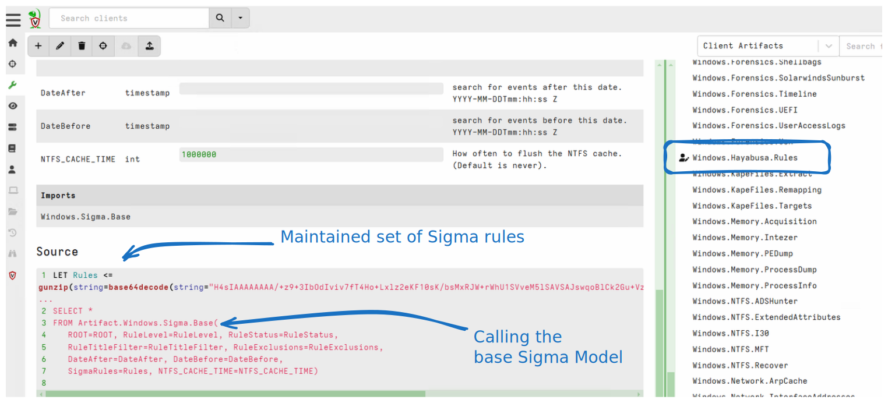

This allows users to easily leverage existing model to write and
maintain their own custom set of rules.

## Writing custom Sigma Rules

While it is common to use curated rule sets for triage, this article
explains the process of developing and testing custom rules.

Below is a worked example of applying the `Log Triage Model` to
develop a Sigma Rule to detect misuse of the `BITS` service.

### The Windows.Sigma.Base Log Triage Model

The [Windows.Sigma.Base
Model](https://sigma.velocidex.com/docs/models/windows_base/), is used
for triaging event log files on Windows:

1. The model defines log sources that access static Event Log Files on
   a Windows System.

2. The model defines a set of `Field Mappings` to access common fields
   within the event log messages, as extracted by the `Log Sources`.

This model is useful for [rapidly triaging event logs]({}) on an endpoint in order to
quickly surface relevant events. You can view the details of this
Sigma Model on the Velociraptor Sigma project's pages

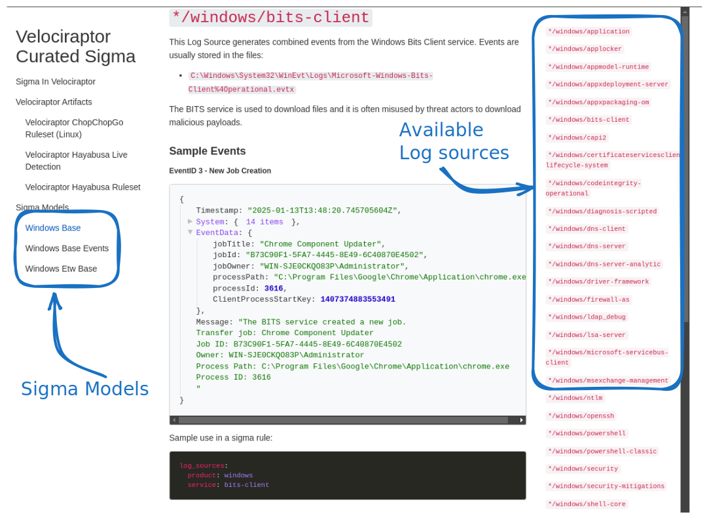

The reference page helps us write the Sigma rules by documenting
exactly which log sources are available in this model and giving some
example events produced by these models.

{}

Although Sigma is in theory an interchange format between different
SIEMs products, in practice it is difficult to port rules between
different evaluation engines (Or different Sigma Models):

1. There is no guarantee that the rule's `Log Source` is actually
   available in a different model.
2. Fields may not exist in other models.
3. There may not be field mappings for the same field in different
   models, or the mappings may clash with other fields.

To achieve portability between SIEM systems we need to develop a Sigma
Model to fully emulate another environment to be able to directly
consume the same rules.

In Velociraptor we are less concerned with portability and more
concerned with having Sigma rules as a way of implementing an easy to
use and powerful detection engine. Velociraptor defines a range of
different `Sigma Models`, some are defined with the intention to
directly consume a large set of rules from another project (For example
the
[Windows.Sigma.Base](https://sigma.velocidex.com/docs/models/windows_base/)
model was written to consume Hayabusa rules for the
[Windows.Hayabusa.Ruleset](https://sigma.velocidex.com/docs/artifacts/velociraptor_hayabusa_ruleset/)
artifact), while others are defined to make powerful telemetry events
available to rule writers (For example the
[Windows.ETW.Base](https://sigma.velocidex.com/docs/models/windows_etw_base/)
model exposes ETW sources not usually available in centralized server
based SIEM architectures).

{}

## Developing custom detection rules.

One of the challenges with rapidly developing detection rules is
iterating through the process of generating events, inspecting the
produced events, updating the rules and applying the rule on the event
sources.

A simple approach to developing detection rules is to:

1. Find an exploit or specific tool to emulate the specific attack on
   the target platform. For example, one may use
   [Metasploit](https://www.metasploit.com/) or [Atomic Red
   Team](https://github.com/redcanaryco/atomic-red-team) to emulate a
   particular attack on the target platform (e.g. Exchange Server).
2. While the attack is performed, ensure sensors are enabled and
   forwading events to the target SIEM.
3. Implement the detection rules on the SIEM
4. Examine if the rule triggers. If the rule does not trigger go to
   step 1 and try to figure out why it does not trigger.
5. Finally try to figure out how to tweak the original exploit to
   ensure the rule may trigger in slight variations of the attack
   (e.g. slightly different command line). This step is essential to
   make the detection robust.

The more complicated the detection pipeline (with event forwarders,
data lakes, matching engines etc) the more complicated it is to
iterate through the above steps.

Testing the rules in future also becomes impractical as it requires
setting up a large infrastructure footprint to be able to successful
run the exploit. If the original vulnerability is patched, running the
exploit may not work and an older unpatched system is required.

To develop detection rules effectively we must separate the event
generation step and the event detection step. To generate the raw
events, we must run the exploit on a real system. However to test
detection rules, we can simply replay the events into the detection
engine, testing detection rules in isolation.


The `Sigma Model` already supports this kind of workflow. The model
defines a set of `Log Sources` which emit raw events. We can then
replay these events back into the detection engine to rapidly develop
the `Sigma Rule`.

The workflow is illustrated above:

1. `Recording Mode`: We start off by recording the relevant events on
   the detected platform. We use the relevant Sigma Model's Log Source
   to record relevant events into JSON files. This step must
   necessarily be run on the target platform as it records real life
   behavior.

2. `Replay/Test Mode`: In this mode we can replay the JSON files
   collected previously back into the same `Sigma Engine`. Except that
   this time, instead of using the real log source, we substitute a
   mock log source which replays events back from JSON files. This
   step can be done on any platform since the events are
   isolated.

   In this mode we are able to quickly iterate over the same events
   and even enable debugging mode which assists in figuring out why an
   event would match a specific condition.

3. `Detection Mode`: Once the rules are validated we can deploy them
   in real life and ensure they match on the real log sources. In
   production the proper log sources are used to feed live events from
   the system to the `Sigma Engine` with the validated `Sigma Rules`

### Example Workflow: Detecting BITS Client Activity

To illustrate the process I will develop a Sigma rule to detect suspicious BITS client activity. BITS is a windows service which is often misused to download malware onto the endpoint.

The service may be abused using the `bitsadmin` command:

```
bitsadmin.exe /transfer /download /priority foreground https://www.google.com c:\Users\Administrator\test.ps1
```

To start off we will use the `Windows.Sigma.Base` model, which
inspects the windows event log files. We have already seen the BITS
client log source in this model previously and know that the events
are read from
`C:\Windows\System32\WinEvt\Logs\Microsoft-Windows-Bits-Client%4Operational.evtx`

Let's take a look at the raw events in this file using the event
viewer.

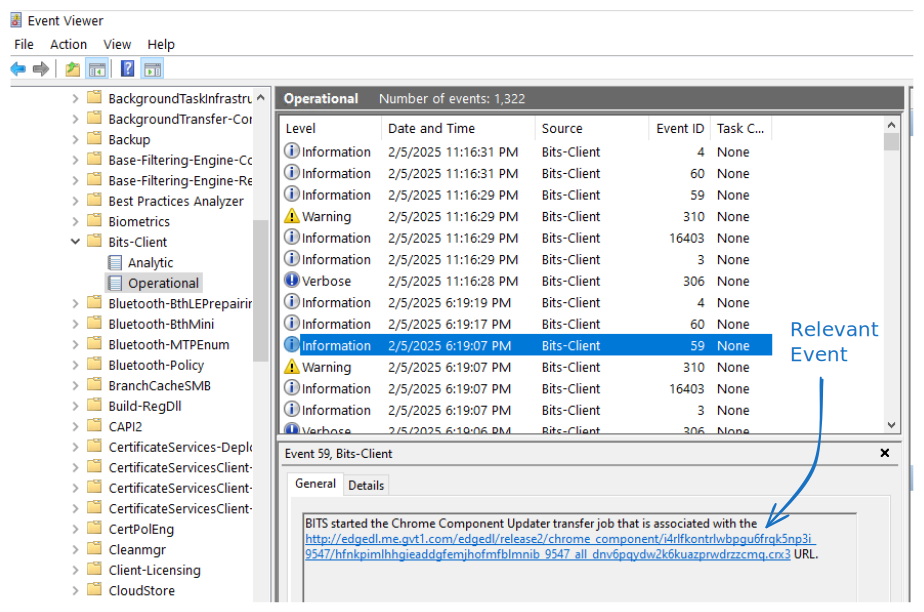

The relevant event I am interested in is event ID 59 - which tells me
the URL where the file was downloaded from. Since the service is used
legitimately by the system there are many URLs mentioned which are not
suspicious. My rule will need to exclude those URLs to only
concentrate on the suspicious uses.

### Step 1: Capture Test Events

My first step is to collect relevant events from the relevant `Sigma
Model`. I do this by collecting the
`Windows.Sigma.Base.CaptureTestSet` artifact. This companion artifact
to the `Windows.Sigma.Base` artifact uses the same log sources but
simply records the raw events.

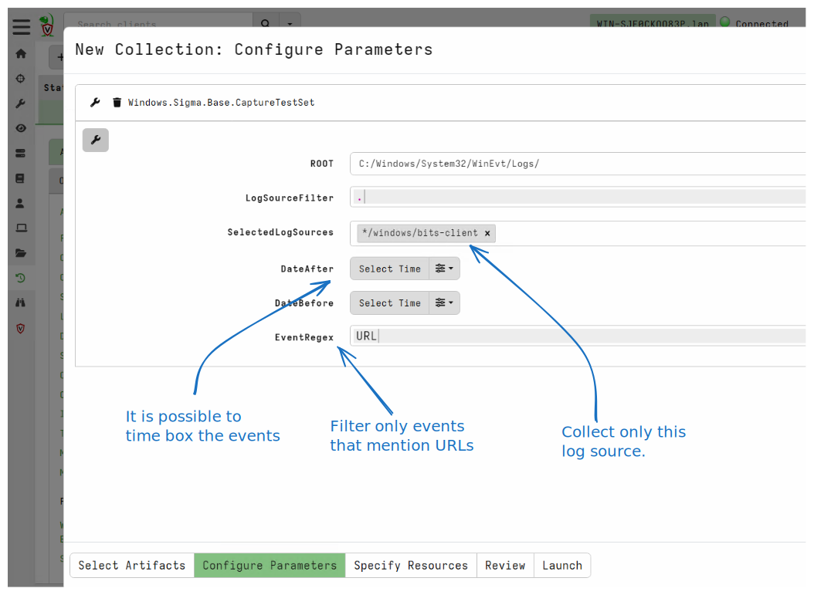

In this case I will only collect events from the `bits_client` log
source and only those events that mention URLs. I can time box the
events to only collect recent events if I want but in this case I will
collect from all available time to get a good selection of URLs used.

Once the collection is done (I can collect this remotely from the
server), I have the raw events available. I can download the raw JSON
from the GUI table view, after possibly filtering them further using
the GUI.

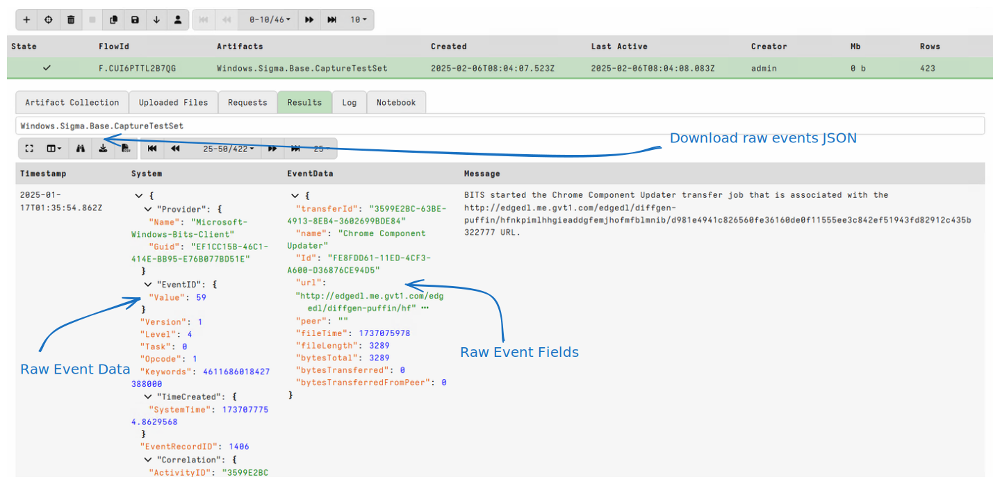

I can pre-filter these events in the notebook to see what is
representative of normal behavior and what is unusual. In this case, I
identify that event ID 59 is associates with transfer job started for
example `BITS started the Chrome Component Updater transfer job that
is associated with the XXX`.

I will extract the domain name part from the URL and group by it so I
can see all unique URLs collected.

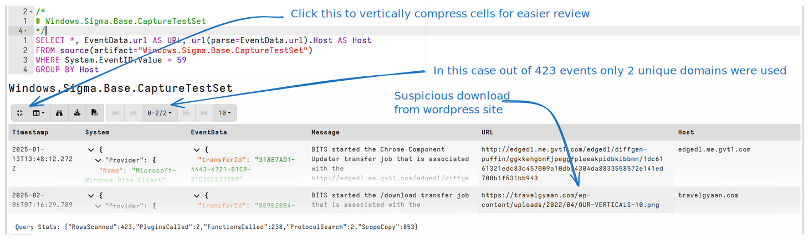

In practice I can collect a more representative set of these events by
collecting the artifact using a hunt (which can include the entire
deployment). This will give me a more representative set of download
URLs found in the environment so I can reduce false positives.

### Step 2: Developing rules with Sigma Studio

To effectively develop rules, one must be able to iterate quickly by
applying the rules against the collected events. To assist with this
process, I will use the `Sigma Studio` notebook template.

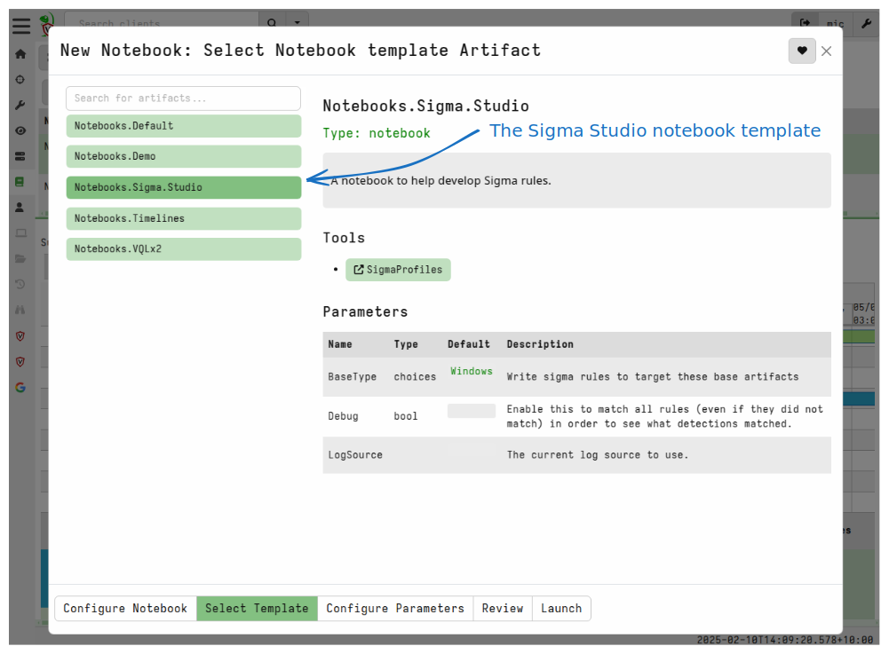

Velociraptor notebooks are interactive documents allowing users to
dissect and analyse data using VQL. The `Sigma Studio` template is
specifically designed to make manipulation of Sigma Rules simpler.

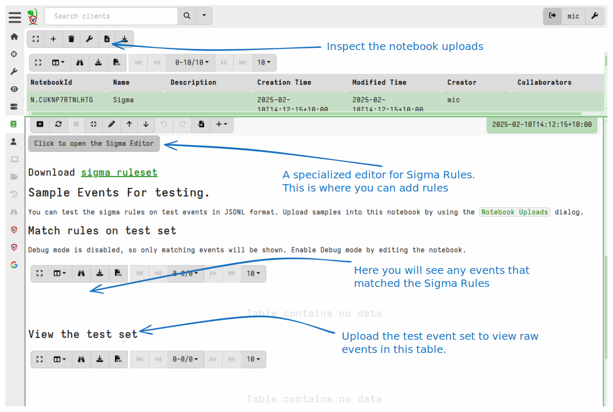

The notebook has a number of important sections:

1. The Sigma Editor button launches a dedicated editor to edit Sigma rules.
2. By clicking the `Notebook Uploads` button you can upload the test
   events described in Step 1 above.
3. Once these raw events are uploaded to the cell, the bottom table
   will render the raw events, while the top table renders only those
   events matching the rules.


I will start off by uploading the test events I collected previously.

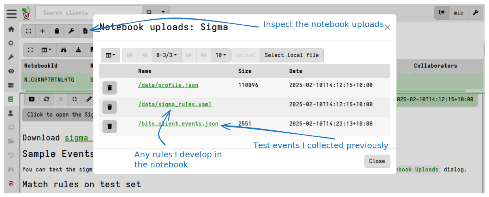

#### Editing the Sigma Rules

I will launch the `Sigma Editor` by clicking on the button.

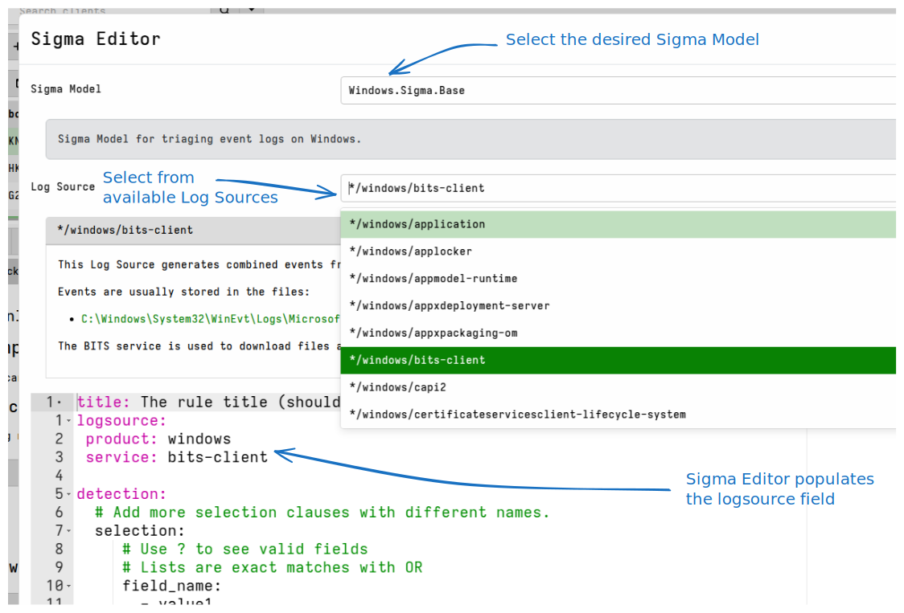

Within the editor I select the `Windows.Sigma.Base` model. Next I
select the `bits-client` log source from the pull down. The editor
will show me available log sources within this model.

The editor displays so documentation about the log source and presents
a syntax highlighted Sigma text editor populated with a template
rule. For those not familiar with Sigma, comments help to guide the
user into filling in the desired fields.

For this detection, I will search for event ID 59, which reveal the
URL associated with the bits job. However, I will suppress jobs from
URLs accessing specific domains.

Pressing `?` will suggest any of the field mappings defined within
the model.

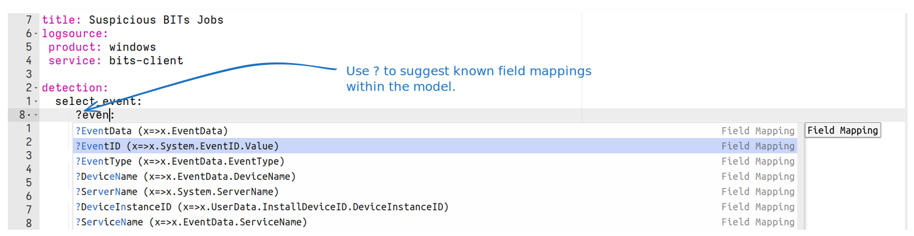

In this case I know that `EventID` is a field mapping to extract the
log message's Event ID, and the `Url` field mapping will extract the
`url` field from the `EventData`

The rule I came up with is:

```yaml
title: Suspicious BITs Jobs
logsource:
 product: windows
 service: bits-client

detection:
 select_event:
   EventID: 59

 allowed_urls:
   Url|re:
    - edgedl.me.gvt1.com

 condition: select_event and not allowed_urls

details: "Bits Job %JobTitle% accessed URL %Url%"
```

* The rule consumes events from the `windows/bits-client` log source
  (which in this model ends up reading the events from the
  `C:\Windows\System32\WinEvt\Logs\Microsoft-Windows-Bits-Client%4Operational.evtx`
  log file.

* There are two selections:
   1. If the event id equal to 59
   2. Does the URL match one of the specified regular expressions

* Finally the rule will match only if the first selection is true and
  the second selection is false (i.e. only event 59 which do not match
  one of the allowed urls).

* The `details` field specified a message that will be emitted when
  the rule matches. This allows us to specify a simple human readable
  alert to explain what the rule has detected. You can add field
  interpolations enclosed in `%` to the message.

When I save the rule, the notebook will be refreshed and recalculated
using the new rule applied on the sample events I uploaded previously.

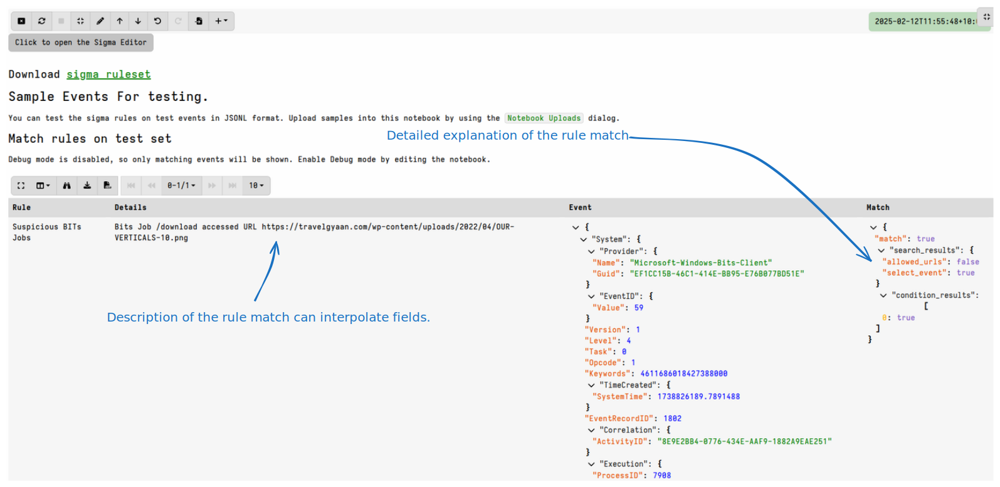

You can see a detailed description of why the rule matched. For rules
with many selections and complex condition clauses this allows us to
inspect each condition in isolation.

#### Unavailable Field Mappings

Sigma strictly requires field mappings to already exist in the model
so they can be referenced. This makes it impossible to access fields
in the event which have not previously been defined within the model.

To solve this problem, Velociraptor's Sigma implementation allows, as
a special case, to use field names with `.` separating fields within
the event. The above rule can be written without any field mappings
as:

```yaml
title: Suspicious BITs Jobs
logsource:
 product: windows
 service: bits-client

detection:
 select_event:
   System.EventID.Value: 59

 allowed_urls:
   EventData.url|re:
    - edgedl.me.gvt1.com

 condition: select_event and not allowed_urls

details: "Bits Job %EventData.name% accessed URL %EventData.url%"
```

It is better to use model field mappings if they are already defined
in the model because this makes its easier to port the rule to other
models, however if one is not available you can fall back to this
method of referencing fields directly.

### Step 3: Test the rule on the fleet.

Now that we have a working Sigma rule we can apply this rule to the
wider fleet to assess the rule's false positive rate. As we apply the
rule more widely we are likely to discover more legitimate uses of the
BITS service and so we might need to add more URLs to the allow list.

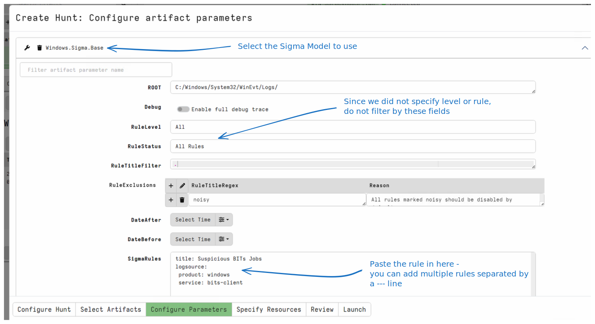


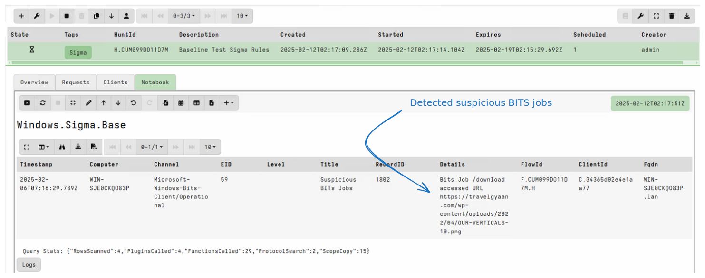


## Conclusions

This Blog post explains the rational behind separating Sigma Rules
into `Sigma Models`. Velociraptor's Sigma implementation allows for
the creation of many specialized `Sigma Models` which can operate in
completely different environments.

For example, the `Windows.Sigma.Base` model operates on parsing of
event log files on the endpoint (triaging existing logs). On the other
hand the `Windows.Sigma.BaseEvents` model watches log files in real
time to generate Sigma based events on current activity.

Similarly the `Linux.Sigma.EBPF` model surfaces real time telemetry
collected from EBPF sensors on Linux and makes these available to
Sigma rule authors. This flexibility allows applying Sigma in many
different scenarios, making it a power technique.

The main difficulty with writing Sigma rules is being able to iterate
through generating event data, applying the Sigma Rule, debugging the
rule and testing the detection at scale.

This post describes a new Sigma rule writing workflow that allows to
rapidly iterate through the detection process, then apply the test to
the entire fleet quickly to test false positive rates.
