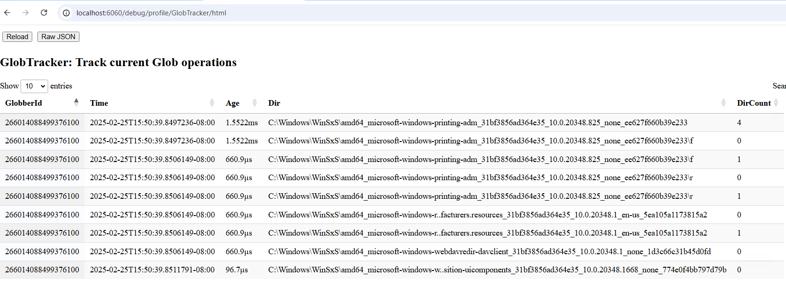

I am very excited to announce that the latest Velociraptor release
0.74 is now in the release candidate (RC) status and available for
testing.

In this post I will discuss some of the new features introduced by
this release.

## GUI Improvements

This release improves a number of GUI features.

### Notebooks now receive typed parameters

Notebooks can now receive typed parameters and tools. This can be used
to create sophisticated notebooks which utilize external tools and
user parameters for post processing complex results.

For example, consider the new `Sigma Studio` notebook - a specialized
notebook designed to facilitate development of `Sigma` rules.

Notebook parameters can be modified at any time, where they are made
available to cells for recalculation. This allows notebook templates
to be interactive.

### Expose the debug server to all admin users

Sometimes it is hard to know what is happening within Velociraptor -
this is especially the case when a large collection is made or a
complex query is added to the notebook.

Previously Velociraptor had a debug server which was accessible when
started with the `--debug` flag. The debug server exposes a lot of
internal state in order to help users understand what is going on.

However, adding another command line flag and exposing a new port
requires the server to be restarted which makes it hard to access this
debugging information.

In this release the debug server is always exposed in the GUI.

The debug server has a lot more interesting pages now. For example the
`Plugin Monitor` page shows which VQL plugins are currently in any
query and what parameters they were given.

The above shows the `glob()` plugin is currently searching the glob
`C:/Windows/**/*.exe` and had been for 7 seconds. This page provides
visibility as to what plugins are running slower than expected and
what they are doing.

Breaking it down even further the `GlobTracker` page shows the last 10
files visited by the `glob()` plugin. This is often critical to
understanding why a glob operation is slow, as sometimes the plugin
will visit many files and directory which do not match or are on a
remote network drive leading to long delays without evident progress.

There are many other debug pages including `ETW` tracking,
`ExportContainer` tracking the progress of zip export of hunts or
collections, `Client Monitoring Manager` reports status of client
monitoring queries and many more.

{}

While in this release the debug server is always present in the GUI,
the debug server is still available in other contexts as well. You can
still start the debug server on a client with the `--debug` flag and
similarly in the offline collector by starting it with
`VelociraptorCollector.exe -- --debug`

{}

## Real time detection and monitoring

As Velociraptor is used more and more in real time detection
applications, Velociraptor's detection capabilities are maturing. We
are now using `Sigma` rules in many contexts, not just to triage
Windows Event logs, but also to match real time events from `eBPF` and
`ETW` as well as more traditional forensic artifacts.

### Sigma Studio

Velociraptor's `sigma()` plugin appeared in the previous release and
was improved greatly in this release. Previously Sigma rules were used
primarily for rapid triaging of Windows Events using the `Hayabusa`
rule set. A Curated set of rules are published on the Velociraptor
Sigma site at https://sigma.velocidex.com/ - these rules can be
automatically imported using the
[Server.Import.CuratedSigma](https://docs.velociraptor.app/artifact_references/pages/server.import.curatedsigma/)
artifact.

Previously it was difficult to write and test your own custom Sigma
rules. However in this release we introduced the concept of `Sigma
Models` - a preset collection of `Sigma log sources` that can be used
in particular contexts to write custom rules.

The GUI also introduces a new `Sigma Editor` which is used in the
`Sigma Studio` Notebook Template. These measure make it easy to write
or curate custom Sigma Rules.

To understand how all these components work together, read our new
blog post [Developing Sigma Rules in Velociraptor]({})

### Linux eBPF support

Live detection using Sigma rules works well on Windows as we have a
good source of events with Sysmon or Windows event logs. For example
the
[Windows.Hayabusa.Monitoring](https://sigma.velocidex.com/docs/artifacts/velociraptor_hayabusa_event_ruleset/)
artifact uses the `watch_evtx()` plugin to follow event logs and match
them against the Hayabusa rule set in real time.

However for Linux we did not have a reliable live event
stream. Velociraptor previously had the `watch_auditd()` plugin to
receive `auditd` events but this was always clunky and hard to
configure.

In this release Velociraptor includes a full `eBPF` plugin based on
the excellent open source [tracee
project](https://github.com/aquasecurity/tracee). This given
unprecedented access to live system telemetry on Linux via VQL. Among
others some useful events include

- File operations with process information (open, delete, rename etc).
- Process Start/Stop.
- Network Connections (with process information).

You can see example events from the eBPF plugin in the [Linux Base
eBPF Model](https://sigma.velocidex.com/docs/models/linux_ebpf_base/)
page. These events are directly available now in Sigma rules so we can
monitor Linux endpoints in real time.

### Added support for the NT Kernel Logger ETW session

While on Linux we need an eBPF program to access system telemetry, on
Windows we can in theory use ETW as a built in way. Velociraptor had
the `watch_etw()` plugin for a long time, but we found that some
specialized ETW sources actually require a lot of processing before
they were directly usable.

On Windows there is a special ETW provider called the `NT Kernel
Logger` provider. This provider gives live events for many kernel
operations:

- Process Start/Stop events
- Module Load events (Linking dlls)
- Network Operations
- Registry keys

And many more. The provider can also provide stack traces for system
calls which may be useful in some detection scenarios.

Velociraptor now supports this provider for receiving real time
events. You can see some of the events provided in the [Windows Base
ETW Model](https://sigma.velocidex.com/docs/models/windows_etw_base/)
page explaining how to use those for Sigma detection rules.

This exciting capability brings Velociraptor into line with other open
source endpoint detection tools, for example
[Fibratus](https://www.fibratus.io/) uses this log provider almost
exclusively.

## VQL and Artifacts

This release also brings some improvements in Velociraptor's plugins
and artifacts.

### Added parse_pst() plugin and pst accessor

One commonly requested feature is support for `PST` files, usually
containing Outlook emails. This release introduces the `parse_pst()`
plugin which allows us to parse emails from a PST file as well as
extract attachments for Yara scanning.

### Artifact Verifier

As users start to build large corpus of custom artifacts, the need for
automated static analysis of VQL artifacts is increasing.

This release introduces the new `velociraptor verify` command. This
command scans a set of directories for VQL artifacts and uses static
analysis to find errors and highlight issues.

Currently the command employs the following checks:

- Checks the VQL syntax is correct
- Ensures that plugins and function that are called in VQL actually
  exist - this flags common errors like using a VQL plugin where a
  function is needed etc.
- Ensures plugins are called with the correct arguments. This flags
  common errors like passing a plugin a deprecated argument or
  accidentally calling a plugin with the wrong parameter.
- Ensures that dependent artifacts are called correctly - i.e. the
  artifacts define the parameters that are being called.

This command is intended to run inside a Continuous integration (CI)
pipeline as a presumbit check for artifact correctness.

## Conclusions

There are many more new features and bug fixes in the latest
release. Please download the release candidate and give it a test and
provide feedback.

If you like the new features, take [Velociraptor for a
spin](https://github.com/Velocidex/velociraptor)!  It is available
on GitHub under an open source license. As always please file issues
on the bug tracker or ask questions on our mailing list
[velociraptor-discuss@googlegroups.com](mailto:velociraptor-discuss@googlegroups.com)
. You can also chat with us directly on discord
[https://www.velocidex.com/discord](https://www.velocidex.com/discord)
.
