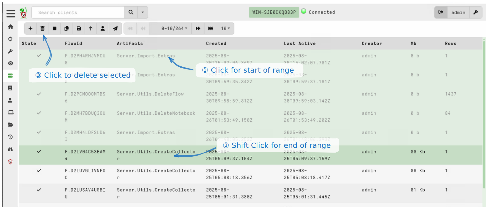
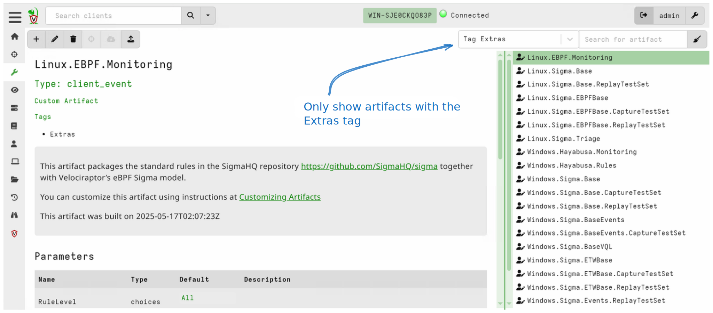
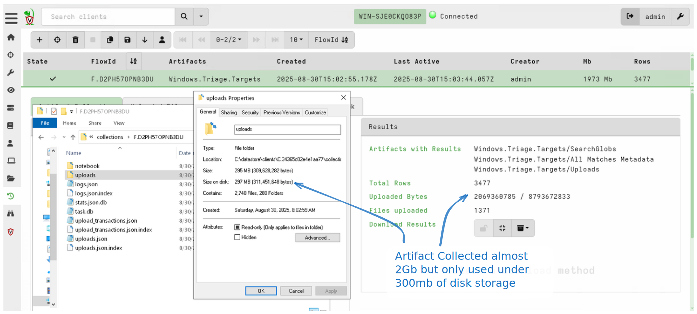
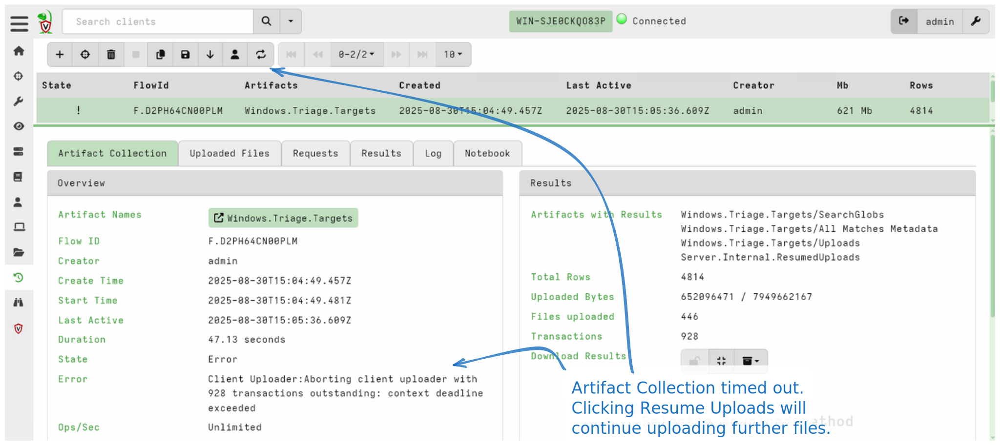

I am very excited to announce that the latest Velociraptor release
0.75 is now available.

In this post I will discuss some of the new features introduced by
this release.

## GUI Improvements

This release improves a number of GUI features.

### Multi-select deletion

Previously it was only possible to delete flows, clients, artifacts or
hunts one at the time. However, in this release it is now possible to
highlight a set of items by clicking the first item in the range, then
pressing SHIFT, then clicking the last in the range.

This allows deleting many items at once from the GUI. The same process works for
deleting multiple clients, multiple artifacts in the artifacts viewer, multiple
notebooks, and multiple collections from a client.

### Artifact Tagging

As Velociraptor is used by more and more people, we are seeing many
public artifact sources becoming widely available for users to add to
their server. While this is great to see, it is sometimes overwhelming
to see so many custom artifacts in the artifacts viewer mixed up into
the same view.

Previously, we used a prefix to import artifacts so their names would
be distinct. For example, all artifacts coming from the artifact
exchange were given the `Exchange` prefix. This proved problematic in
practice because it made it difficult for artifacts to import other
artifacts by their name, when the name could depend on the way the
user imported the artifacts.

In this release, Velociraptor introduces the concept of a `Tag` on the
artifact. Tags are kept separately from the artifact itself, and can
be considered part of the artifact metadata.

You can add tags using the
[artifact_set_metadata]()
VQL function, which is used in certain import artifacts.
This allows grouping of similar artifacts.

The GUI will add a new search category for each tag to allow the user
to easily see all artifacts that have the same tag.

In the above example, the artifacts imported through the
`Server.Import.Extras` artifact are tagged with the `Extras` tag. They
can all be seen together and deleted at once if needed (using the
multi-select method described above).

### Table keyboard navigation

Velociraptor presents a lot of information in tabular form. This
release adds keyboard navigation to all tables to make it easier to
preview a lot of information quickly:

* `n`, `p` page table forward and backwards.
* `j`, `k` move selection focus up or down
* `home`, `end` page table to first or last page.

## Server improvements

### Storing compressed data

Velociraptor is often used to collect large quantities of data from
endpoints. This data appears in the form of either bulk data
(e.g. file contents) or JSON data (e.g. the results of VQL queries).

This data can be quite large and new users often run out of disk space
when starting to collect from large networks. In previous versions of
Velociraptor, the server would store the data uncompressed on
disk. This has some advantages such as being able to post process the
data using an external script or program because the data is simply
stored as flat files on the server.

However, this advantage comes at a massive cost in storage needs. It
would be much better to store the data compressed on the server and
only decompress the data as needed.

Because the Velociraptor server is light weight and needs to support a
large number of endpoints, it is not practical to have the server
itself compress the data as it arrives from the endpoints.  Therefore
in this release, the Velociraptor client is asked to compress data
into chunks as it is transmitting the data in the first place. The
server only needs to write the chunks down into storage **without
needing to decompress the data at all**.

This new scheme actually makes the server faster, as it needs to write
less data to storage (reduced IO costs), and does not require the
server to perform expensive compression/decompression cycles. The
client does not actually have to do additional work (as it always
needs to compress data for network transmission anyway), so this
scheme is an overall improvement in performance.

The above example shows a typical `Windows.Triage.Targets` collection
with the `KapeFiles` target on a test system collecting just under 2Gb
of data (mostly bulk files in this case). However, the actual storage
used on disk is around 300Mb representing a 85% storage saving.

Even higher compression ratios were observed with artifacts that
produce a lot of JSON output, like `Windows.NTFS.MFT`, since JSON data
is highly compressible.

The downside of this change is that the files on the server storage
are no longer readable by external tools, and so any post processing
artifacts that use the [file_store()]() to obtain the underlying file
are unlikely to work. If you need to get the uncompressed data you may
use the [copy()]() function to
copy the file to a temporary file thereby uncompressing it.

Since the new compression scheme requires client support it will only
work with 0.75 clients. If you do not want to enable compression you
may change [the configuration setting]() to "none".

### Resumable uploads

Velociraptor places a reasonable timeout on collections in order to
avoid accidentally collecting too many files. This is necessary
because often we do not really know what is on the endpoint before
collection. For example, say we wanted to collect all browser
artifacts from an endpoint. Sometimes, a single server may have
hundreds or even thousands of users (e.g. a Terminal Server) and this
artifact will end up collecting vast quantities of data, likely not
targeted to the investigation.

For this reason, Velociraptor always places a timeout on collections,
as well as an upload limit. The idea is to catch such accidents early.

Previously when a collection would reach its limits, the collection
would be cancelled and the user would be faced with two choices:
either refine the artifact to be more targeted and collect less data,
or repeat the collection with larger timeout or upload limits.

If the user chose to repeat the collection, then all the previous data
would need to be collected again (since it is a brand new collection).

In this release, Velociraptor offers `Resumable Collections`. This
feature is enabled by default for many artifacts that primarily
collect files (such as the `Windows.Triage.Targets` artifact).

In the above example the `Windows.Triage.Targets` artifact timed out
but it is reporting that there are 928 upload transactions remaining
(i.e. incomplete uploads that can be resumed). Clicking the `Resume
Uploads` button will restart those uploads and set the collection back
into the running state.

Note that this may not always be safe. If the filesystem has changed
since the upload transaction started, the resumed file may not match
with the initial file. For example, supposed that the original
artifact searched for `C:\Windows\*.exe` and found 50 executable files
to upload, but when the collection was resumed, 10 of the previous
executables were removed and 10 more were added. The resumed
collection will not detect the new files and will fail to upload the
older files.

If you wish to use resumable uploads in your custom artifact, set the
`UPLOAD_IS_RESUMABLE` parameter to `TRUE`. This changes the `upload()`
function to become asynchronous and just queue an upload transaction
instead of waiting for the upload to complete.

### Securing the Server Filesystem

Velociraptor allows users to run arbitrary VQL queries in
notebooks. These queries run directly on the server and so may allow
users to view any files or run any commands on the server itself.

In many higher security deployments there is a need to restrict access
to the server itself from Velociraptor users. Velociraptor already
offers an extensive user permission model, with users needing the
`FILESYSTEM_READ` permission to be able to read files on the server
filesystem.

Often it is necessary to provide users with this permission (for
example to allow them to post process data using an external tool),
but we still do not want to allow users to be able to read the entire
server filesystem.

In this release it is possible to restrict the directories that VQL is
allowed to read on the server using [a configuration option]().

## Client improvements

### Reworked Lnk parser

The `Lnk` parser is used in many artifacts like
`Windows.Forensics.Shellbags`, `Windows.Forensics.Lnk`, and
`Windows.Forensics.JumpLists`.

The artifact is now more complete with support for many shellbag
types.

### Added Windows.Forensics.NotepadParser

The new notepad available in Windows 11 provides a lot of valuable forensic
information. This is now implemented in Velociraptor based on research by
[ogmini](https://github.com/ogmini/Notepad-State-Library).

### Removal of some large artifacts

Over time Velociraptor has spawned many sub-projects for curating and
managing certain larger, more complex artifacts. As some artifacts became more
complex and powerful, we moved them into separate projects so that they could be
developed and managed independently of the main Velociraptor project. Splitting
these off allows for independent release cycles, thus facilitating more rapid
development and innovation.

The following artifacts were removed from the built-in set, and are now
available to download using the `Server.Import.Extras` server artifact:

1. The `Windows.KapeFiles.Targets` artifact is now managed as part of
   the [Velociraptor Triage Project](https://triage.velocidex.com/).

   This project intends to develop a set of rules that are used for specifying
   the collection of files from the endpoint.

   Building on from the `KapeFiles` repository, this project now
   contains the `Windows.Triage.Targets` artifact based on the old
   `KapeFiles` project, and the `Linux.Triage.UAC` artifact based on
   the `UAC` project.

2. The `Generic.Forensic.SQLiteHunter` artifact is now managed under the
   [Velociraptor SQLite Hunter Project](https://sqlitehunter.velocidex.com/)

   This aims to be a one-stop shop for all `SQLite`, `ESE` and many other
   database-oriented forensic artifacts.

3. [Velociraptor Sigma Project](https://sigma.velocidex.com/) is the home of
   our artifacts that implement rapid Sigma-based triage and monitoring rules.

4. [Velociraptor Registry Hunter Project](https://registry-hunter.velocidex.com/)
   is our project to develop sophisticated registry analysis modules.

5. [The Velociraptor Artifact Exchange]() is our
   repository of community-contributed artifacts.

The following artifacts were permanently removed:

1. `Generic.Collectors.SQLECmd`: Superseded by `Generic.Forensic.SQLiteHunter`

2. `Server.Import.DeleteArtifacts`: Obsolete since custom artifacts can now be
   filtered by tag and then bulk deleted using
   [multi-select deletion]()
   as described above.

3. `Server.Import.UpdatedBuiltin`: Superseded by `Server.Import.Extras`.

4. `Windows.Analysis.EvidenceOfExecution`: A wrapper artifact that is largely
   superseded by `Windows.Registry.Hunter`, however the underlying artifacts are
   still included.

## Conclusions

There are many more new features and bug fixes in the latest
release. Please download the release candidate and give it a test and
provide feedback.

If you like the new features, take [Velociraptor for a
spin](https://github.com/Velocidex/velociraptor)!  It is available
on GitHub under an open source license. As always please file issues
on the bug tracker or ask questions on our mailing list
[velociraptor-discuss@googlegroups.com](mailto:velociraptor-discuss@googlegroups.com)
. You can also chat with us directly on discord
[https://www.velocidex.com/discord](https://www.velocidex.com/discord)
.
