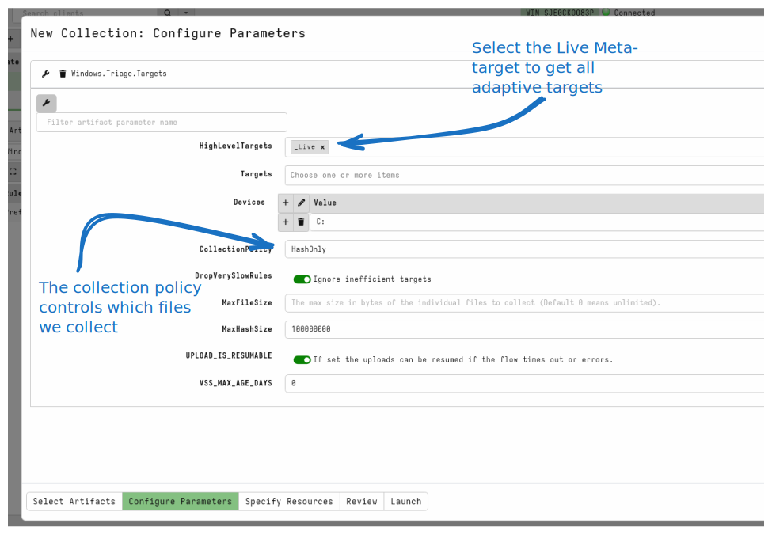
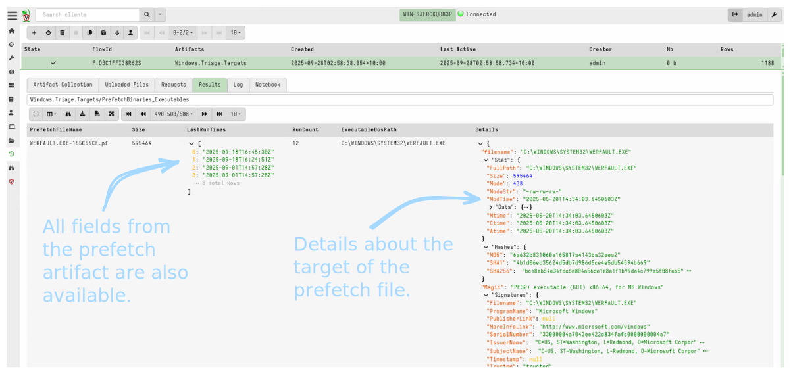
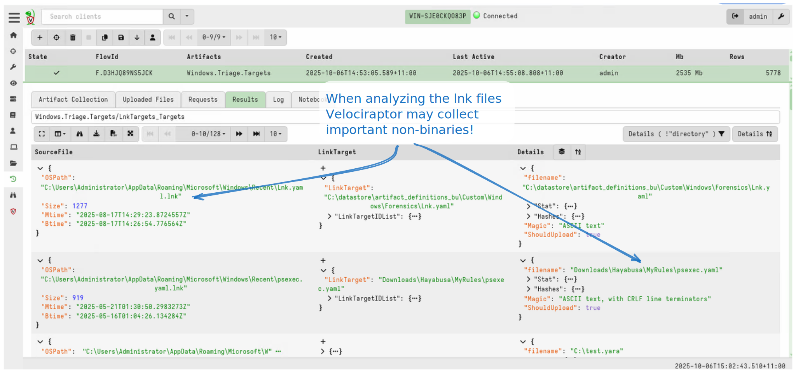

I recently joined the great folk at [Cyber
Triage](https://www.cybertriage.com/) on a webinar to explore the new
[CyberTriage Velociraptor artifact](). I was excited
to be talking with them since I heard great things about Cyber Triage
and really wanted to learn more about it.

One of the interesting features they presented was the concept of
[Adaptive
Collection](https://www.cybertriage.com/cyber-triage-dfir-collector/)
which I thought was quite neat.

In this blog post I will describe what "Adaptive Collection" means and
how this really improves the state of the art in DFIR triage. I will
also show how this is now implemented in Velociraptor and how you can
use it today to improve your triage and investigation.

## What is Triage collection anyway?

DFIR is all about trying to quickly determine what happened. In the distant past
we used to acquire full disk images of systems so we could perform digital
forensics on them. However, these days this is usually highly impractical:

* Hard disks have become so large that imaging them, copying the images
  elsewhere, storing and working with them is often impractical, especially
  since speed is a critical aspect of every investigation.
* In modern network intrusions we usually need to examine a large number of
  endpoints. Aside from storage constraints, the time required to make full disk
  images of potentially thousands of machines puts this option in the realm of
  the impossible.

Today's best practice is to actively hunt the network with a tool like
Velociraptor to quickly gather specific, well-targeted artifacts
across a large number of endpoints.

Through efficient distributed hunts the number of systems of interest is
reduced. We may then perform _Triage Acquisition_ for the purpose of
[preservation of evidence]().
We often need to delegate the Triage Acquisition step to others who have
access to the affected systems (for example Help Desk employees or system
administrators).

Triage Acquisition has a number of goals:

1. To acquire as much relevant information as possible to be able to determine
   what happened on the system. In many cases we only get one chance
   to perform triage acquisition, before the system is rebuilt and evidence is
   destroyed.

2. To perform this collection as quickly as possible. Some critical servers can
   not tolerate prolonged outages or resource-intensive investigative activity.

3. Triage collection should be as automated as possible. Ideally the person
   initiating the collection should not need to provide any input to the
   collection process. They may not be skilled in DFIR techniques nor be
   accustomed to making critical decisions under pressure.

These goals call for a high level of automation.

Velociraptor's
[offline collector]()
is specifically designed to be fully automated - the operator simply needs to
run it and a triage collection is made. The collection can be uploaded to the
cloud or returned to the investigation team some other (potentially out-of-band)
way.

The main takeaway from this diagram is that it is difficult to iterate
over the collection with the offline process. Initiating a new
collection required repeating the entire process again with potential
manual intervention.

Therefore it is desirable to collect as much as possible in the first
place to minimize the need to go back and re-collect more data.

While it would be nice to collect as much as possible, we need to be
speedy in our collection. Therefore we need to make some tradeoffs:

* The more files we collect the longer it takes and the larger the
  collection gets. This makes it harder to handle more systems and
  transfer more data across the network.

* However, once the collection is done it is not always possible to go
  back and get more files. Sometimes systems are rebuilt the preservation step,
  which puts pressure on responders to collect all relevant data in a single
  acquisition step. This pressure can also lead to over-collection of data,
  including irrelevant items.

## Current state of the art

One of the more popular artifacts to use with the offline collector is
the `Windows.KapeFiles.Targets` artifact. This artifact uses target
definitions from the
[KapeFiles](https://github.com/EricZimmerman/KapeFiles) project to
collect files from the system. The project defines targets which are
essentially search globs finding particular files on the system.

For example, the Windows Event logs are usually stored in
`C:\Windows\System32\winevt\logs\*.evtx`. During a preservation triage
acquisition, one would usually collect all those files.

Meta-Targets can also be defined so that when the user chooses to
collect the
[BasicCollection](https://triage.velocidex.com/docs/windows.triage.targets/rules/#!BasicCollection)
target, Velociraptor will automatically collect the Event logs,
Registry, MFT etc.

There are many `KapeFiles` targets collecting files related to many
products and applications, however they are all essentially static
globs. The `Windows.KapeFiles.Targets` artifact looks for files on disk
from this static list of pre-determined globs.

{}

Since the Velociraptor 0.75 release, the `Windows.KapeFiles.Targets`
artifact is no longer built into Velociraptor. Instead it is managed
in its
[own project](https://triage.velocidex.com/docs/windows.triage.targets/rules/).

The new artifact goes beyond the using simple globs expressions, and
has therefore been renamed to `Windows.Triage.Targets` to distinguish it from
it's predecessor artifact.

{}

### Why is this not enough?

While this is artifact is a great start, it is usually not enough.
Many of the forensic artifacts collected may point to other files that
may be found on disk, and those files are not usually collected.

For example, consider the [prefetch artifact]() in which
Windows stores paths to previously run executables. While the location
of the prefetch files themselves is well known
(i.e. `C:\Windows\Prefetch\*.pf`), when an analyst examines these
files, they may discover that they point at a suspicious executable
located somewhere else on the disk from which file were not acquired.

During the initial triage acquisition phase there is no way to know if the
executables they point to are malicious or not. With the standard `KapeFiles`
collections, the investigator needs to go back to the original system to get
those files.

Another example is the XML files that define Windows Scheduled tasks, which are
normally located in `C:\Windows\System32\Tasks\**`. These files point to
periodically launched executables that could be located anywhere on the disk.

### What is Adaptive Collection?

The idea of "adaptive collection" is that the collector itself performs an
initial parsing and analysis phase and then decides based on it's results which
additional files to collect. That is, relevant files should be collected
automatically even when not explicitly specified as collection targets.

Applying an adaptive collection strategy to the previous example, the user would
specify collection of the prefetch files, but the collector would parse each
prefetch file automatically and check whether the target file exists in the
target location. For each target, if it is present, the collector will also
collect it.

This way, when the analyst later examines the prefetch files, they can
immediately also inspect the related binary, without needing to
go back to the original system.

Of course in the case of prefetch, it is possible that the target executable was
deleted before the acquisition. In this case the adaptive collector cannot
acquire it. But this is also an important piece of information as the analyst
then knows that the executable is actually missing and that there is no point in
trying to fetch it in a subsequent collection phase.

The point of adaptive collection is to include files which may be relevant once
the basic (primary) artifacts are parsed. This avoids needing to go back and
re-collect additional files after the analysis is performed.

A useful side-effect of this approach is that forensic artifacts are already
parsed and analyzed, so there is no need for further post-processing of bulk
collected files. This simplifies the post-processing pipeline and speeds up
analysis when dealing with a large number of systems.

## The Windows.Triage.Targets artifact

The `Windows.Triage.Targets` artifact is compiled from many separate
rules. Each rule specifies one or more targets - basically a single
type of forensic artifact to acquire.

You can download the `Windows.Triage.Targets` artifact from
https://triage.velocidex.com/docs/windows.triage.targets/ or simply
use the built in [Server.Import.Extras]() artifact to
automatically download and import the latest version.

The artifact contains many adaptive rules, for example some of these
are:

1. `AdaptiveScheduledTasks`: Enumerates all scheduled tasks and
   attempts to acquire the associated binaries run by them.
2. `LnkTargets`: Searches for `lnk` files and attempts to acquire their file
   targets. `lnk` files are common infection vectors.
3. `PrefetchBinaries`: enumerates all prefetch files and captures the associated
   executables.
4. `PsList`: enumerates all running processes and captures their respective
   binaries.
5. `Services`: enumerates all installed services and captures their binaries.

All of the adaptive rules are triggered by the meta-target
[_Live](https://triage.velocidex.com/docs/windows.triage.targets/rules/#_Live).
So all a user needs to do is to select the `_Live` target and collect the
artifact (Usually the `_Live` target is selected _in addition_ to more
traditional/non-adaptive target sets like `_SansTriage` or `_BasicCollection`).

Adaptive rules may substantially increase the number of files
collected. However, we rarely care about legitimate binaries which are
often signed. The way we choose if a file is to be collected is termed
the `Collection Policy`.

There are a few choices:

1. `ExcludeSigned`: This is the default policy. We collect all
   adaptive targets, except if they are a trusted signed binary. Most
   of the time, signed binaries are trusted already and there is no
   benefit in collecting them. In practice this reduces the collection
   size substantially.

2. `HashOnly` is used to simply take the hash of the file but not to
   collect the file itself. This setting is useful when the client is
   connected and available so interesting files may be fetched at a
   later stage. The hashes and file stats are enough to indicate whether
   the target files are still present on the system or not.

3. `AllFiles` Just collect all files. This is not recommended for
   adaptive collections as it will also collect system files and
   signed/trusted binaries.

{}

Adaptive rules will sometimes attempt to collect the same file. For
example, if there are several `notepad` processes running, the `PsList`
rule will attempt to collect `notepad.exe` multiple times.

The triage artifact automatically caches and deduplicates these
collections so that collecting the same file multiple times is safe
and fast - only one copy will be acquired and it will be hashed only
once.

{}

Let's look at the result of collecting the `PrefetchBinaries` target:

Collecting the `PrefetchBinaries` target will execute the standard
Velociraptor `Windows.Forensics.Prefetch` artifact and capture all the usual
fields that the artifact returns, such as run times and other prefetch
related fields. Additionally, Velociraptor will attempt to acquire
each target if possible (if the file still exists on disk at that
location).

The `Windows.Triage.Targets` artifact automatically captures metadata
such as last modified timestamps, hashes and authenticode status for
executables.

In addition to collecting the prefetch binary targets, we also receive
all the usual output from collecting the `Windows.Forensics.Prefetch`
artifact, saving us from having to re-collecting it later.

Another example is collecting the
[LnkTargets](https://triage.velocidex.com/docs/windows.triage.targets/rules/#LnkTargets)
rule. This rule analyzes `Lnk` files (shortcuts) to extract their targets.

Lnk files are often created when the user edits them on the desktop,
so capturing the targets of `Lnk shortcuts` can capture strong
evidence of user activity. In this case we see a number of files that
were edited with `Notepad` and were captured (assuming they were still
present).

## The Registry Hunter

Registry analysis is a powerful and critical tool in the Digital
Forensics arsenal. The Windows registry contains a wealth of
information about system state, while many persistence techniques
leave traces in the registry.

Traditionally, registry analysis is performed on the raw registry
hives (collected using, for example, the `KapeFiles` artifact). These
files are analysed using tools such as [Reg
Ripper](https://github.com/keydet89/RegRipper4.0) or [Registry
Explorer](https://www.sans.org/tools/registry-explorer). These tools
operate on collected registry hives and contain rules designed to
extract specific pieces of information from various registry keys.

Recently, The Velociraptor team has started the [Registry
Hunter](https://registry-hunter.velocidex.com/) project. This project
aims to develop a fully featured rule-based registry parser, and
contains a large (and growing) number of
[rules](https://registry-hunter.velocidex.com/docs/rules/). Many of
the rules in the Registry Hunter also attempt to uncover evidence of
persistence through various registry artifacts.

While the Registry Hunter can operate on collected hive files, it can
also operate on the live system using a mixture of API based registry
access and raw hive parsing. Therefore, the Registry Hunter running on
a live system is ideally positioned to perform Adaptive Collection
as described above.

The Registry Hunter now has a `CollectionPolicy` parameter for rules
that implement adaptive rules. By default these rules simply hash the
binaries uncovered in the registry, but they can collect them as well.

For example, consider the [Scheduled Tasks (TaskCache)
rule](https://registry-hunter.velocidex.com/docs/rules/#Scheduled%20Tasks%20(TaskCache))
from the Registry Hunter. This rule analyses the registry to extract
the scheduled tasks (as opposed to analysing the XML files in the
`Windows/System32/Tasks` directory).

When the task action launches a binary, the Registry Hunter is able to
inspect the disk to check on the launched binary.

For an offline collector, it is recommended to use both the `Registry
Hunter` and the `Triage Targets` artifacts together.

### Optimizations

Adaptive collection is more expensive than simple file collection, as
it requires Velociraptor to parse forensic artifacts on the endpoint
and attempt to locate the files referred by them on disk.

While parsing the forensic artifacts on the endpoint is usually very
quick due to Velociraptor's optimized VQL engine, the act of hashing
and collecting all the additional files can increase the time and
storage requirements to collect the triage artifact.

Most of the time, adaptive collection helps us to answer the following
questions:

1. Were the target files present on the endpoint at collection time?

   This information is important as many forensic artifacts record
   evidence of execution for files that were already deleted. In this
   case, it won't help us to go back to the endpoint and re-collect
   the target file - it is deleted already!

2. What were those files?

   Some of the files that were indicated by the forensic artifacts may
   be significant for further investigation - for example, malware
   payloads may need to be collected etc.

   However not all files are unique to the investigation. For example,
   most files that are executed on the endpoint are legitimate
   binaries. We rarely need to collect those, and even if we need them
   later, legitimate binaries can usually be acquired in other ways
   (for example Virus Total).

Adaptive collections need to strike a balance between collecting
everything and collecting the most useful files.

### Guidelines for using adaptive collections

For offline collections, it is usually not possible to go back to the
endpoint to perform a second collection. In this case it might be
better to err on the side of collecting more than less.

1. Use `ExcludeSigned` Collection Policy
2. Consider using the `TrustedPathRegex` to eliminate system files.
3. Set conservative values for `MaxFileSize` to avoid capturing very
   large adaptively, such as very large executables.
4. If you are concerned about endpoint resource load, consider imposing [CPU limits]()

For live connected clients, it is useful to run an adaptive collection
with `HashOnly` collection policy:

1. Bulk adaptive targets are not collected so this reduces needed
   storage and bandwidth, as well as speeding the collection
   significantly.
2. The artifact will still attempt to locate and hash the targets
   which tells us if the files are still present on the endpoint. We
   can always issue a new collection for important files.
3. If you dont use the hashes, considering setting `MaxHashSize` to a
   small number. This will speed up the artifact and still record if
   the file itself is present (and its timestamps).

## Conclusions

The idea behind `Adaptive Collection` is to automate the analysis as
much as possible, and make collection decisions based on this
automated initial analysis pass. We need to weigh up how likely it is
that the discovered files be useful for further analysis.

It is not 100% reliable - sometimes there will be interesting binaries
present inside the Windows directory which the artifact will
skip. This might necessitate the investigator to go back and retrieve
it.

You can think of forensic acquisition as a spectrum: at one extreme a
bit-for-bit copy of disk and memory, will surely capture most of the
data we are interested in. However, this is not usually practical due
to large systems, storage and network bandwidth.

At the other extreme, a `triage collection` just captures some
critical files, like event logs. This is usually insufficient to
complete a full analysis of a case.

The `Adaptive Collection` is a middle ground - not as complete as a
bit-for-bit copy, but a lot better than just collecting files blindly.
By reducing the analyse/collect feedback loop, Velociraptor is able to
speed up investigations and strike a better balance along the
acquisition spectrum.

If you like to try these new artifacts, take [Velociraptor for a
spin](https://github.com/Velocidex/velociraptor)!  It is available on
GitHub under an open source license. As always please file issues on
the bug tracker or ask questions on our mailing list
[velociraptor-discuss@googlegroups.com](mailto:velociraptor-discuss@googlegroups.com)
. You can also chat with us directly on discord
[https://www.velocidex.com/discord](https://www.velocidex.com/discord)
.
