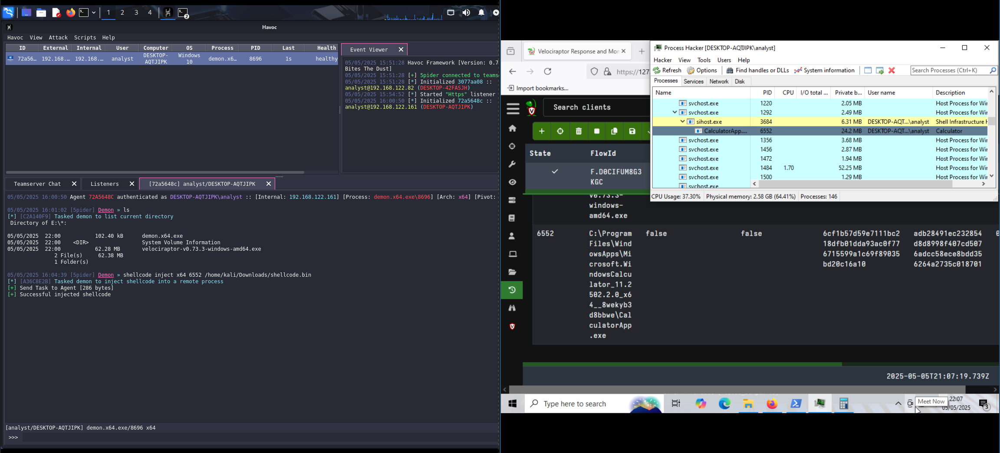

In [Memory Analysis with Velociraptor - Part 1]() we looked at how to access
the RAM with Velociraptor. In this post, we look at how to find fileless
malware.


# 0. Abstract

Commonly, in an incident response scenario one has a live attacker in the
network but does not know which systems are compromised. Networks can be quite
large and include >10.000 systems. Additionally, attackers nowadays use Command
and Control (C2) frameworks running in Random Access Memory (RAM).

Our approach finds the C2 frameworks without knowing where the attacker is,
without dumping the RAM and scaling to >10.000 systems.

Our custom Velociraptor Query Language (VQL) artifact
[Windows.Memory.Mem2Disk]() compares the code in
the .text segment of every process to the code of the executable on
disk. Leveraging Velociraptor, we can execute this artifact on >10.000 systems
simultaneously and we can analyze the RAM live without actually dumping it.


# 1. Introduction

The most difficult to detect cyber attacks nowadays are RAM-only
attacks or fileless attacks. As most security tools focus on
detections in persistent storage (hard disks), attackers avoid them by
leveraging the RAM. Commonly, malicious code is injected into
legitimate processes live in RAM.

We already detected fileless malware in a [proof-of-concept
implementation](https://github.com/lautarolecumberry/DetectingFilelessMalware/blob/main/DetectingFilelessMalware.pdf). Our
goal is now to improve detection and to detect fileless instances of
professional C2 frameworks live without dumping the RAM across a network of
computers.


# 2. Background and Existing Techniques

## 2.1. Process injection

[Process injection](https://attack.mitre.org/techniques/T1055/) is a
code injection technique used to execute arbitrary code within the
address space of another, possibly legitimate process. The purpose is
to evade process-based defenses and escalate privileges. There are
many ways of achieving this, e.g.:

- [Process hollowing](https://attack.mitre.org/techniques/T1055/012/)
  is a sub-technique of process injection. It works by creating a
  process in a suspended state, unmapping its memory, and then
  replacing it with custom (malicious) code. The custom code is
  executed under the identity of the previously created process,
  hollowing it.

- [Thread Execution
  Hijacking](https://attack.mitre.org/techniques/T1055/003/) is
  comparable to process hollowing but instead of creating a new
  process, it controls a live thread in an existing process. To
  accomplish this, it is necessary to pause the running thread.

- [Inline hooking](https://unprotect.it/technique/inline-hooking/) is
  a method used to intercept calls to functions. The first few bytes
  of the target function in memory are overwritten with a jump
  instruction, redirecting the execution flow to a custom function.
  
- With [DLL injection](https://attack.mitre.org/techniques/T1055/001/)
  an adversary modifies an existing Dynamic-Link Library (DLL) or adds
  a new DLL to an existing process. An example for a DLL modification
  is DLL hollowing analogous to process hollowing while new libraries
  can e.g. be added by manipulating the Import Address Table (IAT)
  of the executable.
  
A full list of process injection techniques can be found at [Mitre:
Process injection](https://attack.mitre.org/techniques/T1055/).

## 2.2. Volatility & Malfind

One of the main existing tools to analyze the RAM is
[volatility](https://github.com/volatilityfoundation/volatility3). It requires
creating an offline RAM dump first with other tools like
[WinPmem](https://github.com/Velocidex/WinPmem) which takes considerable
time. Afterwards, this dump can be analyzed with volatility.

Most commands of volatility require in-depth knowledge of the RAM and the
operating system. An exception is `malfind`, which searches for memory pages
that are writable and executable. The hypothesis is that memory pages are
either writable or executable. If executable pages are writable again, it means
an injection took place and the page is flagged.

## 2.3. Hollowshunter

[Hollowshunter](https://github.com/hasherezade/hollows_hunter) scans the RAM of
one machine for various malware injection techniques. It uses
[PE-sieve](https://github.com/hasherezade/pe-sieve), a tool to scan a single
process.

## 2.4. MemProcFS

[MemProcFS](https://github.com/ufrisk/MemProcFS) provides a filesystem-like
view of the RAM. This way, files can easily be accessed. However, detection of
malware is mostly left to the analyst.

# 3. Methodology

To test against C2 frameworks, we use the most common open source C2 frameworks
and inject shellcode (e.g. an implant) into a legitimate process. The utilized
C2 frameworks are [Sliver](https://github.com/BishopFox/sliver),
[Havoc](https://github.com/HavocFramework/Havoc), and
[Mythic](https://github.com/its-a-feature/Mythic).

Our test setup consists of two virtual machines, a Kali machine (attacker) and
a Windows 10 host (victim). Both machines can reach each other and the
anti-virus (Windows Defender) is turned off. Anti-virus bypasses are not the
focus in this article and were therefore excluded.

## 3.1. Sliver Setup

We create a Sliver HTTP agent and deploy it on the victim computer.
Afterwards, we create a beacon and injected it using `execute-assembly --ppid
<ppid> --process <process.exe> ./beacon.exe`.

## 3.2. Havoc Setup

After creating and executing the Havoc agent, we use `shellcode inject x64
<pid> /path/to/shellcode.bin` to inject into a process.

## 3.3. Mythic Setup

Similar to Sliver and Havoc, we create a Mythic agent and we deploy it. We use
the `Apollo` agent and `http` C2 profile.

To inject into a process we use `shinject -PID <pid> -File
/path/to/shellcode.bin`.

## 3.4. Shellcode

The shellcode used in the tests is created using the Python `pwntools` library
with the following script.

```python
from pwn import *

context.update(arch="amd64")
path = "C:\\Program Files\\example\\example.exe"
pay = (asm(shellcraft.amd64.windows.winexec(path)))

with open("shellcode.bin", "wb") as bf:
    bf.write(pay)
```

We simply start a random executable with the shellcode. Usually, an attacker
would start a beacon or backdoor.


# 4. Technique

## 4.1. Velociraptor

[Memory Analysis with Velociraptor - Part 1]() already described in depth
how to access the RAM with Velociraptor. This works live with the accessors of
Velociraptor, so we do not need to dump the entire RAM. It scales up to
thousands of computers, therefore, we can detect C2 frameworks in entire
networks without previously knowing which machines are infected.

Our detection technique, `Windows.Memory.Mem2Disk`, compares the .text segment
of running processes to the executable on disk. Any deviation indicates
suspicious behaviour, i.e. mostly RAM injections.

## 4.2. BaseOfData and ASLR

While this detection sounds trivial, code in RAM and code on disk should not
match. Address Space Layout Randomization (ASLR) and Relative Virtual Address
(RVA) introduce offsets to the RAM.

Interestingly, in our experiments, most of the time code in RAM perfectly
matched the code on disk. As it turns out, modern compilers and linkers nearly
exclusively use relative jumps instead of absolute ones.

The only common exception we found in our experiments was the RVA `BaseOfDate`
of 32-bit executables (see
[Microsoft](https://learn.microsoft.com/en-us/windows/win32/debug/pe-format#optional-header-image-only)
and [0xrick](https://0xrick.github.io/win-internals/pe4/) for details).

In the first stage of our experiments, `BaseOfData` introduced changes
to the .text segment of one byte. For example, in our analysis of
`firefox.exe` process, we observed the differences shown in
Table 1. Since `BaseOfData` is a relative address, the offset between
code and memory content is always the same (as shown in the table). It
actually represents Address Space Layout Randomization (ASLR) and,
thus, while we only observed one byte offsets, it is actually a 32-bit
offset. `BaseOfData` only exists for 32-bit programs, which is why we
only observed these offsets for 32-bit binaries.

| Memory  | Disk  | Times | Difference |
|---------|-------|-------|------------|
|    0x44 |  0x06 |  2724 |  62 (0x3e) |
|    0x45 |  0x07 |  2385 |  62 (0x3e) |
|    0x42 |  0x04 |    21 |  62 (0x3e) |
|    0x40 |  0x02 |    27 |  62 (0x3e) |
|    0x43 |  0x05 |    12 |  62 (0x3e) |
|    0x41 |  0x03 |     1 |  62 (0x3e) |

Table 1: 32-bit Firefox `BaseOfData` offsets

Thanks to Mike Cohen we were able to improve our VQL code, calculate the ASLR
offset and ignore these false positives. Thus, eliminating false positives from
ASLR as well as `BaseOfData` in one go.

Afterwards, none of the legitimate processes we analyzed were detected (see
Table 2).

| Name                   | BaseOfData | Detected | Detected ignoring ASLR    |
|------------------------|------------|----------|---------------------------|
| Adobe Acrobat Reader   | yes        | yes      | no                        |
| Command Prompt         | no         | no       | no                        |
| Discord                | no         | no       | no                        |
| Google Chrome (x32)    | yes        | yes      | no                        |
| Google Chrome (x64)    | no         | no       | no                        |
| LibreOffice Writer     | yes        | yes      | no                        |
| LibreOffice Calc       | yes        | yes      | no                        |
| Microsoft Edge         | no         | no       | no                        |
| Microsoft Edge Updates | yes        | yes      | no                        |
| Microsoft Teams        | no         | no       | no                        |
| Mozilla Firefox (x32)  | yes        | yes      | no                        |
| Mozilla Firefox (x64)  | no         | no       | no                        |
| Spotify                | yes        | yes      | no                        |
| Velociraptor           | yes        | yes      | no                        |
| VLC                    | yes        | yes      | no                        |
| Windows Calculator     | no         | no       | no                        |
| WordPad                | no         | no       | no                        |
| Zoom                   | yes        | yes      | no                        |

Table 2: Legitimate binaries with and without ignoring ASLR

# 5. Results

Additionally to legitimate binaries, we tested the (RAM-based) malware samples
shown in Table 3.

| Num |      Sample       | Detected |
|-----|-------------------|----------|
|  1  | AgentTesla        | yes      |
|  2  | AssemblyInjection | no       |
|  3  | Astaroth          | no       |
|  4  | Azorult           | yes      |
|  5  | BADNEWS           | yes      |
|  6  | bandook           | yes      |
|  7  | Donut             | no       |
|  8  | Dyre              | yes      |
|  9  | Empire            | no       |
| 10  | Gh0stRAT          | yes      |
| 11  | GuLoader          | yes      |
| 12  | Havoc C2          | yes      |
| 13  | HopLight          | no       |
| 14  | HyperBro          | yes      |
| 15  | Injection PoC     | no       |
| 16  | ISMAgent          | yes      |
| 17  | lokibot           | yes      |
| 18  | Mythic C2         | yes      |
| 19  | netwire           | yes      |
| 20  | Pandora           | yes      |
| 21  | Platinum Group    | no       |
| 22  | qakbot            | no       |
| 23  | remcos            | yes      |
| 24  | REvil             | yes      |
| 25  | RokRAT            | yes      |
| 26  | Ryuk              | yes      |
| 27  | sliver C2         | yes      |
| 28  | Slothful Media    | yes      |
| 29  | smokeloader       | yes      |
| 30  | synack            | no       |
| 31  | TsCookie          | no       |
| 32  | ursnif            | yes      |
| 33  | WarzoneRAT        | yes      |
| 34  | WhisperGate       | yes      |

Table 3: Tested malware samples and their detection

Injecting code into legitimate programs with all three tested C2 frameworks
(Sliver, Havoc, and Mythic) is detected by `Mem2Disk`. Additionally, 21 further
malware samples were successfully detected.

We usually injected into a running `Calculator` app. Figure 1 and 2 show
screenshots of the detections for Havoc C2 and Mythic C2 respectively. The left
side of the screen shows the attacker virtual machine while the right side
shows the victim including the Velociraptor detection. `Process Hacker` was
also displayed to show the PID of the `Calculator` app. As shown in the two
screenshots, both times Velociraptor detects `Calculator` as compromised.



Figure 1: Havoc C2 Detection


Figure 2: Mythic C2 Detection

Table 4 shows our full evaluation. Numbers in brackets are the amount
of samples in this category.

|                 | Not-detected | Detected | Total     |
|-----------------|--------------|----------|-----------|
| **Non-malware** |  35% (18)    |  0%  (0) |  35% (18) |
| **Malware**     |  19% (10)    | 46% (24) |  65% (34) |
| **Total**       |  54% (28)    | 46% (24) | 100% (52) |

Table 4: Detection rates (numbers in brackets are amount of samples)

With these results, the true negatives (TN) are 35%, while the false positives
(FP) are 0%. Also, the false negatives (FN) are 19%, and the true positives
(TP) are 46%.

As shown in the equations below, the detection rate is 100.0%, while the
sensitivity is 70.6%, and the accuracy is 80.8%.

{{% math "Detection\ rate = \frac{TP}{TP + FP} \times 100 = \frac{24}{24 + 0} \times 100 = 100.0\%" %}}

{{% math "Sensitivity = \frac{TP}{TP + FN} \times 100 = \frac{24}{24 + 10} \times 100 = 70.6\%" %}}

{{% math "Accuracy = \frac{TN + TP}{TN + TP + FN + FP} \times 100 = \frac{18 + 24}{18 + 24 + 10 + 0} \times 100 = 80.8\%" %}}

Lastly, detections usually ran within 1-5 minutes, sometimes in under
a minute depending on the system hardware. It scales to the maximum
number of systems Velociraptor can handle in parallel (i.e. >10.000
machines).

# 6. Discussion

## 6.1. Evaluation

We tested `Mem2Disk` against available malware, own malware created
using three well-known C2 frameworks, and benign software.

The results are quite promising and we were able to detect
state-of-the-art open source C2 frameworks. When filtering out ASLR,
`Mem2Disk` did not detect many false positives in our tests.

Our approach shows that it is possible to scale RAM analysis up to
multiple systems without prior knowledge which systems might be
affected.

`Mem2Disk` only detects RAM injections that are visible within the
.text segment of a process or its libraries. Adding a new memory page
or manipulating memory locations outside of the .text segment are not
detected.

Thus, Portable Executable (PE) injections
([T1055.002](https://attack.mitre.org/techniques/T1055/002/)), threat
execution hijacking
([T1055.003](https://attack.mitre.org/techniques/T1055/003/)), threat
local storage
([T1055.005](https://attack.mitre.org/techniques/T1055/005/)), ptrace
system calls
([T1055.008](https://attack.mitre.org/techniques/T1055/008/)), process
hollowing
([T1055.012](https://attack.mitre.org/techniques/T1055/012/)), process
doppelgänging
([T1055.013](https://attack.mitre.org/techniques/T1055/013/)), and
ListPlanting
([T1055.015](https://attack.mitre.org/techniques/T1055/015/)) could be
detected.

While Asynchronous Procedure Call (APC) injection
([T1055.004](https://attack.mitre.org/techniques/T1055/004/)), proc
memory injections
([T1055.009](https://attack.mitre.org/techniques/T1055/009/)), extra
windows memory injection
([T1055.011](https://attack.mitre.org/techniques/T1055/011/)), and
Virtual Dynamic Shared Object (VDSO) hijacking
([T1055.014](https://attack.mitre.org/techniques/T1055/014/)) are
currently not detected.

DLL injection
([T1055.001](https://attack.mitre.org/techniques/T1055/001/)) might be
detected if program code or DLL code is changed (e.g. DLL hollowing)
but is not detected if a DLL is loaded additionally (e.g. via Import
Address Table (IAT)). IAT could be detected though, if the new code is
added in memory to an existing library.

If malware removes itself from RAM temporarily or hooks the functions
used by Velociraptor, it could still hide itself from `Mem2Disk`. We
also observed that some of the false negatives ran pretty quickly, so
we suspect that they were already finished when Velociraptor ran.

Lastly, there are legitimate tools - likely security tools - using
similar functionalities, which would create false positives. We have
not encountered them, since we do not have licenses for most of these
tools, but analysts should be aware that security tools can trigger
`Mem2Disk` detections.

## 6.2. Comparison to Other Tools

Volatility as the state-of-the-art memory forensics tool has a
different focus to our implementation. Volatility aims to enable a
forensic expert to deeply analyze one RAM dump. It does not scale to
multiple RAMs and it relies mostly on the knowledge of the
analyst. The most comparable plugin `malfind` searches for executable
(and writable) memory pages like `Mem2Disk` however then analyzes
those pages more thoroughly than `Mem2Disk`. So, Volatility is more
capable than `Mem2Disk` but does not scale well.

MemProcFS per se is more of a RAM access tool than a RAM analysis
tool. It enables the analyst to access the RAM through a browser but
ultimately relies on the analyst to find malware with the exception of
the `findevil` plugin. It is work in progress and currently only
detects user-mode malware. It is comparable to Volatility, provides
more options than `Mem2Disk` but cannot be executed on multiple
machines easily.

Hollows Hunter and PE-sieve are the most comparable tools to
`Mem2Disk`. They employ a variety of techniques to detect malware on
one system and are more capable and in-depth than `Mem2Disk`. Hollows
Hunter can also be executed via Velociraptor with the
[Windows.Memory.HollowsHunter](https://docs.velociraptor.app/exchange/artifacts/pages/hollowshunter/)
plugin and scales to multiple machines.

In contrast to `Windows.Memory.HollowsHunter`, `Mem2Disk` is a
Velociraptor-native plugin fully written in VQL and benefits from the
parallelization of Velociraptor. No additional binary has to be
uploaded to the client machines (unlike
`Windows.Memory.HollowsHunter`), which also means Velociraptor can
regulate the CPU load of `Mem2Disk`. As already mentioned, detections
usually ran within 1-5 minutes, mostly in under a minute depending on
the system hardware. Therefore, the performance overhead of `Mem2Disk`
seems acceptable in a normal company network. Anti-virus scans in
comparison would take considerable more time and are generally
accepted.

In summary, `Mem2Disk` is useful for breadth search. For example when
not knowing if or where fileless malware hides within a full network
of more than a few machines. When analyzing known-compromised machines
or only a few suspicious machines, the other mentioned tools give more
details than `Mem2Disk` and should be preferred.

# 7. Conclusion

All in all, the blue team just stepped up. We are able to detect injected
implants of common C2 frameworks live in RAM and scalable to thousands of
machines in nearly real-time.

We also recommend memory forensics experts to think about scalability
of their tools. Velociraptor enables memory forensics on multiple
machines without dumping the RAM.

Happy detecting!

# 8. Acknowledgement

We would like to express our gratitude to Prof. Nicolas Wolovick for
supporting this publication with advice and guidance and to Mike Cohen
for improving our VQL code, giving feedback on the blog post as well
as helping us understand the connection between `RVA`, `BaseOfData`
and `ASLR`.

