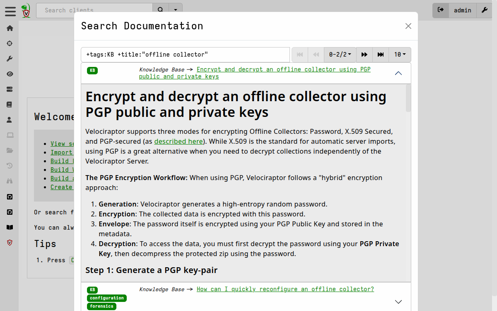

I am very excited to announce that the latest Velociraptor release
0.76 is now available.

In this post I will discuss some of the new features introduced by
this release.

## GUI Improvements

This release improves a number of GUI features.

### Local searchable documentation

Recently we have been having issues with Google refusing to index our
documentation website, despite our best efforts to get them to do
so. This has made it frustrating for users trying to find relevant
technical information.

To help mitigate this problem we have added a local documentation
search feature that allows you to search our docs directly from the
Velociraptor GUI. You can read more about how to use it
[here]().

This search feature is powered by the
[Bleve](https://blevesearch.com/) search engine, which is also now
available to be used for indexing and searching VQL query results [as
described below]().

## CLI Improvements

The command line interface has been streamlined to use artifacts as
extensible mini-VQL programs. This makes it easy to use specific
artifacts as replacements for one shot scripts. See our blog post on
[The Velociraptor CLI]({}) for a
complete discussion.

## New VQL plugins

### Full text indexing and searching

Many users already forward their Velociraptor results to Elasticsearch
or Opensearch so that the data is indexed and more easily
searchable. In this release we've added the ability to index and
search results locally using the [Bleve](https://blevesearch.com/)
search engine, which provides Full Text Search (FTS) capabilities
similar to Elasticsearch and other NoSQL database solutions.

This capability is provided by the following new VQL plugins:
- <a href="https://docs.velociraptor.app/vql_reference/other/index/">index</a>
- <a href="https://docs.velociraptor.app/vql_reference/other/index_search/">index_search</a>

## Removed plugins

Velociraptor includes some plugins which link to very large libraries
with huge API surface, making the binary extremely large. In this
release very large libraries were removed or substituted in order to
reduce the binary size:

1.  The Elastic library is now handled via a fork to isolate just the
    Bulk upload API - reducing the binary size by 16mb
2.  The next largest library is the AWS client library used by
    `s3_upload()` increasing the binary size by 6mb.
3.  The Google cloud client library is also huge at around 5mb

For regular release builds:

-   Use the MinIO S3 library to connect to AWS - this library is much
    smaller and easier to use. It supports the most common features
    and should be mostly compatible.
-   Remove Google cloud dependencies: `Google pubsub` is a rarely used
    feature, and with Google Cloud Storage (GCS) we can always enable
    S3 compatible mode so there is no real need for specific GCS
    access.

From this version we've introduced a new build tag `sumo` which
includes these large libraries if anyone really needs them. By
enabling `sumo` build tags (i.e. `make linux_sumo`) it is possible to
build a larger binary with the full AWS and Google client libraries.

## Conclusions

There are many more new features and bug fixes in the latest release.
Please download the release candidate and give it a test and provide
feedback.

If you like the new features, take [Velociraptor for a
spin](https://github.com/Velocidex/velociraptor)!  It is available on
GitHub under an open source license. As always please file issues on
the bug tracker or ask questions on our mailing list
[velociraptor-discuss@googlegroups.com](mailto:velociraptor-discuss@googlegroups.com)
. You can also chat with us directly on discord
[https://www.velocidex.com/discord](https://www.velocidex.com/discord)
.
