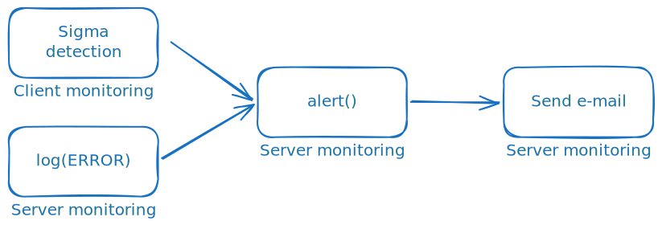

Velociraptor does a lot in the background. Client and server event
queries run continuously. Hunts and scheduled flows complete on their
own time. Detection artifacts watch for IoCs. Most of this happens
without anyone looking. And when someone does, they may find that
the event query they relied on for uploading data to S3 has failed
for over a week. Or that flows in the last hunt have started
failing. Or that the collection scheduled for the CEO's laptop —
which was offline at the time — has finally completed, with results
that should have been inspected immediately.

This post introduces a small family of exchange artifacts that
notify you when any of this happens:

- [`Server.Monitor.FlowCompletion`](/exchange/artifacts/pages/server.monitor.flowcompletion/):
  sends an e-mail when a client flow completes (or fails)
- [`Server.Monitor.Alerts`](/exchange/artifacts/pages/server.monitor.alerts/):
  forwards alerts created by [`alert()`](/vql_reference/other/alert/) calls anywhere in the
  deployment
- [`Server.Monitor.Errors.Alert`](/exchange/artifacts/pages/server.monitor.errors.alert/)
  and
  [`Server.Monitor.Client.Errors.Alert`](/exchange/artifacts/pages/server.monitor.client.errors.alert/):
  turn entries in the monitoring log into alerts so failures stop
  being silent

A series of knowledge base articles will go into detail on how to use
these artifacts.

## Overview

There are many ways to send a notification (Slack, Teams, PagerDuty
etc.), but this post sticks to e-mail because:

- it requires little setup and works almost everywhere
- it can carry a lot of information per message

Two of the artifacts introduced here send e-mail directly:

- [`Server.Monitor.FlowCompletion`](/exchange/artifacts/pages/server.monitor.flowcompletion/)
- [`Server.Monitor.Alerts`](/exchange/artifacts/pages/server.monitor.alerts/)

The remaining artifacts, and most of the examples, produce alerts. If
you want alerting but not e-mail notifications, the error monitoring
and the use of [`alert()`](/vql_reference/other/alert/) for detection are still relevant. You
only need to use or write/adjust a monitoring artifact to produce
notifications, for example Slack or Teams, for alerts produced. See
[Using in-app user messages](#using-in-app-user-messages) for how to use Velociraptor's
new built-in notification system.



### Sending e-mails

Every e-mail produced by the artifacts in this post passes through
two pieces of shared infrastructure:

- **An SMTP secret** holds the connection details (server, port,
  credentials, sender address). It is created once in **Manage
  Server Secrets** and referenced by name everywhere else.
- [`Generic.Utils.SendEmail`](/artifact_references/pages/generic.utils.sendemail/)
  builds a properly-encoded MIME message: it Base64-wraps the body,
  supports `multipart/alternative` for HTML with plain-text fallback,
  and handles file attachments. It then calls the underlying
  [`mail()`](/vql_reference/other/mail/) function for you.


If you have not configured SMTP yet, start with
[How to send e-mails from Velociraptor](/knowledge_base/tips/sending_email/).
It also covers testing locally with
[Mailpit](/knowledge_base/tips/sending_email/#testing-locally-with-mailpit),
which lets you send as many e-mails as you want without getting
blocked by any real SMTP server, and explains the
[global e-mail throttling](/knowledge_base/tips/sending_email/#throttling)
worth knowing about before going to production.

## Flow-completion notifications

[`Server.Monitor.FlowCompletion`](/exchange/artifacts/pages/server.monitor.flowcompletion/) watches
[`System.Flow.Completion`](/artifact_references/pages/system.flow.completion/)
and sends an e-mail when a client flow finishes. The default e-mail
includes client details, flow metadata (creator, timestamps, duration,
requested artifacts, arguments), and a result summary.


The artifact comes with a great number of parameters, most being
filters that let you configure in detail when and for what to be notified. You
should read through the description and use cases and pick suitable
arguments. Some of the parameters are:

- `ArtifactsToAlertOn`/`ArtifactsToIgnore`: regex match on the
  collected artifacts
- `ClientLabelsToAlertOn`/`ClientLabelsToIgnore`: match on client
  labels
- `ArtifactPermToAlertOn`: only notify when the collected artifacts
  require a specific permission, e.g. `EXECVE`
- `DelayThreshold`: only notify when the flow took at least N
  seconds (filters out clients that were already online)
- `ErrorHandling`: multi-choice flag that lets failures bypass
  individual filters (`IncludeHunts`, `IgnoreArtifactFilters`,
  `IgnoreDelay`)
- `NotifyIfResultsLabels`/`NotifyIfUploadsLabels`: special
  override: If a client carries this label, or a hunt is tagged with
  this value, any flow that produces results (or uploads) notifies
  regardless of other filters

Recipients can come from a fixed list (`Recipients`), be derived
from the user who scheduled the flow (`NotifyExecutor`, optionally
mapping bare usernames to full addresses), or be pulled from a
client metadata field (`NotifyMetadataEMail`). All three can be used
at once.

### A few examples

- **Notify the analyst who ran a collection**: Set `NotifyExecutor` to
  true. If usernames are e-mail addresses, that is all you need;
  otherwise add `NotifyExecutorDomains` to map them. Since getting a
  notification for a flow that finishes immediately is not very
  useful, set `DelayThreshold` to a few seconds or minutes. The idea
  is to get notified when a collection finishes some time in the
  future, so that its results are not forgotten.
- **Audit shell access**: Set `ArtifactPermToAlertOn` to `EXECVE` and
  `DelayThreshold` to `0`. Every completed flow that involved a shell
  artifact (or any artifact that allows for arbitrary code execution
  through artifact arguments) notifies an auditor.
- **Notify the device owner**: Store the owner's address in a
  client metadata field and point `NotifyMetadataEMail` at that
  field. Useful in environments with strict privacy rules.
- **Catch failures in a hunt**: Leave `NotifyHunts` off, but
  add `IncludeHunts` to `ErrorHandling`. Be sure to test-run your
  hunts before enabling this.

### Including results in the e-mail

Apart from just notifying you that a collection has completed,
[`Server.Monitor.FlowCompletion`](/exchange/artifacts/pages/server.monitor.flowcompletion/)
can also include (parts) of the results in the e-mail.

`IncludeResultTableFrom` renders selected sources as inline HTML
tables. `IncludeResultAttachmentFrom` exports them as JSONL or CSV
attachments. Both accept a CSV argument of `Source`, `Columns`, `MaxRows`
(and `CellLimit`) to help you restrict the amount of data to include.


See
[How to set up e-mail notifications for flow completions](/knowledge_base/tips/email_alerts/)
for more information.

## Detection alerts

Flow-completion notifications fire on every flow that passes the
filters, regardless of what the flow actually found. Alerts are
different: the artifact author chooses when to surface something worth
attention, such as when a honey file is accessed, when a YARA rule
matches, or when an IoC is detected in the system log. The
[`alert()`](/vql_reference/other/alert/) function is how that signal
is sent. Alerts are created very much like log entries, but as opposed
to logs, alerts are sent to the queue
[`Server.Internal.Alerts`](/artifact_references/pages/server.internal.alerts/),
which server event artifacts can subscribe to.

```vql
SELECT alert(
    name="Honey file accessed",
    dedup=300,
    Path=FileName,
    `Process name`=ProcessName,
    `Process info`=ProcInfo,
    PID=Pid
)
FROM ...
```

The `name` argument is required. Every other argument is free-form
context, available as an individual column in the internal
[`Server.Internal.Alerts`](/artifact_references/pages/server.internal.alerts/)
artifact. Identical names are deduplicated for two hours by default;
pass `dedup=-1` to disable the suppression while testing.

Although [`alert()`](/vql_reference/other/alert/) can be used in VQL anywhere, it makes the most
sense to use it in event artifacts. Collections and hunts finish or
expire, after which you would normally inspect the results. Event
queries never stop, making alerts a good way to notify when
something noteworthy happens.

[`Server.Monitor.Alerts`](/exchange/artifacts/pages/server.monitor.alerts/) is the consumer. It watches the
[`Server.Internal.Alerts`](/artifact_references/pages/server.internal.alerts/) queue, formats each alert as an HTML or
plain-text e-mail, and sends it through the same
[`Generic.Utils.SendEmail`](/artifact_references/pages/generic.utils.sendemail/) utility as [`Server.Monitor.FlowCompletion`](/exchange/artifacts/pages/server.monitor.flowcompletion/).


As seen in the screenshot above, the resulting e-mail contains a
lot of details. Every free-form argument passed to [`alert()`](/vql_reference/other/alert/) is
included as alert context and flattened by default. This makes
nested JSON data a lot more readable. The client and flow
information may be optionally disabled.

### Where to call `alert()`

There are two places to call [`alert()`](/vql_reference/other/alert/) for
detections in client monitoring: directly in the client event artifact,
or in a server event artifact watching the client event artifact.

The simplest place is inside the artifact that detects the
condition. If you do not want to modify the existing artifact, or
want full control over when the alert fires and with what context,
create a small server event artifact:

###### Server monitoring for client honey file access

```yaml
name: Server.Monitor.HoneyfileAccess
type: SERVER_EVENT
sources:
  - query: |
      SELECT alert(
          name=format(
            format='Honeyfile "%v" accessed on %v',
            args=(FileName,
                  client_info(client_id=ClientId).os_info.hostname)),
          ClientId=ClientId,
          Artifact="Linux.Detection.Honeyfiles",
          ArtifactType="CLIENT_EVENT",
          Severity="high",
          `File name`=FileName,
          PID=Pid,
          `Process name`=ProcessName)
      FROM watch_monitoring(artifact="Linux.Detection.Honeyfiles")
```

See [Using alerts in Velociraptor](/knowledge_base/tips/vql_alerts/)
for details.

## Catching silent failures

Event queries fail. Perhaps not during testing, but after months of
successfully calling an API or parsing events from an endpoint. A
[`parse_json()`](/vql_reference/parsers/parse_json/) call quietly fails, returning nothing. An [`upload_S3()`](/vql_reference/other/upload_s3/)
call exhausts its retries. [`execve()`](/vql_reference/popular/execve/) fails to find the executable.
None of these stops the event query from running; they all just write
something to the monitoring log. You would have to study these logs
(per client in the case of client monitoring) in order to notice the
errors.


[`Server.Monitor.Errors.Alert`](/exchange/artifacts/pages/server.monitor.errors.alert/) (server) and
[`Server.Monitor.Client.Errors.Alert`](/exchange/artifacts/pages/server.monitor.client.errors.alert/) (clients) inspect
those logs and call [`alert()`](/vql_reference/other/alert/) for entries that match their filters.
Combined with [`Server.Monitor.Alerts`](/exchange/artifacts/pages/server.monitor.alerts/), you can get an e-mail notification every
time a monitoring artifact starts failing.

The filter model is shared by both: `IncludeFilter` and
`ExcludeFilter` are CSVs with regex columns for `Artifact`, `Level`
and `Message`, plus an optional `Severity` column and any extra
columns you add for free-form context (such as a description of the
error). Rows match top-to-bottom and the first match wins, so put
specific patterns above broad catch-alls.

```csv
Artifact,Level,Message,Severity,Explanation
.+,DEFAULT,fork/exec .+ no such file or directory,high,Executable not found
.+,DEFAULT,upload_S3: operation error .+,high,S3 upload failed with no retry
.+,ERROR,.+,medium,
```

A subtle point worth knowing: many errors from native VQL functions
and plugins are logged at level `DEFAULT`, not `ERROR`. A naive filter
that only matches `ERROR` will miss most of them. [This
reference](/knowledge_base/tips/vql_error_catalogue/) contains a CSV
list that you can use as an argument to `IncludeFilter` to detect many
of these errors.

[`Server.Monitor.Client.Errors.Alert`](/exchange/artifacts/pages/server.monitor.client.errors.alert/) iterates over **all** clients
to query their per-client monitoring logs. The work is parallelised,
but it is still more expensive than the server-side variant —
narrow `IncludeFilter` to the artifacts you actually care about
before turning it on in a large deployment.

See
[How to monitor event artifact errors](/knowledge_base/tips/monitoring_artifact_errors/)
for a full walkthrough.

## Using in-app user messages

You can supplement e-mail notifications with in-app notifications ("user messages") by using
[`Server.Monitor.Alerts.UserMessage`](/exchange/artifacts/pages/server.monitor.alerts.usermessage/)
This simple artifact posts each matching alert as an in-app user
message in addition to (or instead of) an e-mail. Logged-in users see
the notification when they open the message panel from the bell icon
in the lower-left corner of the web app. The bell turns red when there
are unread messages, and the list can be cleared from the panel.


User messages have no formatting and only show a nested dict. However,
since you are already in the Velociraptor web app, the additional
details provided in the e-mail notifications are not needed: Simply
navigate to the source of the alert and investigate.

## Summary

If you want to try out all of the discussed monitoring:

1. Create an SMTP secret of type **SMTP Creds** and grant access to
   `VelociraptorServer (Server Event Runner)`.
2. Add [`Server.Monitor.FlowCompletion`](/exchange/artifacts/pages/server.monitor.flowcompletion/) as a server event artifact.
   Start with `NotifyExecutor=true` and a sensible `DelayThreshold`,
   then refine `ArtifactsToAlertOn`/`ArtifactsToIgnore` and the
   label filters as you go.
3. Add [`Server.Monitor.Alerts`](/exchange/artifacts/pages/server.monitor.alerts/) so anything that calls [`alert()`](/vql_reference/other/alert/)
   (detection artifacts, error monitors, your own custom watchers)
   produces an e-mail. Configure `SeverityTransforms` and
   `SeverityThreshold` as needed.
4. Add [`Server.Monitor.Errors.Alert`](/exchange/artifacts/pages/server.monitor.errors.alert/) to surface failures in your
   server event queries.
5. Optionally add [`Server.Monitor.Client.Errors.Alert`](/exchange/artifacts/pages/server.monitor.client.errors.alert/), scoped to the
   handful of client event artifacts you feel the need to monitor
   closely for errors.
6. Optionally add
   [`Server.Monitor.Alerts.UserMessage`](/exchange/artifacts/pages/server.monitor.alerts.usermessage/)
   to enable in-app user messages for alert notifications.
7. Set `SendInterval` to `-1` once the configuration is settled. The
   default 10-second window silently drops bursts. This is useful
   while tuning, but could be problematic in production when you
   expect to be alerted.

## Further reading

- [How to send e-mails from Velociraptor](/knowledge_base/tips/sending_email/):
  SMTP secrets, [`mail()`](/vql_reference/other/mail/), [`Generic.Utils.SendEmail`](/artifact_references/pages/generic.utils.sendemail/), Mailpit
- [How to set up e-mail notifications for flow completions](/knowledge_base/tips/email_alerts/):
  [`Server.Monitor.FlowCompletion`](/exchange/artifacts/pages/server.monitor.flowcompletion/) in depth
- [Using alerts in Velociraptor](/knowledge_base/tips/vql_alerts/):
  [`alert()`](/vql_reference/other/alert/), severity, deduplication, custom watchers
- [How to monitor event artifact errors](/knowledge_base/tips/monitoring_artifact_errors/):
  [`Server.Monitor.Errors.Alert`](/exchange/artifacts/pages/server.monitor.errors.alert/) and the client variant
