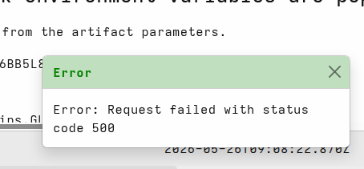

I am very excited to announce that the latest Velociraptor release
0.77 is now available.

In this post I will discuss some of the new features introduced by
this release.

## New Features

- **Interactive shell sessions.** The shell is no longer a one-shot
  affair. Commands now run inside persistent sessions where each
  command builds on the last, with all output visible in a single
  scrollable view. Each command appends to the same flow, replacing
  the previous approach where each interaction ran as a separate flow.
  Graceful timeouts, CSS improvements, and proper stdin lifecycle
  management have also been added. Flow requests are now stored in a
  separate data store file.

- **Improved artifact descriptions.** Every built-in artifact has been
  reviewed to ensure a clear, concise lead sentence that summarizes
  its purpose. Self-referential "This artifact..." phrases have been
  removed, making it much easier to scan and understand artifacts at a
  glance in the GUI or in listings.

- **User messaging.** Messages can now be sent to GUI users via the
  `user_message()` VQL function, which means they can be packaged into
  server artifacts and set up by server operators. A new
  `Server.Monitoring.RSSFeeds` artifact is provided as an example: it
  polls RSS feeds (such as Velociraptor's own CVE and blog feeds) and
  automatically emits user notifications when new items appear.

- **Azure Data Explorer (ADX) upload.** A new `adx_upload()` VQL plugin
  uploads rows to Azure Data Explorer for KQL-based analysis, along
  with a `ADX Creds` secret type for securely managing credentials. A
  corresponding server event artifact (`ADX.Flows.Upload`) is provided
  that uses this plugin to forward flow results to ADX. This mirrors
  the existing Splunk and Elastic upload integrations, and has been
  tested in production engagements.

- **Artifact verifier linter.** The artifact verifier now emits structured
  errors and warnings that can be selectively disabled on a per-
  artifact basis. To suppress a specific linter error, add a `//
  linter:` comment to the VQL snippet with the error name and an
  optional subject regex.

- **Loading artifact packs from zips.** Zip files can now be imported
  directly with the `--definitions` flag, avoiding the need to
  manually unzip them first. This is especially useful when
  distributing collections of artifacts as a single archive file.

- **OIDC role assignment rework.** Automated OIDC role assignment now
  supports removing access from users (roles are no longer treated as
  a minimum floor). Custom claims from Azure ID tokens can also be
  used for more granular role mapping.

- **Velociraptor container.** An initial Docker-based container
  implementation is now available, including a Dockerfile,
  compose.yaml, and supporting configuration files. This makes it
  easier to deploy Velociraptor in containerized environments.

### Performance and operational improvements

- **Memory allocation limits.** Velociraptor now places limits on memory
  allocations to prevent out of memory errors during large collections
  or data processing tasks.

- **EVTX preferred message language.** The EVTX parser has been updated to
  support a preferred message language, allowing Windows event log
  messages to be rendered in the specified language when available.

- **Refactored hunt dispatcher.** The hunt dispatcher internals have been
  reworked for improved tracking and reliability of hunt state
  management.

- **Refactored journal service.** The journal service has been updated
  with more efficient artifact type discovery and stricter validation
  of forwarded messages, ensuring messages reach only the artifact
  types they are authorized for.

- **Removed hunt dispatcher housekeeping thread.** The periodic
  housekeeping thread that tallied hunt stats has been removed,
  reducing IO overhead. The same functionality can now be triggered on
  demand via a VQL query when needed.

- **Removed old client API support.** Support for legacy client API
  versions has been removed, simplifying the server codebase. The
  server now falls back to `Frontend.Hostname` when `API.Hostname` is
  not specified.

- **Email client compatibility.** The `SendEmail` artifact now supports an
  alphanumeric-only MIME boundary mode. Some email clients (such as
  Evolution) struggle with the standard boundary characters prescribed
  by RFC 2045, so this option improves compatibility when sending
  multipart emails from Velociraptor.

- **Background dispatcher startup.** The dispatcher now starts in the
  background, avoiding pauses at server startup and making the
  initialization sequence faster and more responsive.

## Security improvements

- **Refactored event queues with caller tagging.** Each event is now
  tagged with the caller's ID, enabling listeners to verify the sender
  and reject messages from untrusted sources. This prevents users from
  sending events to privileged queues intended only for server-
  originated messages.

- **Zip directory traversal prevention.** The `unzip()` plugin has
  been hardened against directory traversal attacks, preventing
  malicious zip files from writing files outside the intended
  extraction directory.

- **YAML field validation for Secrets.** The secrets service now
  validates YAML fields more rigorously when creating or updating
  secrets, catching misconfigurations earlier.

## GUI Improvements

This release improves a number of GUI features.

- **Redesigned Shell interface** now uses sessions where each
  command builds on the previous one.

- **User messaging system** for sending notifications directly in the
  GUI.

  

  The new `Server.Monitoring.RSSFeeds` artifact polls RSS feeds
  and alerts users about new items, such as critical CVEs or blog
  posts.

- **GUI state stored in sessionStorage**, preserving state when
  switching between screens.

- **Filters added to the user management screen** for easier user
  lookup.

## CLI Improvements

- **New CLI run syntax** with reworked command line parser.

  The CLI has a new syntax for running artifacts from the command line.
  The new `--api_config` flag supports collecting artifacts remotely and
  fetching results via the API.

- **API support for the `artifacts collect` command**, allowing remote
  collection and result fetching over the API. Also added the
  `artifacts fetch` command for fetching remote artifact results.

- **Zip file import with the `--definitions` flag** for loading artifact
  packs.

## New Artifacts

- **`Server.Monitoring.RSSFeeds`.** Polls RSS feeds at a configurable
  interval and alerts users about new items via GUI messages.

- **`ADX.Flows.Upload`.** Forwards flow results to Azure Data Explorer
  (ADX) for analysis using KQL queries.

- **`Generic.Utils.Crypto`.** Utility artifact providing HMAC-SHA256 and
  other custom hash functions.

## Removed Artifacts

- **`Server.Internal.Enrollment`, `Server.Internal.FrontendMetrics`,
  `Server.Internal.Label`, `Server.Internal.Notifications`,
  `Server.Internal.Ping`, `Server.Internal.Pong`,
  `Server.Internal.TimelineAdd`, and `System.Hunt.Participation`**
  were removed as part of event queue refactoring where each event is
  now tagged with the caller's ID for security.
- **`Server.Import.ArtifactExchange`.** Renamed to
  `Server.Import.ArtifactBundle` (old name aliased for backward
  compatibility).

## VQL Plugins and Functions

### New

- **`user_message()`.** Sends messages to GUI users from VQL queries.

- **`user_messages()`.** Emits user console messages as a plugin.

- **`adx_upload()`.** Uploads rows to Azure Data Explorer (ADX).

### Improved

- **`cache()`.** Updated to use disk-based LRU, allowing persistent caches
  across different queries. API updated to use VQL lambda for more
  intuitive usage.

- **`memoize()`.** Updated to use disk-based LRU for persistence. Added
  `period` parameter for stale data refresh and `filename` parameter
  for file-backed storage.

- **`index()`.** Changed to batch mode, providing much faster indexing
  performance.

## Removed

- **Support for old client APIs removed, including several internal
  communication protocols.**

## Conclusions

There are many more new features and bug fixes in the latest release.

If you like the new features, take [Velociraptor for a
spin](https://github.com/Velocidex/velociraptor)!

It is available on GitHub under an open source license. As always
please file issues on the bug tracker or ask questions on our mailing
list [velociraptor-discuss@googlegroups.com](mailto:velociraptor-discuss@googlegroups.com).
You can also chat with us directly on [Discord](/discord/).
