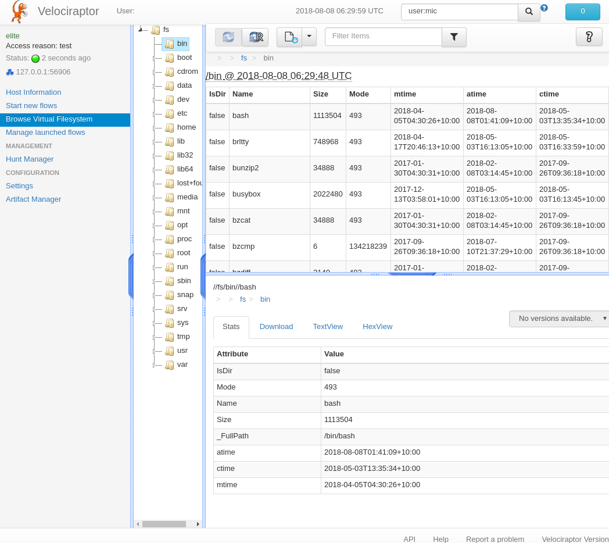
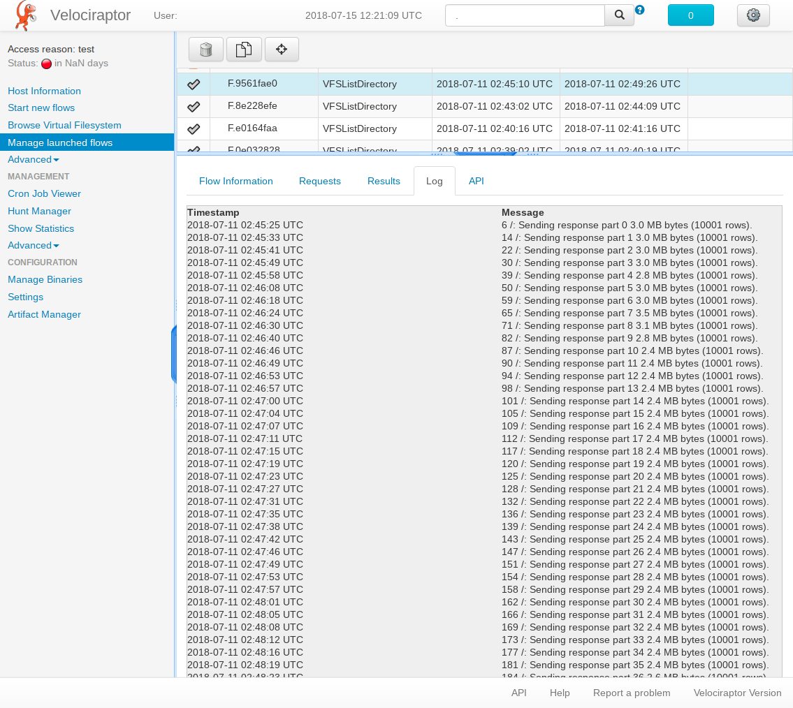

The Virtual File System
=======================

Like GRR, Velociraptor also maintains a virtual file system view (VFS)
of the client\'s filesystem. GRR\'s VFS view is generated by adding a
row for each file into the database. In order to refresh the view of a
certain directory, GRR issues a ListDirectory request and updates the
database by storing each newly discovered file in its own row.

Velociraptor models the client\'s VFS as a per-directory VQL query. In
order to refresh the view of a certain directory, a new VQL query is
issued to the client, essentially collecting the glob information for
that directory in a single VQL response table. The VQL result is then
stored in a single database row. Therefore Velociraptor stores a single
row per directory (as compared to GRR\'s single row per file approach).
This leads to a huge reduction in database rows.

The tradeoff however, is that the Velociraptor VFS view can only show
the state of the entire directory listing at a single point in time.
GRR\'s VFS viewer can show old files (which have been removed) mixed in
with current files because it can merge the output of different
ListDirectory operations that occurred in different times. We decided
this feature was not often useful and sometimes actually led to
confusion since files that are removed from a directory are shown
together with files currently present. Velociraptor therefore shows the
VFS directory at the latest timestamp the entire directory was fetched.

Recursive VFS refresh
=====================

Users who are more familiar with traditional forensic tools (or GUI file
managers like Windows Explorer) usually attempt to browse the client\'s
VFS view interactively, searching for files and directories relevant to
the case. However, since the VFS view is only a cached database view of
the real client\'s file system, we need to go to the client to refresh
the cache whenever we try to view a directory in the VFS which had not
yet been fetched from the client.

Since clients are not always online, some users attempt to just
recursively refresh the entire VFS view (i.e. recursively list all
client directories from the root). This is however, an expensive
operation (This is at least as expensive as running a recursive \"find /
-ls\" command on the commandline). Due to GRR\'s extensive data model
and complex multi-round trip flow model, performing a recursive VFS
refresh with GRR is unlikely to work in any reasonable time (typically
the flow will run for a while then hang due to race conditions in the
frontend).

On the other hand, Velociraptor issues a single VQL request as a
recursive directory glob and stores the entire directory content in a
single VQL response taken at an instance in time. The response is
streamed back to the server. The server simply splits the response table
into directory specific tables, and then stores a single VQL response
table for each directory in the database.

{}

The VQL glob() plugin is guaranteed to generate results in breadth first
order. This means that it emits information about all files in the same
directory first, before recursing into sub directories. This feature
makes it simple to split the result table into directory specific
sub-tables by simply watching the FullPath column and noting when its
directory changes.




{}

Very large VQL queries
======================

While we claimed above that Velociraptor simply issues a single VQL
query and stores its result in a single database row, this was an
oversimplification. If the VQL query generates too many rows, the
Velociraptor client splits the response into parts (by default 10000
rows per part). This allows data to be uploaded immediately to the
server and processed while the query is still executing on the client.

Consider the VFSListDirectoryflow was issued with a glob of /\*\*10
(i.e. refresh the entire VFS view from the root directory, recursively
into a depth of 10 directories). The VQL query executed was:

``` {.sourceCode .sql}
SELECT FullPath AS _FullPath,
    Name, Size, Mode,
    timestamp(epoch=Sys.Mtim.Sec) AS mtime,
    timestamp(epoch=Sys.Atim.Sec) AS atime,
    timestamp(epoch=Sys.Ctim.Sec) AS ctime
FROM glob(globs='/**10')
```

The query was issued to a Velociraptor client running on a Chromebook.
This particular system has approximately 500k files in its root
filesystem, and so the response consists of 500k rows. However, as the
query executes, the response is split into multiple parts, each being
10k rows, and uploaded (each part is about 3mb in total).



Total execution time for this query is about 4 minutes and consists of
about 50 parts (around 2.5mb each). It is still an expensive query, but
depending on the urgency of the case, it may well be warranted.

It is very convenient to just take a snapshot of the entire filesystem,
especially when the client is offline. We can issue the flow and then
when the client comes back online we can review all the files.

File uploads
============

The VFS view is just a local cache in the data store of what is really
going on the client. While we can see the file in each directory we cant
transfer all the file content. Velociraptor represents downloaded files
differently from just listed files. Files with the floppy disk next to
them represent files that we have a local cache for. We can view the
Hexview or just download them.

You can always initiate a download of a VFS file by selecting the
Download tab. Unlike GRR, Velociraptor does not keep previous versions
of files - a re-download will overwrite the previous file.
