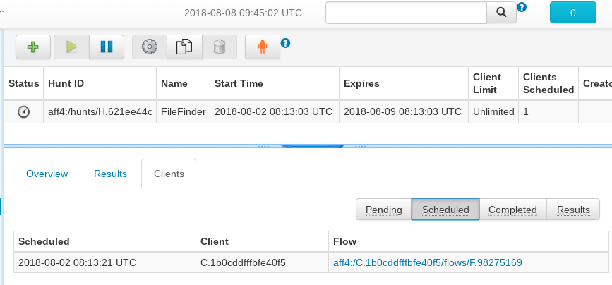
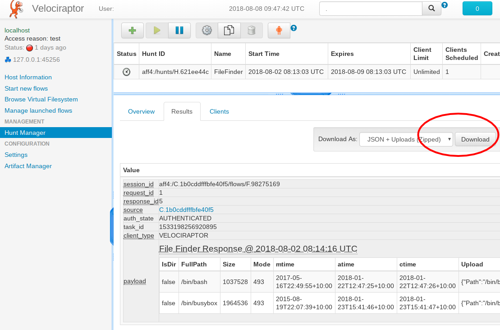

Velociraptor has completely redesigned the way that hunts are
implemented in order to avoid database locking and increase hunt
processing efficiency.

Now we hunt like this:


How are hunts scheduled?
========================

GRR allows hunts to be scheduled by a few client properties such as OS
type, label, users etc. This works because GRR has an extensive data
model of endpoint properties. However, this requires that the data model
be refreshed periodically to be kept accurate. For example, to run a
hunt of all machines with a suspected compromised user account we can
schedule the run on all machines where the user has logged in, but
because GRR uses its data model to decide if a machine should be issued
the hunt, the data model may be out of date and GRR will not schedule
the hunt on machines which have only recently been logged into. For this
reason we typically run the Interrogate hunt very frequently causing a
lot of extra load on the system and clients hoping to minimize the time
window where the data model is out of date with reality.

Velociraptor\'s approach is different - since Velociraptor does not
really maintain a data model server side, we check the client\'s
information for every hunt, before we even decide if the hunt should be
scheduled for this client. This is done by issuing a VQL query to the
client.

Sometimes we don\'t necessarily want the client to know exactly why we
are scheduling the hunt (e.g. in the compromised user account case we
don\'t want to advertise the exact username we are looking for). In
these cases we run another VQL query on the server side.

So hunt selection is managed by two different VQL queries - a client
side one and a server side on.

The default client side VQL queries simply collects the usual facts like
OS version, Username etc, while the server side query filters the
results with more specific conditions. This approach does not reveal to
the client the hunt\'s condition:

``` {.sourceCode .sql}
Client side VQL:
    SELECT OS, Architecture, Fqdn, Platform,
      config.Client_labels AS Labels
      FROM info()

Server side VQL:
    SELECT * from rows
      WHERE Fqdn =~ '(?i)myhostname.+' AND 'MY_LABEL' IN Labels
```

The hunt\'s life cycle
======================

When the hunt is started, the server updates its in-memory list of
active hunts managed by the Foreman. Clients then poll the foreman for
new hunts they should participate in. Clients remember the last hunt
they participated in and so they present this hunt\'s timestamp to the
foreman. If a new hunt is available, the foreman can immediately launch
the `CheckHuntCondition` flow on the client.

{}

The clients themselves are actively keeping track of the hunts they
participated in. This avoids the server having to check the client\'s DB
record.

{}

The `CheckHuntCondition` flow issues the client side VQL queries and then
runs the server side query on the results. If the query matches (i.e.
the hunt should be scheduled for this client), the client\'s record is
written into the hunt\'s \"pending\" queue.

The hunt manager
================

Each hunt specifies its own client recruitment rate (i.e. how many
clients will be started per minute). The hunt manager is a component
which periodically reads all hunts and schedules flows for these hunts
if the hunts\' client rate allows for more clients to be scheduled. It
does this by moving clients from the pending queue to the running queue
and starting respective flows for them.

Once each of those flows completes, the record is moved from the running
queue to the completed queue or the results queue if the flow produced
any results. We can observe how many clients exist in each queue using
the GUI.



The flows that hunts launch arn the client. However, when they complete,
a small record is made in the hunts\'s results queue pointing to the
flow. It is therefore possible to retrieve all results from the hunt
from all client\'s. For example, the GUI allows downloading a zip file
of all the results and files uploaded:



Since hunts invoke regular flows, and Velociraptor flows are much
lighter than GRR\'s flows, hunts are much cheaper to run in terms of
resources consumed.
