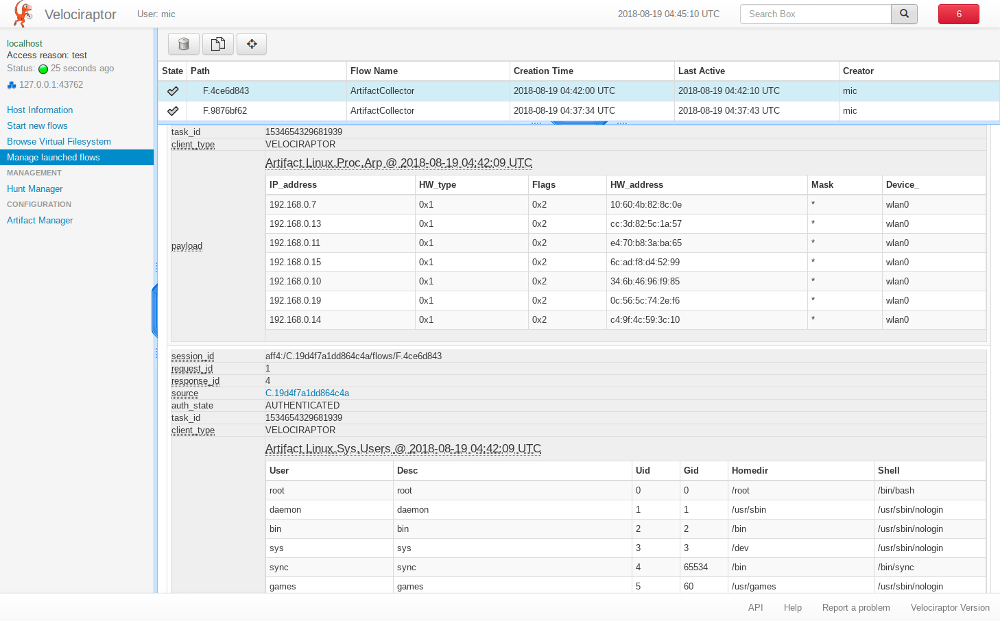

First a bit of history. When we first started writing endpoint
monitoring tools (With GRR then Rekall Agent) we implemented the ability
to collect files, registry keys and other data. If an analyst wanted to
collect, say the chrome extensions, they would need to know where chrome
extensions typically reside (
`%homedir%/.config/google-chrome/Extensions/**`) and enter that in each
time.

We soon realized this was error prone and required too much mental
overhead for analysts to constantly remember these details. GRR inspired
the creation of the Forensic Artifacts project. It was created in order
to solve the problem of documenting and sharing knowledge about forensic
evidence file and registry location.

Further, since GRR can only collect files and has limited parsing
support, the parsing and interpretation of the artifacts is not
specified. GRR Artifacts can only specify file sets (via globs),
registry key/value sets and collections of other artifacts. These are a
bit limited in their expressiveness, and so it means that GRR has to
augment forensic artifacts with a lot of GRR specific things (like post
processing, parsing etc) to make them useful. Although Forensic
Artifacts are supposed to be tool agnostic they carry over a lot of GRR
implementation details (e.g. the knowledge base interpolations, glob
patterns etc).

Next came OSQuery with their SQL like syntax. This was a huge
advancement at the time because it allows users to customize the data
they obtained from their endpoint, and ask questions from the entire
enterprise at once. For the first time it was possible to combine data
from multiple sources (i.e. OSQuery \"tables\") in an intelligent way
and customize the output to fit a processing pipeline, rather than write
a lot of interface glue code to filter and extract data.

Currently OSQuery has grown many tables - each table typically
implements a specific parser to extract one set of data. In this sense
OSQuery also solves the same problem as GRR\'s artifacts - they provide
a single named entity (called a table in OSQuery) which produces results
about one type of thing (e.g. arp\_cache table produces results about
the arp cache entries). The user can then just ask for the arp cache and
doesn\'t care how we get it.

The next logical development was the development of Velociraptor Query
Language (VQL). VQL is not pure SQL - instead it is an SQL like language
with a severely reduced feature set. The main difference with regular
SQL is the ability to provide arguments to table names - that is a VQL
plugin is a data source that can receive arbitrary arguments.

This changes the entire game - since we can now provide high level
functions to control plugin execution. Combined with the VQL ability to
combine multiple queries into subqueries this opens the door for very
complex types of queries.

For example, consider the OSQuery users table. This table reads the
system\'s /etc/passwd file and parses out the different columns. It is
hard coded into the OSQuery binary. While this is a very simple table,
it shares its operation with many other similar tables. Other tables
open similar files, parse them line by line and return each field as the
query\'s columns. There are many similar files that contain useful
information on a system. If one was to add a parser for each one in
OSQuery, then they need to write a small amount of code, recompile the
binary and push it out to clients.

Re-deploying new code to endpoints is a difficult task in practice.
There is testing and release processes to employ. Furthermore if a local
modification is made to OSQuery one needs to submit PRs upstream,
otherwise the codebases may diverge and maintainance would be difficult.

Rather than have a built in plugin for each such table, Velociraptor
simply includes a number of generic parsers which may be reused for
parsing different files. For example, consider the following VQL Query:

``` {.sourceCode .sql}
SELECT User, Desc, Uid, Gid, Homedir, Shell FROM parse_records_with_regex(
      file="/etc/passwd",
      regex='(?m)^(?P<User>[^:]+):([^:]+):' +
            '(?P<Uid>[^:]+):(?P<Gid>[^:]+):(?P<Desc>[^:]*):' +
            '(?P<Homedir>[^:]+):(?P<Shell>[^:\\s]+)')
```

The `parse_records_with_regex()` plugin simply applies one or more regex
to a file and each match is sent as a record. In this case, each line is
matched and parsed into its components automatically. Note how the query
produces the same results as OSQuery\'s users table, but uses completely
generic parsers.

The generic parser can be used to parse many other file types. Here is
query which parses debian apt-source lines:

``` {.sourceCode .sql}
SELECT * FROM parse_records_with_regex(
   file="/etc/apt/sources.list",
   regex="(?m)^ *(?P<Type>deb(-src)?) "+
         "(?:\\[arch=(?P<Arch>[^\\]]+)\\] )?" +
         "(?P<URL>https?://(?P<base_uri>[^ ]+))" +
         " +(?P<components>.+)")
```

Having the ability to control parsing directly in the query opens up
many possibilities. What if we need to parse new files which do not have
an OSQuery parser yet (maybe an enterprise application configuration
file)? We can easily construct a query using the generic parsers and
issue it to the endpoint to support new file format.

Velociraptor Artifacts
======================

In the previous section we saw how we can express very complex queries
to support novel parsing scenarios. However it is hard for users to
directly issue the queries - who can remember this complex regex and
type it in every time?

We clearly need some way to record the queries in a simple, reusable
way. This sounds a lot like GRR\'s Artifacts! What if we could just
write the complex query in a YAML file and then just said to
Velociraptor - go collect that artifact and the correct queries would be
issued to the client automatically.

Rather than try to make artifacts generic, we define Velociraptor
Artifacts as YAML files which simply bundle together a bunch of VQL
statements that together run a particular query. In a sense,
Velociraptor\'s artifacts are similar to OSQuery\'s table definition
(since they specify output columns), except they are defined completely
by the YAML definition file, using generic reusable VQL plugins, put
together with VQL queries.

Here is an example of the the Linux.Sys.Users artifact - this is the
equivalent artifact to OSQuery\'s users table:

``` {.sourceCode .yaml}
name: Linux.Sys.Users
description: Get User specific information like homedir, group etc from /etc/passwd.
parameters:
  - name: PasswordFile
    default: /etc/passwd
    description: The location of the password file.
sources:
  - precondition: |
     SELECT OS From info() where OS = 'linux'
    queries:
      - SELECT User, Desc, Uid, Gid, Homedir, Shell
         FROM parse_records_with_regex(
           file=PasswordFile,
           regex='(?m)^(?P<User>[^:]+):([^:]+):' +
                 '(?P<Uid>[^:]+):(?P<Gid>[^:]+):(?P<Desc>[^:]*):' +
                 '(?P<Homedir>[^:]+):(?P<Shell>[^:\\s]+)')
```

The artifact has a specific name (Linux.Sys.Users) and a description.
The Artifact will only run if the precondition is satisfied (i.e. if we
are running on a linux system). Running the artifact locally produces
the following output:

``` {.sourceCode .console}
$ velociraptor artifacts collect Linux.Sys.Users
+-------------------+-------------------------+-------+-------+--------------------------+
|       USER        |              DESC       |  UID  |  GID  |         HOMEDIR          |
+-------------------+-------------------------+-------+-------+--------------------------+
| root              | root                    |     0 |     0 | /root                    |
| daemon            | daemon                  |     1 |     1 | /usr/sbin                |
| bin               | bin                     |     2 |     2 | /bin                     |
| sys               | sys                     |     3 |     3 | /dev                     |
| sync              | sync                    |     4 | 65534 | /bin                     |
| games             | games                   |     5 |    60 | /usr/games               |
| man               | man                     |     6 |    12 | /var/cache/man           |
| lp                | lp                      |     7 |     7 | /var/spool/lpd           |
| mail              | mail                    |     8 |     8 | /var/mail                |
```

Why would I want to use Artifacts?
==================================

We just demonstrated that Velociraptor\'s artifact produces the same
output as OSQuery\'s users table - so what? Why use an artifact over
hard coding the table in the executable?

Velociraptor is inherently a remote endpoint monitoring agent. Agents
are installed on many end points and once installed it is often
difficult to remotely update them. For various reasons, endpoints are
often difficult to upgrade - for example, they might be off the
corporate LAN, or have a broken update agent.

In particular, when responding to a major incident, we often have to
rapidly deploy a new hunt to search for an indicator of compromise. In
most cases we don\'t have time to go through proper software deployment
best practice and upgrade our endpoint agent in rapid succession (it
typically takes weeks to have endpoint agents upgraded).

However, Velociraptor\'s artifacts allow us to write a new type of
parser immediately since it is just a YAML file with VQL statements, we
can push it immediately to the clients with no code changes, rebuild, or
redeploy scripts. That is very powerful!

Not only can we add new artifacts, but we can adapt artifacts on the fly
to different systems - perhaps there is a slightly different version of
Linux which keeps files in different locations? Or maybe a slightly
different format of the file we are trying to parse. Being able to adapt
rapidly is critical.

So how do I use Artifacts?
==========================

Velociraptor exposes artifacts via two main mechanisms. The first is the
Artifact Collector flow. This flow presents a special GUI which allows
us to view the different artifacts, choose which ones we want to launch
and describes them:


As we can see in the screenshot above, the artifact collector flow
allows the user to inspect the artifacts, before issuing the VQL to the
client. The responses are received by the server and displayed as part
of the same flow:



This is a pretty easy set and forget type system. However, Velociraptor
makes artifacts available within any VQL query too. The artifact simply
appears as another VQL plugin. Consider the following VQL Query that
filters only user accounts which have a real shell:

``` {.sourceCode .console}
$ velociraptor query --format text "SELECT * FROM Artifact.Linux.Sys.Users() where Shell =~ 'bash'"
+------+------+------+------+-----------+-----------+
| USER | DESC | UID  | GID  |  HOMEDIR  |   SHELL   |
+------+------+------+------+-----------+-----------+
| root | root |    0 |    0 | /root     | /bin/bash |
| mic  |      | 1000 | 1000 | /home/mic | /bin/bash |
+------+------+------+------+-----------+-----------+
SELECT * FROM Artifact.Linux.Sys.Users() WHERE Shell =~ 'bash'
```

An artifact definition can use other artifacts by simply issuing queries
against these artifact plugins. This forms a natural system of
interdependency between artifacts, and leads to artifact reuse.

How powerful are Velociraptor Artifacts?
----------------------------------------

Previously we described Velociraptor artifacts as having some properties
in common with GRR\'s artifacts (pure YAML, reusable and server side)
and OSQuery\'s tables (very detailed and potentially complex parsers,
directly using APIs and libraries). We said that Velociraptor attempts
to replace many of the specific \"one artifact per table\" model in
OSQuery with a set of YAML files referencing generic plugins.

Velociraptor\'s artifacts can never fully emulate all OSQuery\'s tables
because some OSQuery tables call specific APIs and have very complex
operation. However, most of OSQuery\'s tables are fairly simple and can
be easily emulated by Velociraptor artifacts. In this sense
-Velociraptor lies somewhere in between GRR\'s simple collect all files
and registry keys without parsing them, and OSQuery\'s specialized
parsers. However VQL is quite capable, as we shall see. Although we can
not implement all tables using pure VQL queries, the ability to
implement many artifacts this way provides us with unprecedented
flexibility and enables rapid response to evolving threats.

Let\'s looks at some artifacts that demonstrate this flexiblity.

Parsing debian packages.
------------------------

Debian packages keep a manifest file with records delimited by an empty
line. Each record consists of possible fields.

``` {.sourceCode .sql}
- LET packages = SELECT parse_string_with_regex(
     string=Record,
     regex=['Package:\\s(?P<Package>.+)',
            'Installed-Size:\\s(?P<InstalledSize>.+)',
            'Version:\\s(?P<Version>.+)',
            'Source:\\s(?P<Source>.+)',
            'Architecture:\\s(?P<Architecture>.+)']) as Record
     FROM parse_records_with_regex(
            file=linuxDpkgStatus,
            regex='(?sm)^(?P<Record>Package:.+?)\\n\\n')
```

> -
>
>     SELECT Record.Package as Package,
>
>     :   Record.InstalledSize as InstalledSize, Record.Version as
>         Version, Record.Source as Source, Record.Architecture as
>         Architecture from packages
>
The above query uses the parse\_records\_with\_regex() plugin to split
the file into records (anything between the Package: and the next empty
line). Each record is then parsed separately using the
parse\_string\_with\_regex() VQL function. Being able to parse in two
(or more) passes makes writing regexes much easier since they can be
simplified greatly.

Complex multi-query example: Chrome extensions.
-----------------------------------------------

An example of a sophisticated artifact is the chrome extensions
artifact. It implements the following algorithm:

1.  For each user on the system, locate all chrome extension manifest
    files by using a glob expression.
2.  Parse the manifest file as JSON
3.  If the manifest contains a \"default\_locale\" item, then locate the
    locale message file.
4.  Parse the locale message file.
5.  Extract the extension name - if the extension has default locale
    then return the string from the locale file, otherwise from the
    manifest file.

The full artifact is rather long so will not be listed here in full, but
are a couple of interesting VQL plugins which make writing artifacts
more powerful.

The foreach() plugin runs a query and for each row produced, a second
query is run (with the first row present in the scope). This is similar
to SQL\'s JOIN operator but more readable. For example the following
query executes a glob on each user\'s home directory (as obtained from
the password file):

``` {.sourceCode .console}
LET extension_manifests = SELECT * from foreach(
 row={
    SELECT Uid, User, Homedir from Artifact.Linux.Sys.Users()
 },
 query={
    SELECT FullPath, Mtime, Ctime, User, Uid from glob(
      globs=Homedir + '/' + extensionGlobs)
 })
```

Note how the query is assigned to the variable \"extension\_manifests\"
which can be used as an input to other queries. The if() plugin
evaluates a condition (or a query) and runs the \"then\" query if true,
or the \"else\" query:

``` {.sourceCode .console}
LET maybe_read_locale_file = SELECT * from if(
     condition={
        select * from scope() where Manifest.default_locale
     },
     query={
        SELECT Manifest, Uid, User, Filename as LocaleFilename,
               ManifestFilename, parse_json(data=Data) AS LocaleManifest
        FROM read_file(
                -- Munge the filename to get the messages.json path.
                filenames=regex_replace(
                  source=ManifestFilename,
                  replace="/_locales/" + Manifest.default_locale + "/messages.json",
                  re="/manifest.json$"))
     },
     else={
         -- Just fill in empty Locale results.
         SELECT Manifest, Uid, User, "" AS LocaleFilename, "" AS ManifestFilename,
                "" AS LocaleManifest FROM scope()
     })
```

Parsing binary data: Wtmp file parser.
--------------------------------------

It is also possible to parse binary files with VQL. For example,
consider the wtmp file parser implemented in the Linux.Sys.LastUserLogin
artifact. This artifact uses the binary\_parser() VQL plugin which
accepts a Rekall style profile string to instantiate an iterator over
the file. Since the wtmp file is simply a sequence of wtmp structs, we
can iterate over them in a query.

``` {.sourceCode .console}
SELECT * from foreach(
         row={
           SELECT FullPath from glob(globs=split(string=wtmpGlobs, sep=","))
         },
         query={
           SELECT ut_type, ut_id, ut_host as Host, ut_user as User,
                 timestamp(epoch=ut_tv.tv_sec) as login_time
           FROM binary_parse(
                  file=FullPath,
                  profile=wtmpProfile,
                  iterator="Array",
                  Target="wtmp"
                )
         })
```

The future
----------

We started implementing many of the simpler OSQuery tables using VQL.
For the remaining tables (the ones that need to call out to libraries or
more complex APIs), we will integrate these using a set of specialized
VQL plugins over time.
