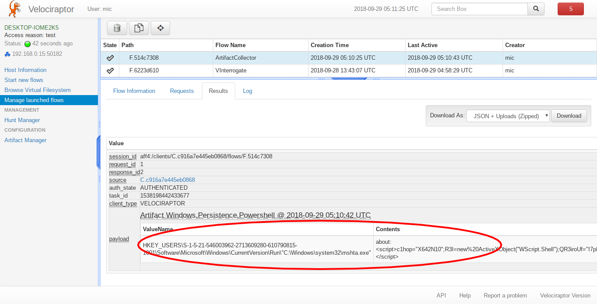
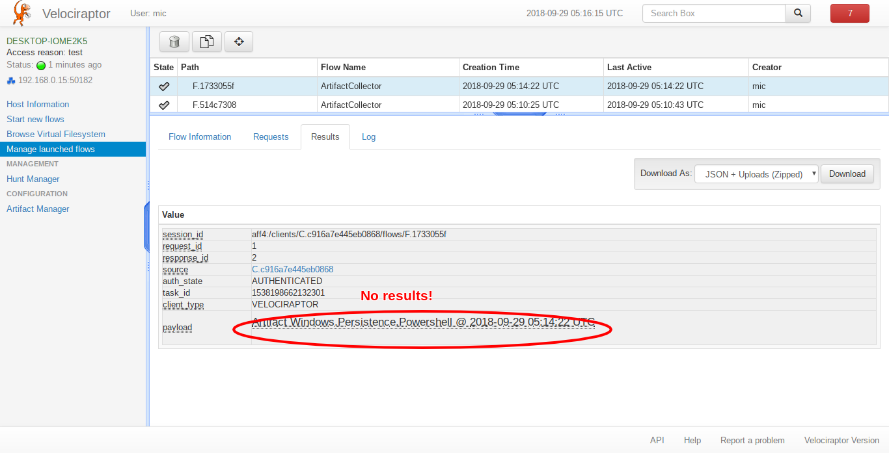
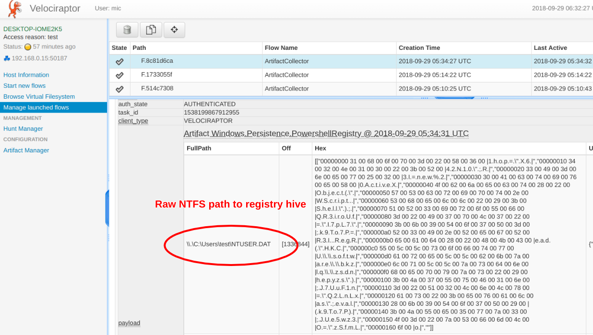

{}

This page is written about a very old version of Velociraptor and is
retained for historical purposes.

{}

I was watching the SANS DFIR Summit 2018 videos on youtube and came
across Mari DeGrazia\'s talk titled [\"Finding and Decoding Malicious
Powershell Scripts\"](https://www.youtube.com/watch?v=JWC7fzhvAY8). This
is an excellent talk and it really contains a wealth of information. It
seems that Powershell is really popular these days, allowing attacker to
\"live off the land\" by installing fully functional reverse shells and
backdoors, in a few lines of obfuscated scripts.

Mari went through a number of examples and also expanded on some in her
blog post [Malicious PowerShell in the Registry:
Persistence](http://az4n6.blogspot.com/2018/06/malicious-powershell-in-registry.html),
where she documents persistence through an autorun key launching
powershell to execute a payload within another registry key.

A similar persistence mechanism is documented by David Kennedy from
Binary defence in his post [PowerShell Injection with Fileless Payload
Persistence and Bypass
Techniques](https://blog.binarydefense.com/powershell-injection-diskless-persistence-bypass-techniques).
In that case an msha.exe link was stored in the user\'s Run key which
executed a payload from another registry key.

I was eager to write a Velociraptor artifact to attempt to detect such
keys using a YARA signature. Of course signature based detection is not
as robust as behavioural analysis but it is quick and usually quite
effective.

I thought it was still quite instructive to document how one can develop
the VQL queries for a simple Velociraptor artifact. We will be
developing the artifact interactively on a Windows system.

Preparation
===========

Our artifact will attempt to detect the persistence mechanism detailed
in the above posts. We start by adding a value to our test user account
under the key

``` {.sourceCode .console}
Key: "HKEY_CURRENT_USER\Software\Microsoft\Windows\CurrentVersion\Run"
Value: "C:\Windows\system32\mshta.exe"
Data:
  about:<script>c1hop="X642N10";R3I=new%20ActiveXObject("WScript.Shell");
  QR3iroUf="I7pL7";k9To7P=R3I.RegRead("HKCU\\software\\bkzlq\\zsdnhepyzs");
  J7UuF1n="Q2LnLxas";eval(k9To7P);JUe5wz3O="zSfmLod";</script>
```

Defining the Artifact.
======================

We create a directory called \"artifacts\" then create a new file inside
it called powershell\_persistence.yaml. Velociraptor artifacts are just
YAML files that can be loaded at runtime using the \--definitions flag.

Every artifact has a name, by convention the name is separated into its
major categories. We will call ours Windows.Persistence.Powershell:

``` {.sourceCode .yaml}
name: Windows.Persistence.Powershell
```

This is the minimum required for Velociraptor to identify it. We can see
a listing of all artifacts Velociraptor knows about using the
\"artifacts list\" command:

``` {.sourceCode .console}
F:\>velociraptor.exe --definitions artifacts artifacts list
INFO:2018/09/28 07:59:40 Loaded 34 built in artifacts
Linux.Applications.Chrome.Extensions
Linux.Applications.Chrome.Extensions.Upload
…
Windows.Persistence.Powershell
...
Windows.Sys.Users
```

We can collect the artifact simply by using the \"artifacts collect\"
command:

``` {.sourceCode .console}
F:\>velociraptor.exe --definitions artifacts artifacts collect Windows.Persistence.Powershell
INFO:2018/09/28 20:01:32 Loaded 34 built in artifacts
```

Ok so Velociraptor can load and collect this new artifact, but as yet it
does nothing! We need to think about what exactly we want to collect.

We know we want to search for all values in the Run/RunOnce hive of all
the users. Let\'s first see if we can retrieve all the values using a
glob:

``` {.sourceCode .yaml}
name: Windows.Persistence.Powershell
parameters:
  - name: keyGlob
    default: "HKEY_USERS\\*\\Software\\Microsoft\\Windows\
    \\CurrentVersion\\{Run,RunOnce}\\*"
sources:
 - precondition:
    SELECT OS from info() where OS = "windows"
   queries:
   - |
    SELECT FullPath from glob(
       globs=keyGlob,
       accessor="reg"
    )
```

This artifact demonstrates a few concepts:

1.  We can define parameters by name, and reference them from within the
    VQL query. This keeps the VQL query clean and more readable.
2.  We can define a precondition on the artifact. If the precondition is
    not met, the VQL query will not be run.

Lets run this artifact:

``` {.sourceCode .console}
F:\>velociraptor.exe --definitions artifacts artifacts collect Windows.Persistence.Powershell
INFO:2018/09/28 20:51:47 Loaded 34 built in artifacts
+--------------------------------+
|            FullPath            |
+--------------------------------+
| HKEY_USERS\S-1-5-19\Software\M |
| icrosoft\Windows\CurrentVersio |
| n\Run\OneDriveSetup            |
| HKEY_USERS\S-1-5-20\Software\M |
| icrosoft\Windows\CurrentVersio |
| n\Run\OneDriveSetup            |
| HKEY_USERS\S-1-5-21-546003962- |
| 2713609280-610790815-1001\Soft |
| ware\Microsoft\Windows\Current |
| Version\Run\"C:\Windows\system |
| 32\mshta.exe"                  |
+--------------------------------+
Artifact:
Windows.Persistence.Powershell
```

It returns a couple of results so there are two Run/RunOnce values
defined. For this artifact, we only want to return those entries which
match a specific yara signature. We can work later on improving the yara
signature, but for now let\'s just detect uses of the eval() powershell
command within 500 characters of an ActiveXObject instantiation. We will
try to match each value returned from the Run keys with this object:

``` {.sourceCode .yaml}
name: Windows.Persistence.Powershell
parameters:
  - name: keyGlob
    default: "HKEY_USERS\\*\\Software\\Microsoft\\Windows\
             \\CurrentVersion\\{Run,RunOnce}\\*"
  - name: yaraRule
    default: |
      rule Powershell {
        strings:
        $ = /ActiveXObject.{,500}eval/ nocase
        $ = /ActiveXObject.{,500}eval/ wide nocase
        condition:
        any of them
      }
sources:
 - precondition:
    SELECT OS from info() where OS = "windows"
   queries:
   - |
     // This is a stored query
     LET file = SELECT FullPath from glob(
       globs=keyGlob,
       accessor="reg"
     )
   - |
     SELECT * FROM yara(
       rules=yaraRule,
       files=file.FullPath,   // This will expand to a list of paths.
       accessor="reg")
```

This version recovers the FullPath of all the Run/RunOnce values and
stores them in a stored query. We then issue another query that applies
the yara rule on these values:

``` {.sourceCode .console}
F:\>velociraptor.exe --definitions artifacts artifacts collect Windows.Persistence.Powershell
INFO:2018/09/28 21:29:10 Loaded 34 built in artifacts
+------------+------+------+--------------------------------+--------------------------------+
|    Rule    | Meta | Tags |            Strings             |              File              |
+------------+------+------+--------------------------------+--------------------------------+
| Powershell |      |      | {"Name":"$","Offset":40,"HexDa | {"FullPath":"HKEY_USERS\\S-1-5 |
|            |      |      | ta":["00000000  41 63 74 69 76 | -21-546003962-2713609280-61079 |
|            |      |      |  65 58 4f  62 6a 65 63 74 28 2 | 0815-1001\\Software\\Microsoft |
|            |      |      | 2 57  |ActiveXObject(\"W|","00 | \\Windows\\CurrentVersion\\Run |
|            |      |      | 000010  53 63 72 69 70 74 2e 5 | \\\"C:\\Windows\\system32\\msh |
|            |      |      | 3  68 65 6c 6c 22 29 3b 51  |S | ta.exe\"","Type":"SZ","Data":{ |
|            |      |      | cript.Shell\");Q|","00000020   | "type":"SZ","value":"about:\u0 |
|            |      |      | 52 33 69 72 6f 55 66 3d  22 49 | 03cscript\u003ec1hop=\"X642N10 |
|            |      |      |  37 70 4c 37 22 3b  |R3iroUf=\ | \";R3I=new%20ActiveXObject(\"W |
|            |      |      | "I7pL7\";|","00000030  6b 39 5 | Script.Shell\");QR3iroUf=\"I7p |
|            |      |      | 4 6f 37 50 3d 52  33 49 2e 52  | L7\";k9To7P=R3I.RegRead(\"HKCU |
|            |      |      | 65 67 52 65  |k9To7P=R3I.RegRe | \\\\software\\\\bkzlq\\\\zsdnh |
|            |      |      | |","00000040  61 64 28 22 48 4 | epyzs\");J7UuF1n=\"Q2LnLxas\"; |
|            |      |      | b 43 55  5c 5c 73 6f 66 74 77  | eval(k9To7P);JUe5wz3O=\"zSfmLo |
|            |      |      | 61  |ad(\"HKCU\\\\softwa|","00 | d\";\u003c/script\u003e"},"Mti |
|            |      |      | 000050  72 65 5c 5c 62 6b 7a 6 | me":{"sec":1538191253,"usec":1 |
|            |      |      | c  71 5c 5c 7a 73 64 6e 68  |r | 538191253231489700},"Ctime":{" |
|            |      |      | e\\\\bkzlq\\\\zsdnh|","0000006 | sec":1538191253,"usec":1538191 |
|            |      |      | 0  65 70 79 7a 73 22 29 3b  4a | 253231489700},"Atime":{"sec":1 |
|            |      |      |  37 55 75 46 31 6e 3d  |epyzs\ | 538191253,"usec":1538191253231 |
|            |      |      | ");J7UuF1n=|","00000070  22 51 | 489700}}                       |
```

We can see that the last query returns 5 columns, but each column
actually contains objects with quite a lot of additional information.
For example, the File column returns information about the file that
matched the yara rule (its filename, timestamps etc). The output is a
bit confusing so we just return the relevant columns. We can replace the
\* in the last query with a curated list of columns to return:

``` {.sourceCode .sql}
SELECT File.FullPath as ValueName, File.Data.value as Contents,
  timestamp(epoch=File.Mtime.Sec) as ModTime
FROM yara(rules=yaraRule,
          files=file.FullPath,
          accessor="reg")
```

Which results in the quite readable:

``` {.sourceCode .console}
F:\>velociraptor.exe --definitions artifacts artifacts collect Windows.Persistence.Powershell
INFO:2018/09/28 21:42:18 Loaded 34 built in artifacts
+--------------------------------+--------------------------------+---------------------------+
|           ValueName            |            Contents            |          ModTime          |
+--------------------------------+--------------------------------+---------------------------+
| HKEY_USERS\S-1-5-21-546003962- | about:<script>c1hop="X642N10"; | 2018-09-28T20:20:53-07:00 |
| 2713609280-610790815-1001\Soft | R3I=new%20ActiveXObject("WScri |                           |
| ware\Microsoft\Windows\Current | pt.Shell");QR3iroUf="I7pL7";k9 |                           |
| Version\Run\"C:\Windows\system | To7P=R3I.RegRead("HKCU\\softwa |                           |
| 32\mshta.exe"                  | re\\bkzlq\\zsdnhepyzs");J7UuF1 |                           |
|                                | n="Q2LnLxas";eval(k9To7P);JUe5 |                           |
|                                | wz3O="zSfmLod";</script>       |                           |
+--------------------------------+--------------------------------+---------------------------+
Artifact: Windows.Persistence.Powershell
```

Great! This works and only returns values that match the yara signature
we developed.

Testing the artifact
====================

Let\'s test this artifact for real now. We restart the frontend with the
\--definition flag and this makes the new artifact available in the GUI
under the Artifact Collector flow. The GUI also shows the entire
artifact we defined so we can see what VQL will be run:


Launching the flow appears to work and shows exactly the same result as
we collected on the command line:



But wait! There is a problem!
=============================

When we log out of the machine, and then rerun the artifact it returns
no results!



Why is that? Experienced incident responders would recognize that any
artifact that works from the HKEY\_USERS registry hive is inherently
unreliable. This is because the HKEY\_USERS hive is not a real hive -it
is a place where Windows mounts the user\'s hive when the user logs in.

How does HKEY\_USERS hive work?
-------------------------------

Windows implements the concept of user profiles. Each user has a
personal registry hive that stores user specific settings. It is
actually a file stored on their home directory called ntuser.dat. When a
user logs into the workstation, the file may be synced from the domain
controller and then it is mounted under the HKEY\_USERS\\\<sid\>
registry hive.

This means that when the user logs out, their user registry hive is
unmounted and does not appear in HKEY\_USERS any longer. Any artifacts
based around the HKEY\_USERS hive will work only if the collection is
run when a user is logged in.

This is obviously not what we want when we hunt for persistence! We want
to make sure that none of the users on the system have this persistence
mechanism installed. You can imagine a case where a system has been
cleaned up but then a user logs into the machine, thereby reinfecting
it!

How to fix this?
----------------

Yara is a very powerful tool because it allows us to search for patterns
in amorphous data (such as process memory and structured files) without
having to fully understand the structure of the data we are searching
for. Of course this has its limitations, but yara can raise a red flag
if the signature matches the file, and we can analyse this file more
carefully later.

In this case, we can not rely on globbing the HKEY\_USER registry hive,
so maybe we can just search the files that back these hives? We know
that each user on the system has an NTUSER.DAT file in their home
directory (usually C:\\\\Users\\\\\<username\>), so let\'s write an
artifact to find these files. We can reuse the artifact
Windows.Sys.Users that reports all user accounts on a system (we display
it as JSON to enhance readability):

``` {.sourceCode .console}
F:\>velociraptor.exe artifacts collect Windows.Sys.Users --format json
INFO:2018/09/28 22:44:26 Loaded 34 built in artifacts
{
 "Description": "",
 "Directory": "C:\\Users\\test",
 "Gid": 513,
 "Name": "test",
 "Type": "local",
 "UUID": "S-1-5-21-546003962-2713609280-610790815-1001",
 "Uid": 1001
},
{
 "Description": "",
 "Directory": "C:\\Users\\user1",
 "Gid": 513,
 "Name": "user1",
 "Type": "local",
 "UUID": "S-1-5-21-546003962-2713609280-610790815-1003",
 "Uid": 1003
},
```

So we just want to YARA scan the NTUSER.DAT file in each home directory:

``` {.sourceCode .console}
SELECT * from foreach(
row={
   SELECT Name, Directory as HomeDir
     FROM Artifact.Windows.Sys.Users()
    WHERE Directory.value and Gid
},
query={
  SELECT File.FullPath As FullPath,
         Strings.Offset AS Off,
         Strings.HexData As Hex,
          upload(file=File.FullPath, accessor="ntfs") AS Upload
      FROM yara(
            files="\\\\.\\" + HomeDir + "\\ntuser.dat",
            accessor="ntfs",
            rules=yaraRule, context=10)
      })
```

This query:

1.  Selects all the usernames and their home directory from the
    Windows.Sys.Users artifact.
2.  For each directory prepends \\\\\\\\.\\\\ and appends
    \"ntuser.dat\". For example c:\\\\Users\\\\test becomes
    \\\\\\\\.\\\\c:\\\\Users\\\\test\\\\NTUSER.dat
3.  The file is accessed using the NTFS filesystem accessor. This is
    necessary because the registry hive is locked if the user is logged
    in. Therefore we must access it using raw NTFS parsing to bypass the
    OS locking.
4.  For each file that matches the yara expression, we upload the file
    to the server for further analysis.

Lets run this new artifact on the server:



Unlike the previous artifact, this one simply returns the YARA hit, but
because we do not have any context on which value contained the
signature, or even if it had been deleted. Luckily we uploaded the raw
registry hive for further analysis, and we can use a tool such as
RegRipper to extract more information from the hive:

``` {.sourceCode .console}
$ wine rip.exe -p user_run -r
/tmp/velociraptor/clients/C.c916a7e445eb0868/uploads/F.078739d6/ntfs/
%5C%5C.%5CC%3A%5CUsers%5Cuser1%5CNTUSER.DAT
Launching user_run v.20140115
user_run v.20140115
(NTUSER.DAT) [Autostart] Get autostart key contents from NTUSER.DAT hive

Software\Microsoft\Windows\CurrentVersion\Run
LastWrite Time Thu Sep 27 01:19:08 2018 (UTC)
 OneDrive: "C:\Users\user1\AppData\Local\Microsoft\OneDrive\OneDrive.exe"
   /background
 c:\windows\system32\mshta.exe: about:<script>c1hop="X642N10";
   R3I=new%20ActiveXObject("WScript.Shell");
   QR3iroUf="I7pL7";k9To7P=R3I.RegRead("HKCU\\software\\
   bkzlq\\zsdnhepyzs");J7UuF1n="Q2LnLxas";eval(k9To7P);JUe5wz3O="zSfmLod";</script>
```

Note above how we can simply retrieve the uploaded file from
Velociraptor\'s filestore. Velociraptor stores uploaded files on the
filesystem within the flow\'s directory.

Conclusions
-----------

In this blog post we saw how to utilize YARA to find suspicious
powershell persistence mechanisms. YARA is a powerful tool and using
Velociraptor\'s artifacts we can apply it to files, registry values, and
raw NTFS files such as locked registry hives and the pagefile.

We also saw some of the inherent problems with relying on the
HKEY\_USERS registry hive for detection - the hive is only present when
a user is logged in so when we hunt, we might miss those users who are
currently logged out. We saw how YARA can be used to detect suspicious
patterns in raw registry hive files and how artifacts may retrieve those
files for further analysis.
