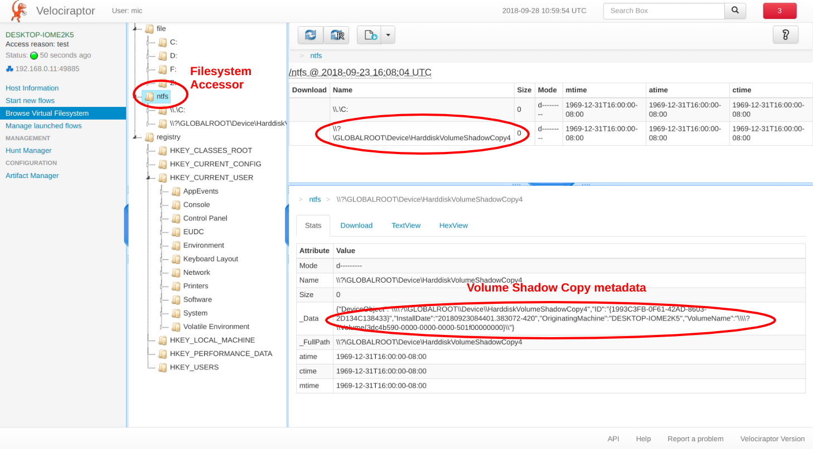
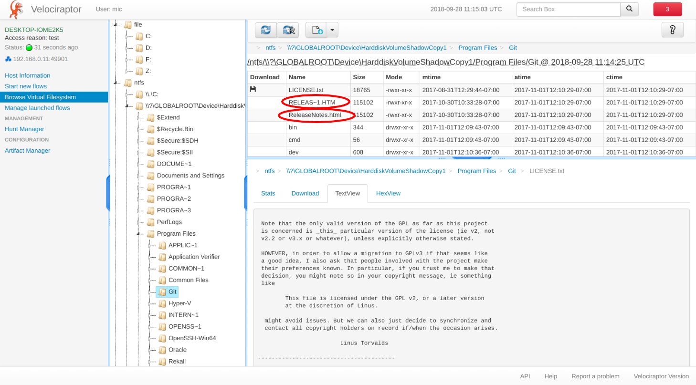

In addition, Velociraptor can now also read [Volume Shadow
Copy](https://docs.microsoft.com/en-us/windows/desktop/vss/volume-shadow-copy-service-portal)
snapshots. The gives a kind of time-machine ability to allow the
investigator to look through the drive content at a previous point in
the past.

This blog post introduces the new features and describe how
Velociraptor\'s filesystem accessors work to provide data from multiple
sources to VQL queries.

We have previously seen that Velociraptor can list and download files
from the client\'s filesystem, as well as registry keys and values. The
client\'s filesystem is made available to VQL plugins such as glob()
allowing many Artifacts to be written that work on files, registry keys
and raw NTFS volumes.

While Velociraptor is a great remote response tool, everything that it
can do remotely, it can also do locally using a command line interface.
This gives the user an opportunity to interactively test their VQL
queries while writing artifacts.

The latest release adds a couple of convenient command line options
which allow the user to interact with the filesystem accessors. For
example, to list the files in a directory we can use the \"velociraptor
fs ls\" command:

``` {.sourceCode .console}
F:\>velociraptor.exe fs ls
+------+------+------------+---------------------------+---------------------------------+
| Name | Size |    Mode    |           mtime           |              Data               |
+------+------+------------+---------------------------+---------------------------------+
| C:   |    0 | d--------- | 1969-12-31T16:00:00-08:00 | Description: Local Fixed Disk   |
|      |      |            |                           | DeviceID: C:                    |
|      |      |            |                           | FreeSpace: 12686422016          |
|      |      |            |                           | Size: 33833349120               |
|      |      |            |                           | SystemName: DESKTOP-IOME2K5     |
|      |      |            |                           | VolumeName:                     |
|      |      |            |                           | VolumeSerialNumber: 9459F443    |
| D:   |    0 | d--------- | 1969-12-31T16:00:00-08:00 | Description: CD-ROM Disc        |
|      |      |            |                           | DeviceID: D:                    |
|      |      |            |                           | FreeSpace: 0                    |
|      |      |            |                           | Size: 57970688                  |
|      |      |            |                           | SystemName: DESKTOP-IOME2K5     |
|      |      |            |                           | VolumeName: VBox_GAs_5.2.11     |
|      |      |            |                           | VolumeSerialNumber: A993F576    |
+------+------+------------+---------------------------+---------------------------------+
SELECT Name, Size, Mode.String AS Mode, timestamp(epoch=Mtime.Sec) AS mtime,
   Data FROM glob(globs=path, accessor=accessor)
```

The \"fs ls\" command instructs Velociraptor to list directories using
its internal filesystem accessors. By default it will use the \"file\"
accessor - which simply uses the usual Win32 api filesystem calls (i.e.
CreateFile, FindFirstFile etc).

On windows, the file accessor lists the drive letters at the root of the
filesystem, then allows subdirectories to be listed under each letter.
The above output shows some metadata for each drive letter (like its
size etc) and below the table we can see the VQL query that was used to
generate the table. To be clear, the \"fs ls\" command is simply a
shortcut for producing a VQL query that ultimately uses the filesystem
accessor in the glob() VQL plugin. Therefore, we can enter any glob
expression to find files:

``` {.sourceCode .console}
F:\>velociraptor.exe fs ls -v "c:\program files\**\*.exe"
+--------------------------------+----------+------------+---------------------------+------+
|            FullPath            |   Size   |    Mode    |           mtime           | Data |
+--------------------------------+----------+------------+---------------------------+------+
| C:\Program Files\Windows Defen |  4737448 | -rw-rw-rw- | 2018-07-14T17:56:49-07:00 |      |
| der Advanced Threat Protection |          |            |                           |      |
| \MsSense.exe                   |          |            |                           |      |
| C:\Program Files\Windows Defen |   791384 | -rw-rw-rw- | 2018-07-14T17:56:43-07:00 |      |
| der Advanced Threat Protection |          |            |                           |      |
| \SenseCncProxy.exe             |          |            |                           |      |
| C:\Program Files\Windows Defen |  3832016 | -rw-rw-rw- | 2018-07-14T17:56:50-07:00 |      |
| der Advanced Threat Protection |          |            |                           |      |
| \SenseIR.exe                   |          |            |                           |      |
| C:\Program Files\Windows Defen |  2147192 | -rw-rw-rw- | 2018-07-14T18:05:00-07:00 |      |
| der Advanced Threat Protection |          |            |                           |      |
| \SenseSampleUploader.exe       |          |            |                           |      |
........
+--------------------------------+----------+------------+---------------------------+------+
SELECT FullPath, Size, Mode.String AS Mode, timestamp(epoch=Mtime.Sec) AS mtime, Data FROM
glob(globs=path, accessor=accessor)
```

When using the registry filesystem accessor, the registry appears like a
filesystem, allowing us to run glob expressions against registry keys
and values (Note that the registry accessor provides the value in the
metadata):

``` {.sourceCode .console}
F:\>velociraptor.exe fs --accessor reg ls "HKEY_USERS\*\Software\Microsoft\Windows\CurrentVersion\{Run,RunOnce}\*"
+---------------+------+------------+---------------------------+---------------------------------+
|     Name      | Size |    Mode    |           mtime           |             Data                |
+---------------+------+------------+---------------------------+---------------------------------+
| OneDriveSetup |  104 | -rwxr-xr-x | 2018-09-03T02:48:53-07:00 | type: SZ                        |
|               |      |            |                           | value: C:\Windows\SysWOW64\     |
|               |      |            |                           | OneDriveSetup.exe /thfirstsetup |
| OneDriveSetup |  104 | -rwxr-xr-x | 2018-09-03T02:48:47-07:00 | type: SZ                        |
|               |      |            |                           | value:   C:\Windows\SysWOW64\   |
|               |      |            |                           | OneDriveSetup.exe /thfirstsetup |
+---------------+------+------------+---------------------------+---------------------------------+
SELECT Name, Size, Mode.String AS Mode, timestamp(epoch=Mtime.Sec) AS mtime,
Data FROM glob(globs=path, accessor=accessor)
```

Finally, the NTFS accessor can access files by parsing the NTFS
filesystem directly. At the top level, the accessor shows all NTFS
formatted partitions. These include regular drives as well as Volume
Shadow Copies:

``` {.sourceCode .console}
F:\>velociraptor.exe fs --accessor ntfs ls
+--------------------------------+------+------------+---------------------------------------------------------+
|              Name              | Size |    Mode    |                             Data                        |
+--------------------------------+------+------------+---------------------------------------------------------+
| \\.\C:                         |    0 | d--------- | Description: Local Fixed Disk                           |
|                                |      |            | DeviceID: C:                                            |
|                                |      |            | FreeSpace: 11802157056                                  |
|                                |      |            | Size: 33833349120                                       |
|                                |      |            | SystemName: DESKTOP-IOME2K5                             |
|                                |      |            | VolumeName:                                             |
|                                |      |            | VolumeSerialNumber: 9459F443                            |
| \\?\GLOBALROOT\Device\Harddisk |    0 | d--------- | DeviceObject: \\?\GLOBALROOT\Device\                    |
|                                |      |            |             HarddiskVolumeShadowCopy1                   |
| VolumeShadowCopy1              |      |            | ID: {CAF25144-8B70-4F9E-B4A9-5CC702281FA1}              |
|                                |      |            | InstallDate: 20180926154712.490617-420                  |
|                                |      |            | OriginatingMachine: DESKTOP-IOME2K5                     |
|                                |      |            | VolumeName: \\?\Volume{3dc4b590-0000-000-501f00000000}\ |
| \\?\GLOBALROOT\Device\Harddisk |    0 | d--------- | DeviceObject: \\?\GLOBALROOT\Device\                    |
|                                |      |            |            HarddiskVolumeShadowCopy2                    |
| VolumeShadowCopy2              |      |            | ID: {E48BFDD7-7D1D-40AE-918C-36FCBB009941}              |
|                                |      |            | InstallDate: 20180927174025.893104-420                  |
|                                |      |            | OriginatingMachine: DESKTOP-IOME2K5                     |
|                                |      |            | VolumeName: \\?\Volume{3dc4b590-0000-000-501f00000000}\ |
+--------------------------------+------+------------+---------------------------------------------------------+
SELECT Name, Size, Mode.String AS Mode, timestamp(epoch=Mtime.Sec) AS mtime,, Data FROM glob(globs=path, accessor=accessor) WHERE Sys.name_type != 'DOS'
```

The above example shows two volume shadow copies that Windows has takens
on two different dates (highlighted above). We can browse these
snapshots just like they were another drive (We can also apply any glob
expressions to this path):

``` {.sourceCode .console}
F:\>velociraptor.exe fs --accessor ntfs ls "\\?\GLOBALROOT\Device\HarddiskVolumeShadowCopy1\
Users\test\*.exe"
+------------------+----------+------------+---------------------------+------------------+
|       Name       |   Size   |    Mode    |           mtime           |       Data       |
+------------------+----------+------------+---------------------------+------------------+
| velociraptor.exe | 12521472 | -rwxr-xr-x | 2018-08-19T23:37:01-07:00 | mft: 39504-128-0 |
|                  |          |            |                           | name_type: Win32 |
| winpmem.exe      |  3619260 | -rwxr-xr-x | 2017-12-28T21:17:50-08:00 | mft: 39063-128-1 |
|                  |          |            |                           | name_type: POSIX |
+------------------+----------+------------+---------------------------+------------------+
SELECT Name, Size, Mode.String AS Mode, timestamp(epoch=Mtime.Sec) AS mtime, Data FROM
glob(globs=path, accessor=accessor) WHERE Sys.name_type != 'DOS'
```

Volume shadow copies are like a time machine - they can reveal data that
was stored on the drive days or weeks prior to the time we inspected it
which makes them very useful for some investigations.

Using filesystem accessors remotely - The Velociraptor VFS
==========================================================

The above description shows how Velociraptor\'s command line interface
can be used to interact with the various filesystem accessors. This is
important for writing and collecting artifacts for triage and general
system state exploration.

However, how do filesystem accessors appear in the Velociraptor GUI?



The nice thing about Velociraptor\'s GUI is that it is just a way to
present the same information that the \"fs ls\" command is getting by
using the same VQL queries. Therefore the view is very familiar:

1.  The top level of the Velociraptor VFS represents all the filesystem
    accessors implemented in the client.
2.  Each of these accessors shows its own view:
    1.  The file accessor uses the OS APIs to list files and
        directories. Its top level is a list of mounted drives (which
        may be CDROM\'s or even network shares).
    2.  The NTFS accessor shows all NTFS volumes accessible, including
        local drives and Volume Shadow Copies.
    3.  The registry accessor uses Win32 APIs to access the registry and
        shows at the top level a list of all system hives currently
        attached.
3.  For each file listed, the accessor also includes a Data attribute.
    This contains accessor specific metadata about the file (for example
    the MFT entry).

In the below screenshot we can see how the user may navigate into the
Volume Shadow Copy and retrieve files from it:



A note about filenames.
=======================

NTFS can have several different names to the same file. Typically, a
short DOS 8.3 style filename (e.g. PROGRA\~1), as well as a Win32 long
filename (e.g. Program Files). You can see the short name for a file
using the API GetShortPathName() (or the command dir /x), but a program
needs to deliberately ask for it. Most programs do not explicitly
collect or show the short filename of a file.

This can cause problems for DFIR applications. For example, Imagine we
discovered a Run key to C:\\\\Users\\\\test\\\\runme.exe. If we only
considered the long filename (as for example returned by the Win32API
FindFile() or the output of the dir command), then we would assume the
file has been removed and the run key is not active. In reality however,
the file may be called \"This is some long filename.exe\" with a DOS
name of \"runme.exe\". Explorer (and most tools) will only show the long
filename by default, but the runkey will still execute by referring to
the DOS filename!

Usually the short filename is some variation of the long filename with a
\~1 or \~2 at the end. In reality it can be anything. In the snippet
below, I am setting the short filename for the velociraptor.exe binary
to be something completely unrelated, then I am running the binary using
the unrelated filename:

``` {.sourceCode .console}
C:\Users\test>fsutil file setshortname velociraptor.exe runme.exe
C:\Users\test>dir /x *.exe
 Volume in drive C has no label.
 Volume Serial Number is 9459-F443

 Directory of C:\Users\test

08/19/2018  11:37 PM        12,521,472 RUNME.EXE    velociraptor.exe
               2 File(s)     16,140,732 bytes
               0 Dir(s)  11,783,704,576 bytes free
C:\Users\test>runme.exe -h
usage: velociraptor [<flags>] <command> [<args> ...]

An advanced incident response and monitoring agent.
```

You can see that Windows explorer shows no trace of the runme.exe file
since it only displays the Win32 long file name:


It is important for DFIR investigators to be aware of this and test your
tools! You can see that sysinternals\' autoruns program won\'t have any
of these shenanigans when I added a runkey to \"runme.exe\". It shows
the real filename velociraptor.exe even though the runkey indicates
runme.exe:


Velocirpator treats a file\'s DOS name and Win32 Name as distinct
entries in the NTFS directory listing. This allows us to find any
references to the file by it\'s DOS name as well as its Win32 name.

Conclusions
===========

As Velociraptor gains more functionality, we envision more filesystem
accessors to become available. The nice thing about these accessors is
that they just slot in to the rest of the VQL plugins. By providing a
new accessor, we are able to glob, hash, yara scan etc the new
abstraction. For example, to yara scan a registry key one simply calls
the VQL plugin yara with an accessor of reg: yara(rules=myRules,
files=my\_reg\_keys, accessor=\"reg\")
