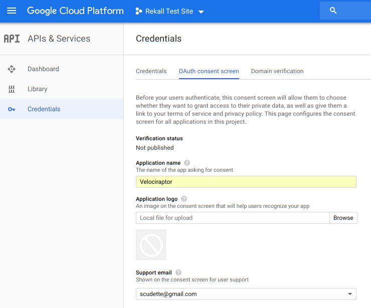
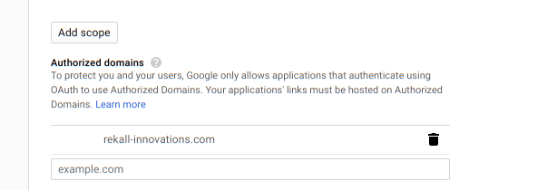
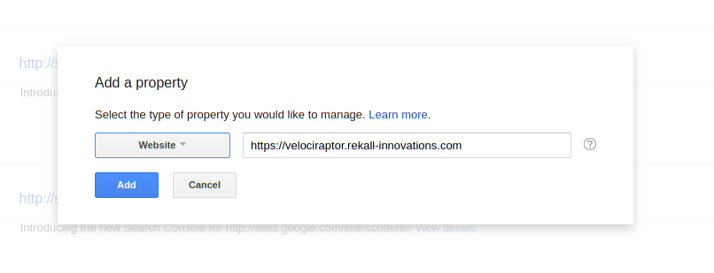

In the previous post we saw how to set up Velociraptor\'s GUI over SSL.
This is great, but we still need to create users and assign them
passwords manually. The trouble with user account management is that we
can not enforce 2 factor authentication, or any password policies or any
of the usual enterprise requirements for user account management. It is
also difficult for users to remember yet another password for a separate
system, and so might make the password easily guessable.

Most enterprise systems require an SSO mechanism to manage user accounts
and passwords. Manual user account management simply does not scale!

In this post we discuss how to enable Google\'s SSO authentication for
Velociraptor identity management.

OAuth Identity management
=========================

Velociraptor can use Google\'s oauth mechanism to verify a user\'s
identity. This requires a user to authenticate to Google via their usual
mechanism - if their account requires 2 factor authentication, then
users need to log in this way.

Once the user authenticates to Google, they are redirected back into the
Velociraptor application with a token that allows the application to
request information about the user (for example, the username or email
address).

{}

OAuth is an authentication protocol. This means Velociraptor can be
pretty confident the user is who they claim they are. This does not
automatically grant them access to the application! A Velociraptor
administrator must still manually grant them access before a user may
log in.

{}

Before we can use Google for Authentication, we need to register our
Velociraptor deployment as an OAuth App with Google. Unfortunately
Google is not known for having intuitive and easy to follow processes so
actually doing this is complicated and bounces through many seemingly
unrelated Google products and services. This post attempts to document
this process at it exists in this time.

For our example we assume that our server is located at
<https://velociraptor.rekall-innovations.com> as we continue on from our
example in the last post (i.e. it is already configured to use SSL).

Registering Velociraptor as an OAuth application
================================================

The first step is to register Velociraptor as an OAuth app. We do this
by accessing the Google cloud console at
<https://console.cloud.google.com> . You will need to set up a cloud
account first and create a cloud project. Although in this example we do
not necessarily need to host our application on Google cloud or have
anything to do with Google cloud, OAuth seems to exist within the Google
cloud product.

Our ultimate goal is to obtain OAuth credentials to give our
Velociraptor app, but we have to have a few things set up first. The
cloud console is fairly confusing so I usually use the search feature to
find exactly what I need. Searching for \"oauth\" at the search bar
indicates that it is under \"APIs and Services\".

We need to set up the OAuth consent screen first - in which we give our
application a name to be presented to the user by the OAuth flow:



Further down we need to provide an authorized domain



In order to add an Authorized domain we need to *verify it*. Google\'s
help pages explain it further:

{}

To protect you and your users, Google restricts your OAuth 2.0
application to using Authorized Domains. If you have verified the domain
with Google, you can use any Top Private Domain as an Authorized Domain.

{}

And this links to <https://www.google.com/webmasters/tools/home> which
again seems completely unrelated to OAuth, Velociraptor or even a web
app (the web masters product is supposed to help sites increase their
search presence).

Within this product we now need to \"Add a property\":



Hidden within the settings menu there is an option \"Verification
Details\" which allows you to verify that you own the domain. If you
purchased your domain from Google Domains then it should already be
verified - otherwise you can set some TXT records to prove you own the
domain.


After all this we can go back to the cloud console and Create
Credentials/OAuth client ID:


Now select \"Web App\" and we must set the \"Authorized redirect URIs\"
to <https://velociraptor.rekall-innovations.com/auth/google/callback>
-This is the URL that successful OAuth authentication will direct to.
Velociraptor accepts this redirect and uses it to log the user on.


{}

The UI is a bit confusing here - you must press enter after typing the
redirect URL to have it registered **before** you hit *Create* otherwise
it misses that you typed it completely. I spent some time stumped on
this UI bug.

{}

If all goes well the Google cloud console will give us a client ID and a
client secret. We can then copy those into the Velociraptor
configuration file under the GUI section:

``` {.sourceCode .yaml}
GUI:
  google_oauth_client_id: 1234xxxxxx.apps.googleusercontent.com
  google_oauth_client_secret: qsadlkjhdaslkjasd
  public_url: https://velociraptor.rekall-innovations.com/

logging:
  output_directory: /var/log/velociraptor/
  separate_logs_per_component: true
```

In the above config we also enabled logging (which is important for a
secure application!). The separate\_logs\_per\_component option will
create a separate log file for the GUI, Frontend as well as important
Audit related events.

Now we can start the Velociraptor frontend:

``` {.sourceCode .bash}
$ velociraptor --config server.config.yaml frontend
```

Connecting using the browser goes through the familiar OAuth flow and
arrives at this Velociraptor screen:


The OAuth flow ensures the user\'s identity is correct but does not give
them permission to log into Velociraptor. Note that having an OAuth
enabled application on the web allows anyone with a Google identity to
authenticate to the application but the user is still required to be
authorized. We can see the following in the Audit logs:

``` {.sourceCode .json}
{
  "level": "error",
  "method": "GET",
  "msg": "User rejected by GUI",
  "remote": "192.168.0.10:40570",
  "time": "2018-12-21T18:17:47+10:00",
  "user": "mike@velocidex.com"
}
```

In order to authorize the user we must explicitly add them using the
velociraptor admin tool:

``` {.sourceCode .bash}
$ velociraptor --config ~/server.config.yaml user add mike@velocidex.com
Authentication will occur via Google - therefore no password needs to be set.
```

Note that this time, Velociraptor does not ask for a password at all,
since authentication occurs using Google\'s SSO. If we hit refresh in
the browser we can now see the Velociraptor application:


We can see that the logged in user is authenticated by Google, and we
can also see their Google avatar at the top right for some more eye
candy :-).


{}

Shoutout to the folks from [CyberCX](https://www.cybercx.com.au/) who
sponsored this exciting feature!.

{}
