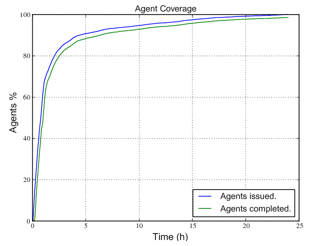
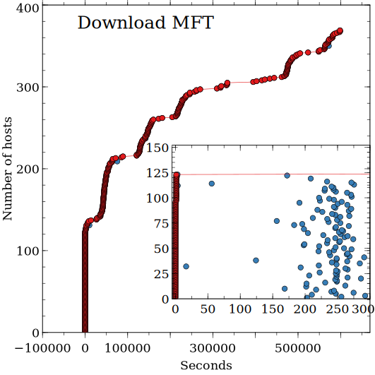
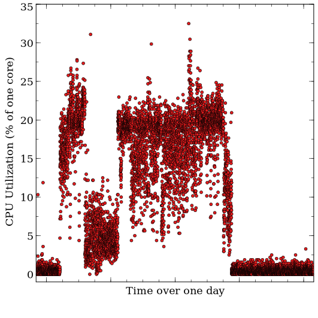

We are often asked how many resources does a Velociraptor deployment
use? How should one spec a machine for a Velociraptor deployment?

We have previously said that one of the reasons we developed
Velociraptor was to improve on the performance of GRR which was not
scalable for our use case.

We\'ve been working with the team at Klein & Co. on several intrusions
over the past several months, which are providing valuable opportunities
to deploy and test Velociraptor in a range of real world investigation
scenarios. Through this process, we've been able to extend
Velociraptor's functionality and prove its performance on real client
networks.

I thought I would write a short blog post to show how Velociraptor
performed on such a recent engagement. In this engagement we deployed
Velociraptor on AWS and selectively pushed the client to around 600
machines running a mix of MacOS and Windows.

This post will hopefully give readers some idea of how scalable the tool
is and the typical workloads we run with it.

The Server
==========

Since this is a smallish deployment we used a single VM with 32Gb of RAM
and 8 cores. This was definitely over speced for this job as most of the
time the server consumed less than 10% of one core:

``` {.sourceCode .console}
top - 06:26:13 up 29 days,  2:31,  5 users,  load average: 0.00, 0.01, 0.05
Tasks: 214 total,   1 running, 213 sleeping,   0 stopped,   0 zombie
%Cpu(s):  0.5 us,  0.1 sy,  0.0 ni, 99.4 id,  0.0 wa,  0.0 hi,  0.0 si,  0.0 st
KiB Mem:  32948060 total, 14877988 used, 18070072 free,   411192 buffers
KiB Swap:        0 total,        0 used,        0 free. 13381224 cached Mem

  PID USER      PR  NI    VIRT    RES    SHR S  %CPU %MEM     TIME+ COMMAND
19334 root      20   0 1277924  94592  12616 S   3.0  0.3   9:11.03 ./velociraptor --config server.config.yaml frontend
    8 root      20   0       0      0      0 S   0.3  0.0   7:16.30 [rcuos/0]
```

You can see that the server consumed about 95mb when operating normally
and CPU usage was around 3% of one core.

For this engagement we knew that we would be collecting a lot of data
and so we specified a large 500gb volume.

Hunt performance
================

Velociraptor works by collecting \"Artifacts\" from clients. Artifacts
are simply encapsulated VQL queries which specify something to search
for on the endpoint. Without going into the details of this engagement,
we can say that we collected typical artifacts for a DFIR/Forensic
investigation engagement. In the following I want to explore how well
hunts performed for the following typical artifacts in order of
complexity:

1.  Search the filesystem for a file glob.
2.  Download the \$MFT from the root filesystem.
3.  Run a Yara scan over every file on all mounted filesystems.

We ran these artifact collections over a large number of hosts (between
400-500) that fell within the scope of our engagement. Although the
number of hosts is not huge, we hope to demonstrate Velociraptor\'s
scalability.

Searching for a file glob
=========================

One of the simplest and most common tasks in DFIR is to search the
filesystem for a glob based on filename. This requires traversing
directories and matching the filename based on the user specified
expression - for example, find all files with the extension \*.exe
within the C:\\\\Users directory.

Velociraptor can glob over the entire filesystem or over a limited set
of files. Typically a full filesystem glob can take some minutes on the
endpoint (it is equivalent to running the find unix command) and touches
every file. We typically try to limit the scope of the glob as much as
possible (e.g. only search system directories) but sometimes it is nice
to run a glob over all mounted filesystems to make sure we don\'t miss
anything. In this case we opted for a full filesystem scan.

We searched the entire deployment using a hunt (The hunt is constructed
using the File Finder flow in the GUI) which just launches the artifact
collection. Therefore the horizontal distance between the red and blue
dot, in the graph below, represents the total time taken by the host to
collect the artifact.


The graph shows how many hosts were recruited into this hunt on the Y
axis. The X axis show the number of seconds since the hunt launch. The
red points indicate the time when clients started their collection,
while the blue dots indicate the time when the client completed the
artifact collection and the server saved its results.

The inset shows the same data but zoomed into the time origin.

Velociraptor improves and builds on the initial ideas implemented within
the GRR DFIR tool, and so it is interesting to compare this graph to a
typical graph produced by GRR\'s hunt (reproduced from [this
paper](https://www.sciencedirect.com/science/article/pii/S1742287613000285)).



The first noticeable difference is that Velociraptor clients complete
their collection much faster than GRR\'s (the horizontal distance
between the red and blue dots represents the time between when the
collection is issued and the time it completes).

The main reason for this is that GRR\'s communication protocol relies on
polling (by default every 10 minutes). Also, since hunting is so
resource intensive in GRR, the clients actually poll the hunt foreman
task every 30 minutes by default. This means that GRR clients typically
have to wait up to 30 minutes to run a hunt!

The second difference is the slope of the line around the start of the
hunt. GRR implements a hunt client rate - clients are recruited into the
hunt slowly (by default 20 per minute) in order to limit the load on the
frontends. Unlike GRR, Velociraptor does not implement a hunt rate since
the Velociraptor frontend load is controlled by limiting concurrency
instead (more on this below).

This means that Velociraptor can deliver useful results within seconds
of the hunt starting. We see that this particular filename search
typically takes 25-30 seconds and we see about 200 clients completing
the hunt within this time consistently. The remaining clients are
probably not online and they receive the hunt as they join the network.
This makes Velociraptor hunts far more responsive and useful.

You might also notice a few outliers which spend a long time collecting
this artifact - these machines have probably been shutdown or suspended
while collecting this artifact.

MFT Download
============

A common technique is to examine the Master File Table (MFT) of an NTFS
volume. By forensically analyzing the MFT it is possible to detect
deleted files, time stomping and build a timeline of the system using
tools like [analyseMFT.py](https://github.com/dkovar/analyzeMFT) or
[ntfswalker](https://dmitrybrant.com/ntfswalker) .

In this case we decided to collect the \$MFT from all the Windows hosts
and post-process them offline. Typically the MFT is around 300-400mb and
could be larger. Therefore this artifact collection is about performance
downloading large quantities of data from multiple hosts quickly.

Velociraptor can read the raw NTFS partition and therefore read the
\$MFT file. We wrote the following artifact to just fetch the \$MFT
file:

``` {.sourceCode .yaml}
name: Artifact.NTFS.MFT_puller
description: |
   Uses an NTFS accessor to pull the $MFT

parameters:
- name: path
  default: \\.\C:\$MFT

sources:
- precondition:
    SELECT OS From info() where OS = 'windows'
  queries:
  - SELECT upload(file=path, accessor="ntfs") as Upload from scope()
```

Here is the timing graph for this artifact collection:



This collection takes a lot longer on each host as clients are uploading
around 400mb each to the server, but our server was in the cloud so it
had fast bandwidth. Again we see the hosts that are currently up being
tasked within seconds, while as hosts come online gradually we see them
receiving the hunt and a few minutes later uploading their \$MFT file.

Was the frontend loaded at the time? I took a screenshot of top on the
server seconds after launching the hunt:


We can see that the CPU load is trivial (4.7%) but the major impact of a
heavy upload collection is the memory used (about 4.7gb - up from about
100mb). The reason is that each client is posting a large buffer of data
(several mb) simultaneously. The server needs to buffer the data before
it can decrypt and process it which takes memory.

In order to limit the amount of memory used, Velociraptor limits the
total number of connections it is actively processing to 8-10 concurrent
connections. By carefully managing concurrency we are able to keep a
limit on server memory use. We may lower the total memory use by
reducing the concurrency (and therefore maybe fit into a smaller VM).
Clients simply wait until the server is able to process their uploaded
buffers. If the server takes too long, the clients automatically back
off and retry to send the same buffer.

Yara scan over the entire filesystem
====================================

The final example of a very intense artifact is to scan the entire
filesystem with a YARA rule. This not only requires traversing the
entire filesystem, but also opening each file and searching it.

One of the dangers with such a scan is that users will be negatively
impacted as their workstations start to read every file on disk! The
main resources a YARA scan consumes is disk IO and CPU load. Users might
complain and blame Velociraptor for their machine being slow (disk IO
may negatively affect performance much more than CPU load!).

However in this case, we don\'t care how long we take to scan the
user\'s system, as long as every file was scanned, and as long as the
endpoint is not overloaded and the user\'s work is not affected. Luckily
Velociraptor allows us to specify the trade-off between collection time
and collection intensity.

Velociraptor rate limiting
--------------------------

Velociraptor controls client side load by rate limiting the client\'s
VQL query. Each VQL plugin consumes an \"operation\" from the throttler.
We define an \"operation\" as a notional unit of work - the heavier the
VQL plugin\'s work, the more operations are consumed. For example for
yara scanning, an operation is defined as 1mb of scanned data, or a
single file if the file is smaller.

When a user issues an artifact collection task, they may limit the rate
at which operations are performed by the client. The Velociraptor agent
then limits the operations to the specified rate. For example, if the
rate is 20 ops/sec then the client will scan less than 20mb per seconds.

Other collections may run concurrently at different rates, though; The
client is not blocked while performing a single artifact collection.
This makes sense since we often need to collect a low priority artifact
slowly, but we do not want this to compromise rapid response to that
host.

For example, one of our targets was a server with large attached
storage. We ran the Yara scan over this system, scanning the first 100Mb
of each file, at a rate of 50 ops/sec. In total we scanned 1.5Tb of
files and the scan took 14 hours (for a total scan rate of 30Mb/sec).

Velociraptor by default collects the Generic.Client.Stats artifact,
which samples the client\'s CPU utilization and memory usage every 10
seconds. These samples are streamed to the server and form a record of
the client\'s footprint on the endpoint. We can use this data to
visualize the effects of performing the yara scan on this host:



Above is the CPU usage on that particular server over the course of a
full day (24 hours). The 14 hour yara scan is clearly visible but at no
time is CPU utilization exceeding 30% of one core. With endpoint disk IO
limited to about 30mb/sec we have achieved a balance between performance
and endpoint load we are happy with.


We can see that most endpoints take approximately an hour to perform
this yara scan, but server load is minimal since the server simply
stores the results of the scans while doing minimal processing.

Conclusions
===========

This post provides some typical numbers for Velociraptor performance in
typical DFIR engagements. We also covered some considerations and
trade-offs we must think about when issuing large artifact collections.
Readers can use these as a guideline in their own deployments - please
comment below about your experiences. Velociraptor is under very active
development and this feedback is important to ensure we put in place the
mechanisms to account for more use cases.

Thanks
------

We would like to thank the folk at
[Klein&Co](https://www.kleinco.com.au/) for their wonderful support and
assistance in Velociraptor development.
