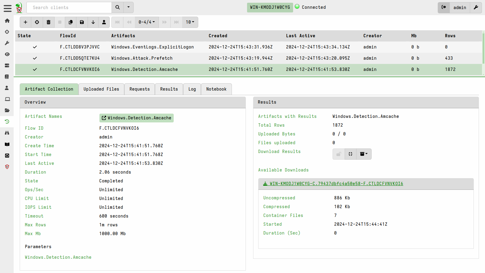

A page for testing and previewing the presentation of common content
components.

---

* [Admonitions](#admonitions)
* [Images](#images)
  * [Raster types](#raster-types)
  * [SVG](#svg)
  * [Fontawesome Icons](#fontawesome-icons)
* [Explicit Links](#explicit-links)
* [Implicit Links](#implicit-links)
* [Headings](#headings)
* [Level 1 Heading](#level-1-heading)
* [Level 2 Heading](#level-2-heading)
  * [Level 3 Heading](#level-3-heading)
      * [Level 4 Heading](#level-4-heading)
        * [Level 5 Heading](#level-5-heading)
            * [Level 6 Heading](#level-6-heading)
* [Emphasis (Bold and Italic)](#emphasis-bold-and-italic)
* [Lists](#lists)
  * [Unordered:](#unordered)
  * [Ordered:](#ordered)
* [Blockquotes](#blockquotes)
* [Inline Code and Code Blocks](#inline-code-and-code-blocks)
            * [VQL example](#vql-example)
            * [Python example](#python-example)
* [Horizontal Rules](#horizontal-rules)
* [Escaping Characters](#escaping-characters)

---

## Admonitions

Currently we support 4 admonition types: `note`, `tip`, `info`,
`warning`.

Admonition titles are optional but recommended.

{}
Notebooks contain cells which help the user to evaluate VQL queries
**on the server**. Remember that notebook queries always run on the
server and not on the original client. This post-processing query will
parse the prefetch files on the server itself.
{}

{}
In a secure installation you should remove the **CA.private_key**
section from the server config and keep it offline. You only need it
to create new API keys using the *velociraptor config api_client*
command, and the server does not need it in normal operations.
{}

{}
It is good practice to always make a backup copy of your config file
both before upgrading and after upgrading, just in case changes are
made by the upgrade!
{}

{}
The reformatted VQL is **inserted back into the original YAML file**,
replacing the old VQL while preserving the rest of the structure! Make
sure you have backup copies of your artifacts before applying
`reformat` to them, just in case you're dissatisfied with the
resultant formatting.
{}

---

## Images

Images follow the same syntax as links but are prefixed with an
exclamation mark `!`.

### Raster types




An inline PNG

with height < 200px.


### SVG


### Fontawesome Icons

An <i class="fas fa-eye"></i> icon.


## Explicit Links

Here is an [internal link](/vql_reference/encode/) and also an
[external link](https://www.google.com) and a [relative link](../) and
a [link to a file resource](client_config_yaml.svg).

## Implicit Links

https://commonmark.org

user@example.com


## Headings

Headings from level 1 to 6 are supported.


# Level 1 Heading
## Level 2 Heading
### Level 3 Heading
#### Level 4 Heading
##### Level 5 Heading
###### Level 6 Heading


## Emphasis (Bold and Italic)

You can wrap text in asterisks or underscores to add style.

*This text is italicized.* **This text is bold.** ***This text is both bold and italic.***


## Lists

CommonMark supports both ordered (numbered) and unordered (bulleted)
lists.

### Unordered:

* Item A
* Item B
  * Sub-item B1
  * Sub-item B2

### Ordered:

1. First item
2. Second item
3. Third item


## Blockquotes

Blockquotes are used to indicate text quoted from another source.

> "Markdown is a text-to-HTML conversion tool for web writers."
> — John Gruber


## Inline Code and Code Blocks

Use backticks for `inline code` and triple backticks for blocks.

We currently support `browser`, `python`, `yaml`, `sql`, `json`,
`bash`, `powershell`, `vql`, `text`, `shell` syntax highlighting via
the `highlight.js` highlighter.

###### VQL example

```vql
SELECT read_file(path="C:/Windows/notepad.exe", accessor="file")
FROM scope()
```

``````text
```vql
SELECT read_file(path="C:/Windows/notepad.exe", accessor="file")
FROM scope()
```
``````

###### Python example

```python
def hello_world():
    print("Hello, CommonMark!")
```

``````text
```python
def hello_world():
    print("Hello, CommonMark!")
```
``````


## Horizontal Rules

You can create a thematic break using three or more hyphens,
asterisks, or underscores.

---

This is the next paragraph.

***


## Escaping Characters

If you want to show a literal character that would otherwise be
interpreted as Markdown syntax, use a backslash `\`.

\*This is not italic\*


