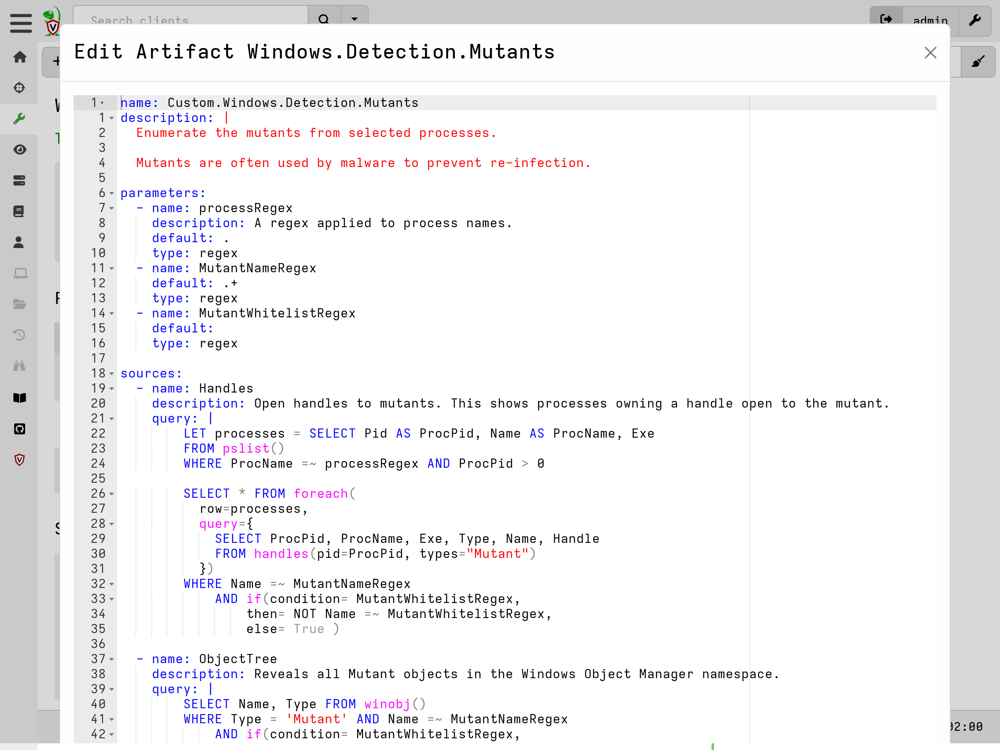
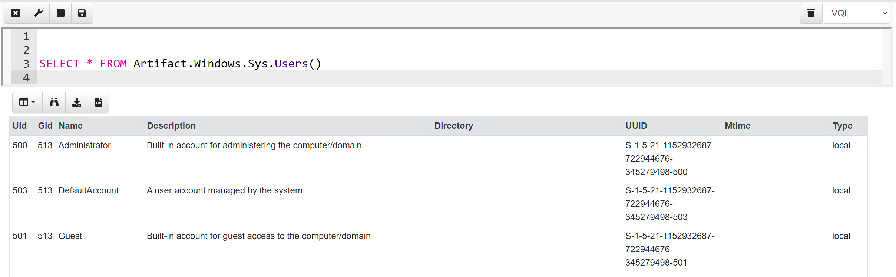

## What are Artifacts?

At it's core Velociraptor is simply a VQL engine . That is, it processes a VQL
query producing a series of rows and sends those rows to the server.

An **Artifact** is a way to package one or more VQL queries and related data in
a human readable YAML file, give it a name, and allow users to collect it. An
Artifact file encapsulates one or more queries to collect data or answer a
specific question about the endpoint.

Artifacts can be thought of as VQL "modules". By encapsulating a VQL query
inside a YAML file, users do not need to understand the query to use it. This
facilitates knowledge sharing with more experienced users.

### A Basic Example

Usually an artifact is geared towards collecting a single type of information
from the endpoint.

For example consider the following artifact:

```yaml
name: Custom.Artifact.Name
description: |
   This is the human readable description of the artifact.

type: CLIENT

parameters:
   - name: FirstParameter
     default: Default Value of first parameter

precondition: ""

sources:
  - name: MySource
    precondition:
      SELECT OS From info() where OS = 'windows' OR OS = 'linux' OR OS = 'darwin'

    query: |
      SELECT * FROM info()
      LIMIT 10
```

The Artifact contains a number of important YAML fields:

1. **Name**: The artifact contains a name. By convention the name is
   segmented by dots in a hierarchy. The Name appears in the GUI and
   can be searched on.
2. **Description**: Artifacts contain a human readable description. The
   description field is also searchable in the GUI and so should
   contain relevant keywords that make the artifact more discoverable.
3. **Type**: The type of the Artifact. Since Velociraptor uses VQL in many
   different contexts, the type of the artifact hints to the GUI where
   the artifact is meant to run. For example, a CLIENT artifact is
   meant to be run on the endpoint, while a SERVER artifact is meant
   to be run on the server. The artifact type is only relevant for the
   GUI.
4. **Parameters**: An artifact may declare parameters, in which case they
   may be set by the GUI user to customize the artifact collection.
5. **Sources**: The artifact may define a number of VQL sources to
   generate result tables. Each source generates a single table. If
   more than one source is given, they must all have unique names.
6. **Precondition**: A source may define a precondition query. This query
   will be run prior to collecting the source. If it returns no rows
   then the collection will be skipped. Preconditions make it safe to
   collect artifacts from all hosts (e.g. in a hunt), and ensure that
   only artifacts that make sense to collect are actually run.
7. **Query**: The query that will be used to collect that source. Note
   that since each source **must** produce a single table, the query
   should have exactly one `SELECT` clause and it must be at the end
   of the query potentially following any `LET` queries.

## Parameters

Artifact parameters allow the user to customize the collection in a
controlled way - without needing to edit the VQL. The GUI will present
a form that allows the user to update the parameters prior to each
collection.

Parameters may define a type. This type will be used to hint to the
GUI how to render the form element. The type also determines how the
parameter is sent to the client and ensures the parameter appears as
that type in the query.

Prior to launching the query on the endpoint, Velociraptor will
populate the scope with the parameters. This allows the VQL query to
directly access the parameters.

Artifact parameters are sent to the client as strings The client
automatically parses them into a VQL type depending on the parameter's
type specification.  The GUI uses type specification to render an
appropriate UI

### Parameter types

Currently the following parameter types are supported

* **int, integer**: The parameter is an integer
* **timestamp**: The parameter is a timestamp
* **csv**: Parameter appears as a list of dicts formatted as a CSV
* **json**: Parameter is a JSON encoded dict
* **json_array**: The parameter is a list of dicts encoded as a JSON blob (similar to csv)
* **bool**: The parameter is a boolean (TRUE/YES/Y/OK)

### A More Advanced Example

Let's take a look at a typical artifact `Windows.Detection.Mutants`.



This artifact uncovers the mutants (named mutexes) on a system, using
two methods. First we enumerate all handles, and check which process
is holding a handle to a mutant object. Alternatively we enumerate the
kernel object manager to receive the same information.

Therefore this artifact contains two sources - each gets similar
information in a different way. A user who is just interested in
listing the Mutants on an endpoint would probably need to see both
results.

We also see some parameters declared to allow a user to filter by
process name or mutant name.

## Preconditions and source queries

A precondition is a query that is run before collecting the artifact
to determine if the artifact should be collected at all. The
precondition makes it safe to collect artifacts without needing to
worry about if the artifact is designed for this particular
architecture or operating system. For example, performing a hunt for a
Windows only artifact is safe to target all clients because Linux
clients will just ignore it and return no rows. Most preconditions
target specific operating systems or architectures but the precondition
can be an arbitrary query.

You can specify a precondition at the top level of the artifact or at
each source:

* For a top level precondition, after testing for the precondition,
  the queries from each source are run in series within the same query
  scope. This means you can define a VQL variable in an earlier source
  and use it in another source.
* If the precondition is specified at the source level, the VQL engine
  has no idea if any particular source will be use or not. Therefore
  the engine treats each source as an independent query within its own
  scope. Since sources are independent they will run in parallel and
  any VQL variable defined in one source will not be visible to other
  sources.

## Artifact writing tips

Typically we have a new idea for a new detection. The first step is to
develop the VQL that will detect the anomaly by writing the VQL in a
notebook cell on the target operating system itself (usually we use
`velociraptor gui` to start a new local server).

While developing the VQL, Use the `log()` VQL function librally to
provide print debugging.

Use format(format="%T %v", args=[X, X]) to learn about a value's type
and value.

## Calling artifacts from VQL

You can call other artifacts from your own VQL using the
`Artifact.<artifact name>` plugin notation. Args to the `Artifact()`
plugin are passed as artifact parameters.



When calling artifacts types are not converted. Make sure you pass the
expected types

{}

When collecting an artifact from the client, the server **compiles**
the artifact and it's dependencies into raw VQL statements and sends
these to the client for evaluation. We never rely on the artifact
definitions embedded in the client itself - instead we always send the
compiled VQL to the client. This allows us to upgrade artifact
definitions on the server without needing to update the client itself.

{}
