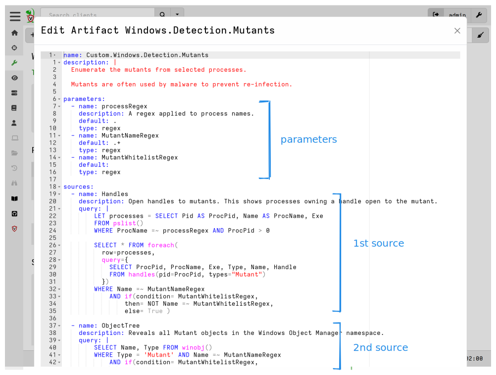

Velociraptor Artifacts are a key component of the platform, providing numerous
benefits for digital forensics and incident response workflows.


## What are Artifacts?

At it's core Velociraptor is simply a VQL engine . It processes a VQL query
producing a series of rows and sends those rows to the server.

Artifacts allow us to package one or more VQL queries and related data into a
human-readable [YAML](https://www.tutorialspoint.com/yaml/yaml_basics.htm) file
which is stored within the Velociraptor server's datastore.

Artifacts are intended to be self-documenting through good descriptions and
well-structured VQL. This allows other users to collect specific information
from endpoints without necessarily needing to understand or remember the queries
and related data encapsulated in the artifact. This approach facilitates
knowledge sharing between users with varying skill levels, within the
Velociraptor community, and the broader DFIR community.

Artifacts can also be directly used within other VQL queries.

Here is the basic structure of a simple artifact:


{}

Don't confuse Velociraptor Artifacts with forensic artifacts! Although they are
historically somewhat related, and there is also a correspondence in the sense
that Velociraptor Artifacts usually (but don't have to) target specific
information sources on endpoints which are traditionally described as
["forensic artifacts"](https://github.com/ForensicArtifacts).

{}

## Why use Artifacts instead of just running VQL queries directly?

VQL queries are typically packaged in a type of logical container which we call Artifacts. VQL cannot be run
directly on clients.

The Velociraptor CLI does have the ability to run queries directly using the
[`query` command]()
however in client-server mode VQL queries are always delivered to the client in the
form of artifacts.

When performing a collection against a client, the server _compiles_ the
artifact and it's dependencies into raw VQL statements and sends these to the
client for evaluation. The compiled artifacts do not include comments and
informational fields (such as author, description, or references) since these
server no purpose on the client. This also reduces the risk of artifact
information leakage on a potentially compromised client, as well as reducing the
size of the artifacts sent to the client.

We never rely on the artifact definitions embedded in the client
itself - instead we always send the compiled VQL to the client.

Artifacts are stored and managed on the server. This allows us to centrally
upgrade, customize, or add new artifact definitions without needing to update
the clients.

Here are some of the key benefits of Velociraptor Artifacts:

- **Encapsulation and Reusability**: \
  Artifacts bundle VQL statements and related configurations into a single,
  reusable unit. Once an artifact is written, the user does not need to remember
  or re-enter the query. Artifacts can be
  [called from other VQL queries]()
  as if they were [standard plugins](),
  encouraging the development of reusable components that can be combined like
  Lego bricks.

- **Sharing and Community Collaboration**: \
  By encapsulating one or more VQL queries inside a YAML file, users
  do not need to understand the query itself in order to use it. This
  facilitates knowledge sharing between users with varying skill
  levels, as well as documenting and sharing knowledge about forensic
  evidence amongst experts.  Platforms like the [Velociraptor Artifact
  Exchange]() exist for this purpose, promoting
  knowledge sharing and code reusability within the Velociraptor and
  broader DFIR community.

- **Extending Velociraptor Functionality**: \
  Artifacts offer a powerful way to extend Velociraptor's capabilities. They can
  wrap external tools like PowerShell scripts or other binaries, thus making
  them callable through VQL. This allows us to rapidly add new features and
  adapt to different systems or file formats rapidly, without requiring source
  code changes, rebuilding, or redeploying the Velociraptor client or server
  binaries.

- **Discoverability and Ease of Use**: \
  Artifacts abstract the underlying complexity, allowing users to run powerful
  queries or external tools simply by calling the artifact by name, often with
  configurable parameters. Artifacts that have clear names and descriptions are
  easier to find within the GUI, and easier for other users to understand. The
  Artifact collection and Hunt creation workflows provides a user-friendly
  interface to find, view and launch them.

- **Targeted and Efficient Collection**: \
  While artifacts can collect files, they are central to Velociraptor's
  philosophy of performing processing directly on the endpoint and returning
  only targeted, high-value results, rather than collecting bulk data for
  offline analysis. This distributed processing approach contributes
  significantly to Velociraptor's scalability.

- **Parameterization**: \
  Artifacts can declare parameters, allowing users to customize how the
  underlying VQL query runs directly from the GUI or when called from other VQL.

- **Operational Safety and Standardization**: \
  Artifact sources can define preconditions – VQL queries that run first to
  determine if the main query is relevant or safe to execute on a specific
  endpoint. If the precondition returns no rows, the source's collection is
  skipped. This makes it safe to deploy hunts involving numerous diverse
  artifacts across an entire fleet. In addition, artifacts serve as a
  foundational unit for testing and quality assurance.

- **Integration of External Tools**: \
  Artifacts provide a structured way to declare dependencies on external
  binaries. Velociraptor handles the logic to ensure these tools are uploaded to
  the endpoint, updated when necessary, and cached for efficiency.

- **Support for Dead Disk Analysis**: \
  Artifacts written for live endpoint analysis can often be reused without
  modification to analyze dead disk images by utilizing Velociraptor's accessor
  remapping feature. This allows leveraging the same powerful analysis logic in
  different contexts.

- **Modular Workflow Creation**: \
  By encapsulating VQL queries, artifacts serve as building blocks that can be
  combined to create custom incident response workflows directly using VQL on
  the server.

### A Simple Example

Usually an artifact is geared towards collecting a single type of information
from the endpoint.

For example consider the following artifact:

```yaml
name: Custom.Artifact.Name
description: |
   This is the human readable description of the artifact.

type: CLIENT

parameters:
   - name: FirstParameter
     default: Default Value of first parameter

sources:
  - name: MySource
    precondition:
      SELECT OS From info() where OS = 'windows' OR OS = 'linux' OR OS = 'darwin'

    query: |
      SELECT * FROM info()
      LIMIT 10
```

The Artifact contains a number of important YAML fields:

1. **Name**: The artifact contains a name. By convention the name is
   segmented by dots in a hierarchy. The Name appears in the GUI and
   can be searched on.
2. **Description**: Artifacts contain a human readable description. The
   description field is also searchable in the GUI and so should
   contain relevant keywords that make the artifact more discoverable.
3. **Type**: The type of the Artifact. Since Velociraptor uses VQL in many
   different contexts, the type of the artifact hints to the GUI where
   the artifact is meant to run. For example, a CLIENT artifact is
   meant to be run on the endpoint, while a SERVER artifact is meant
   to be run on the server. The artifact type is only relevant for the
   GUI.
4. **Parameters**: An artifact may declare parameters, in which case they
   may be set by the GUI user to customize the artifact collection.
5. **Sources**: The artifact may define a number of VQL sources to
   generate result tables. Each source generates a single table. If
   more than one source is given, they must all have unique names.
6. **Precondition**: A source may define a precondition query. This query
   will be run prior to collecting the source. If it returns no rows
   then the collection will be skipped. Preconditions make it safe to
   collect artifacts from all hosts (e.g. in a hunt), and ensure that
   only artifacts that make sense to collect are actually run.
7. **Query**: The query that will be used to collect that source. Note
   that since each source **must** produce a single table, the query
   should have exactly one `SELECT` clause and it must be at the end
   of the query potentially following any `LET` queries.

These and other artifact fields are discussed in more detail in the pages of
this section. The order of fields does not matter.

### A More Advanced Example

Let's take a look at a more typical artifact named `Windows.Detection.Mutants` -
one of Velociraptor's 400+ built-in artifacts.



This artifact uncovers the mutants (a.k.a mutexes) on a system, using
two methods:
1. First we enumerate all handles, and check which process is holding a handle to
   a mutant object.
2. Alternatively we enumerate the kernel object manager to receive the same
   information.

Therefore this artifact contains two sources - each gets similar
information in a different way. A user who is just interested in
listing the Mutants on an endpoint would probably need to see both
results.

We also see some parameters declared to allow a user to filter by
process name or mutant name.


## Loading, importing, and saving artifacts

Velociraptor ships with hundreds of built-in artifacts which are compiled into
the binary itself.

You can use the
[`artifacts` CLI command](), the
[Artifacts screen in the GUI](), or
[VQL's `artifact_definitions()` plugin]()
to list and examine these artifacts.

When Velociraptor is run, its built-in artifacts are read directly from the
binary and are not written to disk. Only custom artifacts are written to disk,
and these are written to the `artifact_definitions` directory in the server's
datastore.

### Loading artifacts at startup

The default location for custom artifacts is the server's datastore. This is the
location used when artifacts are
[imported, created or edited during runtime]().

- For the root org's artifact repository this is: `<datastore>/artifact_definitions`

- For [other orgs](), each org has its own
artifact repository: `<datastore>/orgs/<org_id>/artifact_definitions`

The server's datastore location is specified by the
`Frontend.Datastore.location` key in the
[config]().

In addition to the default location, other artifact sources can be specified
that Velociraptor should try to load artifacts from. The following config keys
provide for additional artifact sources:

- `autoexec.artifact_definitions`: artifact definitions embedded in the config.
- `Frontend.artifact_definitions_directory`: a single directory.
- `defaults.artifact_definitions_directories`: a list of directories.

If you are running the server manually in a terminal, you can use the
`--definitions` CLI flag to specify an additional location.

Velociraptor will search these locations recursively for any `.yaml` or `.yml`
files and try to parse them as artifacts.

{}

When installed as a service, Velociraptor's datastore directory is owned by the
service account named `velociraptor` and accessible to the `velociraptor` user
group. New users often overlook this fact and create files in the datastore
using their own user account or the `root` account, which means that the
Velociraptor service cannot read them.

Working directly with artifact files in the datastore is discouraged, but if you
need to do this you can avoid creating permissions problems by switching to the
`velociraptor` user. On most Linux systems this can be done with the command
`sudo -u velociraptor bash`.

For other files that the service account needs to read, such as the additional
artifact definitions directories mentioned above, you need to ensure that the
`velociraptor` user has read access to these directories.

{}


### Built-in vs. Compiled-in vs. Custom Artifacts

Artifacts loaded from the binary, or

- embedded in the config's `autoexec.artifact_definitions` section, or
- from a directory specified by the `Frontend.artifact_definitions_directory`
  config setting, or
- from additional directories specified by the
  `defaults.artifact_definitions_directories` config setting, or
- from a directory specified by the `--definitions` CLI flag

are deemed "built-in" and they cannot be modified during runtime. Any changes to
the artifacts in those locations will not be effective without a server restart.

To summarize:

| Loaded from                                         | considered <br>built-in? | considered <br>compiled-in? |
|:----------------------------------------------------|:------------------------:|:---------------------------:|
| compiled into binary                                |           yes            |             yes             |
| config: `autoexec.artifact_definitions`             |           yes            |             no              |
| config: `Frontend.artifact_definitions_directory`   |           yes            |             no              |
| config: `defaults.artifact_definitions_directories` |           yes            |             no              |
| `--definitions` CLI flag                            |           yes            |             no              |

When you attempt to edit a built-in artifact in the GUI, you are actually
creating a customized _copy_ of that artifact.

Attempting to edit any **compiled-in** artifact in the GUI will result in a copy
being created with the `Custom.` prefix added to the name.

Attempting to edit any **built-in** artifact in the GUI will create a copy but
you'll need to ensure that you choose a new name for it.

You can run the following VQL query in a notebook to see how a particular
artifact has been classified by the server:

```vql
SELECT name, built_in, compiled_in FROM artifact_definitions()
WHERE name =~ "Artifact.Name"
```

Artifacts loaded from the external sources listed above are able to override
artifacts included in the binary.

For custom artifacts loaded from the server's datastore, the name must be unique
and not conflict with the names of the artifacts included in the binary. If
there is a name conflict then the custom version will be ignored.

When multiple external sources are specified which contain artifacts with the
same name, then this is the order of precedence that applies (lowest number
wins):

1. config: `autoexec.artifact_definitions`
2. `--definitions` CLI flag
3. config: `defaults.artifact_definitions_directories`
4. config: `Frontend.artifact_definitions_directory`
5. compiled into binary

This is similar to the artifact masking which occurs for orgs, which we describe
[here]().

Artifacts which are not assigned the built-in designation are considered
**custom**. In the GUI's artifact screen these artifacts are shown with the
<i class="fa-solid fa-user-pen"></i> icon.

### Importing / creating, editing, and deleting artifacts at runtime

Now that you know where artifacts are loaded from when the server starts, you
might be wondering: how you create new artifacts in Velociraptor? There are
several ways...

In the GUI, as explained in more detail [here](),
the available methods are:

- creating or editing an artifact [using the artifact editor]()

- importing [artifact packs]()

- importing artifacts [using server import artifacts]()

In VQL we can create artifacts using the
[artifact_set()]() function,
and delete them using the
[artifact_delete()]() function.


All artifacts created during runtime are saved to the `artifact_definitions`
directory in the datastore. Artifacts in this location are readable and
writable, which means they can be edited or deleted.

When the server starts it reads all artifacts stored in the
`artifact_definitions` directory and marks these as "custom" (i.e. "not
built-in). In the GUI's artifact previews these artifacts are labelled with
"Custom Artifact". Note that the artifact name does not need to start with the
word "Custom" - it's just a helpful convention to use.


## Orgs, artifact inheritance, and masking

If you use Velociraptor's [orgs]()
(multi-tenancy) feature then things can get a little confusing.

The important thing to remember is that the root org serves as a
supervisory org to all tenants. This means the root org can export
custom artifacts to tenants automatically, but a tenant may not modify
those directly (they can create a local copy).

Each org has visibility of all the artifacts in the root org, including custom
artifacts. In the Artifacts screen the built-in artifacts look no different to
how they appear in the root org. And, as explain previously, they can't be
edited or deleted (although custom copies of them can still be made).

Custom artifacts defined in the root org are "inherited" by all
non-root orgs and these artifacts are marked with a <i class="fa-solid
fa-house"></i> icon in the artifact listing on the Artifacts screen to
denote they came from the supervisory root org.


Although custom artifacts created in the root org are visible to non-root orgs,
these artifacts can only be edited or deleted from the root org.

If you create a custom copy of an inherited artifact, and save it using the same
name, the server stores that custom copy in the org's `artifact_definitions`
directory - the artifact in the root org is not altered. The org-specific custom
artifact will then have the <i class="fa-solid fa-user-pen"></i> icon.


What this means, in practical terms, is that the org-specific artifact is
_masking_ the original artifact on which it was (or maybe wasn't!) based. If you
perform a collection of that artifact then the org-specific copy will be used.

If you delete the org-specific copy in the GUI then you will see the icon revert
to the <i class="fa-solid fa-house"></i> icon. That is, the masking has been
reversed and you can once again see the root org's artifact.

This allows users in different orgs to create artifacts with the same names that
possibly do very different things. The artifact namespaces for orgs are
completely independent.

Custom artifacts created in non-root orgs look and behave exactly the same as
they do in the root org, except that they are not shared or inherited anywhere
outside the org.


## Automatic custom overrides

Velociraptor provides automatic overriding of certain built-in artifacts with
custom versions. That is, certain artifacts beginning with the prefix `Custom.`
will, under specific circumstances, override their built-in equivalents to allow
for customization.

**Custom.Generic.Client.Info**

The built-in artifact `Generic.Client.Info` is used to gather host information
when a client enrolls or on-demand when clicking the
[Interrogate]()
button on the host Overview page in the GUI. If a custom artifact name
`Custom.Generic.Client.Info` exists in the artifact repository then it will be
used instead when clients enroll or are interrogated. This override capability
allows you to create a custom version of the artifact which gathers additional
information and then have it work seamlessly via the GUI. This override
behaviour does _not_ occur when either artifact is collected explicitly.

**Custom.Server.Monitor.Health**

The built-in artifact `Server.Monitor.Health` provides the server dashboard
(also known as the <i class="fa-solid fa-house"></i> **Home** page). The layout
and content of this page is defined in this artifact. If an artifact exists
named `Custom.Server.Monitor.Health` then it will be used instead of the
default.

**Custom.Server.Internal.Welcome**

The built-in artifact `Server.Internal.Welcome` provides the GUI's Welcome
page (what you see if you click on the green dinosaur) and defines the content
and layout of the resulting web page. If you create a customized version named
`Custom.Server.Internal.Welcome` then this will be used instead of the default
artifact.

## What's next?

Learn more about the key concepts for creating, managing and using artifacts.

{}
