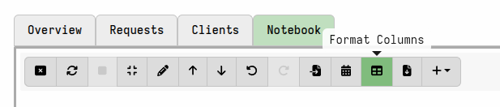

These are less frequently used fields which deal with more advanced artifact
functionality.

### Summary

| Field Name         | Description                               |
|--------------------|-------------------------------------------|
| [column_types]() | Defines specific GUI formatting for selected results columns. | No | sequence |
| [precondition]() | A VQL expression to be evaluated prior to using this artifact. |
| [export]() | VQL that this artifact exports to other artifacts. |
| [imports]() | A list of other artifacts with exported VQL to be used in this artifact. |
| [resources]() | Resource limits that apply when the artifact is collected. |
| [tools]() | Tools are external files that Velociraptor ensures are available to the artifact. |
| [impersonate]() | Run the artifact as a different user. |
| [implied_permissions]() | Projected permissions which the artifact will use on the client. |
| [required_permissions]() | A list of permissions required to collect this artifact. |
| [reports]() | A list of reports to potentially post-process this artifact. (deprecated) |

{}

Due to YAML keys being case-sensitive (the fields "Name" and "name" would be
treated as different keys in a YAML document), all artifact field names are
case-sensitive and, by convention, also lowercase.

{}


## Fields

---

### [ column_types ]

The `column_types` field allows you to customize how specific columns (i.e.
fields returned by a queries in an artifact) are displayed in the artifact's
results tables in the GUI. That is, this field allows you to define formatting
for specific columns that are returned by the artifact.

This is not mandatory but helps the GUI understand the data better, allowing it
to render types like timestamps appropriately or display binary data with a hex
viewer if the column type is specified as binary.

If the column type is not specified for a particular field then Velociraptor
will try to infer or guess the appropriate display format based on the data
in the first row of the query results.

It is particularly important to specify the column types if your artifact might
produce rows with varying fields, because the GUI could potentially omit or
incorrectly display columns if they don't appear in the initial rows returned.

In the GUI you can override the column types using the "Format Columns" button
in a notebook. This is also a good way to test column types while you are
developing your artifact.



`column_types` is a YAML sequence (list) and supports the following subfields:

- `name`: the column name to apply the formatting to.
- `type`: one of the allowed formatting types (see below).
- `description` (optional): freeform text description.

**Example:**

```yaml
column_types:
  - name: ChildrenTree
    type: tree
```

**Formatting types**

These are the types currently supported:

- string
- number
- mb
- timestamp
- nobreak
- tree
- url
- url_internal
- safe_url
- flow
- preview_upload
- download
- client
- hex
- base64
- collapsed


---

### [ precondition ]

A VQL query to be evaluated prior to using this artifact. If the query returns
no rows then the artifact is skipped. If it produces ANY rows then the artifact
will be used.

Preconditions are also supported in `sources`, in addition to the artifact-level
precondition.

See [preconditions]()
for further details of how this field works.


---

### [ export ]

The `export` field allows you to specify a block of VQL which can be imported by
other artifacts (using `imports`, described below).

VQL in this field is run prior to VQL in the `sources` section, and the results
are made available to all sources. This means that such VQL can be used to
define variables, custom functions, or modify parameter values prior to running
each source.

See [export & imports]()
for further details of how this field works.

---

### [ imports ]

The `import` field defines a list of artifacts from which to import their
`export` sections.

The imported VQL is run after the VQL in the `export` section, and before the
VQL in each source.

See [export & imports]()
for further details of how this field works.

---

### [ resources ]

You can define default resource limits directly within the artifact's YAML
definition using the `resources` section. This allows tailoring resource control
per artifact. These defaults are then populated in the GUI when a collection is
created.

When you create a new collection or hunt, you can specify resource limits in the
"Specify Resources" tab. Settings made in the GUI override the limits defined in
the artifact itself.

If you define `resources` in your artifact, you only need to specify the subkeys
relevant to the resources you want to limit. Default values will apply to any
subkeys not specified and, as mentioned above, users still have the opportunity
to override these limits in the GUI before collecting the artifact.

The following resource limit settings are currently available in artifact
definitions:

- `timeout`
- `ops_per_second`
- `cpu_limit`
- `iops_limit`
- `max_rows`
- `max_upload_bytes`
- `max_batch_wait`
- `max_batch_rows`
- `max_batch_rows_buffer`

---

### [ tools ]

A list of third-party tool definitions, which will be used by the artifact.
These can be executables _or any other file_ that the client will need when it
runs the VQL in the artifact's sources.

Tools can be defined within an artifact or, alternatively, by using the
`inventory_add` VQL function.

The inventory service is responsible for managing tools within Velociraptor
artifacts. The inventory stores information about the various third-party tools
known to Velociraptor. You can view this tool information by running the
following query in a notebook.

```vql
SELECT * FROM inventory()
```

A tool is uniquely identified by its `name` and `version`.

If the full tool definition is provided in another artifact, or has been defined
via VQL, and therefore already known to the server, then you may only need to
provide the tool's name and optionally its version in subsequent artifact
definitions.

A tool may be served by Velociraptor itself, or from an external URL. This
decision is configured by the `serve_url` setting..

Previously used tools are cached on the client. Before using a cached tool, the
client verifies that the hash is still as expected (as provided by the server).
If the hash verification fails then the client will download a new copy, and
again verify the hash.

These are the subfields available for defining each tool:

- `name`: The unique identifier for this tool
- `version`: Specify a version for the tool. This allows multiple versions of
  the same tool to be used.
- `url`: The URL to fetch the tool from when we download it the first time, or
  when we update it.
- `serve_locally`: If set, the tool will be served locally from the server -
  otherwise the endpoint will download the file by itself from the url above.
  The URL for the client to download the tool from is generated using the config
  setting `Client.server_urls` on the server. Currently only the first URL from
  `server_urls` is used, and tools are only served over HTTPS (not WSS).
- `github_project`: As an alternative to a url we allow scraping of GitHub
  releases using the github API. When this method is specified, the file will
  always be served locally.
- `github_asset_regex`: A regex to select a specific file from the available
  GitHub releases.
- `expected_hash`: Hex encoded sha256 hash of the expected hash of the file.
  When the server downloads the file it will check it against the expected hash
  and refuse to store or serve a file with an incorrect hash.  This is a way to
  pin the dependency into the artifact definition to protect against supply side
  attacks.

**Examples:**

```yaml
tools:
  - name: VelociraptorWindows
    url: https://github.com/Velocidex/velociraptor/releases/download/v0.74/velociraptor-v0.74.3-windows-amd64.exe
    serve_locally: true
    version: 0.74.3
```
Will download the specified binary, store it tagged with the specified version
number, and serve it to clients from the Velociraptor server.


```yaml
tools:
  - name: OSQueryWindows
    github_project: Velocidex/OSQuery-Releases
    github_asset_regex: windows-amd64.exe
```
Clients will download the binary matching the `github_asset_regex` directly from
the GitHub repo, since `serve_locally` is not specified.

Usually tools are used together with the built-in `Generic.Utils.FetchBinary`
helper artifact. This artifact ensures that the defined tools are downloaded to
the endpoint, if required, and performs other housekeeping functions. While
using this artifact is highly recommended, it is not mandatory. When an artifact
contains tool definitions, the following variables are added to the scope for
each tool, which allow you to perform your own tool selection logic, downloads
(for example using `http_client`), and hash verification:

- `Tool_<name>_HASH`
- `Tool_<name>_FILENAME`
- `Tool_<name>_URL`

The `Generic.Utils.FetchBinary` artifact makes use of these variables when
provisioning the tool on the client.

{}

The setting described above are simply the initial defaults that are
added to the inventory service when the artifact is first seen. These
settings can be modified by an administrator in the tool setup
screen. For example, the administrator may decide to serve the tool
from a different URL with a different hash.

The administrator configuration always overrides the settings in the
artifact definition.

{}

---

### [ impersonate ]

For scenarios where you need to allow lower-privileged users to perform specific
tasks that typically require higher permissions (like `EXECVE` for quarantine
actions), the `impersonate` directive allows users with limited permissions
(e.g., `COLLECT_BASIC`) to launch the artifact, which then executes the
privileged actions under the impersonated user's authority, effectively granting
permission only for that specific artifact's operation. This provides a way to
safely delegate specific higher-privilege tasks without granting the launching
user broad permissions like `EXECVE` which could provide full server shell
access. You can also mark the artifact as "basic" using
`artifact_set_metadata()` to allow users with `COLLECT_BASIC` permission to see
and collect it.

This is similar to the Unix suid mechanism or the Windows impersonation
mechanism in that it allows artifact writers to craft a curated set of powerful
artifacts that can be run by low privileged users in a controlled way.

See [Artifact Security]()
for more information.


---

### [ required_permissions ]

Specifies a list of permissions that a user must possess before the server will
allow them to schedule or collect the artifact. This check is performed by the
server when a user attempts to launch an individual collection or hunt that
includes the artifact.

The purpose of `required_permissions` is to restrict access to artifacts
that can perform sensitive or potentially dangerous operations. Artifact authors
determine which artifacts require additional permissions and add this field
accordingly. For instance, artifacts that allow running arbitrary commands on an
endpoint often require the `EXECVE` permission. Users who lack the required
permissions cannot launch the collection of that artifact. This helps in
enforcing a least privilege model by preventing users with lower roles, such as
Investigator, from running potentially harmful artifacts if they do not have the
necessary permissions.

It's important to note that the `required_permissions` check is only performed on
the artifact being launched. It does not apply to any dependent artifacts that
the launched artifact might call. This design is deliberate, allowing
administrators to create "wrapper artifacts" or curated versions of dangerous
artifacts that can be used safely by lower-privilege users.

A user with the `ARTIFACT_WRITER` permission can modify the artifact definition
itself. This capability allows them to potentially bypass the
required_permissions model by removing or changing the required permissions on
the artifact.

For more information see the
[Artifact Security]()
and
[Roles and Permissions]()
sections.

---

### [ implied_permissions ]

A list of permissions implied by this artifact. This is used by the artifact
writer to declare what additional permissions the artifact provides on the
client, which may be beyond the permissions which the user has on the server.

On the client, artifacts do not run with ACL enforced, therefore they
can do anything, including actions which the user launching the
artifact does not have permissions for.  For example, the user may
have the investigator role which does not have `EXECVE`. However, when
launching this artifact on the client, the artifact will be able to
run actions requiring the `EXEVE` permission (because there is no ACL
enforcement on the client).

Therefore we say this artifact implies the user has `EXECVE` - this is safe if
the artifact takes steps to ensure the user does not have arbitrary control over
what to execute, for example, if the artifact launches a tool with restricted
command line args.

This field is only used by the [static analysis engine]() to ensure that the implied
permission is properly controlled. It represents a promise by the
artifact writer that this additional permission is safely handled
within this artifact.

---

### [ reports ]

Historically this artifact section contained templates that were used to produce
HTML reports. Reports have been deprecated in favor of
[notebooks](),
however this is still used by some internal artifacts.
