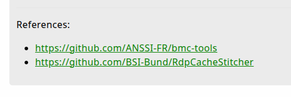

Understanding the most commonly used artifact fields is crucial for working with
artifacts. These are the ones you really need to know about. This page outlines
the most commonly used top-level artifact fields and explains how to use them.

Less frequently used fields that deal with more advanced functionality are
described separately [here]().

### Summary

These fields are the basic building blocks of most artifacts.

| Field Name         | Description                               | GUI Searchable? | YAML Data Type |
|--------------------|-------------------------------------------|:---------------:|:--------------:|
| [name]() | Artifact's unique identifier. _Required_ | Yes | string |
| [aliases]() | Allows for multiple names to be used for the same artifact. | Yes | sequence |
| [type]() | Artifact category (e.g. CLIENT or SERVER). | Filterable | string |
| [description]() | Prose describing the artifact’s purpose and usage. | Yes | string |
| [author]() | Records the artifact's author(s). | No | string |
| [reference]() | Links to external resources or further information. | No | sequence |
| [parameters]() | User-definable parameters to be provided to the artifact. | No | sequence |
| [sources]() | Defines how the artifact produces data. | No | sequence |


{}

Due to YAML keys being case-sensitive (the fields "Name" and "name" would be
treated as different keys in a YAML document), all artifact field names are
case-sensitive, and by convention also lowercase.

{}

## Artifact Identity Fields

These fields identify and characterize the artifact.

---

### [ name ]

The only field that is required for an artifact is its `name`. Of course we will
usually want our artifacts to have more than just a name, although there are
[special cases]()
where not much else is required.

Artifact names must be unique within the org's
[artifact namespace]().

#### Naming rules

1. The artifact's name can only consist of alphabetic characters (upper or
   lowercase), digits, and the characters `_` (underscore) and `.` (dot).

2. The name cannot contain `-`, spaces, or any other special characters.

3. In addition, the artifact name and the parts of an artifacts name (which are
   separated by a `.`) must start with an alphabetic character.

#### Naming conventions

As you'll see, most of the current artifacts tend to use CamelCase, although
this is just a convention that has developed organically. You are free to use
your own naming convention for your own artifacts.

By default when you create a new artifact in the [artifact editor](), it will
add the prefix `Custom.` to the name. This convention is usually helpful, but
if you choose not to use it then that's fine too.
If you [filter for custom artifacts]()
on the Artifacts screen, then you will still see all the custom ones regardless
of their name.

Artifacts imported from the [Artifact Exchange]() or
[other sources]()
may, by default, have a prefix added to their names. But again this is
completely optional (it's implemented through the import artifact's VQL actually
and configurable by an artifact parameter), and all imported artifacts are
internally marked as being custom artifacts anyway.

#### How artifact names translate to file and folder structure on disk

Each artifact is stored as a YAML file on disk in the datastore folder. The
`root` org's custom artifacts are stored in the folder `artifact_definitions` in the
root of the datastore. Custom artifacts for orgs are stored in their own
`artifact_definitions` folder, which exists for each org that you create.

For example, with the following 3 artifacts...

```text
Custom.Artifact.Name
Custom.Windows.LastUser
Lab01.MyArtifact
```

we will have the following file and folders in the `artifact_definitions`
directory on disk:

```text
artifact_definitions
├── Custom
│   ├── Artifact
│   │   └── Name.yaml
│   └── Windows
│       └── LastUser.yaml
└── Lab01
    └── MyArtifact.yaml
```

When reading artifact YAML files from disk, for example when using the
`--definitions` CLI flag or when using `artifact_definitions_directory` in the
config, then the folder structure and file names don't matter - Velociraptor
will read all *.yaml (or .yml) files, parse them, and get the artifact name from
the `name` field. However if you edit such artifacts in the GUI and then save
them, then the saved copy will be stored in the datastore using the structure as
described above.

The name is case-sensitive. That is `Custom.MyArtifact` and `custom.myartifact`
will be saved as 2 distinct artifacts on disk and will appear separately in the
GUI.

The `name` field _is_ searched when using the search filter on the Artifacts
screen.

---

### [ aliases ]

Aliases are other names by which the same artifact is known.

For example, if we have an artifact named `Generic.Detection.Yara.Glob` which
can be used on any platform, then we might like to have an alias for each
platform so that this artifact will be included in the results when anyone does
a search for "Windows.Detection.*".

Aliases occupy the same artifact namespace as the `name` field. This means that
aliases cannot conflict with names of existing artifacts or other aliases. Each
alias must be a unique name.

```yaml
name: Generic.Detection.Yara.Glob

aliases:
  - Windows.Detection.Yara.Glob
  - Linux.Detection.Yara.Glob
  - MacOS.Detection.Yara.Glob
```

The above example will show as 4 separate artifacts in the Artifacts screen.
Selecting one of the aliases and editing it will edit the single underlying
artifact. Only the original named artifact is saved on disk.

This field is a [YAML sequence](https://www.tutorialspoint.com/yaml/yaml_sequence_styles.htm)
(list) because an artifact can have several aliases.

The `aliases` field _is_ searched when using the search filter on the Artifacts
screen.

---

### [ type ]

The artifact `type` field is mainly used to determine where the artifact can be
used in the GUI, with the exception of the `INTERNAL` type.

This field categorizes the artifact into one of the six available types:

- The `CLIENT` type is the most commonly used. This is also the default type if
  the field is not specified. Artifacts of this type can be collected on clients.

- The `CLIENT_EVENT` type establishes client [event queues]() on the server, and then also includes VQL
  which is sent to the client to generate data that will be sent to the
  associated client event queue.

- The `SERVER` type is mainly used for server-side administrative tasks, for
  example:
  - creating new orgs
  - importing artifacts from external sources
  - pruning old clients and cleaning up associated data that's taking up space
    on disk.

- The `SERVER_EVENT` type establishes server [event queues]()
  Typically artifacts of this type also contain VQL to process and act upon
  events arriving in the associated event queue.

- The `INTERNAL` type is generally only used for system event queues (for
  example, for master/minion communications), and is rarely used for custom
  artifacts. This type of artifact is similar to the `SERVER_EVENT` type but the
  data not written to disk to ensure maximum performance at the cost of data
  permanence. This artifact type is still visible to users since there are some
  situations where there's a need to monitor the associated queues and the
  visibility of the associated artifacts advertises their existence. Most such
  artifacts have the word
  "Internal" [in their name]().

- The `NOTEBOOK` type is a relatively recent development. Artifacts of this type
  are also called [Notebook Templates](),
  and are used when creating new global notebooks. As with the other artifact
  types these also support parameter, imports, exports, tools, etc.

Although the value of the `type` field is not case-sensitive, for historical
reasons most artifacts use uppercase for the field's value, but this is not
a requirement.

All artifact types (with the exception of the `INTERNAL` type) are available as
[search filters]()
on the Artifacts screen.

Artifacts are hidden from the artifact selection lists in the GUI if they have
[no `sources`]().
This is to prevent users from running artifacts that will not return any data,
and avoid the confusion which might arise if these were selectable in the
artifact selection lists.

---

## Informational fields

There are a few informational fields that are used to hold descriptive
"metadata" about the artifact. Because these fields are purely for human
consumption they are all optional, but still highly recommended as they allow
other users to understand the purpose, usage, and origin of the artifact. For
artifacts shared with the community it is helpful to be able to contact an
artifact's author to report bugs or discuss issues.

---

### [ description ]

The `description` field is used to include prose describing the purpose of the
artifact and any other usage information that might need to be brought to the
attention of users.

This field supports most [CommonMark Markdown](https://commonmark.org/help/)
formatting, for example headings, bold/italic text, lists, tables, etc. However
when rendering the markdown some sanitization is applied for security reasons,
so it's possible that not all markdown elements will be rendered in the GUI.

The `description` field _is_ searched when using the search filter on the
Artifacts screen.

See [Artifact Writing Tips]()
for some suggestions on writing good descriptions for your artifacts.

---

### [ author ]

The author field allows for a single string in which you can put your name,
company name, social media handle, email address, etc. If you decide to share your
artifact publicly then you should carefully consider what information you want
to include in this field.

The `author` field is _not_ searched when using the search filter on the
Artifacts screen.

---

### [ reference ]

The `reference` field accepts a sequence (list) of one or more strings. These
strings are parsed and displayed as markdown in the GUI, so if you add a raw URI
it will be rendered as a clickable hyperlink.



Since the strings are rendered as markdown, you can also use markdown's link
syntax - `[My Example](https://example.com)` - to make your links prettier.

This field is typically used for links to websites that the artifact author
thinks are helpful or relevant further reading. However you could use the
`reference` field to store other data such as additional contextual information
for each item, or data such as MITRE ATT&CK® ID tags, or [more complex
markdown](https://www.markdownguide.org/basic-syntax/) which can include
headings, paragraphs, tables. But the most common use case for this field is
just simple links to internet resources.

Since the field is a YAML sequence, this is how you would specify it for simple
or complex items:

```yaml
reference:
  - https://golearn.here
  - https://nowgohere.2learn.com - with some **extra** info
  - |
    Items can contain \
    multiline strings \
    too.
```

We also accept the field name `references` (with an 's' on the end) which is
an alias for this field, however `reference` is preferred.

The `reference` field is _not_ searched when using the search filter on the
Artifacts screen.

---

## Parameters and Sources

Parameters and sources (and less frequently also
[imports & exports]()),
are the main components in most artifacts, since these contain the VQL that
produces the data we're interested in.

---

### [ parameters ]

Parameters are essentially VQL variables. That is they are accessible in VQL as
variables, and their data type will correspond to the parameter's type. When
creating a collection against a client or a hunt targeting many clients, users
have the option of customizing the parameters for each artifact.

The `parameters` field is _not_ searched when using the search filter on the
Artifacts screen.

Since parameters are a relatively large topic, we cover them separately in more
detail [here]().

---

### [ sources ]

An artifact may contain one source, several sources, or
[no sources]().

Each source represents a single SELECT statement and potentially multiple LET
statements. Ultimately each source returns a single table of results. If an
artifact wishes to return multiple tables, it should define multiple sources.

The `sources` field is _not_ searched when using the search filter on the
Artifacts screen.

For a more detailed discussion of `sources` see the
[Sources]() section.


