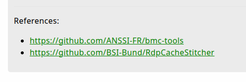

{}

All artifact field names are lowercase. This is due to YAML keys being
case-sensitive, e.g. the fields "Name" and "name" would be treated as different
keys in a YAML document.

{}

### [ name ]

The only field that is required for an artifact is its `name`. Of course we will
usually want our artifacts to have more than just a name, although there are
[special cases]()
where not much else is required.

**How names translate to file and folder structure on disk**

Each artifact is stored as a YAML file on disk in the datastore folder. The
`root` org's custom artifacts are stored in the folder `artifact_definitions` in the
root of the datastore. Custom artifacts for orgs are stored in their own
`artifact_definitions` folders for each org.

For example, with the following 3 artifacts...

```text
Custom.Artifact.Name
Custom.Windows.LastUser
Lab01.MyArtifact
```

we will have the following file and folders in the `artifact_definitions`
directory on disk:

```text
artifact_definitions
├── Custom
│   ├── Artifact
│   │   └── Name.yaml
│   └── Windows
│       └── LastUser.yaml
└── Lab01
    └── MyArtifact.yaml
```

When reading custom artifacts, for example when using the `--definitions` CLI
flag or when using `artifact_definitions_directory` in the config, then the
folder structure and file names don't matter - Velociraptor will read all
*.yaml (or .yml) files and get the artifact name from the `name` field. However
if you edit such artifacts and then save them, the saved copy will be stored in
the datastore using the structure as described above.

**Naming rules**

The artifact's name can only consist of alphabetic characters (upper or
lowercase), digits, and the characters `_` and `.`. The name cannot contain `-`
or any other special characters. In addition, the artifact name and the parts of
an artifacts name (that are separated by `.`) cannot start with a digit.

**Naming conventions**

As you'll see, most of the current artifacts tend to use CamelCase, although
this is just a convention that has developed organically. You are free to use
any other naming convention for your own artifacts.

By default when you create a new artifact in the [artifact editor](), it will
add the prefix `Custom.` to the name. This convention is usually helpful, but
if you choose not to use it then that's fine too.
If you [filter for custom artifacts]()
on the Artifacts screen, then you will still see all the custom ones regardless
of their name.

Artifacts imported from the [Artifact Exchange]() will,
by default, have the prefix `Exchange.` added to them. But again this is
completely optional (it's implemented through the import artifact's VQL
actually), and all imported artifacts are internally marked as being custom
artifacts anyway.

The name is case-sensitive. That is `Custom.MyArtifact` and `custom.myartifact`
will be saved as 2 distinct artifacts on disk and appear separately in the GUI.

The `name` field _is_ searched when using the search filter on the Artifacts
screen.

### [ aliases ]

Aliases are other names by which the same artifact is known.

For example, if we have an artifact named `Generic.Detection.Yara.Glob` which
can be used on any platform, then we might like to have an alias for each
platform so that this artifact will be included in the results if anyone does a
search for "Windows.Detection.*".

```yaml
name: Generic.Detection.Yara.Glob

aliases:
  - Windows.Detection.Yara.Glob
  - Linux.Detection.Yara.Glob
  - MacOS.Detection.Yara.Glob
```

The above example will show as 4 separate artifacts in the Artifacts screen.
Selecting one of the aliases and editing it will edit the single underlying
artifact.

The `aliases` field is a YAML array because an artifact can have several
aliases.

The `aliases` field _is_ searched when using the search filter on the Artifacts
screen.

### [ type ]

Artifact types:

If the artifact `type` field is not specified then it's assumed to be the
default type: `CLIENT`.

The artifact types are also available as [search filters]()
on the Artifacts screen.

## Informational fields

There are a few informational fields that are used to hold descriptive metadata about the
artifact. These fields are purely for human consumption, and therefore all these fields are optional, but the


### [ description ]

The `description` field is used to include prose describing the purpose of the
artifact and any other usage information.

<It's (commonmark) markdown>

<Most markdown elements are supported but not all. The md and html are sanitized.>

The `description` field _is_ searched when using the search filter on the
Artifacts screen.

### [ author ]

The `author` field is _not_ searched when using the search filter on the
Artifacts screen.

### [ reference ]

The `reference` field accepts an array of one or more strings. These strings are
parsed as markdown in the GUI, so if you add a raw URL it will be rendered as a
clickable hyperlink.



Since the strings are rendered as markdown, you can also use markdown's link
syntax - `[My Example](https://example.com)` - to make your links prettier.

This field is typically used for links to websites that the artifact author
thinks are helpful or relevant further reading. However you could use the
`reference` field to store other data such as MITRE ATT&CK® ID tags, or [more
complex markdown](https://www.markdownguide.org/basic-syntax/) such as
paragraphs, or perhaps links plus additional contextual information for each.

Since the field is a YAML array, this is how you would specify it:

```yaml
reference:
  - https://golearn.here
  - https://nowgohere.2learn.com - with some **extra** info
  - |
    And items can contain \
    multiline strings too.
```

The `reference` field is _not_ searched when using the search filter on the
Artifacts screen.