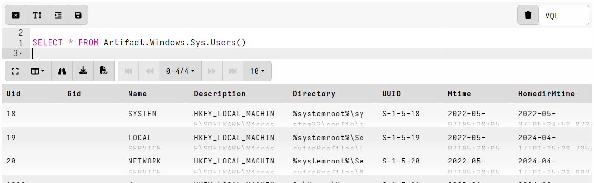

## Calling artifacts from VQL

You can call other artifacts from your own VQL using the
`Artifact.<artifact name>` plugin notation. Args to the `Artifact()`
plugin are passed as artifact parameters.

When calling artifacts, parameter types are not converted. For example if the
called artifact has a parameter named `StartDate`

Some implicit parameters that are always allowed:

- `source` - see Windows.Registry.Sysinternals.Eulacheck
- `preconditions`

		"SELECT * FROM Artifact.ArtifactWithSourcesAndPreconditions()",
		"SELECT * FROM Artifact.ArtifactWithSourcesAndPreconditions(preconditions=TRUE)",

		// Select a specific source.
		"SELECT * FROM Artifact.ArtifactWithSourcesAndPreconditions(source='Source1')",

		// Should return no results as preconditions is false.
		"SELECT * FROM Artifact.ArtifactWithSourcesAndPreconditions(source='Source1', preconditions=TRUE)",

		service.repository/fixtures/plugin_test.go
