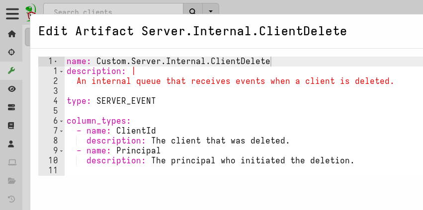
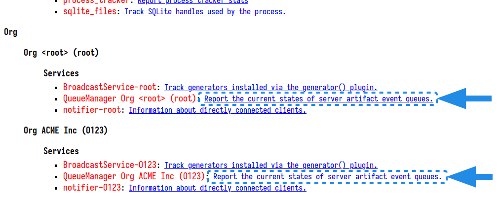

Velociraptor supports stream-based data collection (also referred to as
[Client Monitoring]() and
[Server Monitoring]()
), which means that events are sent in near-realtime rather than being batched,
as occurs with normal collections, and without waiting for collection
completion.

**Event queues** are the internal mechanism that supports this capability.

Event queues are basically like pipes:

- VQL in an artifact generates data (on a client or the server) and sends it to
  the (server-side) queue.
- VQL in a server event artifact (using the `watch_monitoring` plugin) reads the
  data from the queue, and potentially does something with it - for example,
  sends it to an Elastic server.

You can think of event artifacts as having 2 parts:

1. a `name` which establishes the event queue on the server.
2. the rest of the artifact (optional, except in the case of `CLIENT_EVENT`
   artifacts), including VQL in it's `sources` which generates data and sends it
   to the event queue identified by the artifact's `name`.

Artifacts of type `SERVER_EVENT`, `CLIENT_EVENT` or `INTERNAL` establish message
queues on the server. The artifact's name is used as the message queue's name.
This means that such artifacts don't always need to be collected in order to
be useful - _as soon as they are created in the server's artifact repository the
associated message queues are set up_. However, in the case of client event
queues, such artifacts also always contain `sources` which generate messages on
the client, and these messages are forwarded to the corresponding event queue on
the server.




Many internally-generated events are sent to server event queues. For example,
client enrollment events, flow completion events, and server audit events are
each sent to their own queue.

{}

Usually `SERVER_EVENT` and `CLIENT_EVENT` artifacts receive events
from the VQL queries defined in their `sources` section, but this is
not strictly necessary. Events may be sent from anywhere using the VQL
[send_event()]()
function, or via the API. This way it is possible to implement push
notification to inform the server of certain events.

Some events are sent internally by the server to their event queues
(for example `System.Flow.Completion` events are sent when a flow is
completed). In these cases there is no need for VQL queries to be
defined as sources, and therefore some event artifacts do not have
sources defined.

It is still possible to receive events sent to these queues using
`watch_monitoring()`, even though they do not have VQL queries.

{}


## Server event queues

An artifact of type `SERVER_EVENT` establish a server event queue on
the server, using the artifact [name]().

The following are some built-in `SERVER_EVENT` artifacts which only establish
server event queues. You can monitor for events sent to these queues using the
`watch_monitoring()` plugin.

```vql
SELECT name, description FROM artifact_definitions() WHERE NOT sources AND type =~ "server_event"
```

| name | description |
|---|---|
| `Server.Audit.Logs` | This internal event artifact collects relevant audit events from the server. Audit events are significant auditable actions that a user takes, for example, starting a new collection, creating a new hunt, updating an artifact definition etc. |
| `Server.Internal.Alerts` | An internal event queue for alerts. All alerts sent from clients are collected in this event queue. |
| `Server.Internal.ArtifactModification` | This event artifact is an internal event stream over which notifications of artifact modifications are sent. Interested parties can watch for new artifact modification events and rebuild caches etc. |
| `Server.Internal.ClientDelete` | An internal queue that receives events when a client is deleted. |
| `Server.Internal.MetadataModifications` | This event artifact is an internal event stream over which notifications of server metadata modifications are sent. |
| `Server.Internal.TimelineAdd` | This artifact will fire whenever a timeline is added to a super timeline. You can use this to monitor for users adding timelines and forward them to an external timeline system (e.g. TimeSketch) |
| `System.Hunt.Creation` | An event artifact that fires when a user schedules a new hunt. |

### Sending events to server event queues.

To send events to any server event queue you use the
[send_event]() VQL function.

For example, if you set up a server event queue with the following artifact:

```yaml
name: Server.Events.Receive
type: SERVER_EVENT
```

then send an event to it:

```vql
SELECT send_event(row=dict(a=1,b=2,c=3), artifact="Server.Events.Receive") FROM scope()
```

The event should appear in the selected server event queue:


## Internal event queues

Artifacts of type `INTERNAL` establishes a server event queue on the
server using the artifact name. Functionally they are very similar to
the `SERVER_EVENT` artifact type, except that they are intended to
handle internal messaging and are not backed by disk (unlike the
`SERVER_EVENT` type) for performance reasons.

You can't send messages to internal event queues with the `send_event` VQL
function, but you can use the `watch_monitoring` plugin to monitor them for
events.

The following are built-in `INTERNAL` artifacts which only establish server
event queues.

```vql
SELECT name, description FROM artifact_definitions() WHERE NOT sources AND type =~ "internal"
```

| name | description |
|---|---|
| `Server.Internal.ArtifactDescription` |  |
| `Server.Internal.ClientConflict` | This event artifact is an internal event stream receiving events about client conflict.  When two clients attempt to connect to the server with the same client id, the server rejects one of these with a 409 Conflict HTTP message. The client id will be forwarded on this artifact as well so the server may take action. |
| `Server.Internal.ClientInfo` | An internal artifact collecting client information. This is used to update the client info indexes. Client send this automatically at startup and then every day. |
| `Server.Internal.ClientInfoSnapshot` | An internal artifact that fires when the master node writes a new snapshot. Minion use this to trigger a refresh of their client info snapshots. |
| `Server.Internal.ClientPing` | An internal event channel for notifying about client pings. |
| `Server.Internal.ClientScheduled` | This event will be fired when a client was sent flows to process. |
| `Server.Internal.ClientTasks` | This event will be fired when a client has new tasks scheduled. |
| `Server.Internal.Enrollment` | This event artifact is an internal event stream over which client enrollments are sent. You can watch this event queue to be notified on any new clients enrolling for the first time. |
| `Server.Internal.FrontendMetrics` | An internal queue that receives metrics from all frontends. The master Frontend manager service will aggregate these into a combined metric stream. |
| `Server.Internal.HuntModification` | An internal queue to watch modifications of hunts. The hunt dispatcher from all nodes sends this mutation to the hunt manager which applies it. |
| `Server.Internal.HuntUpdate` | An internal queue to notify hunt dispatchers on all minions that a certain hunt has changed and should be updated from the internal cache. |
| `Server.Internal.Interrogation` | This event artifact is an internal event stream over which client interrogations are sent. When the interrogation service finishes updating a client record, it will send an event on this artifact. |
| `Server.Internal.Inventory` | An internal artifact to listen to inventory (tools) changes. |
| `Server.Internal.Label` | An internal artifact used to track new labeling events. |
| `Server.Internal.MasterRegistrations` | The master will advertise to the minions the events it is interested in. |
| `Server.Internal.Notifications` | This event artifact is an internal event stream over which client notifications are sent. A frontend will watch for events over this stream and if a client is actively connected to this frontend, the client will be notified that new work is available to it. |
| `Server.Internal.Ping` | An internal queue for Ping requests. The queue is watched by the replication service on the slave nodes which will notify the target specified. |
| `Server.Internal.Pong` | An internal queue for Ping replies |
| `Server.Internal.UserManager` | An internal artifact notifying when user accounts are modified. |
| `System.Hunt.Participation` | Endpoints may participate in hunts. This artifact collects which hunt each system participated in. |

## Client event queues

An artifact of type `CLIENT_EVENT` establishes a client event queue on the
server, using the artifact name.

With this type of artifact, the event queue and artifact sources are more
tightly coupled: all rows emitted by the artifact's sources are sent to the
corresponding event queue. That is, sources in a `CLIENT_EVENT` artifact
generate data _on the client_. This differs from sources in server event
artifacts which generally receive/process data (although they too can generate
data and send it to a queue).

Unlike server event queues, you can't send messages to client event queues with
the `send_event` VQL function.

## Viewing active event queues

You can view the current queues on your server by going to the
[Debug Server](). Client event queues are shown under the section
[Client -> Client Monitoring Manager]()
and server event queues under the section
Org _<org_name>_ > Services -> QueueManager Org (event queues are created and run
independently for each org).




## Alerts queue

An **alert** is a special type of log message which is generated by VQL
specifically to be routed into the high-priority alerts queue on the server.
Alerts are time deduplicated, within a 2 hour window by default, as they are
meant to just direct attention to some important activity rather than providing
a running log of all events that happened.

Alert messages are sent to the alerts event queue named `Server.Internal.Alerts`
on the server, which is a built-in queue for this specific purpose.

```yaml
name: Server.Internal.Alerts
description: |
  An internal event queue for alerts. All alerts sent from clients are
  collected in this event queue.

  Alerts are expected to be low frequency and high value and may be
  generated client or server side.

type: SERVER_EVENT
```

An alert message is technically similar to a
[log]()
message with the level set to "ALERT", although this logging level is not
available in normal logging. Alert messages are intercepted and directed to the
alerts queue.

Custom alert messages are generated using the
[alert]() VQL function.

To act on messages in the alerts queue you need to create a
[Server Monitoring]()
artifact which retrieves events from this queue using the VQL query
`SELECT * FROM watch_monitoring(artifact='Server.Internal.Alerts')`

To test it: From a notebook on the server, or via an artifact collected on a
client, run:

```vql
SELECT alert(dedup=-1, name="Test Alert") FROM scope()
```

You should then be able to see that your test message reached the alerts queue:


