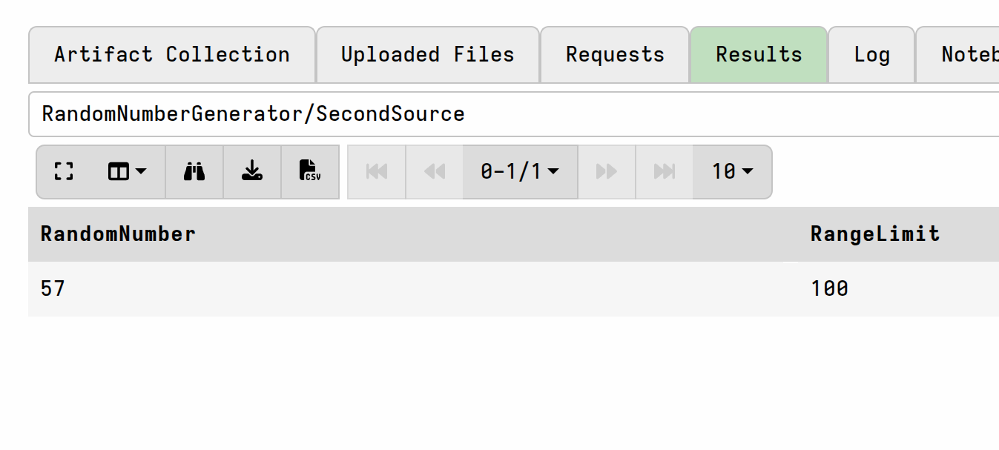
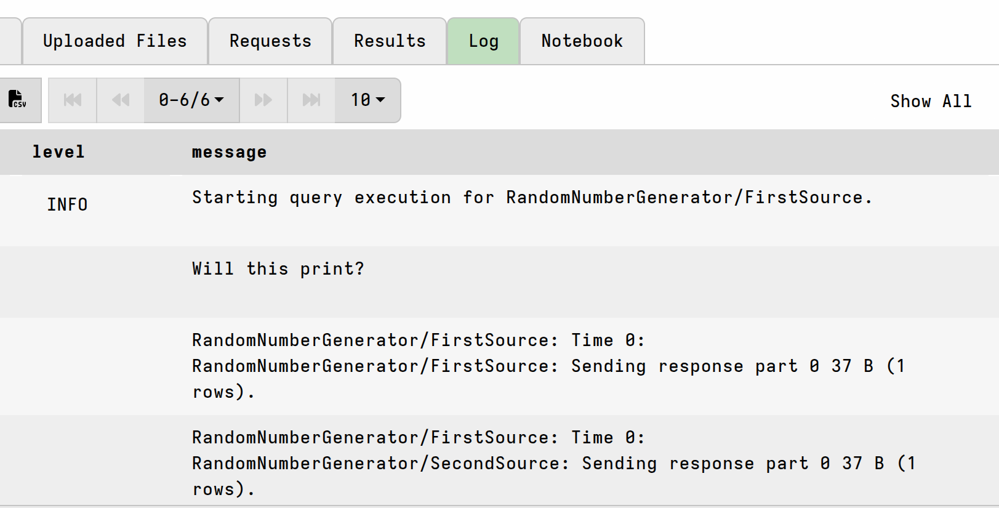
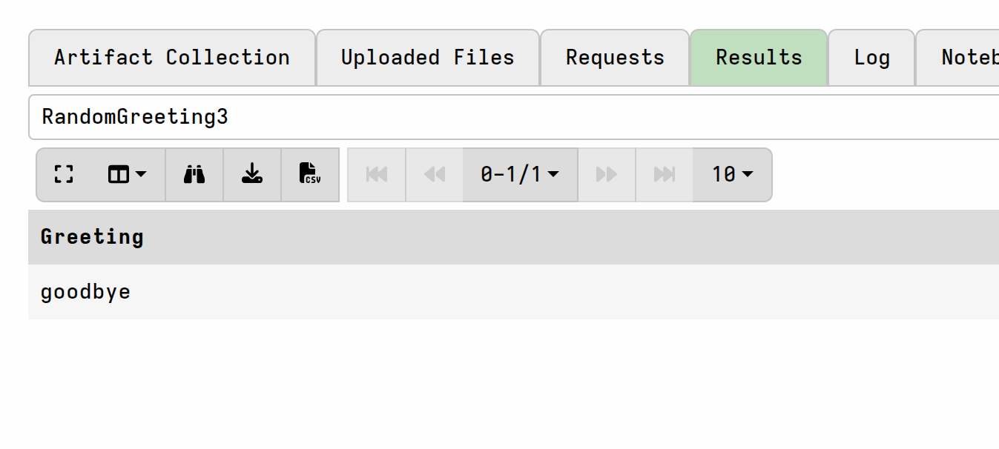
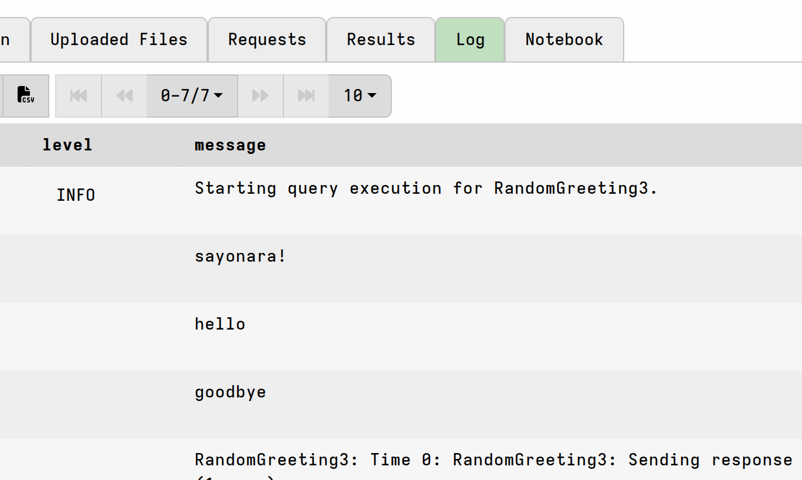

`export` (notice the singular) and `imports` (notice the plural) work together
to allow artifacts to share VQL with each other. This allows us to write more
concise and more consistent artifacts with reusable VQL.

Artifacts can import the `export` section from other artifacts using the
`imports` field's specification, which is a list of artifact names.

The VQL compiler automatically inserts all VQL statements in the
`export` section of each `imported` artifact before each [source](). This allows any functions or
variables defined in the `export` sections to be visible to importing
VQL queries. This makes it ideal to define reusable VQL code that can
be shared by multiple artifacts.


Any type of artifact can import the `export` section from any other type of
artifact - it's not constrained by artifact type. So a notebook template
(artifact type:NOTEBOOK) can simultaneously import the exports from a `CLIENT`
type artifact and a `SERVER_EVENT` type artifact. Any `export` field in any
artifact in the artifact repository is available to be imported by any other
artifact.

As you will see below, you can imagine this as artifacts implicitly
"importing" their own `export` section.  That is, the VQL stored in
`export` can (and usually is) used by the artifact itself, which makes
the `export` section a very useful place to put VQL utility queries,
_even if you don't intend other artifacts to import them_. For
example, if your new artifact has multiple sources and each one
repeats the same queries --perhaps as custom VQL functions-- then it
might be better to move those to the `export` section where a single
instance of the queries produce results that can be shared by all the
sources.

## How export is processed

To illustrate how `export` is processed, let's create the following trivial
artifact:

```yaml
name: RandomNumberGenerator
description:
parameters:
  - name: RangeLimit
    type: int
    default: 100
export: |
  LET RandomNumber <= rand(range=RangeLimit)
  SELECT "Will this print?" AS Message FROM scope() WHERE log(message="%v", args=Message)
sources:
  - name: FirstSource
    query: SELECT RandomNumber, RangeLimit FROM scope()
  - name: SecondSource
    query: SELECT RandomNumber, RangeLimit FROM scope()
```

If you then collect the artifact (remember, it's a CLIENT type artifact by
default) you should see results similar to this:





So what does that tell us?

- `RandomNumber` was generated in the `export` section. This tells us that the
  VQL in `export` was executed first, before the VQL in `sources`.

- `RandomNumber` used the value from the parameter `RangeLimit`. This tells us
  that VQL in the `export` section had access to the artifact's `parameters`.

- The value of `RandomNumber` in both sources is the same. Therefore we can
  deduce that the `export` section only ran once (and this is actually related
  to the sources running in series, due to the absence of source
  [preconditions]())
  since both sources got the same value for `RandomNumber`.

- The `Message` field defined in the `export` section does not show up in the
  results, but due to to the log() function it does appear in the collection
  logs. This is because results of VQL queries (i.e. SELECT statements) in the
  `export` section do run, but are only useful if they are assigned to a
  variable. The log message also appears only once, confirming that our `export`
  section only ran once.

To summarize:

- VQL in the `export` section is always run (at least once) when the artifact is
  collected. If any of the sources have preconditions then the `export`
  section's VQL will execute _once for each source_
  ([parallel execution]()).
  In the absence of any source-level preconditions, the VQL executes once and
  all sources have access to the same results.

- Unlike `sources`, the `export` section's VQL doesn't directly produce results.
  The results need to be made available to the sources as variables if you want
  sources to be able to work with the results. There's not much point to bare
  queries (SELECT statements) in `export` unless they are assigned to variables,
  however they are not disallowed.

- VQL in the `export` section has access to the artifact's `parameters`.

In the example above, the `export` VQL refers to an artifact parameter,
`RangeLimit`. While this demonstrated that parameters are available to queries
in `export` it's really a bad idea in practice because any other artifact
importing from this one would fail since it would know nothing about that
parameter. In real life, if you needed to reference a parameter, you would need
to ensure that your queries in `export` had a conditional fallback value so that
other artifacts could make use of your VQL. Alternatively, the artifacts
importing the VQL would need to ensure that they also provided the referenced
parameter themselves.

## How imports are processed

To examine how `imports` operate, let's now create 3 new trivial artifacts: two
that export and one that imports.

```yaml
name: RandomGreeting1
export: |
  LET Greeting <= "hello!"
  LET LogIt <= log(message="%v", args=Greeting, dedup=-1)
```

```yaml
name: RandomGreeting2
export: |
  LET Greeting <= "goodbye!"
  LET LogIt <= log(message="%v", args=Greeting, dedup=-1)
```

```yaml
name: RandomGreeting3
imports:
  - RandomGreeting1
  - RandomGreeting2
export: |
  LET Greeting <= "sayonara!"
  LET LogIt <= log(message="%v", args=Greeting, dedup=-1)
sources:
  - query: SELECT Greeting FROM scope()
```

Notice that the first 2 artifacts have no sources. They could have sources but
here we don't actually care what they do. But it's also interesting because it
means that those first 2 artifacts can't be collected (at least not via the GUI)
and it raises an interesting use case for such artifacts:
[sourceless artifacts](),
which can be useful containers for storing reusable VQL snippets.

If you collect the artifact `RandomGreeting3` you should see results similar to
this:





So what does that tell us?

- The artifact imported the export sections from the first 2 artifact before
  running.

- The artifact also ran it's own `export` section's VQL.

- The `Greeting` variable was updated with each LET statement, ending up having
  the value `goodbye`.

Basically, the `export` section and the `imports` from the other 2 artifacts
were concatenated like this:

```vql
-- from RandomGreeting3
LET Greeting <= "sayonara!"
LET LogIt <= log(message="%v", args=Greeting, dedup=-1)
-- from RandomGreeting1
LET Greeting <= "hello!"
LET LogIt <= log(message="%v", args=Greeting, dedup=-1)
-- from RandomGreeting2
LET Greeting <= "goodbye!"
LET LogIt <= log(message="%v", args=Greeting, dedup=-1)
```

The 3 log messages were emitted (once) as it ran and the final value of
`Greeting` was `goodbye`, which is what was passed to the single source in the
`RandomGreeting3` artifact.

Note that the ordering is preserved:

- `export`
  - RandomGreeting3
- `imports`
  - RandomGreeting1
  - RandomGreeting2

If our artifact had 2 sources, and if at least one of them had a precondition,
then the above VQL would have executed twice due to parallel execution mode
being triggered by the presence of the precondition.
