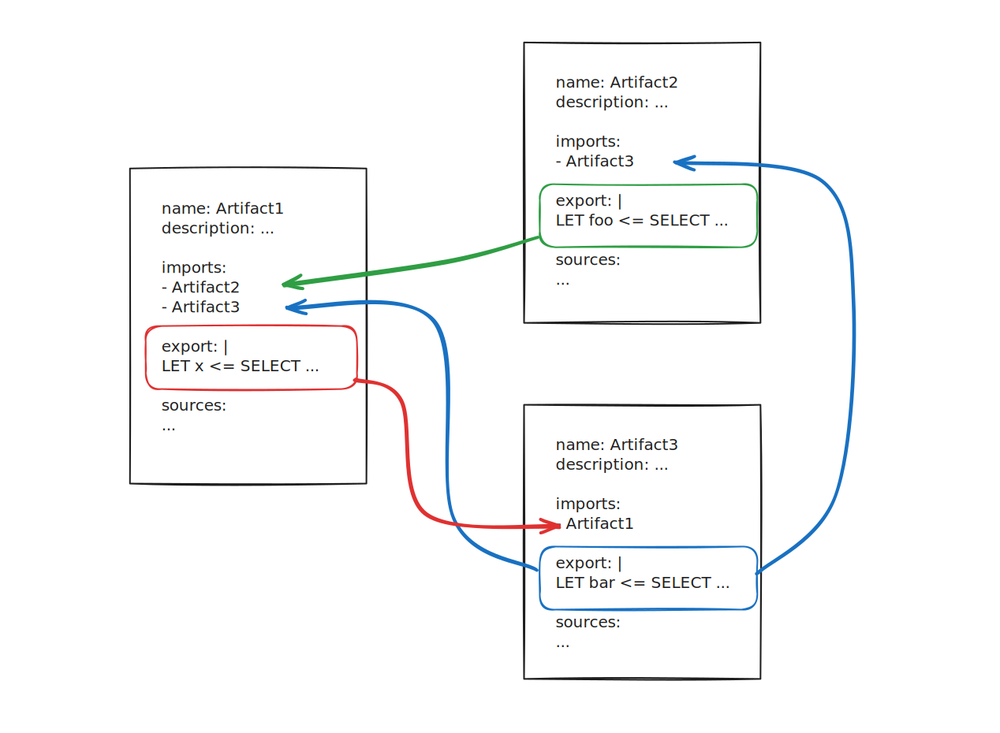

`export` (notice the singular) and `imports` (notice the plural) work together
to allow artifacts to share VQL with each other. This allows us to write more
concise and more consistent artifacts with reusable VQL that can be shared by
multiple artifacts.

Artifacts can import the `export` section from other artifacts using the
`imports` field's specification, which is a list of artifact names.

The VQL compiler automatically inserts all VQL statements in the
`export` section before each [source]().

It then inserts the VQL statements in the `export` sections from the artifacts
listed in the `imports` section before each source.

The VQL statements (functions or variables) defined in these sections are then
executed prior to the VQL defined in the artifact's sources. The order in which
these statements are concatenated and then executed is:

1. VQL from `exports`
2. VQL from `imports` (possibly from multiple artifacts)
3. VQL from `sources`

If the artifact's sources run in
[series]()
then the additional VQL from `export` and `imports` only executes once. If the
sources run in parallel then the additional VQL is executed for each source.
The execution mode is determined by the presence or absence of source-level
[preconditions]()).

## Export

Because the `export` section is added to each source, this is essentially the
same as the artifact implicitly "importing" its own `export` section.  That is,
the VQL stored in `export` can be (and usually is) used by the artifact itself.
It does not have to be imported by other artifacts in order to be useful.

This makes the `export` section a very useful place to put VQL statements that
are shared across multiple sources, even if you don't intend other artifacts to
import them. For example, if your artifact has multiple sources and each one
repeats the same `LET` statements (perhaps defining the same custom VQL
functions) then it may be better to move such shared statements to the `export`
section rather than having them duplicated VQL in multiple sources.

Unlike `sources`, the `export` section's VQL can't directly emit results. The
results need to be made available to VQL in the sources as variables. Therefore
there's no point in having bare queries (`SELECT` statements _not_ assigned to
variables) in the `export` section; VQL in `export` typically only consists of
one or more `LET` statements.

Since the VQL in the `export` section is combined with the VQL in `sources` it
has access to the artifact's `parameters`. Although artifact parameters are
available to queries in `export` you need to consider that other artifacts might
import from it, and these could then could fail since they would know nothing
about the parameters (which are not imported). If you need your VQL in `export`
to reference a parameter, then ideally you should ensure that such statements
have a conditional fallback value so that other artifacts can reliably make use
of your VQL. Alternatively, the other artifacts importing the VQL would need to
ensure that they also provided the referenced parameter themselves.

An artifact can contain an `export` section but no `sources` and still be
[imported by other artifacts]().
In such a scenario, the artifact serves only as a container for reusable VQL
since it can't itself be run (because it has no sources).

## Imports

Any [type]()
of artifact can import the `export` section from any other type of artifact -
importing is not constrained by artifact type.

So, for example, a notebook template (artifact type:`NOTEBOOK`) can
simultaneously import the exports from a `CLIENT` type artifact and a
`SERVER_EVENT` type artifact. Any `export` field in any artifact within the
artifact repository is available to be imported by any other artifact.

When importing from multiple artifacts, the VQL preserves the order of the
`imports` list, and this is added _after_ the VQL from `export` (if defined in
the importing artifact), but _before_ the VQL from each source.
