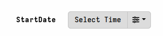

Parameters allow us to customize the collection of artifacts in a
controlled way, without needing to edit the VQL.

When the queries contained in artifacts are sent to the endpoint, the
Velociraptor server populates the VQL scope with the parameters. This allows the
VQL queries running on the client to directly access those parameters as
variables.
The VQL data type of each such variable will correspond to the parameter's
[type]() specification.

For hunts and individual collections, the GUI presents a **Configure Parameters**
form that allows the user to update the parameters for all selected artifacts
prior to launching the collection. The parameter type is also used to hint to
the GUI how to render the corresponding form element.


While the GUI provides a user-friendly UI component for each parameter type, all
artifact parameters are sent to the client as strings. The client automatically
parses them into a VQL data type according to the parameter's `type`
specification.

You can see how the parameters are provided to clients by examining the
**Review** tab for any collection or hunt, prior to launching it, or the
**Requests** tab, after launching it.

## Parameter definitions

Each parameter can optionally have additional attributes that specify the
parameter's data type and additional information which is used by the GUI for
displaying and editing the parameter.

<!-- [Descriptions of the parameter fields](https://github.com/Velocidex/velociraptor/blob/52dc005b1594723716dc6b3e3a7a719a885b74ef/docs/references/server.config.yaml#L1050) -->

- **name**: The parameter's `name` is the only required field. This is the
  variable name that will be used in VQL queries to access the value of the
  parameter.
- **friendly_name**: An alternative human-friendly display name for the
  parameter when it is presented to users in the GUI. If this field exists then
  it is used in the GUI instead of the `name` field. This is useful in cases
  where the parameter's name might not be easily understood by the user.
- **description**: A description that is either displayed alongside the form
  control for certain GUI form controls, or displayed as a popup when the user's
  cursor hovers over the form control. This can be a multi-line text string if
  you need to provide a detailed explanation to the user.
- **default**: The default value of the parameter. This is always specified as a
  string, although the GUI provides user-friendly form components that make
  entering values for each type easier.
- **type**: The data type of the parameter.
  See [Parameter types]() for more information.
  If `type` is not specified then it defaults to being a text field; that is a
  simple text string.
- **validating_regex**: Used to indicate to the user that their entered value is
  not valid. However this is just a visual indicator - it will not prevent users
  from running the artifact with invalid values. There is no way to make a
  parameter require a value. You should ensure that your parameters either have
  a sensible default value, or else design your artifact in such a way that it
  fails gracefully (for example, by providing a helpful log message) if no value
  or an invalid value is provided.


### Parameter types


#### How parameter types are processed

All parameter values are defined as strings. These string values are then
converted to the corresponding VQL data type according to the parameter's `type`
specification when the collection request is compiled.

- Demonstrate this:
   - using typeof()
   - by overriding a parameter value with a VQL assignment.

Currently the following parameter types are supported.

##### int / integer / int64

* **int, integer**: The parameter is an integer
* **timestamp**: The parameter is a timestamp. The GUI will present a time widget to assist you in selecting a timestamp
* **csv**: Parameter appears as a list of dicts formatted as a CSV. The GUI will present a CSV editor to assist in pasting or editing structured CSV data.
* **json**: Parameter is a JSON encoded dict
* **json_array**: The parameter is a list of dicts encoded as a JSON blob (similar to csv)
* **bool**: The parameter is a boolean (TRUE/YES/Y/OK)
* **int**, **in64**, **integer**: The parameter is an integer.
* **float**: The parameter is a float.
* **string**: The parameter is a string (the default type)
* **regex**: The parameter is a Regular Expression. The GUI will present a Regular Expression editor to help you write it.
* **redacted**: The parameter should be redacted. The value of this parameter is redacted in the request or other places where it may be logged.
* **upload**: The parameter contains a string which is uploaded from a file. NOTE- this is limited to 4mb - if you need larger files use `upload_file`. The GUI will present a file upload widget to allow you to upload a file for this request only!
* **upload_file**: The parameter will be the name of a temporary file on the endpoint containing the contents of the uploaded file.
* **server_metadata**: The server will populate this parameter from the server metadata service prior to launching the artifact. The parameter will not be settable in the GUI
* **artifactset**: A set of artifacts. This is probably only useful on server
  artifacts as clients do not have access to arbitrary artifacts. You must also
  include the `artifact_type` parameter which can be `CLIENT`, `SERVER`,
  `CLIENT_EVENT`, `SERVER_EVENT`, `NOTEBOOK`
* **json**, **json_array**, **xml**, **yaml**: This is a data blob encoded as a string.


## Parameter types

Currently the following parameter types are supported:

| type |  | VQL function |  | description |
|---|---|---|---|---|
| timestamp |  | timestamp |  |  |
|  |  |  |  |  |
|  |  |  |  |  |

- artifactset
  - artifact_type (string: only used for type = artifactset)
  - sources (bool: only used for type = artifactset)
- csv
- bool
- choice
  - choices (list)
- multichoice
```
  - name: Events
    type: multichoice
    description: Events to view
    default: '["NameCreate", "NameDelete", "FileOpen", "Rename", "RenamePath", "CreateNewFile"]'
    choices:
      - NameCreate
      - NameDelete
      - FileOpen
      - Rename
      - RenamePath
      - CreateNewFile
```
- float
- hidden
- int / integer / int64
- json
- json_array / regex_array / multichoice https://github.com/Velocidex/velociraptor/pull/3392
- redacted
- string / regex / yara	- (these types are passed through unparsed)
- server_metadata
- starlark
- timestamp
- upload
- upload_file
- xml
- yaml
- yara_lint?


