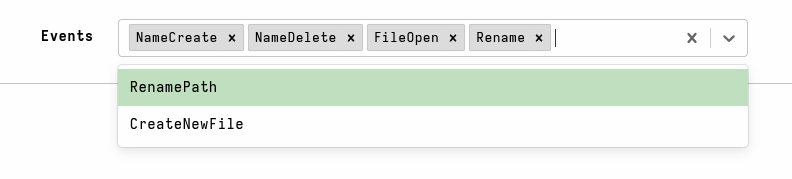

Parameters allow us to customize the collection of artifacts in a
controlled way, without needing to edit the VQL.

When the queries contained in artifacts are sent to the endpoint, the
Velociraptor server populates the VQL scope with the parameters. This allows the
VQL queries running on the client to directly access those parameters as
variables.
The VQL data type of each such variable will correspond to the parameter's
[type]() specification.

For hunts and individual collections, the GUI presents a **Configure Parameters**
form that allows the user to update the parameters for all selected artifacts
prior to launching the collection. The parameter type also determines which form
element should be used to appropriately render the parameter in the GUI.

We have a built-in artifact named `Demo.Plugins.GUI` which demonstrates all the
parameter UI types. You can use this artifact to familiarize yourself with the
look and feel of each type.


While the GUI provides a user-friendly UI component for each parameter type, all
artifact parameters are sent to the client as strings. The client automatically
parses them into a VQL data type according to the parameter's `type`.

You can see how the parameters are provided to clients by examining the
**Review** tab for any collection or hunt, prior to launching it, or the
**Requests** tab, after launching it.

## Parameter definitions

Each parameter can optionally have additional attributes that specify the
parameter's data type and additional information which is used by the GUI for
displaying and editing the parameter.

- **name**: The parameter's `name` is the only required field. This is the
  variable name that will be used in VQL queries to access the value of the
  parameter.

- **friendly_name**: An alternative human-friendly display name for the
  parameter when it is presented to users in the GUI. If this field exists then
  it is used in the GUI instead of the `name` field. This is useful in cases
  where the parameter's name might not be easily understood by the user.

- **description**: A description that is either displayed alongside the form
  control for certain GUI form controls, or displayed as a popup when the user's
  cursor hovers over the form control. This can be a multi-line text string if
  you need to provide a detailed explanation to the user.

- **default**: The default value of the parameter. This is always specified as a
  string, although the GUI provides user-friendly form components that make
  entering values for each type easier.

- **type**: The data type of the parameter.
  See [Parameter types]() for more information.
  If `type` is not specified then it defaults to being a text field; that is a
  simple text string.

- **validating_regex**: For string type parameters, this is used to indicate to
  the user that their entered value is not valid. However this is just a visual
  indicator - it will not prevent users from running the artifact with invalid
  values. There is no way to make a parameter require a value. You should ensure
  that your parameters either have a sensible default value, or else design your
  artifact in such a way that it fails gracefully (for example, by providing a
  helpful log message) if no value or an invalid value is provided. You can also
  implement additional validation in your VQL and have it provide a default
  value if an acceptable value is not found.


With certain parameter types -- namely `choices`, `multichoice`, and
`artifactset` -- additional fields become available that are necessary to
support the specific behaviour of those parameter types.

## Parameter types


### How parameter types are processed

All parameter values are defined as strings. These string values are then
converted to the corresponding VQL data type according to the parameter's `type`
specification when the collection request is compiled.

For example, consider the following trivial artifact:

```yaml
name: Custom.ParameterTypeDemo

parameters:
  - name: AnInt
    type: int64
    default: "10"

sources:
  - query: SELECT AnInt, typeof(a=AnInt) FROM scope()
```

Note that the default value for the parameter is defined as a string, not a YAML
integer. While this is not strictly necessary, as Velociraptor knows that values
should be interpreted as strings and will silently convert them for certain YAML
scalar types, it is good to be aware of this. It is especially important when
dealing with compound data types such as JSON dicts, JSON arrays, and other
types of data blobs, which must be enclosed in quotes.

When sending the artifact to a client, we can see in the Requests tab that a
conversion function is added to the compiled VQL queries, assigning the result
to a variable named by the parameter.

```json
"env": [
  {
    "key": "AnInt",
    "value": "10"
  }
],
"Query": [
  {
    "VQL": "LET AnInt <= int(int=AnInt)"
  },
  {
    "VQL": "LET Custom_ParametersTest_0_0 = SELECT AnInt, typeof(a=AnInt) FROM scope()"
  },
  {
    "Name": "Custom.ParametersTest",
    "VQL": "SELECT * FROM Custom_ParametersTest_0_0"
  }
],
```

As expected, the variable's type in the results corresponds to the parameter's
type specification, and we can confirm this by using the [typeof]() function.


### Parameter validation

As mentioned previously, the `validating_regex` parameter field provides a way
to give the user visual feedback when they are entering an invalid value for the
parameter. However this does not prevent the user from proceeding with an
invalid value.


Because parameters are ultimately just variables, you can perform additional
validation on the variable's value in your VQL and potentially override the
parameter's value using VQL variable assignment, if the user-supplied value is
unacceptable.

For example, consider the following artifact which uses the `server_metadata`
parameter type:

```yaml
name: GetServerMetadata

parameters:
  - name: NameOfMetadataKey
    type: server_metadata
    default: "600"
    validating_regex: ^\d{1,5}$

sources:
  - query: |
     LET NameOfMetadataKey <= if(condition=NOT NameOfMetadataKey =~ '''^\d{1,5}$''', // recheck the validating regex
                              then=600, // re-apply the default value
                              else=int(int=NameOfMetadataKey)) // otherwise just convert it to an int
     SELECT NameOfMetadataKey, typeof(a=NameOfMetadataKey) FROM scope()
```

In this artifact we can't be sure that the metadata key actually exists, nor
that it contains a valid value (we want it to _only_ be a 1-5 digit integer).
It's also possible for the user to set a different value in the Configure
Parameters screen of the collection wizard. To guard against invalid or missing
values in this situation we can implement a few measures including additional
validation in VQL:

- the `validating_regex` parameter field will help guide the user towards
  entering a valid value, however this is not enforceable.
- although a `default_value` is defined for the parameter, this is only used if
  the value stored in the server metadata key is undefined (i.e. the metadata
  key does not exist).
- if the user enters a valid value in the Configure Parameters screen, or if the
  server metadata key exists and contains a valid value, then the VQL converts
  this to an integer. The user-entered value takes precedence over the
  metadata-defined value.
- if the user enters an invalid value in the Configure Parameters screen, or if
  the value defined in the server metadata key is invalid, then the VQL will
  re-apply the default value as an int (no type conversion is necessary because
  it's unquoted and therefore interpreted as an integer).

While it's rarely necessary to be as guarded about parameter values as the above
example is, it shows how you might implement stronger validation in your VQL, if
your artifact requires it.


### Types

The following parameter types are currently supported.

---

#### [ string ]

- **Description:** The parameter is a string (the default type).

- **VQL conversion function:** not converted

- **UI form component:** \
  

---

#### [ int / integer / int64 ]

- **Description:** The parameter is an integer (int64 data type).

  When specifying the type, `int`, `integer`, and `int64` are all equivalent.

  Note that a YAML integer as a parameter default, without the `int` type, will
  be interpreted as a string.

  ```yaml
  parameters:
  - name: AnInt
    default: 80 # <- will be interpreted as a string!
  ```

- **VQL conversion function:** `LET x <= int(int=x)`

- **UI form component:** same as `string` type

---

#### [ float ]

- **Description:** The parameter is a float (float64 data type).

- **VQL conversion function:** `LET x <= parse_float(string=x)`

- **UI form component:** same as `string` type

---

#### [ bool ]

- **Description:** The parameter is a boolean (TRUE/YES/Y/OK).

  A default value of `true` or `yes` or `y` or `ok` (case-insensitive) will
  evaluate as `TRUE`. Any other value, including but not limited to `false`,
  will evaluate as `FALSE`.

- **VQL conversion function:** `LET x <= x =~ '^(Y|TRUE|YES|OK)$'`

- **UI form component:** \
  

---

#### [ timestamp ]

- **Description:** The parameter is a timestamp ( Golang
[time.Time object]()).

- **VQL conversion function:** `LET x <= timestamp(epoch=x)`

- **UI form component:** \
  

---

#### [ choices ]

- **Description:** Allows a single selection from a list of choices.

  When using this type, the `choices` field should also be used as it contains
  the list of items that can be chosen from.

- **VQL conversion function:** not converted - the selected item is passed as a
  string.

- **UI form component:** \
  

---

#### [ multichoice ]

- **Description:** A selection list allowing multiple selections. This returns
  an array of the selected items.

  When using this type, the `choices` field should also be used as it contains
  the list of items that can be chosen from.

  The default choices are specified as a list of items, which should be a subset
  of the items in `choices`. These items will then be pre-selected in the
  multichoice UI component.

  **Example:**

  ```yaml
  parameters:
    - name: Events
      type: multichoice
      description: Events to view
      default: '["NameCreate", "NameDelete", "FileOpen", "Rename"]'
      choices:
        - NameCreate
        - NameDelete
        - FileOpen
        - Rename
        - RenamePath
        - CreateNewFile
  ```

- **VQL conversion function:** `LET x <= parse_json_array(data=x)`

- **UI form component:** \
  

---

#### [ server_metadata ]

- **Description:** The server will populate this parameter from the server
  metadata service prior to launching the artifact. It can therefore be used in
  both client and server artifacts.

  Metadata values are always strings, but you can store string representations
  of other data types in metadata fields and then convert them to the required
  data type in your VQL.

- **VQL conversion function:** `LET x <= server_metadata().x` or `LET x <= get(item=server_metadata(), member="x")`

- **UI form component:** same as `string` type

---

#### [ regex ]

- **Description:** The parameter is a Regular Expression. The GUI will present a
  regular expression editor with regex autosuggestions to help you write it.

- **VQL conversion function:** not converted - passed as a string

- **UI form component:** \
  

---

#### [ regex_array ]

- **Description:** Allows for entry of a list of regular expressions, and returns
  an array containing these expressions.

- **VQL conversion function:** `LET x <= parse_json_array(data=x)`

- **UI form component:** \
  

---

#### [ yara ]

- **Description:** The parameter is a multiline string consisting of one or more
  Yara rules. The GUI will present an editor with Yara syntax highlighting.

- **VQL conversion function:** not converted - passed as a string

- **UI form component:** \
  

---

#### [ json ]

- **Description:** Parameter is a JSON encoded dict and returns an
  ordereddict.Dict object.

- **VQL conversion function:** `LET x <= parse_json(data=x)`

- **UI form component:** same as `string` type

---

#### [ json_array ]

- **Description:** The parameter accepts a list of items encoded as a JSON blob
  (similar to csv) and returns an array object.

- **VQL conversion function:** `LET x <= parse_json_array(data=x)`

- **UI form component:** \
  

  

---

#### [ csv ]

- **Description:** Parameter accepts CSV-formatted data, and returns an array of
  dicts.

  The GUI will present a table-based CSV editor, which you can also switch to
  a raw editing mode where you can paste in CSV-formatted data.

- **VQL conversion function:** `LET x <= SELECT * FROM parse_csv(filename=x, accessor='data')`

- **UI form component:** \
  

  

---

#### [ hidden ]

- **Description:** String type that is not displayed in the GUI.

  Although this parameter type is hidden, you can still pass values to it from
  other artifacts.

- **VQL conversion function:**  not converted - passed as a string

- **UI form component:** not displayed

---

#### [ redacted ]

- **Description:** The value of this parameter is redacted in the request or
  other places where it may be logged.

  This should not be considered a security mechanism. For securely passing
  sensitive parameters to client you should use Velociraptor's
  [secret management]()
  feature.

- **VQL conversion function:** not converted

- **UI form component:** same as `string` type

---

#### [ upload ]

- **Description:** Allows you to upload content from a file. The upload content
  will be available in this variable (as a string) on the client. The GUI will
  present a file upload widget to allow you to upload a file.

  The file is delivered to the client from the server's `public` directory, with
  the client retrieving it using the `http_client` plugin. The file content is
  not written to disk on the endpoint.

  Notes:
  - The uploaded content is valid for this request only!
  - The upload content is limited to 4MB - if you need larger files to the
    endpoint use `upload_file` instead.
  - You cannot set a default value for this type.

- **VQL conversion function:** `LET x <= SELECT Content FROM http_client(url=x)`

- **UI form component:** \
  

---

#### [ upload_file ]

- **Description:** The parameter will be the name of a temporary file on the
  endpoint containing a copy of the uploaded file.

  This differs from the `upload` parameter type in that the file is written to
  disk as a temp file, and the parameter then contains _the path to this file_.
  This avoids the size limitation, but by writing the file to disk it's slightly
  slower and the file is also susceptible to endpoint anti-malware scanning.

  When using this parameter type your VQL will need to read the contents of the
  file, typically using `read_file()` or similar functions.

  Notes:
  - The uploaded content is valid for this request only, as the temp file is
    removed on the endpoint when the collection completes.
  - You cannot set a default value for this type.

- **VQL conversion function:**
  ```vql
  LET x_ <= SELECT Content FROM http_client(url=x, tempfile_extension='.tmp')
  LET x <= x_.Content[0]
  ```

- **UI form component:** \
  

---

#### [ artifactset ]

- **Description:** Allows selection of one or more artifacts from a set of
  artifacts. Returns an array of artifact names, optionally including named
  sources.

  This parameter type is generally only useful on server artifacts as clients do
  not have access to arbitrary artifacts.

  When using this parameter type you must also include the `artifact_type` field
  which can be one of `CLIENT`, `SERVER`, `CLIENT_EVENT`, `SERVER_EVENT`,
  `NOTEBOOK`. This determines the type of artifacts that the user can select
  from.

  You can optionally include the `sources` parameter field (a boolean) which
  determines whether or not to include artifact source names in the artifact
  selection list. By default source names are not shown (i.e. `sources: False`).

- **Example:**

  ```yaml
  parameters:
    - name: ClientArtifactsToWatch
      type: artifactset
      artifact_type: CLIENT_EVENT
      sources: TRUE
      default: |
        Artifact
        Windows.Detection.PsexecService
        Windows.Events.ProcessCreation
        Windows.Events.ServiceCreation
  ```

- **VQL conversion function:** `LET x <= SELECT * FROM parse_csv(filename=x, accessor='data')`

- **UI form component:** \
  

---

#### [ xml ]

- **Description:** Accepts an XML document and parses it.

- **VQL conversion function:** `LET x <= parse_xml(file=x, accessor="data")`

- **UI form component:** same as `string` type

---

#### [ yaml ]

- **Description:** Accepts an YAML document and parses it.

- **VQL conversion function:** `LET x <= parse_yaml(filename=x, accessor="data")`

- **UI form component:** same as `string` type

---

#### [ starlark ]

- **Description:** Compile a [starlark]()
  code block. Returns the `*tools.StarlModule` data type.

- **VQL conversion function:** `LET x <= starl(code=x)`

- **UI form component:** same as `string` type

---

