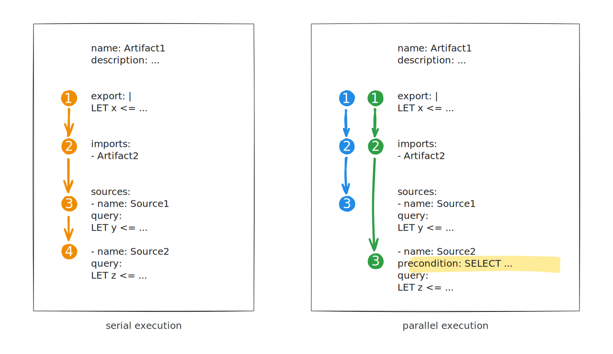

A **precondition** is a query that is run to determine whether the artifact, or
a particular [source]()
within the artifact, should be collected.

The most common use for preconditions is to check the operating system and
sometimes also the architecture, thus making it safe to collect an artifact
without needing to worry about whether the artifact (or each source in the
artifact) is designed for the particular architecture or operating system. For
example, when performing a hunt for a Windows-only artifact (made so using a
precondition) it is safe to target all clients because Linux and macOS clients
will just ignore it and return no rows.

As mentioned, most preconditions target specific operating systems or
architectures, but a precondition can be an arbitrary VQL query.

Only VQL queries are allowed for preconditions. That is, preconditions must be a
VQL `SELECT` clause. They cannot be VQL functions and cannot include `LET`
clauses. However they can include complex `WHERE` clauses, which can even serve
as the main determinant of the precondition, as you'll see in some examples
below.

## How preconditions are evaluated

When run, a precondition is evaluated to either True or False. In terms of
"thruthiness", True means that the query returned 1 or more rows, while False
means that the query returned no rows.

If the precondition evaluates to True then the associated VQL will be executed.
If False then the associated VQL is skipped. This decision is recorded in the
collection log for each precondition.

## Artifact-level preconditions vs. source-level preconditions

Artifacts have two places where preconditions may be defined. You can specify a
precondition at the top level of the artifact definition, or attach a
precondition to any source, or use both.

An artifact-level precondition determines whether the artifact is collected or
ignored entirely. If the precondition evaluates to True then the artifact is
collected, however there may also be source-level preconditions that will
subsequently determine which sources are collected and the
[execution mode]()
of the artifact.


## Serial vs. parallel execution

If a precondition is specified at the source level, the VQL engine has no idea
if any particular source will be used or not. Therefore the engine treats each
source as an independent query within its own scope. Since the sources are
independent they can be, and will be, run in parallel. In parallel execution
mode, any VQL variables defined in one source will not be visible to other
sources.

Consider the following artifact:

```yaml
name: MultiSourceParallelMode
sources:
  - name: Source1
    precondition: SELECT * FROM info() WHERE OS = "linux"
    query: |
      LET X <= SELECT ....
      SELECT ...
  - name: Source2
    precondition: SELECT * FROM info() WHERE OS = "windows"
    query: |
      SELECT * FROM X
```

`Source1` will only run on Linux systems, and `Source2` only on Windows systems.
Therefore it is impossible to share scope between the two sources since
`Source2` can never see the variable `X` defined by `Source1`.

Therefore when preconditions are defined at the source level, the artifact must
be collected in parallel mode, necessitating the creation of an independent
scope for each source.



The presence of a precondition on ANY source causes ALL sources in the artifact
to execute in parallel.

{}

This means that you can force your artifact to execute in parallel mode
by adding a precondition to any source, even if the precondition itself
doesn't actually do anything useful! It can be a query that always evaluates as
TRUE, for example: `precondition: SELECT TRUE FROM scope()`.

Conversely, if you want sources to have access to results from prior sources
then you need to construct your artifact logic so that it doesn't require or use
any source-level preconditions.

{}

Artifact-level preconditions have no effect on execution mode.


## Preconditions in event artifacts

Sources in event artifacts -- that is artifacts of type `CLIENT_EVENT` OR
`SERVER_EVENT` -- always execute in parallel mode, regardless of the presence or
absence of preconditions. This is necessary because source queries in event
artifacts are expected to never complete - they just keep producing more rows.
So no source can ever depend upon the results of any other source.

Preconditions are nevertheless still just as useful in event artifacts, but just
don't have any effect on the execution mode of the artifact.

## Export and imports

Preconditions are evaluated before any of the sources are run, including VQL in
the artifact's `export` and `imports`
[sections]().
This means that any variables and custom functions defined in these sections are
not available for use in preconditions.

When parallel execution mode is triggered by the presence of a source-level
precondition, then each scope gets a copy of the VQL contained in `export` and
`imports`, as can be demonstrated by this example:

```yaml
name: PreconditionParallelExport

export: |
  LET RandomNumber <= rand(range=100)

sources:
  - name: one
    query: SELECT RandomNumber FROM scope()
  - name: two
    precondition: SELECT * FROM info()
    query: SELECT RandomNumber FROM scope()
```

If a source-level precondition did not exist in the above artifact, then both
sources would have received the same value for `RandomNumber` due to them
sharing a common scope. Instead we see independent results for each source
because the `export` section was executed in each scope.


## Preconditions and parameters

Artifact [parameters]()
can be used in preconditions, for example:

```yaml
name: PreconditionFromParameters

parameters:
  - name: DoIt
    type: bool
    default: FALSE

sources:
  - precondition: |
        SELECT * FROM scope()
        WHERE DoIt AND log(message="DoIt is %v", args=DoIt)
    query: SELECT * FROM info()

```
will only run if the `DoIt` parameter is set to TRUE.

## Use Cases and Examples

### 1. Checking host information

By far the most common use for preconditions is to check the operating system,
sometimes in combination with the architecture. When using tools it is important
to select the correct tool for each platform _and_ architecture.

Many details of the host and the state of the client can be obtained from the
`info` plugin.

**Examples:**

```vql
precondition: SELECT OS From info() where OS =~ 'linux|darwin' AND NOT Architecture = 'arm64'
```
Applies to only Linux or macOS, but not arm64 architectures.

```vql
precondition: SELECT OS From info() where OS != 'windows'
```
Applies to all OSes except Windows.

```vql
precondition: SELECT * FROM info() WHERE IsAdmin
```
Check if the client is running with admin privilege (any platform).

### 2. Checking the results of another artifact

It's possible to run another artifact as a precondition. If the artifact
produces any rows then the precondition will evaluate True. The artifact used in
the precondition might be a lightweight check for some indicator before running
more resource-intensive VQL.

**Example:**

```vql
precondition: SELECT * FROM Artifact.XYZ()
```

##### Preconditions when calling other artifacts

The artifact called in the precondition may itself have preconditions. By
default the preconditions in the called artifact won't be evaluated unless you
provide the argument `preconditions=TRUE` to the Artifact() plugin.

### 3. Checking the status of an external tool

You can run a command using the `execve` plugin and base a precondition on it's
output.

**Example:**

```vql
precondition: |
  SELECT OS, { SELECT ReturnCode FROM execve(argv=["dpkg", "--help"]) } AS ReturnCode
  FROM info() WHERE OS = 'linux' AND ReturnCode = 0
```
Applies if the dpkg tool exists and is functioning, on Linux systems.

### 4. Checking plugin versions

Sometimes Velociraptor's built-in functions and plugins need to evolve in a way
that affects either their input (that is the accepted arguments may change),
behaviour, or output. In the case of output changes the function/plugin may not
produce results in the particular format that previously written VQL expects.
This doesn't happen often, but when such backwardly-incompatible changes need to
be made, we increment the plugin's version number. The version number is a
simple integer.

Plugin versions can be queried using the `version` function, and therefore
preconditions can be created to check the version before running VQL that uses
it.

**Example:**

```vql
precondition: SELECT * FROM info() WHERE version(plugin="http_client") > 2
query: SELECT Response FROM http_client(url=["http://a.example.com/test", "http://b.example.com/test"])
```
Ensures that the client has the `http_client` plugin greater than version 2
(i.e. version 3 or above), since only version 3 or above
[supports multiple URLs](https://github.com/Velocidex/velociraptor/pull/4265).

### 5. Checking date and time

In some environments you may want take extra precautions to ensure that
resource-intensive artifacts don't accidentally get collected during business
hours.

Since preconditions are evaluated on the client, this obviously depends on the
client's clock being correct.

**Examples:**

```vql
precondition: |
  SELECT timestamp(epoch=now()).Weekday.String AS DayName FROM scope()
  WHERE DayName =~ 'saturday|sunday'
```
Only run on weekends.

```vql
precondition: |
  SELECT timestamp(epoch=now()).Hour AS Hour FROM scope()
  -- UTC time
  WHERE Hour < 6 OR Hour > 15
```
Only run outside of office hours.

