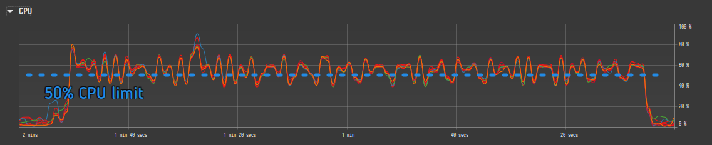

Velociraptor often runs on performance sensitive endpoints, like
servers and laptops, as well as low resource machines like cloud
virtual machines. It is critical to ensure that Velociraptor does not
generate undue load on the endpoint, leading to performance
degradation.

Resource limits can be placed on queries and collections. These limits
are usually set in the artifact collection or hunt creation workflows
in the GUI.  However it is possible to predefine these limits in the
artifact definitions themselves using the `resources` key. If resource
limits are specified in the artifact then the user still has the
opportunity to change these as usual in the GUI workflows.

Resource limits are essential for controlling the load on endpoints
and preventing collections from negatively impacting users or network
infrastructure. They protect the endpoint.

They act as a "fail safe" mechanism to prevent accidents, such as
inadvertently collecting massive quantities of data or using excessive
resources.

Setting resource limits can ensure that runaway queries or collections
that take too long are cancelled before they cause too many problems.

Resource control is specific to an artifact and what it does. For
example, CPU limiting is useful for artifacts doing heavy processing
like Yara scans but not necessarily for others.

Limits are set using the `resources` key in the artifact definition.

resources:
* `timeout`
* `ops_per_second`
* `cpu_limit`
* `iops_limit`
* `max_rows`
* `max_upload_bytes`
* `max_batch_wait`
* `max_batch_rows`
* `max_batch_rows_buffer`

If you define `resources` in your artifact, you only need to specify
the subkeys relevant to the resources you want to limit. Default
values will apply to any subkeys not specified, and as mentioned
above, users still have the opportunity to override these limits in
the GUI before collecting the artifact.

**Example:**

```yaml
resources:
  timeout: 1800
  cpu_limit: 50
```



### How Limits Are Aggregated Across Artifacts

When a collection includes multiple artifacts, the effective resource
limits are calculated by taking the **maximum** value across all
artifacts' `resources` blocks. For example, if artifact A specifies
`max_rows: 10` and artifact B specifies `max_rows: 20`, the
collection will have `max_rows: 20`. This aggregation applies to all
numeric resource limits.

Values specified in the collection request (via the GUI or API)
**override** the artifact-level defaults entirely. The precedence
order from lowest to highest is:

1. Built-in defaults in the Velociraptor configuration
2. Artifact `resources` key (in the artifact YAML definition)
3. Artifact spec overrides (per-artifact overrides in the collection request)
4. Collection-level request values (set in the GUI or API)

## Time Limits

There are two timeouts. The first is for the overall collection and
for offline collections there is no timeout by default. There is also
a progress timeout which aims to catch cases where a query is not
making progress in a reasonable time.

`Timeout / Max Execution Time`: This sets a maximum duration for an
artifact collection. The default timeout is 600 seconds. If the
timeout is reached, the collection is timed out and cancelled.

  - `timeout` (Query Timeout): A general timeout parameter can be set
    for a query. This timeout applies to the entire query and cancels
    the collection when exceeded. Timed-out flows might need to be
    re-run with increased timeouts Setting a timeout is considered a
    way to make a query safe enough.  Queries are typically limited to
    10 minutes (600 seconds).

  - `progress_timeout` (Max Idle Time in Seconds): This parameter, set
    in the resources section, terminates a query if no progress (rows
    emitted) is detected within the specified time. By default, it is
    not set (which means there is no limit). In the context of offline
    collectors, this kills the specific artifact that is not making
    progress, allowing the collection to move on. This parameter can
    also be provided to the `query()` plugin for more fine-grained
    control. This limit cannot currently be specified in an artifact's
    `resources` section.

  - Notebook Query Timeout: The timeout for notebook queries is 10 minutes, by
    default. Normally this should be more than sufficient for any reasonable
    notebook query, but in rare cases if you need to set this to a longer
    interval you can do so via
    [a config setting](/docs/deployment/references/#defaults.notebook_cell_timeout_min)
    (which requires a server restart).

## Resource Limits

Resource limits can be applied to any artifacts/collections, although
the effectiveness of these limits depends on what the artifact
actually does. In particular CPU and IO limits are not enforceable
when running external applications via execve().

- **CPU Limit**: This limits how much CPU the Velociraptor agent can
  use on average.

  - Setting a CPU limit pauses the query when the average CPU usage exceeds the
  limit, and it resumes when the average drops below the threshold.

  - CPU limiting works in all queries, but the underlying plugin needs to
  support pausing.

  - CPU limiting can cause queries to take longer or even not complete if the
  limit is set too low, since a limited query will stop until the CPU load for
  the entire process drops below the threshold, other queries which are not
  limited may preempt it.

  - Setting a global CPU limit is generally not recommended; Only artifacts
  which are known to impose a high CPU load should have throttling enabled.

- **IOPS Limit**: The iops_limit parameter limits the I/O per
  second. The mechanism works by throttling the client based on an IO
  budget, not necessarily tied to real CPU load or bandwidth, and is
  most useful for large Yara scans. It can also be set on the
  `query()` plugin.

- **Ops Per Second**: The `ops_per_second` parameter limits the rate
  at which VQL operations are executed. This is useful for
  throttling artifacts that iterate over large numbers of files or
  registry keys, preventing them from overwhelming the endpoint.
  This limit is set at the collection level in the GUI rather than
  in the artifact definition.

**<i class="fas fa-warning"></i> CPU and IOPS limits do not apply to external tools invoked by an
artifact since Velociraptor has no control over the resources they
consume.**

## Data Limits

- **Max Rows**: This limit restricts the total number of rows
  returned by a collection.  This limit is set per collection and
  works by cancelling the entire collection once the limit is
  reached. Server artifacts currently don't enforce a row limit.

  **Do not confuse `max_rows` with `max_batch_rows`** (see Batching
  Controls below). `max_rows` is a hard limit on the *total* number
  of rows the collection may emit — the collection is cancelled when
  exceeded. `max_batch_rows` controls how many rows are included in
  each *individual response chunk* during transmission; it does not
  cancel the collection.

- **Max Upload Bytes**: This limits the total amount of data
  transferred back from the client as an "Upload" (i.e. bulk
  files). This limit is set per collection and cancels the entire
  collection when reached. This is a crucial limit to prevent
  accidentally collecting massive amounts of data.

## Batching Controls

The `max_batch_wait`, `max_batch_rows`, and `max_batch_rows_buffer`
parameters control how the Velociraptor client chunks results into
response packets during collection. They do **not** limit the total
data collected — they determine the granularity of data transmission
from the client back to the server.

These settings are most relevant for event-based or long-running
queries where you want to control how frequently results arrive at
the server and how large each payload is.

- **Max Batch Rows** (`max_batch_rows`): The maximum number of rows
  to buffer before sending a response packet. When the buffer reaches
  this many rows, the payload is flushed and transmitted. The default
  is 1000 rows.

- **Max Batch Wait** (`max_batch_wait`): The maximum time in seconds
  to wait before sending a partial payload. If the row count or
  buffer size thresholds have not been reached within this time, the
  accumulated rows are sent anyway. This ensures the server sees
  progress even for slow queries. The default is 100 seconds.

- **Max Batch Rows Buffer** (`max_batch_rows_buffer`): The maximum
  size in bytes for a response payload before it is sent. This is a
  fairer measure than row count because rows can vary significantly
  in size. The default is 5 MB (5 * 1024 * 1024 bytes).

The first condition to be met — row count, buffer size, or wait
timeout — triggers a payload flush. For example, if a query produces
very large rows, the buffer size limit may be reached before the row
count limit, causing an early transmission.

**Example:**

```yaml
resources:
  max_batch_rows: 5000
  max_batch_wait: 30
  max_batch_rows_buffer: 10485760
```

This configuration would send a response packet when either 5,000
rows, 10 MB of data, or 30 seconds of wall time is reached, whichever
comes first.

## Limiting Memory Use

It is not possible to limit memory usage via artifact resource
settings. However, Velociraptor provides memory management at both
the client and server levels through configuration settings.

### Client-Side Memory Management

The client runs a [nanny](/docs/deployment/references/#Client.nanny_max_connection_delay)
process that periodically checks the client's memory footprint. The
[`Client.max_memory_hard_limit`](/docs/deployment/references/#Client.max_memory_hard_limit)
setting specifies a hard ceiling (in bytes) for the client process.
If the client's heap usage exceeds this limit, the nanny triggers a
controlled hard exit. If Velociraptor is installed as a Windows
service, the service recovery option can restart the client
automatically.

### Server-Side Memory Management (Notebooks)

On the server, memory pressure is managed through notebook cell
calculation controls:

- [`defaults.notebook_memory_low_water_mark`](/docs/deployment/references/#defaults.notebook_memory_low_water_mark):
  A threshold (in bytes) that must be met before a new notebook cell
  calculation can start. If the server process memory exceeds this
  mark, the cell calculation is delayed until memory drops below it.
  This prevents new calculations from starting under high memory
  pressure.

- [`defaults.notebook_memory_high_water_mark`](/docs/deployment/references/#defaults.notebook_memory_high_water_mark):
  An upper threshold (in bytes) that triggers cancellation of
  in-flight notebook cell calculations. When the server process
  memory exceeds this mark, active cell calculations are cancelled to
  bring memory usage back down.

The low water mark acts as a **soft admission control** (delay new
work) while the high water mark acts as a **hard cancellation**
(kill in-flight work). These settings are independent of artifact
collection and apply only to notebook cell execution on the server.
