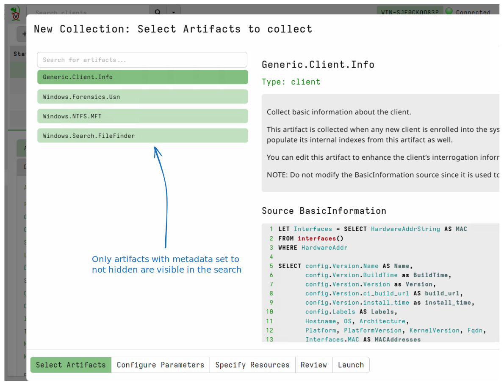
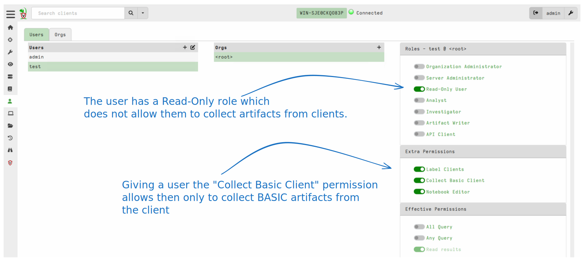
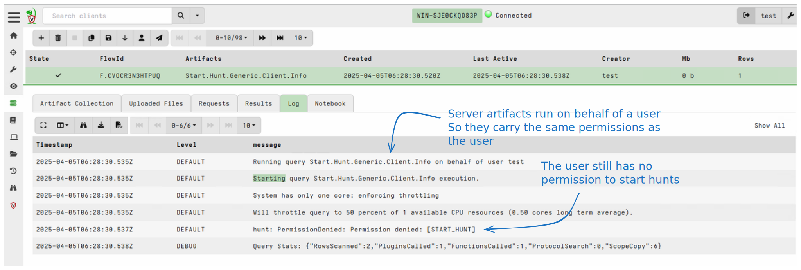
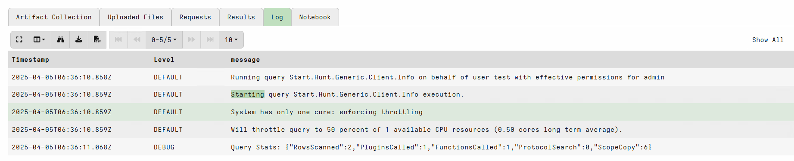

Artifacts are the main way in which users interact with Velociraptor:
Users launch artifact collections from clients and collect artifacts
on the Velociraptor server.

At its core an artifact is simply a way to package VQL queries to make
them easier to use.

However, for new users the number of artifacts can be
overwhelming. Coupled with the power that artifacts can wield there is
a need to control which users are able to access which artifacts: This
helps to avoid mistakes due to inexperience. For example running a
`Windows.KapeFiles.Target` collections as a large scale hunt is almost
always a bad idea!

Most users develop their own operating procedures specifying:
1. Which artifacts are to be used in which situation
2. Who is allowed to launch more sensitive artifacts
3. How artifacts are to be used (what type of arguments are allowed).

In the below page we discuss how Velociraptor enabled each of these
goals.

## Hidden artifacts

The first goal is to clean up the vast number of artifacts that are
presented through the GUI. Because Velociraptor allows artifacts to be
customized, new artifacts to be added to large number of artifacts
imported from external sources (i.e. `Artifact Packs`), there could be
hundreds or thousands of artifacts loaded in the system. Many have
similar but different functionality. This can overwhelm a user with
too much choice and be confusing.

To clean up the interface, Velociraptor allows artifacts to be hidden
from the GUI. This means that they are not shown as part of the search
functionality in the artifact collections wizard or in the
artifact. However the artifacts still exist in Velociraptor and can be
seen as part of the `artifact_definitions()` plugin output.

The visibility of an artifact is controlled by `artifact metadata` - a
field attached to each artifact in the system. You can hide or show
each artifact using the `artifact_set_metadata()` function.

### Example: Making only certain artifacts visible.

The following VQL can be run in a notebook to hide all artifacts other
than a selected set:

```sql
LET VisibleArtifacts <= SELECT * FROM parse_csv(accessor="data",
filename='''Artifacts
Windows.Search.FileFinder
Windows.Forensics.Usn
Windows.NTFS.MFT
Generic.Client.Info
''')


SELECT name, name in VisibleArtifacts.Artifacts AS Visible
FROM artifact_definitions()
WHERE artifact_set_metadata(hidden=NOT name in VisibleArtifacts.Artifacts, name=name) OR TRUE
```

This results in only those artifacts appearing in the GUI.



This reduced view can help guide users into more preferred playbooks
and procedures, reducing confusion.


## Basic artifacts

While hiding the artifacts in the GUI helps to reduce clutter, it
does not stop someone from launching those artifacts (for example
using a VQL query). The artifacts are actually still available but
they are just hidden. Therefore hiding an artifact **is not a security
measure**.

In Velociraptor, a user's permissions control what actions they can
take in the GUI **or** using a VQL query. If a user is allowed to
collect artifacts from the client, they can collect **any** artifact,
including hidden artifacts.

However some artifacts are more dangerous than others and require more
experienced operators.

Velociraptor user permission are given as part of `Roles` or
specifically granted in the user policy.



The above example shows a user given the `Read Only` role. This role
does not allow the user to collect new artifacts from the endpoint,
nor does it allow them to update notebook cells (but they can read
notebooks).

However, here I give the user additional permissions on top of their role:

1. Label Clients - the user is allowed to manipulate client labels
2. Collect Basic Client - The user is allowed to collect basic artifacts from the client.
3. Notebook Editor - The user is allowed to update notebook cells (and
   by extension evaluate VQL queries on the server).


If the user attempts to collect an artifact from a client, they will
be denied because they do not have the `COLLECT_CLIENT` permission.

However we can allow the user to collect **Some** artifacts that we
deem to be safe.

```sql
LET BasicArtifacts <= SELECT * FROM parse_csv(accessor="data",
filename='''Artifacts
Generic.Client.Info
''')


SELECT name, name in BasicArtifacts.Artifacts AS Basic
FROM artifact_definitions()
WHERE artifact_set_metadata(basic=NOT name in BasicArtifacts.Artifacts, name=name) OR TRUE
```

The artifact `Generic.Client.Info` is deemed basic and therefore this
user can collect it.

## Controlling access to client artifacts

Now that we have learned how to hide artifacts in the search GUI, and
how to mark some artifacts as basic, we can proceed to tie down some
artifacts in a safe way.

To illustrate this approach, suppose I wanted to allow my low
privilege user to run `ipconfig` on the remote system. I know that I
can shell out to the system shell using the artifact
`Windows.System.CmdShell`. However, giving the user access to that
artifact is extremely dangerous - because that artifact allows
arbitrary commands to be launched on the endpoint.

I want to further reduce the way in which the
`Windows.System.CmdShell` artifact is called by **removing the user's
choices for the artifact parameters**.

I can create a new artifact

```yaml
name: Custom.Ifconfig
sources:
  - query: |
        SELECT * FROM Artifact.Windows.System.CmdShell(Command="ipconfig")
```

This artifact takes no parameters and so the user can not change the
command to anything other than `ipconfig` (which I deem safe to run on
any endpoint).

Now I will add the `basic` metadata to this artifact which will allow
the user to launch it. However the user is unable to change the
parameters or run arbitrary code.

In this way it is possible to lock down a standard operating procedure
for users:

* Velociraptor Built in artifacts are very powerful and very generic -
  their actions can be controlled by many parameters.
* You can write **wrapper artifacts** to narrow down the choices
* Setting those artifacts as basic can allow users to use a reduced
  functionality version of the artifacts safely.

{}

Users with the `ARTIFACT_WRITER` permission are allowed to modify the
artifact itself. Therefore, if the user can change the artifact the
above access control is bypassed.

We consider users with `ARTIFACT_WRITER` as admin equivalent since it
is easy to escalate to full admin with that permission.

{}

### Restricting dangerous client artifacts

In the previous section we saw how to allow users **without the
`COLLECT_CLIENT`** permission to launch some curated `basic`
artifacts.

However, if the user has `COLLECT_CLIENT` permissions, they are able
to launch any client artifact. Once launched, the client will run the
artifact without any ACL enforcement at all. However, not all client
artifacts are created equal. Some client artifacts are more powerful
than others.

Some client artifacts allow running arbitrary commands on the
endpoint. For example, as we have seen previously, the
`Windows.System.CmdShell` artifact allows running arbitrary shell
commands, because the commandline to run is a user supplied parameter
directly passed to the shell, using the the `execve()` plugin. This
can be leveraged for a complete domain compromise by e.g. running a
malicious command on all assets in the environment.

On the other hand, while the `Windows.Sysinternals.Autoruns` artifact
also called the `execve()` plugin, the arguments supplied are
sanitized from user input.

If a user is not fully trusted, they may be allowed to collect the
`Windows.Sysinternals.Autoruns` but definitely should be prevented
from collecting the `Windows.System.CmdShell`.

Because client artifacts do not use any ACL protection, as artifact
writers, we need to be careful to not inadvertently give the user more
permissions than intended on the endpoint.

Client artifacts can specify the `required_permissions` field to
direct the server to check the initiating user has those permissions
before allowing the artifact to be scheduled. This field is used to
restrict collection of powerful, risky artifacts to only
administrative users.

The corollary is that we should try to sanitize user input as much as
possible to restrict the use of dangerous functions. For example:

1. When using `execve()`, build the command line based on user input
   but do not allow user input to be directly interpolated into the
   command in such a way that it can change the meaning of the
   command.

2. When using an artifact that uses plugins that allow writing to
   arbitrary files (e.g. `copy()`), do not allow the user to specify
   the path and content of the files to write. This can be misused to
   e.g. write startup locations and take over the endpoint. Similar
   advice applies to writing registry keys, deleting files etc.

{}

The `execve()` plugin allows artifacts to launch external
commands. This plugin accepts a list of parameters (called `argv`)
instead of a single command line. The plugin will construct a safe
command line by escaping single arguments if necessary, so you should
not need to worry about escaping.

Specifically, do not launch commands via the shell:

```sql
SELECT * FROM execve(argv=["cmd.exe", "/c", "cacls " + DirectoryName])
```

Instead always directly run the target binary - Velociraptor will
suitable escape the command line if required.

```sql
SELECT * FROM execve(argv=["cacls.exe", DirectoryName])
```

{}


How can we tell if a client artifact gives extra permissions to users?

In recent versions, Velociraptor has a VQL query static analyzer,
which among other warnings also suggests to check permissions:

```
$ velociraptor -v artifacts verify ./content/exchange/artifacts/*
...
[ERROR] 2025-05-23T11:55:30Z ./content/exchange/artifacts/RemoteIconForcedAuth.yaml: Call to Artifact.Windows.Forensics.Lnk contain unknown parameter Glob
[INFO] 2025-05-23T11:55:30Z ./content/exchange/artifacts/RemoteIconForcedAuth.yaml: Suggestion: Add EXECVE to artifact's required_permissions or implied_permissions fields
```

The artifact verifier checks all plugins and functions in the artifact
and ensures that dangerous permissions are listed in either of the
following fields:

1. The `required_permissions` field is used to restrict who can launch
   the artifact. Only users who already have that permission can
   launch it, therefore the artifact does not add additional
   permissions.

2. The `implied_permissions` field is used to declare that this
   permission is handled appropriately in this artifact. For example,
   the `execve()` plugin arguments are properly sanitized. Therefore,
   the verifier can suppress this warning.

Ideally you should aim to have no verifier warnings.

### Client artifacts collection permissions model

To summarize, when collecting client artifacts the following security
features are available:

1. If a user does not have the `COLLECT_CLIENT` permission, they can
   not collect any artifacts.

2. Giving a user the `COLLECT_BASIC` permissions allows them to collect
   `Basic` artifacts. Any artifact can be denoted as `Basic` by
   setting the metadata field.

3. Giving the user the `COLLECT_CLIENT` permission allows the user to
   collect any client artifact, as long as they also have the
   permissions specified in the `required_permissions` fields of that
   artifact.

4. Artifacts with open ended capabilities (e.g. running arbitrary
   commands), should restrict their `required_permissions` field to
   users who already have that permission. This ensures users can not
   collect artifacts that give them additional permissions.

5. Artifacts that properly sanitize use of dangerous permissions,
   should declare those in `implied_permissions` which allows the
   verifier to suppress these warnings.

## Server artifacts and Impersonation

The above discussion centered around controlling access to client
artifacts. But sometimes we need to also control access to server
artifacts. For example, suppose I wanted to allow the restricted user
above to create a hunt with the `Generic.Client.Info` artifact in it.

In order for users to create hunts, they need the `Start Hunt`
permission. However giving users this permission allows them to create
**any** hunt which is dangerous. I really only want to allow the user
to create a **specific** hunt.

I can use the above approach to create a wrapper artifact:

```yaml
name: Start.Hunt.Generic.Client.Info
type: SERVER

sources:
  - query: |
      SELECT hunt(description="A general hunt",
                  artifacts='Generic.Client.Info')
      FROM scope()
```

This artifact allows a user to start a hunt. I can mark it as a basic
artifact and allow my user to launch it.

However, this still does not work!



The reason is that server artifacts are running on the server, where
ACL permissions are enforced. The VQL query itself is running with the
user token and so can only ever do the same permissions that the user
is allowed to do.

This means that the while I can mark the artifact itself as `basic`
and allow the user to run the artifact, the VQL inside the artifact
can not exceed the permissions of the user.

In order to achieve what I want here (which is to give the user a
controlled privilege to do just one thing), I need to have the server
artifact running with different credentials than the launching user -
In order words I need to `Impersonate` the admin user.

```yaml
name: Start.Hunt.Generic.Client.Info
type: SERVER
impersonate: admin

sources:
  - query: |
      SELECT hunt(description="A general hunt",
                  artifacts='Generic.Client.Info')
      FROM scope()
```

The `impersonate: admin` directive tells Velociraptor that when
running this artifact, the server will use the permissions of the
admin user instead of the launching user.

This is exactly the same as the Linux `suid` mechanism or the windows
`Impersonation` mechanism.


