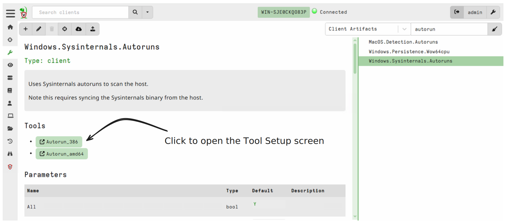
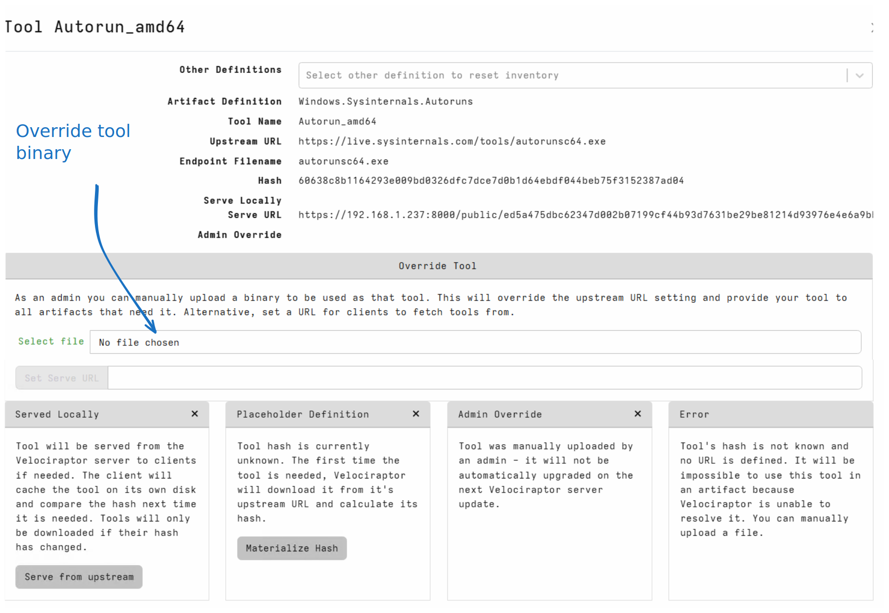
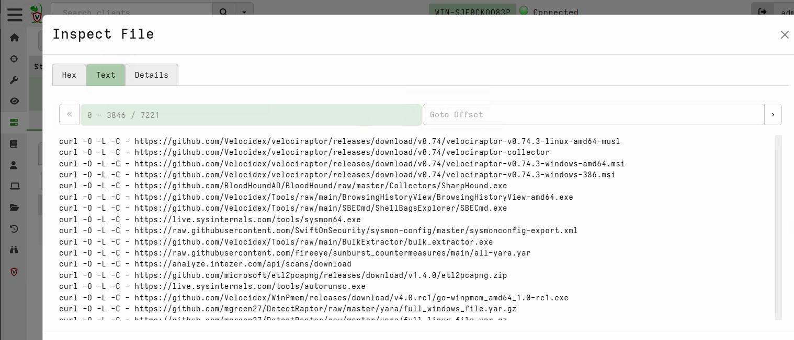
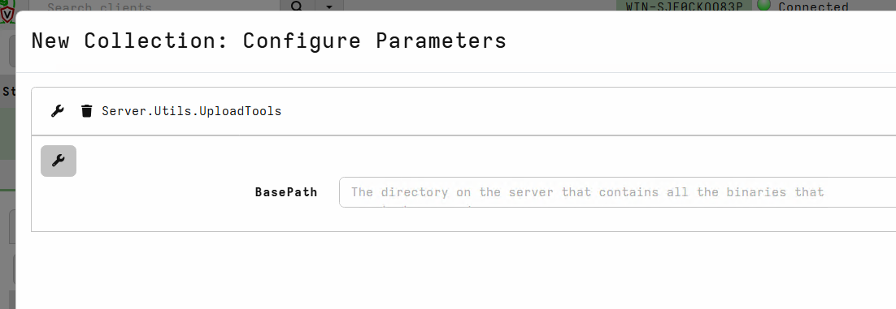

Velociraptor is a powerful endpoint visibility tool. It has plugins
and parsers for many file formats, such as raw NTFS access, raw
registry hive, prefetch files etc. One of the strengths of
Velociraptor is its flexibility afforded by the use of the[
Velociraptor Query Language (VQL).]()

However, as most DFIR professionals know, there are so many tools out
there that we would love to use in our IR work. Many of these tools
are not specifically designed to work in a fast evolving network
environment.

Velociraptor can orchestrate the use of these tools at scale, across
the network using the built in `Tools` support.

## How can Velociraptor manage and distribute tools?

Velociraptor push third party `tools` to the endpoint. In this
context, tools are third party binaries or other files (e.g. Yara Rule
files) that we want to make available on the endpoint.

Tools are managed via the `inventory service`. A part of Velociraptor
dedicated to keep track of `Tools`.

At a high level:

1. A `Tool` is file managed by the inventory service, known by its
   `Tool Name` and `Version` .

2. The Tool is defined as a dependency to a specific artifact in the
   artifact definition YAML.

3. When the artifact is scheduled for collection, Velociraptor ensures
   the tool is available for delivering to the endpoint by its `Tool
   Name`.

4. A Velociraptor administrator may override the tool with a different
   version and decide where the tool should be served from.

5. Once a tool is delivered to the endpoint, it is cached there for
   the next use of the artifact. If the tool changes since the time of
   last use, the new version is delivered to the endpoint
   automatically.

The built in tool support ensures that artifact writers do not need to
think about managing the tools, all the they need to do is simply
define the tool as a dependency of their artifact and then simply use
it in the VQL. The logistics of managing the tool, delivering it to
the endpoint, ensuring the correct version is present are all managed
by Velociraptor in a consistent way.

Let's examine how Velociraptor tools are implemented and used in
detail.

### Defining a tool

Before an artifact can use a managed tool, the artifact writer should
declare that tool as a dependency.

Let's look at a simple example of an artifact that uses a tool:

```
name: Linux.OSQuery.Generic

tools:
  - name: OSQueryLinux
    url: https://github.com/Velocidex/OSQuery-Releases/releases/download/4.4.0/osquery-4.4.0-linux-amd64
    serve_locally: true
    expected_hash: e3b0c44298fc1c149afbf4c8996fb92427ae41e4649b934ca495991b7852b855

parameters:
  - name: Query
    default: "SELECT * FROM osquery_info"

sources:
  - query: |
      LET result = SELECT * FROM foreach(row={
        SELECT OSPath
        FROM Artifact.Generic.Utils.FetchBinary(ToolName="OSQueryLinux")
      }, query={
        SELECT * FROM execve(
         argv=OSPath, "--json", Query],
         length=1000000)
      })

      SELECT * FROM foreach(row=result,
      query={
         SELECT * FROM parse_json_array(data=Stdout)
      })
```

The artifact defines a list of tools under the `tools:` section. Each
tool has a set of options:

* The `name` is the name of the tool that will be used in the artifact
  body itself.
* The `url` is where the tool can be downloaded from. Note that tools
  are not downloaded until the artifact is scheduled for the first
  time so it can be delivered to the endpoint.
* The `serve_locally` flag controls if the endpoint should fetch the
  tool from the Velociraptor server itself, or directly from the `url`
  declared above. Note that this is just the initial preference as this
  setting can be configured by the administrator later.
* The `expected_hash` declares the sha256 hash of the tool as fetched
  from the URL above. This extra control ensures that tool can not be
  replaced by the upstream publisher without the artifact writer being
  aware of it - this is a protection from supply chain attacks.

Of all the above options, only the `name` is mandatory. If the `url`
is not specified, then the server is unable to automatically fetch the
file on first use, therefore the artifact can not be scheduled until
the admin uploads a tool manually (see below). This is a valid
configuration for artifacts that use commercial tools that are not
widely distributed.

### Using a tool in the artifact

Once the tool is defined as a dependency, the artifact may use it via
the `Generic.Utils.FetchBinary` artifact:

```vql
  SELECT OSPath
  FROM Artifact.Generic.Utils.FetchBinary(ToolName="OSQueryLinux")
```

This artifact handles the logistics of managing the tool on the
endpoint:

1. Check the local cache on the endpoint for the presence of the tool.
2. If there is a cached version of the tool, then check the hash of
   the local file to ensure it matches the required hash.
3. If the local copy of the file is not present, or its hash does not
   match the required hash, the `FetchBinary` artifact fetches a new
   copy of the file.

If all goes well the `FetchBinary` artifact emits a single row with a
column `OSPath` of the local path on the endpoint to the file (this
will be in the Tools cache directory).

{}

In the above example, we iterate over the output of the `FetchBinary`
artifact using a `foreach()` plugin. This method is more defensive, as
if the tool fails to be fetched, the query will just do nothing:

```vql
LET result = SELECT * FROM foreach(row={
  SELECT OSPath
  FROM Artifact.Generic.Utils.FetchBinary(ToolName="OSQueryLinux")
}, query={
  ... Do stuff with OSPath
})
```

In many other artifacts we see a pattern like:

```vql
 LET binary <= SELECT OSPath
 FROM Artifact.Generic.Utils.FetchBinary(ToolName="OSQueryLinux")

 SELECT * FROM execve(
    argv=[ binary[0].OSPath, "--json", Query],
    length=1000000)
```

This works because `binary` is a list of rows so we index the first
row with `[0]` and take the `OSPath` column. However, this pattern is
not robust: If the tool fails to download `binary` will be an empty
list, and `binary[0].OSPath` will be `NULL`. This is dangerous because
the artifact will then attempt to execute a program called `NULL`
which is not the intention.

{}

Usually the output of the tool is processed by the artifact somehow,
for example, the tool may write output in JSON or CSV or simply create
some output files that the artifact uses `upload()` to deliver to the
server.

#### Generic.Utils.FetchBinary options

By default the `Generic.Utils.FetchBinary` will ensure the filename
ends with a `.exe` extension, which is required on Windows to be able
to run the tool, while on Unix like systems, the tool will be written
with the execute permission enabled.

If you are using the `Tools` mechanism to distribute non binary tools
(for example a `zip` file), the `.exe` extension can be unexpected
(and also trigger some security tools on the endpoint). Therefore you
can indicate to `FetchBinary` that the file is not an executable by
setting `IsExecutable` to `FALSE` or "N".

When `FetchBinary` decided to fetch the file from the server, a small
random sleep interval is added. This is to avoid overloading the
server during large hunts (which all will try to download the tool at
the same time). You can change the sleep interval with the
`SleepDuration` parameter if the tool is exceptionally large and might
overload the network.

Finally, if you prefer to not cache the tool locally, use
`TemporaryOnly` to prevent the tool from being locally cached. Note
that this will increase network load and delay re-collecting the same
artifact but might be appropriate for tool files which change
frequently (so caching them does not make sense).

### Managing tools

The previous sections showed how tools can be used in artifacts, but
typically Velociraptor administrators need to have more control over
the files that are distributed.

Tools are managed using the `Tool Setup` screen. You can get to the
`Tool Setup` screen whenever the artifact is shown (for example in the
`View Artifact` screen, or when selecting the artifact in new
collections).



Once the setup screen is open we can manage how tools are distributed



The following parts of the GUI are:

1. The `Tool Name` and `Artifact Definition` refer to the specific
   tool we are editing, and where it was defined.

2. It is possible to use the same tool in multiple artifacts which
   means it will be defined in multiple artifacts. However, only one
   definition is actually used at a time. The `Other Definitions` drop
   down shows where else the tool is defined, and allows us to switch
   to the relevant definition (and reset the tool definition back to
   the defaults).

3. The `Upstream URL` indicates where the tool originally resides. The
   server will attempt to fetch the tool from that URL prior to
   scheduling the artifact.

4. Once the tool is fetched (In Velociraptor terminology the tool is
   `Materialized`), the server is able to calculate the hash. This is
   the hash that endpoints will require prior to use of the tool.

5. In the case shown above, the tool is served locally (i.e. fetched
   from the Velociraptor server itself).

6. The `Serve URL` indicates which URL the endpoint will fetch the
   tool from. When served from Velociraptor itself, the URL will
   consist of an obfuscated URL based on the filename, served from the
   server's public directory.

7. The `Override Tool` section allows the administrator to override
   the way the tool is served. The user may upload their own binary
   which will be used as that tool through the GUI.

   Alternatively, the administrator can override the `Serve URL` to an
   external URL. This is useful when the tool is very large and we
   need to distribute it to a large number of hosts. Setting a `Serve
   URL` to be a cloud provider storage bucket for example will handle
   any issues of scale and bandwidth easily.

8. The `Served Locally` button can be used to toggle the tool from
   being fetched from the Velociraptor server, or from the upstream
   URL. Most upstream publishers (e.g. Github) have DDoS protection so
   using the tool in a hunt may trigger rate limiting when thousands
   of endpoints fetch the same file. You should consider delegating
   serving to a cloud provider as described earlier.

{}

There is no authentication required to fetch URLs from the
Velociraptor public directory, only the knowledge of the obfuscated
URL itself. This means that the URL is in itself a form of shared
secret.

{}

## Managing tools in restricted environments.

Many environments are locked down and it is not possible to the
Velociraptor server to reach out to fetch tools on
demand. (i.e. egress access is blocked).

In these environments, we need to manually pre-populate the inventory
service with the binaries of all the tools we would like to use in
advance. This also gives us the opportunity to curate the tools that
will actually be allowed.

To assist with this task, use the [Server.Utils.UploadTools]() server
artifact.

Collecting the artifact with no parameters will generate a batch
script that downloads all the required binaries in all tool
definitions in all currently loaded artifacts.



Place the uploaded files into a directory on the server, one can
re-import them by running the same artifact and setting the directory
as a parameter:




## Working with the tools inventory via the CLI

{}
