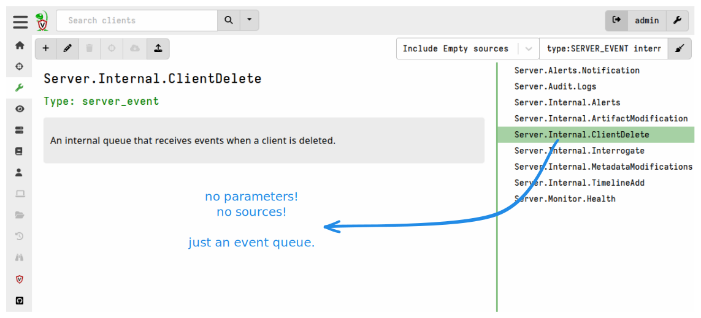
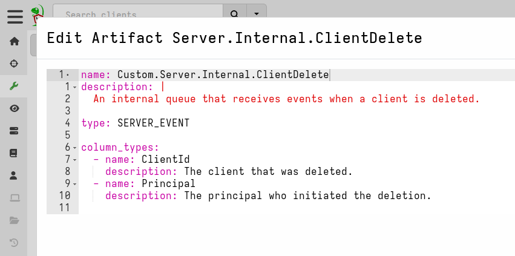
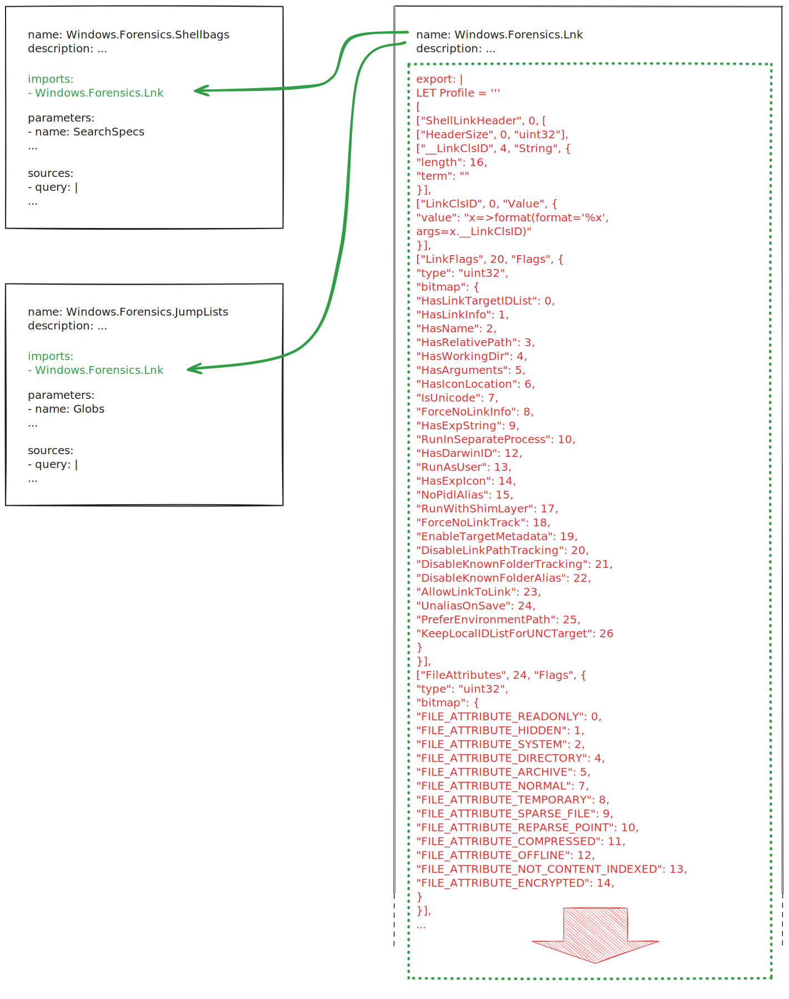
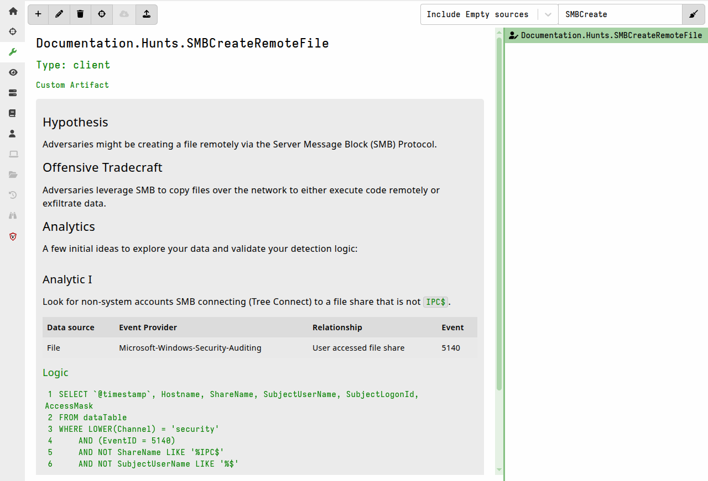

While you can learn a lot about what artifacts are usually used for by looking
through the [hundreds of artifacts]()
that ship with the Velociraptor binary, there are certainly many more use cases
-- including ones that nobody has even thought of yet!

Artifacts are a powerful mechanism for encapsulating information, including but
not limited to VQL.

## Wrapper Artifacts

Using the `Artifact` plugin, you can
[call other artifacts]().
A common use for this is to create "wrapper artifacts" which can:

- combine multiple artifacts into a single artifact
  ```yaml
  name: Windows.Packs.Persistence
  description: This artifact pack collects various persistence mechanisms in Windows.
  sources:
    - name: WMI Event Filters
      query: SELECT * FROM Artifact.Windows.Persistence.PermanentWMIEvents()
    - name: Startup Items
      query: SELECT * FROM Artifact.Windows.Sys.StartupItems()
    - name: Debug Bootstraping
      query: SELECT * FROM Artifact.Windows.Persistence.Debug()
  ```
- add additional sources to an existing artifact
  ```yaml
  name: Generic.Client.DiskSpace.Extra
  sources:
    - name: DiskSpace
      query: SELECT * FROM Artifact.Generic.Client.DiskSpace()
    - name: ExtraInfo
      query: SELECT * FROM ...
  ```
- filter or manipulate results from other artifacts
  ```yaml
  name: Custom.Autoruns.ServicesCompsec
  sources:
    - query: |
        SELECT * FROM Artifact.Windows.Sysinternals.Autoruns()
        WHERE Category =~ "Services" AND `Launch String` =~ "COMSPEC"
  ```
- provide custom parameter defaults (i.e. your own "presets") to other
  artifacts
  ```yaml
  name: Find.DotnetStartupHooks
  description: Finds DOTNET_STARTUP_HOOKS using Windows.Search.FileFinder
  parameters:
    - name: SearchFilesGlobTable
      type: csv
      default: |
        Glob
        HKEY_USERS\*\Environment\DOTNET_STARTUP_HOOKS\*
        HKEY_LOCAL_MACHINE\SYSTEM\CurrentControlSet\Control\Session Manager\Environment\DOTNET_STARTUP_HOOKS\*
    - name: Accessor
      default: registry
    - name: Upload_File
      default: Y
  sources:
    - precondition: SELECT OS From info() where OS = 'windows'
      query: |
        SELECT * FROM Artifact.Windows.Search.FileFinder(SearchFilesGlobTable=SearchFilesGlobTable,
                                                        Accessor=Accessor,
                                                        Upload_File=Upload_File)
  ```
- simplify UI parameter choices for users by only presenting them with
  parameters that you want them to change, while hiding and defining preset
  values for parameters that you _don't_ want them to change
  ```yaml
  name: Find.DotnetStartupHooks
  description: Finds DOTNET_STARTUP_HOOKS using Windows.Search.FileFinder
  parameters:
      # This parameter can be customized by the user
    - name: SearchFilesGlobTable
      type: csv
      default: |
        Glob
        HKEY_USERS\*\Environment\DOTNET_STARTUP_HOOKS\*
        HKEY_LOCAL_MACHINE\SYSTEM\CurrentControlSet\Control\Session Manager\Environment\DOTNET_STARTUP_HOOKS\*

      # This parameter is hidden from the user
    - name: Accessor
      default: registry
      type: hidden

      # This parameter is hidden from the user
    - name: Upload_File
      default: Y
      type: hidden
  sources:
    - precondition: SELECT OS From info() where OS = 'windows'
      query: |
        SELECT * FROM Artifact.Windows.Search.FileFinder(SearchFilesGlobTable=SearchFilesGlobTable,
                                                        Accessor=Accessor,
                                                        Upload_File=Upload_File)
  ```

Wrapper artifacts can be used as a way to limit users' access to built-in
artifact capabilities by using the above methods and then also
[hiding the called artifact]()
from the GUI. In addition you could consider applying the security mechanisms
described [here]() which allow
low-privilege users to only run certain "Basic" artifacts.

## Utility Artifacts

The last example showed how to make an artifact that performs a very specific
task by wrapping the functionality contained in the more general-purpose
`Windows.Search.FileFinder` artifact. In that context, the called artifact
serves as a utility for the calling artifact.

The calling artifact in the previous example contained much simpler logic than
the called artifact, however that's not always the case: the
`Windows.KapeFiles.Targets` artifact is an example of a relatively complex
artifact that wraps the much simpler `Generic.Collectors.File` utility artifact.

Another utility artifact that you may often encounter is
`Generic.Utils.FetchBinary`. This artifact contains VQL which ensures the
delivery of [third-party tools]() to the
endpoint, so you will see it called in just about every artifact that uses
tools. These artifacts could easily have implemented the same logic to ensure
tool delivery, but it is cleaner, more efficient, and more consistent to offload
the logic to a purpose-built artifact that can be reliably reused.

Artifacts designed to be used as utilities (sometimes also referred to as
"helper" artifacts) might not be intended to be collected directly, and this may
influence the design of the artifact. For example, the
`Generic.Utils.FetchBinary` artifact is not intended to be collected directly
and therefore doesn't need to be particularly user-friendly. To avoid confusing
users with such artifacts you could choose to
[hide these artifacts](),
as mentioned previously. Hidden artifacts can still be called from other
artifacts.

## Server "Bootstrap" Artifacts

#### Server initialization config options

Instead of using the GUI to configure the collection of `CLIENT_EVENT` and
`SERVER_EVENT` artifacts, we can preconfigure these items via the config.

The config settings which provide this are:

- `Frontend.default_client_monitoring_artifacts`: specifies the initial client
  monitoring table that will be created.

  By default, Velociraptor collects endpoint CPU and Memory telemetry from all
  clients using the `Generic.Client.Stats` artifact. You can remove this, or
  specify a different set of `CLIENT_EVENT` artifacts to collect.

- `Frontend.default_server_monitoring_artifacts`: specifies an initial set of
  `SERVER_EVENT` artifacts that will be set in the server monitoring table and
  thus collected.

  By default, we collect only the `Server.Monitor.Health` artifact.

The config also allows us to define users and orgs that will be created when the
server is first run, using the following settings:

- `GUI.initial_users`

- `GUI.initial_orgs`

#### Going beyond the config options

While the options described above may be sufficient for some server setup
situations, we may want to automate many other things during setup so that we
don't have to rely on time-consuming and potentially error-prone manual
configuration via the GUI.

One of the limitations of the config settings in the previous section is that
you can't specify custom parameter values for your default monitoring artifacts.

To overcome these limitations and allow for almost unlimited flexibility,
Velociraptor allows us to specify
[startup artifacts]()
via the config setting:

- `Frontend.initial_server_artifacts`

This setting allows us to specify one or more `SERVER` artifacts that will be
run when the Velociraptor server is started for the very first time. The server
detects that it is being run for the first time by checking for the presence of
the file `config/install_time.json.db` in the datastore: if the file is not
found then the server assumes it's the first time it is being run.

Since this setting allows us to run artifacts on the server, this gives us
access to the full capabilities of VQL in setting up the server. There are many
VQL functions that can be useful when initializing a new server which don't have
equivalent config settings.

We could, for example:

- create users _and_ customize user profiles using the `user_create` and
  `user_options` functions.
- create orgs.
- create and start [hunts]() using the `hunt_add`
  function.
- create [notebooks]() using the `notebook_create`
  function (based on custom notebook templates).
- configure client monitoring using the `set_client_monitoring` function or
  server monitoring using the `set_server_monitoring` function.
- run [server artifacts which import other artifacts]()
- run [artifacts which define and download tools]()
  to the server's tool inventory \
  (or we could add/update tools using VQL's `inventory_add` and `inventory_get`
  functions).

Because we can specify multiple server artifacts in the
`initial_server_artifacts` setting, we might choose to have several artifacts
where each one addresses a particular aspect of server initialization, or we
could have one larger "bootstrap" artifact that does everything we want.

These artifacts are just normal server artifacts which can be developed and
tested by running them in the "Server Artifacts" screen in the GUI (obviously on
a non-production/development server!).

These initial server artifacts can also
[call other artifacts]()
(either built-in or custom) to aid in the setup process.

Custom artifacts, as well as the "bootstrap" artifacts themselves, can be
[embedded in the config or loaded from a folder]().


## Client startup artifacts

Sometimes we may want the client to do something very early on, as soon as it
starts and potentially even before client enrollment.

Such startup tasks could be, for example:

- copying a file from the network
- cleaning up some old files
- setting up or starting a VPN client (perhaps to enable the client to connect
  to the server)
- adding an anti-malware exclusion (see for example
  [Windows.Utils.DefenderExclusion]())

The `Client.additional_event_artifacts` configuration item allows us to do this
by specifying artifacts that should run when the client starts. Although these
artifacts are run as event artifacts (never expected to terminate), they can
contain any valid client-side VQL.

These artifacts will run every time the client starts, even before enrollment.
Because client artifacts are normally delivered from the server -- and in this
case the client might not have enrolled with the server yet -- this setting
generally requires the artifacts to be included in the client config's
`autoexec.artifact_definitions` section.

If these artifacts are run before enrollment then the data produced will be
queued and delivered to the server after enrollment, as event queries. To ensure
that the server has a corresponding
[event queue]()
to receive these events, you'll also need to also add the artifact to the
server's artifact repository.


## Sourceless Artifacts

Artifacts can have ZERO or more sources. It may seem strange at first to think
about having artifacts with no sources, however this allows for some interesting
use cases.

We have already seen that
[notebook templates]()
are a special use case for artifact definitions. While notebook templates do
have sources, these sources contain templates for notebook cells rather than
just queries. The notebook cell templates themselves may or may not contain
queries.

Furthermore, if you've spent any time looking through the list of built-in
artifacts, you may have noticed several that have little to nothing but an
artifact name. The purpose of such artifacts is to establish
[event queues]()
on the server, which intercept and queue messages from clients and from the
server itself. These artifacts _can_ have sources, which would typically do
something with the event messages, but they aren't required to have sources; for
example, other artifacts may be created to act on the event queue's messages.





Artifacts without sources cannot be directly launched via the GUI and are also
filtered out from all the preset
[filter views]()
on the Artifacts screen, except for the filter category "Include Empty Sources".
This filter will show all artifacts including those that don't have sources.
This aspect is useful because it means you can define sourceless artifacts
without them being collectible, and therefore such artifacts don't clutter
artifact selection lists or confuse users.

### Export-only artifacts (sharing VQL via export-imports)

An artifact with no sources and an
[export]() section can be used:
  - for defining shared variables or "constants"
  - for defining shared custom functions and plugins

This can help ensure consistency across artifacts and simplify artifacts that
have large sections of generically reusable code. In particular, artifacts that
include binary parser profiles can be difficult to read because you first have
to scroll past the potentially very long profile definition to get to the VQL.
Putting such lengthy blocks into a sourceless artifact's export section and
then importing it when needed makes the latter artifact much more user-friendly.



Ultimately when the _importing_ artifact is collected the imports are resolved
and the compiled artifact is sent to the client which includes the imported VQL,
so there is no saving in terms of network bandwidth. It just improves legibility
and code consistency.

### Event queues

An artifact with no sources can be used to define server and client
[event queues]().

These may have sources, but can still be useful without them, as demonstrated by
the `Server.Internal.ClientDelete` artifact shown above.

### Documentation

Artifacts with no sources and only
[informational fields]()
can be used to store internal documentation; particularly since the
`description` field [supports Markdown]()
and is indexed and searchable in the GUI.

You could perhaps use it to store Velociraptor SOP documentation or other
DFIR-related information that could be useful to the team working on your
server.

As mentioned above, artifacts without sources cannot be directly launched via
the GUI and are also filtered out from all the preset filter views on the
Artifacts screen, which means that you can create such artifacts without them
being collectible, and without them appearing on artifact selection lists where
they might confuse users.



### Standalone Tool definitions

It is possible to use a single sourceless artifact to store all your tool
definitions, which can then be referred to (using only the name and optionally a
version number) in other artifacts that use those tools.

In fact Velociraptor itself takes this approach with the built-in
`Server.Internal.ToolDependencies` artifact, which is used to provide tool
definitions for the other Velociraptor binaries so that they are available for
tasks such as creating offline collectors.

If you define such an artifact as a `SERVER` artifact then running it will
download the tools from the URLs specified in the tool definitions. This
provides a quick way to ensure that your server's tools inventory is populated
with all the tools that your `CLIENT` artifacts will need _before_ you collect
those artifacts.

Manually collecting such an artifact also serves as a way to update all the
tools defined in the artifact, as it will re-download them when `serve_locally`
is set to `true`.

You can additionally use such an artifact as one of your
"[server bootstrap artifacts]()",
as described above.


