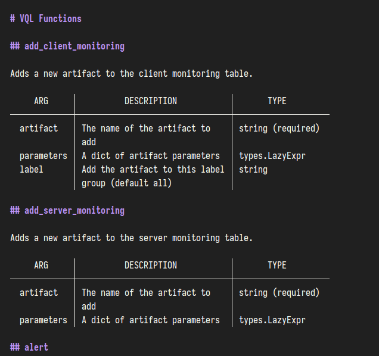
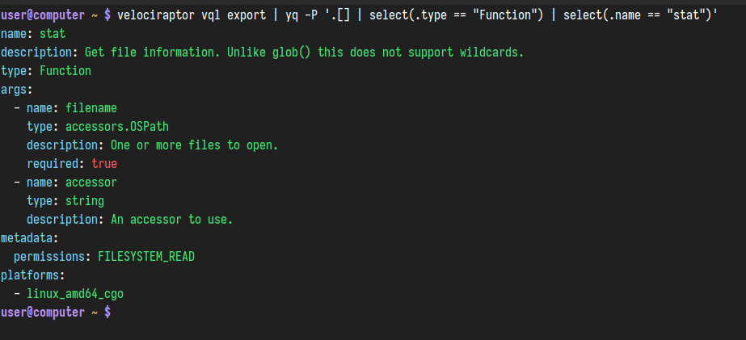

Velociraptor offers many features via it's command line interface (CLI).

In addition to functioning as a client or server, the binary also provides
several utility functions that are accessible on the command line, which in many
cases are CLI equivalents of functions that are available in VQL.

You can also do investigation of the local system using the CLI alone, as
described [here](),
[here]() and
[here]().

## General command syntax

Velociraptor's CLI commands generally consist of a command and optionally a
subcommand, using a subject-verb syntax. For example `config show`.

There are [global flags]() that can be used with
any command, and also flags which are specific to each command and
subcommand.

## How to get help for commands

You can use the `-h` flag or the `help` command with all Velociraptor commands
to see available options and usage details.

- `velociraptor <command> -h` or
- `velociraptor help <command>`
will provide help for a command or command group.

For subcommands:

- `velociraptor <command> <subcommand> -h` or
- `velociraptor help <command> <subcommand>`
will provide help for a specific subcommand.

You can print a short listing of help for all commands by using the `-h`
flag:
- `velociraptor -h`

You can print a more verbose listing of help for all commands by using the
`--help-long` flag:
- `velociraptor --help-long`

A huge list of command line flags and environment variables are supported - too
many to show in the standard help listing. To see all of these, set the
environment variable `DEBUG=1` before running the help command:

`DEBUG=1 velociraptor -h`

## How to get VQL help

For those situations where you're working in a bunker without internet access.

### [ vql list ]

Prints the reference documentation for all VQL plugins, functions and accessors
in Markdown format.

Can be piped through [Glow](https://github.com/charmbracelet/glow) to page it
and pretty-print it.

For example:

```sh
velociraptor vql list | glow -p
```


### [ vql export ]

Prints the reference documentation for all VQL plugins, functions and accessors
in YAML format.

The output can be piped through [yq](https://github.com/mikefarah/yq) to filter,
transform, or pretty-print it.

For example:

```sh
velociraptor vql export | yq -P '.[] | select(.type == "Function") | select(.name == "stat")'
```


## Autoexec mode and post args

Velociraptor has the ability to embed config and files in its binary when using
[the `config repack` command]().
When the binary is run without any CLI commands it first checks whether it has
an embedded config and if it does then it loads it. A special section in the
config, named `autoexec.argv`, tells the binary what command line (including
flags) to execute. This config section can also store custom artifacts.
This is how [offline collectors]()
work.

- When the binary is run ***with*** CLI commands it executes them, and ignores any
  commands potentially contained in the embedded config.

- When the binary is run ***without*** any CLI commands and it has an
`autoexec.argv` spec which it can execute, then it does so.

But what if you want it to load the autoexec section but change it's behavior
with additional CLI flags?

For that special case we have a special CLI argument: `--`

This special argument separates the CLI arguments into pre and post args. Post
args will be appended to any that are in the embedded autoexec command line,
while still allowing the autoexec spec to load and execute it's commands (if it
has any).

As a concrete example, suppose we have created an offline collector named
`velociraptor_collector.exe`. If we just run it without any args it does it's
offline collector business and we can't change how it runs. If we run it with
CLI arguments then it's just a normal binary - without any offline collector
functionality.

But what if we want it to add `--nobanner` to the autoexec command line to hide
the Velociraptor banner? We can do this by adding `-- --nobanner` to the command
line. This causes the embedded config to be loaded and the `autoexec.argv`
command line to be executed, but it now appends our new flag to the command
line.

```text
velociraptor_collector.exe -- --nobanner
```

This causes the banner to be hidden while the offline collector behaviour
otherwise continues according to the embedded spec.

{}

When installed as a service, Velociraptor's datastore directory is owned by the
service account named `velociraptor` and accessible to the `velociraptor` user
group. New users often overlook this fact and create files in the datastore
using their own user account or the `root` account, which means that the
Velociraptor service cannot read them.

Some CLI commands work directly with files in the datastore, which can result in
them being inadvertently owned by your user account. You can avoid creating
permissions problems by switching to the `velociraptor` user. On most Linux
systems this can be done with the command `sudo -u velociraptor bash`.

{}

## Learn about the commands available in the CLI

{}
