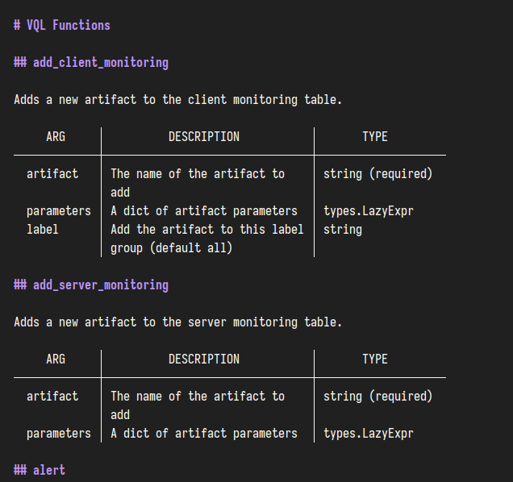
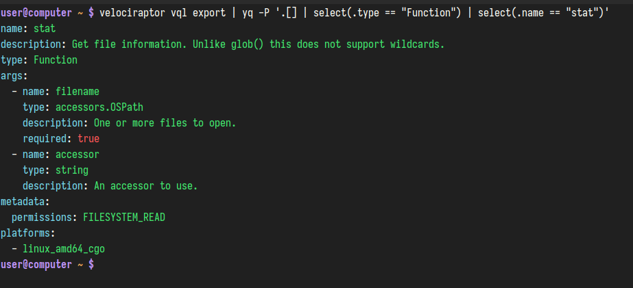

Velociraptor offers many features via its command line interface (CLI).

In addition to functioning as a client or server, the binary also provides
several utility functions that are accessible on the command line, which in many
cases are CLI equivalents of functions that are available in VQL.

You can also do investigation of the local system using the CLI alone, as
described in the [deployment options](/docs/deployment/#command-line-investigation-tool),
[artifact collection](/docs/cli/commands/artifacts/#-artifacts-collect-), and
[query command](/docs/cli/commands/query/) page.

{}

When installed as a service, Velociraptor's datastore directory is owned by the
service account named `velociraptor` and accessible to the `velociraptor` user
group. New users often aren't aware of this fact and run CLI commands on the
server which accidentally create files in the datastore using their own user
account or the `root` account. These files are subsequently inaccessible to the
Velociraptor service which may then fail to start.

Some CLI commands work directly with files in the datastore, which can result in
them being inadvertently owned by your user account. You can avoid creating
permissions problems by switching to the `velociraptor` user. On most Linux
systems this can be done with the command `sudo -u velociraptor bash`.

{}

## General command syntax

Velociraptor's CLI commands generally consist of a command and optionally a
subcommand, using a subject-verb syntax. For example `config show`.

There are [global flags](/docs/cli/flags/) that can be used with
any command, and also flags that are specific to each command and
subcommand.

## How to get help for commands

You can use the `-h` flag or the `help` command with all Velociraptor commands
to see available options and usage details.

- `velociraptor <command> -h` or
- `velociraptor help <command>`
will provide help for a command or command group.

For subcommands:

- `velociraptor <command> <subcommand> -h` or
- `velociraptor help <command> <subcommand>`
will provide help for a specific subcommand.

You can print a short listing of help for all commands by using the `-h`
flag:
- `velociraptor -h`

You can print a more verbose listing of help for all commands by using the
`--help-long` flag:
- `velociraptor --help-long`

Velociraptor supports many command line flags and environment variables -
too many to show in the standard help listing. To see all of these, set the
environment variable `DEBUG=1` before running the help command:

`DEBUG=1 velociraptor -h`

## How to get VQL help

For those situations where you're working in a bunker without internet access.

#### [ vql list ]

Prints the reference documentation for all VQL plugins, functions, and accessors
in Markdown format.

Pipe the output through [Glow](https://github.com/charmbracelet/glow) to page it
and pretty-print it.

For example:

```sh
velociraptor vql list | glow -p
```


#### [ vql export ]

Prints the reference documentation for all VQL plugins, functions, and accessors
in YAML format.

Pipe the output through [yq](https://github.com/mikefarah/yq) to filter,
transform, or pretty-print it.

For example:

```sh
velociraptor vql export | yq -P '.[] | select(.type == "Function") | select(.name == "stat")'
```


## Running artifacts on the command line

**Run mode** (`-r` or `--run` flag) lets you collect any
Velociraptor artifact directly from the terminal as if it were a
standalone CLI command. It supports local collections on the
current machine as well as remote collections on the server or on
clients via the Velociraptor API.

Run mode provides a simpler syntax than the equivalent
`artifacts collect` command — artifact parameters are passed as
direct flags instead of `--args Key=Value` pairs.

See the [Run mode](/docs/cli/run/) page for syntax, examples,
and remote collection details.

## Autoexec mode and post args

Autoexec mode lets you embed a default command line and custom artifacts
directly into the Velociraptor binary using the
[`config repack`](/docs/cli/commands/config/#-config-repack-) command.
[Offline collectors](/docs/deployment/offline_collections/) use this
mechanism.

The embedded config's `autoexec.argv` section specifies the default CLI
arguments. The binary follows these precedence rules:

- When run **with** CLI commands: the commands are executed and
  `autoexec.argv` is ignored.
- When run **without** CLI commands: if an `autoexec.argv` section exists,
  it is executed.

### The `--` pseudo-flag

The `--` pseudo-flag solves a specific problem: running the binary without
any CLI arguments triggers autoexec mode, but adding any CLI command causes
autoexec to be skipped. The `--` pseudo-flag lets you append extra flags
without supplying a command, so autoexec mode still activates.

For example, consider an offline collector binary that contains this
`autoexec.argv` section in its embedded config:

```yaml
autoexec:
  argv:
  - artifacts
  - collect
  - Collector
  - -v
  - --require_admin
```

Without any arguments, the binary runs `artifacts collect Collector
-v --require_admin`. To add `--nobanner` and `--prompt` to that command
line, use `--` followed by the extra flags:

```sh
velociraptor_collector.exe -- --nobanner --prompt
```

Because no CLI command appears before `--`, autoexec mode activates. The
post args are appended to the `autoexec.argv` command line, making it
equivalent to the following config:

```yaml
autoexec:
  argv:
  - artifacts
  - collect
  - Collector
  - -v
  - --require_admin
  - --nobanner
  - --prompt
```

Which produces the effective command line:

```sh
velociraptor_collector.exe artifacts collect Collector -v --require_admin --nobanner --prompt
```

This modifies the offline collector behaviour slightly but it
otherwise continues according to the embedded spec.

Autoexec mode can be used in a lot of novel ways besides the usual
offline collector use case. So this method of tweaking the command
line allows you to use any of the global or command-specific
[CLI flags](/docs/cli/flags/).

Any global or command-specific [CLI flags](/docs/cli/flags/) can be
used as post args.

Note that if a flag is specified in `autoexec.argv` then it can't be
negated or overridden. You can only _add_ flags that have not already
been used.

## Learn about the commands and flags available in the CLI

{}
