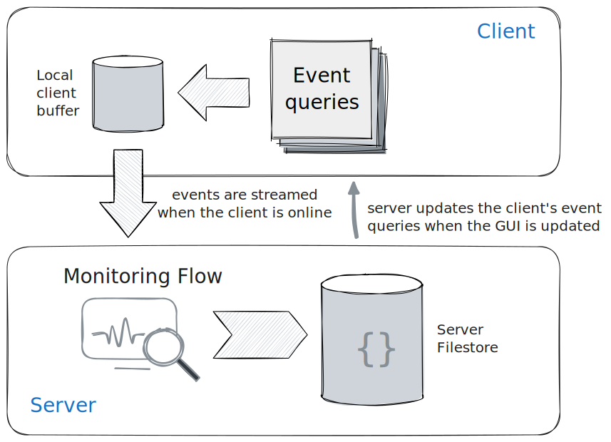
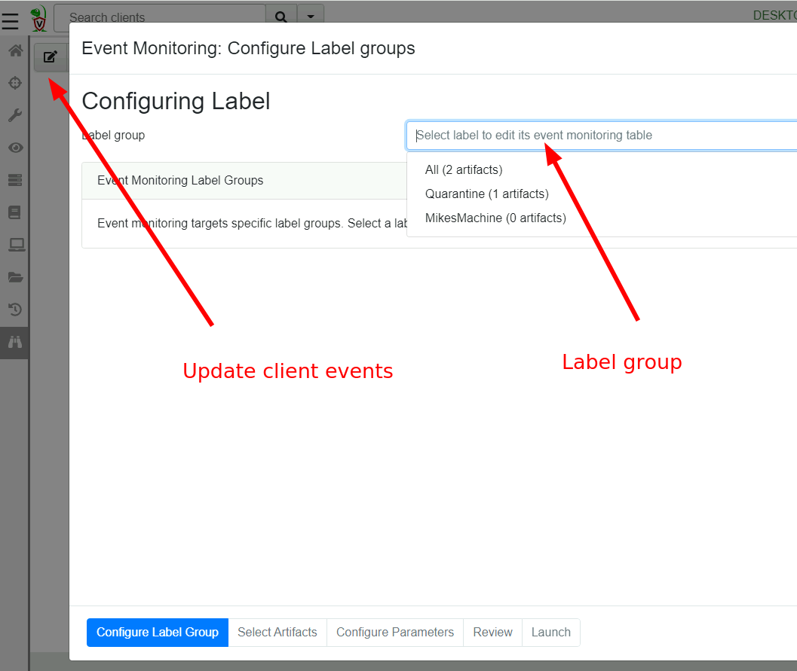
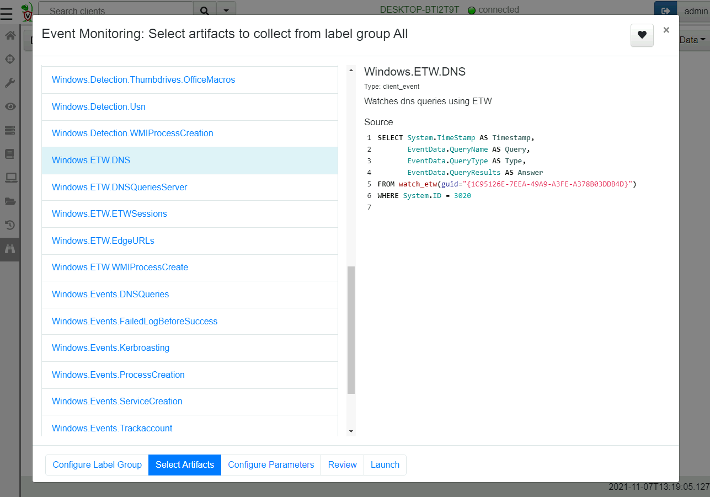
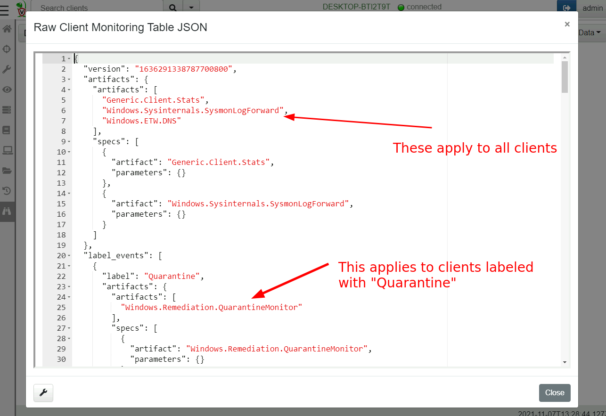
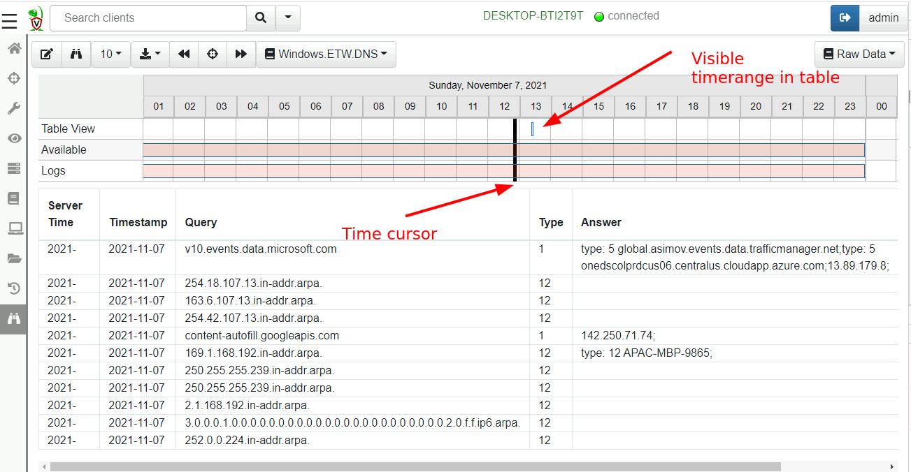
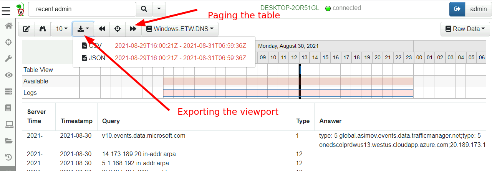

We have previously seen the VQL [Event Queries]() are simply VQL queries that never terminate,
generating a row for each event that occurs.

We can use this property to monitor for events on the endpoint. In
order to build an effective client monitoring framework we need three
components:

1. A number of event plugins that can detect events on the
   endpoint. For example, `watch_etw()` allows Velociraptor to monitor
   ETW events on Windows, `watch_syslog()` allows following syslog
   events on Linux etc.

2. Once events are detected by VQL plugins, we can use the rest of the
   VQL query to post process these events by applying further
   filtering or enriching with additional data.

3. Finally a client monitoring architecture must be used to ensure
   event queries are always running and forward these events to the
   server.

In this page we discuss the client monitoring architecture and
demonstrate how it can be used to feed events from the endpoint to the
server.

{}

VQL event plugins generally start with the word "watch" to indicate
they are event plugins (e.g. `watch_etw`, `watch_evtx`, `watch_usn`
etc). Sometimes there will be a related non-event plugin for example
`parse_evtx()` simply parses the event log file beginning to end,
while `watch_etvx()` watches the file for new events and does not
terminate.

You can search for all plugins on the [VQL Reference page](), so simply read about all available event queries [here]().

{}

## Client monitoring architecture

The client maintains a set of VQL Event Queries that are all run in
parallel. This is called the `Client's Event Table` and it gets synced
from the server when needed. The client writes these Event Queries in
the `writeback file` so they become available as soon as the client
starts - even when not online!

If the client is offline, these will be queued in the client’s local
file buffer, until the client reconnects again, at which time they are
synced back to the server. This architecture ensures that clients can
not lose events, event when not online. It also means that clients are
able to monitor for events autonomously - the server is only needed to
refresh the client's event tables.

When any of these produce rows, the client streams the events to the
server which in turn, writes them to the filestore.

## Installing client event queries.

Each client has a set of event queries that it is constantly running
called an `Event Table`. The server can update the client's event
tables based on client labels:

* Event Artifacts within label group "All" apply to all clients
  regardless of label or OS type (Note that artifact preconditions are
  still honored).

* Event Artifacts can target specific label groups. If the client has
  that label applied, the event table for that client will include
  these event artifacts as well.

{}

Note that label group membership is dynamic - clients may be added or
removed from label groups at any time by simple applying or remove the
relevant label. Applying a label to a client automatically updates the
client event monitoring queries as well.

In this way it is possible to move clients into label groups that
require different monitoring queries - for example perhaps you wish to
monitor only some of your end points for powershell or psexec
executions some of the time, simply apply the relevant label.

{}

## Selecting event artifacts to apply

Velociraptor uses an "Artifact" to package VQL queries in a structured
YAML file. Event queries are no different - they are contained within
`Event Artifacts`. In the next step we can select which artifacts will
be applied to this label group.

For this example, we select the `Windows.ETW.DNS` artifact to collect
DNS lookup from clients.

{}

While the artifact selection UI might look very similar to the new
collection UI or new hunt UI, the main difference is that the artifact
selection UI in the Event selection workflow only shows event
artifacts.

Event artifacts are identified by their `type: CLIENT_EVENT` entry in
the definition YAML.

If you add a new event artifact, be sure to designate it as a
CLIENT_EVENT type or else it will not appear in the UI and the user
can not select it.

{}

## Inspecting the current monitoring table

The current configuration can be viewed by simply clicking the "Show
client monitoring table" button.

## Viewing collected events.

Once the client syncs its client monitoring table, it will start
forwarding events to the server. Events are simply rows returned by
the VQL query. The server simply stores these rows in the filestore
and provides a timeline based UI to inspect the data.

The view is split into two halves. The top half is the timeline view
while the bottom half is the table view. The events can be viewed in
the table, while the timeline view provides a quick way to navigate
different time ranges.

You can see the timeline view is split into three rows:

1. `Table View` visualizes the time range visible in the table currently.
2. `Available` shows the days which have any events in them.
3. `Logs` visualizes the days that have any logs in them (You can view query logs by selecting the `Logs` pull down on the top right).

In order to keep the table brief the timestamps are abbreviated - you
can hover the mouse over those to get the full timestamp. Usually the
exact timestamp in the table is not important as we can see a
visualization of the time range in the timeline above.

You can zoom in and out of the visible time ranges using `Ctrl-Mouse
Wheel` or by clicking the timeline itself.

By clicking the tool bar it is possible to page through the table to
view visible events. If you need to export the data, simply click the
`Export` button and select either JSON or CSV format. The export
functionality applies to the visible time range so you can finely tune
which events should be exported (simply zoom the visible range in or
out).

{}

Although VQL queries emit rows in real time, Velociraptor does not
forward the event row immediately to the server. This is done to avoid
too-frequent communications with the server. Instead, the client will
batch rows in memory (by default for 120 seconds) and send them in a
single POST upload. This means that it could take up to 2 minutes for
events to appear at the server once a new client event table is
installed.

{}

## Further processing client monitoring events.

Client event queries simply run on the endpoint and forward rows to
the server. The event queries generally fall into two types:

1. Collecting real time data such as ETW logs, process executions
   logs, Sysmon logs etc. These are typically collected by
   Velociraptor and sent directory to an external system (e.g. Elastic
   or Splunk). Typically the VQL for such queries contains minimal
   filtering and simply forwards all events to the server.

2. Selective and targeted queries. These artifacts contain refined
   detection and enrichment log within the VQL query itself such that
   only high value events are actually forwarded. These more targeted
   queries send few rows but when an event is detected, it probably
   should be escalated.

In either case, Velociraptor itself does not do anything with the
events collected by default, other than write them to storage. Further
server side processing is needed using [server side event queries]().
