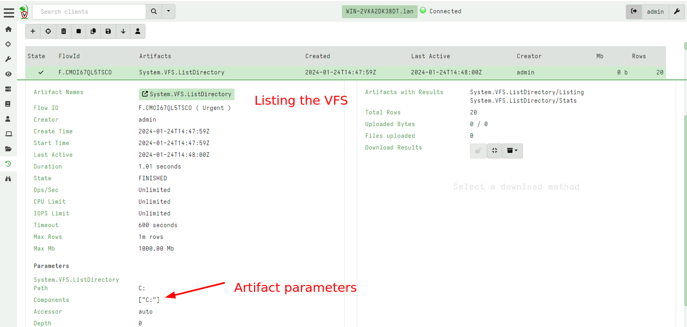
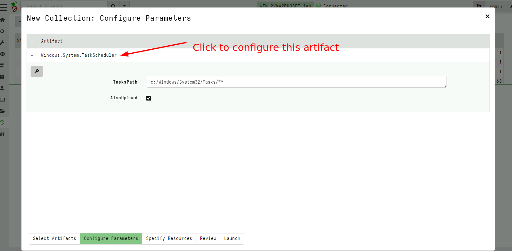
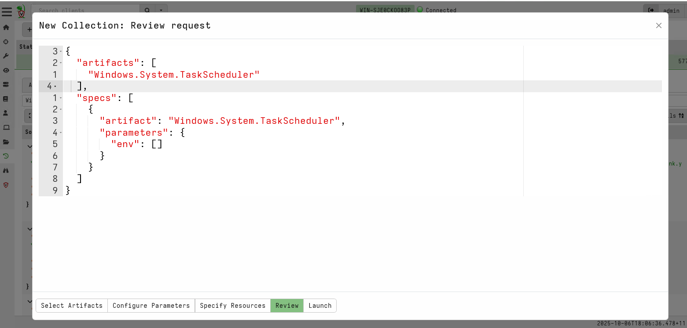
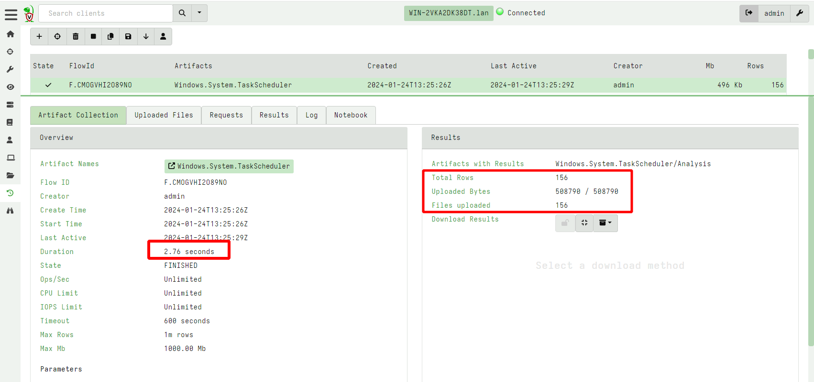
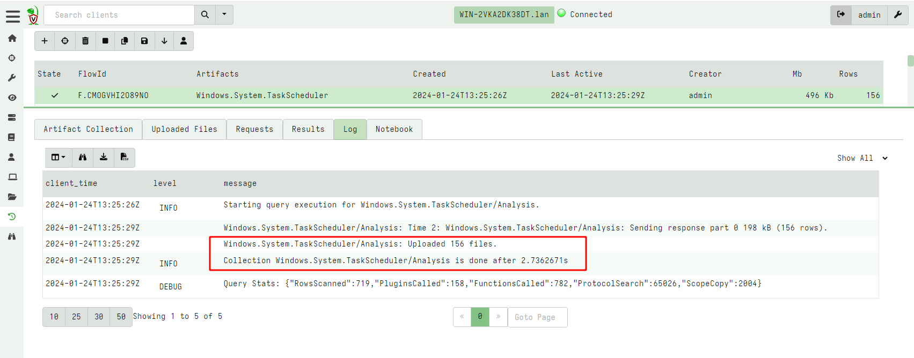
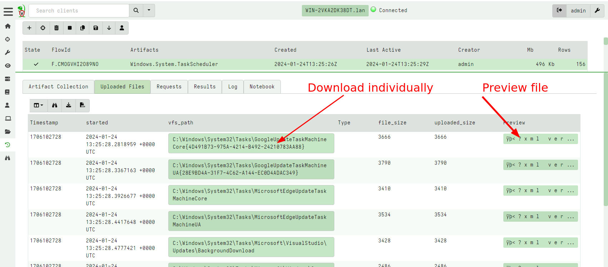
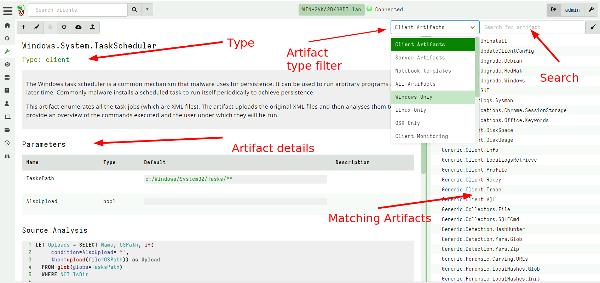
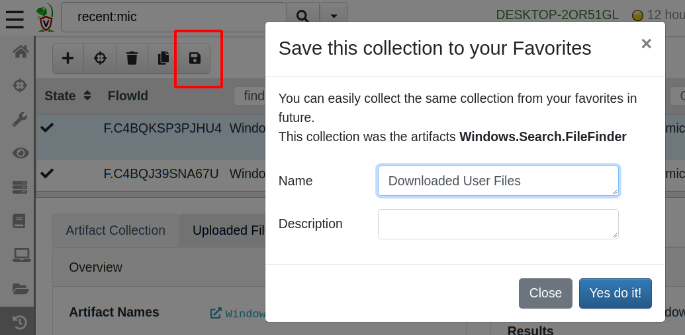

Velociraptor's superpower is a powerful query language termed
**VQL**. You might be surprised to learn that you have already been
using VQL all this time. When clicking in the VFS interface to sync a
directory listing or download files, the GUI was collecting artifacts
behind the scenes.

Click on the **Collected Artifacts** sidebar screen to view the
artifacts that have been collected so far.

This screen consists of two panes - the top pane shows a list of all
the **Artifacts** collected so far from this endpoint, while the bottom
pane shows information about the selected artifact.

All artifacts have a **Name**. In our example, you can see that we
have been collecting `System.VFS.DownloadFile` and
`System.VFS.ListDirectory` in order to populate the VFS screen.

Each artifact collection has a unique `Flow ID`, which is how
Velociraptor refers to a collection. The collection is created at a
certain time and starts some time later. If the client is offline, the
collection will start when it comes back online.

Collections also take parameters. In the previous example, the
`System.VFS.ListDirectory` artifact was used to list the directory
"C:\Users\test".

A collection of artifacts can return rows or upload
files. This is because an artifact is simply a VQL query and all
queries return a sequence of rows.

## Example: collect scheduled tasks from endpoint.

To illustrate how artifacts can be used, let's collect a common
forensic artifact from our Windows endpoint. Windows allows commands
to be scheduled in the future. These tasks are typically stored in the
`C:\Windows\System32\Tasks` directory as XML files.

While it is nice to know the details behind where the scheduled tasks
are stored and how to parse them - this is completely unnecessary with
Velociraptor, since we have a built-in artifact ready to collect and
parse these tasks!

In the following I will walk through the steps for scheduling a new
`Windows.System.TaskScheduler` collection.

### Initiating a new collection

Start a new collection by clicking the **New Collection** button <i
class="fas fa-plus"></i>. This will open the new collection wizard as
show below.

The Wizard contains a number of steps but you can skip them if they
are not needed. For this exercise we will examine each step in turn

### Searching for artifacts to collect

In the first step, search for an artifact to collect the type of
information you are after. In this case we will search for "task" to
see our `Windows.System.TaskScheduler` artifact.

The next step allows us to modify artifact parameters.

### Setting artifact parameters

Artifacts may accept parameters from the user which change the way the
artifact works. The detail of how artifact parameters work is
described in [Artifact Parameters]() but for the moment we just update
the parameters needed for the `Windows.System.TaskScheduler` artifact.

This artifact does not require much updating.  Artifacts have default
values for their parameter such that they mostly do the right thing
without needing to change them. In this case, the `TasksPath`
parameter specifies where to find the task XML files and is already
set to the default location.

For the purposes of our example, we will also upload the raw XML
files, so set the `AlsoUpload` parameter.

### Specify Resources

Velociraptor often runs on performance sensitive endpoints, like
servers and laptops, as well as low resource machines like cloud
virtual machines. It is critical to ensure that Velociraptor does not
generate undue load on the endpoint, leading to performance
degradation.

Velociraptor contains a number of mechanism to limit resource usage,
as a "fail safe" and to prevent accidentally overloading the
endpoint. You can read more details on [Resource Limits here](), but for now notice that
Velociraptor's default resources are pretty reasonable

Collections by default run for 600 seconds before being cancelled -
odds are that collecting the scheduled tasks files should not take
that long. It should also not transfer more than a Gigabyte (which is
the default upload limit).

### Inspecting the collection request

Just prior to collecting, you can view the collection request in the
GUI. This is probably mostly useful for automating the collection
using `collect_client()` but gives a final view on what exactly will
be collected.

### Launching the collection

Finally, click **Launch** to start the collection. After a short time,
the collection will complete.

We can see that this collection uploaded 195 files and added 195
rows. The VQL query parses each XML file in turn and uploads it.

## Inspecting collection results

We can see more information about this collection in the tabs in the
bottom pane:

1. **Logs** - As the VQL query is executing on the endpoint, the query may
   produce log messages. This is called the **Query Log** and it is
   forwarded to the server. We are able to see how the query is
   progressing based on the query log.

2. **Uploaded Files** - This tab shows all the files uploaded by this
   query. You can download any of these files individually from the
   server by simply clicking the link, or click the preview button to
   examine the file in the GUI.

3. **Result Tab** - This shows each result set in a table. A single
   collection may collect several artifacts. In this case you can
   choose which artifact to view by clicking the pull down menu.

## Inspecting and modifying artifacts

The **View Artifacts** screen allows you to search and find all
artifacts loaded into Velociraptor. Search for an artifact in the
search screen and select an artifact to view.

The left pane shows the name of the artifact, a description and any
parameters the artifact may take. Finally we can inspect the VQL
source of the artifact.

You can edit any artifact by clicking the "Edit an Artifact" button <i
class="fas fa-pencil-alt"></i>

User artifacts must have the prefix “Custom.” in order to ensure that
user artifacts do not override built in artifacts. When editing an
existing artifact, Velociraptor will automatically add the Custom
prefix to the artifact name and will produce a new artifact. Therefore
both the custom and built in artifact exist in Velociraptor at the
same time. This allows you to collect either the original or the
customized version as you please.

## Saving collections to a favorite list

Many users find that they tend to collect some artifacts more commonly
than others. In that case you can save your favorite collections by
name and just recall them by clicking in the favorites list button.

## Learn more

To learn more about how to write your own artifacts click
[here]()
