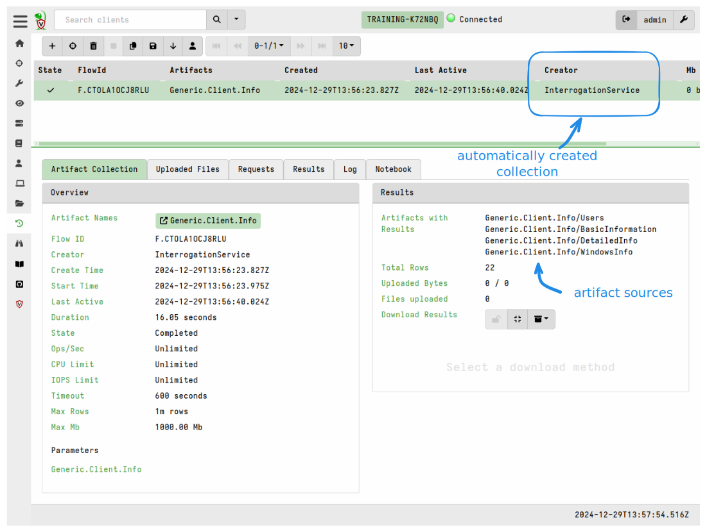

Interrogation is the term we use to describe the process of querying a host for
it's basic host information.

When a new client enrolls the server automatically schedules a collection of the
`Generic.Client.Info` artifact on the client. This is a built-in artifact that
caters for all OSes but also performs some OS-specific queries on Linux and
Windows.

Some of the information collected by this artifact is added to the client info
database and specific fields are also indexed so that we can perform
[fast searches for clients]().

## Client information updates

In old versions of Velociraptor this information was not kept up to date unless
users explicitly created periodic hunts for `Generic.Client.Info`
(see [Server.Monitoring.ScheduleHunt]() for an example).
However this information is now recollected automatically on a recurring basis
in the background.

Of course if you want to be sure you have the absolute latest info you can still
manually collect the artifact or schedule it through a hunt, but you may prefer
to just change the frequency at which the data is collected, as explained below.

If you wish to change the update frequency this can be done via the config
setting `Client.client_info_update_time`. The update is initiated by the client
which sends a `Server.Internal.ClientInfo` message to the server upon startup
and then at a defined interval. Note that this is a client setting and therefore
cannot be centrally configured from the server. By default, if this setting is
not specified in the client config, then the client info is updated once per day
(every 86400 seconds). This is usually sufficient for most deployments since the
client info generally doesn't change very often. If you need more frequent
updates you should still avoid configuring it to occur too frequently as this
imposes additional load on the server.

## Custom artifact override

While the `Generic.Client.Info` artifact covers the basic information that most
people need, you may have a specific requirement to collect additional data as
part of the client interrogation flow. You cannot edit the `Generic.Client.Info`
artifact since it is a built-in artifact, however Velociraptor allows you to
override it with a customized version of the artifact. The way this works is
that if a client artifact exists with the name `Custom.Generic.Client.Info` then
interrogation flows will use that custom version instead of the built-in
artifact.

As explained in the artifact description for `Generic.Client.Info`, you can add
additional artifact sources containing your custom queries. However, the
existing sources, particularly the `BasicInformation` source, should not be
changed as the server expects fields from these sources to be present in all
interrogation flows. There are no constraints on what your custom sources can
contain.

Background client info updates support custom artifact override.

