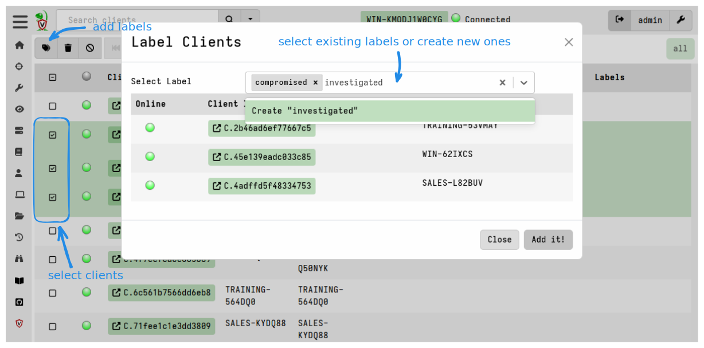
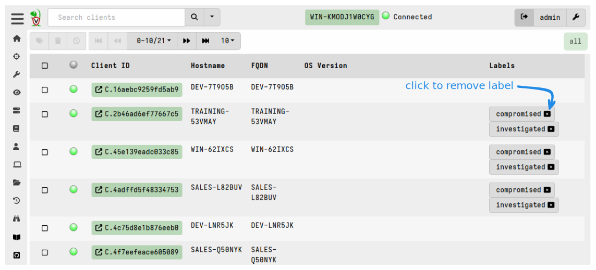

Clients can have one or more **labels** attached to them. In some software
applications the same concept is called "tags" but we just happen to call them
labels. Labels are useful when we need to hunt or perform other operations on a
well-defined group of hosts. For example, we can restrict a hunt to one or more
labels to avoid collecting unnecessary data, or to target specific hosts, or to
avoid specific hosts.

Although labels are associated with clients, the clients themselves have no
knowledge of the labels that have been applied to them. That is, labels are a
purely a server-side construct that are used to organize clients. The VQL
functions to query and manipulate labels are only available in VQL queries
running on the server.

## Adding or removing labels manually

Manual manipulation of labels can be done in the GUI's client search screen.

To add labels, select the hosts in the GUI and then click the "add labels"
(<i class="fas fa-tags"></i>)
button.





## Adding or removing labels via VQL

Although it is possible to manipulate labels manually in the GUI, it is usually
easier to use VQL queries to add or remove labels via the `label()` plugin,
especially when you need to apply label changes to many clients.

For example, let's say we wanted to label all machines with the local
user of `mike`. I would follow the following steps:

1. Launch a hunt to list all user accounts on all endpoints using the
`Windows.Sys.Users`.
2. When enough results are returned, I click the `Notebook` tab in the
   hunt manager to access the hunt's notebook.
3. Applying the query below I filter all results with the user `Mike`
   and apply the label function to that host.

Note that `HuntId` is automatically set to the hunt id inside the hunt notebook:

```vql
SELECT Name, label(client_id=ClientId,
                   labels="Mikes Box",
                   op="set")
FROM hunt_results(hunt_id=HuntId,
                  artifact="Windows.Sys.Users")
WHERE Name =~ "mike"
```

{}

Labels applied to clients essentially form groups. Many features in
Velociraptor apply to these groups and it is possible to move clients
in and out of these during the course of an investigation.

For example, client event monitoring queries are controlled via client
labels. This allows you to assign a detection rule to a group of
machines then simple add or remove machines from the group.  Similarly
it is possible to restrict a hunt to a label group then simply add
clients to the label group in order to automatically add them to the
hunt.

For a practical example of using labels with client monitoring, please see the
artifact
[Windows.Remediation.QuarantineMonitor]()
which is used to enforce network quarantine based on the `quarantine` label.

In addition, it's possible to create
[server monitoring]()
artifacts which automatically add or remove labels based on flow completion
status and results. Thus we can implement event-driven label manipulation via
VQL which in turn initiates further actions (such as assigning the client to a
particular hunt based on a previous hunt's results). In this way we can
accomplish very powerful multi-phased automation that is directed by labeling.

{}


### Built-in Labels

Sometimes you may want clients to have certain labels immediately from the time
of deployment, for example you might want to label clients as belonging to a
particular Active Directory Organizational Unit (OU) where the client was
deployed via a specific Group Policy.

Labels can be pre-assigned to clients via the client config.

Supposing we have a particular OU called `Sales`. We want to ensure that
Velociraptor clients in the Sales team are specifically marked with the `Sales`
label.

To achieve this we edit the client's configuration and specify that the `Sales`
label applies to this client.

```yaml
Client:
  labels:
  - Sales
```

With this added to the config, when the client enrolls it will tell the server
to apply the `Sales` label to it.

We then
[repackage the client MSI]()
so that it contains this modified config and then deploy it via Group Policy
only on the Sales OU. This will result in those clients being enrolled with the
`Sales` label automatically.


{}

Although any labels can be deleted on the server, the labels specified in the
client config file will return after the client restarts.

You can also change the labels in the client config at any time and any new
labels will be applied when the client restarts.

{}
