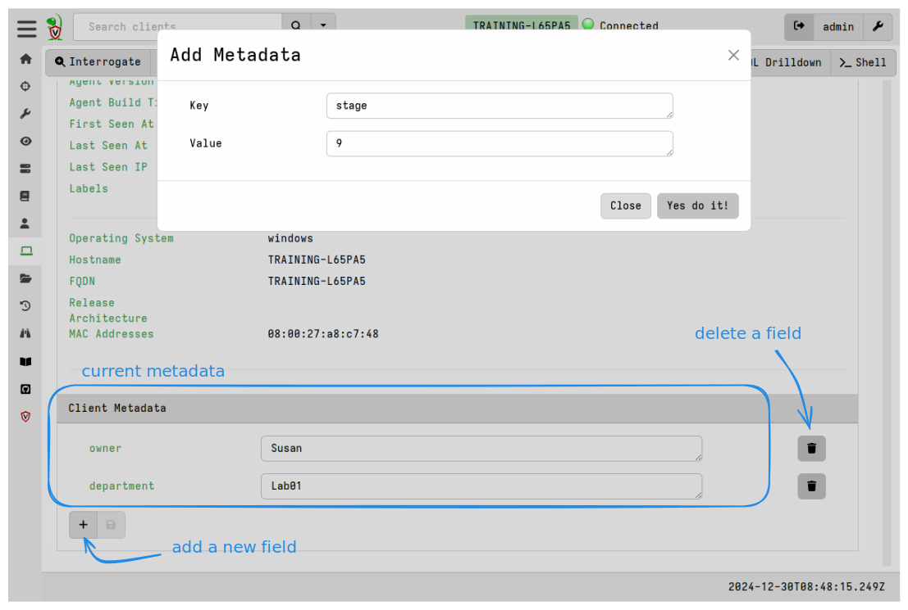
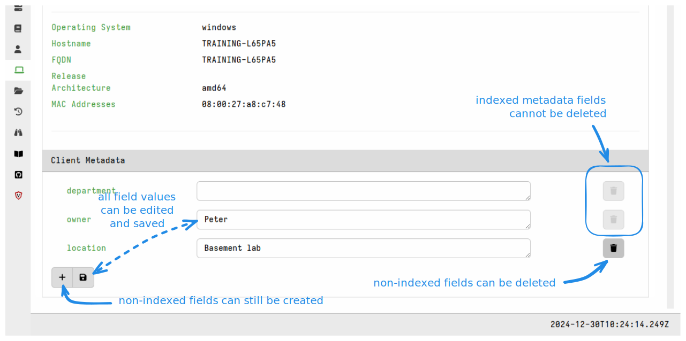

Client metadata is an arbitrary key-value store that holds user-defined
information per client.

Metadata is conceptually similar to
[client labels]() in that they:

- are data structures which exist on the server only
- are used to organize and manage clients
- are completely user-defined.

Metadata and labels differ in that metadata fields can store arbitrary key-value
pairs while labels are just values. In VQL you can think of metadata as being a dict,
and labels as being an array of string values.

## Adding or removing metadata manually

Metadata can be viewed and manually edited on the client overview page.



## Adding or removing metadata via VQL

As with labels, it is often necessary to manipulate metadata in bulk.
VQL provides us with the
[client_set_metadata]()
VQL function to do that.

Although the function operates on a single client at a time we can iterate over
all the clients using the `clients()` plugin and conditionally add or remove
metadata fields.

For example:

```vql
SELECT client_set_metadata(client_id=client_id, metadata=dict(department="Lab02"))
FROM clients()
WHERE os_info.hostname =~ "TRAINING"
```

## Accessing metadata in VQL

We access client metadata using the
[client_metadata]()
VQL function. Typically this is used in combination with the `clients()` plugin
which iterates over all client records.

```vql
SELECT client_metadata(client_id=client_id) AS Metadata FROM clients()
```

Since the client metadata for each client is a dict, in VQL it is possible to
use dot notation to access it's members. For example, if you have this metadata
set on a client:

```json
"Metadata": {
    "owner": "Susan",
    "Department": "Lab03"
    }
```

then the following query will return `Hostname`, `Owner`, and `Department` as
columns.

```vql
SELECT os_info.hostname AS Hostname,
       client_metadata(client_id=client_id).owner AS Owner,
       client_metadata(client_id=client_id).Department AS department
FROM clients()
WHERE Owner =~ "Susan"
```


## Indexed metadata

You can store arbitrary values in client metadata fields but this information is
not indexed, thus making searches on it relatively slow (because each client's
metadata blob needs to be opened, read and matched). Also, as shown above, the normal
metadata fields need to be searched using VQL and can't be easily found or used
in the GUI.

To overcome these limitations we can designate certain metadata fields as ones
that will be indexed. We do this using the server config setting
`defaults.indexed_client_metadata`.

This setting allows us to define _some_ fields in the client metadata that will
be indexed. These fields should not be too large so as to keep the index size
smallish so we recommended that you only index fields that are really useful and
then also consider limiting it's use to fields containing short strings.

Fields designated as indexed can be searched in the GUI search bar using the
field name as a search operator. Search expressions for indexed metadata fields
thus have the form: `<field_name>:<string_to_match>`.

For example, if we specify the following in the server configuration:

```yaml
defaults:
  indexed_client_metadata:
    - department
    - owner
```

Then a GUI search for `department:accounting` will match all clients where the
metadata key `department` and contains the value `accounting`. Searches using
the `owner` keyword are also possible.

Indexed metadata fields cannot be deleted because they are created for all
clients with the initial value being empty. Their values can be set, unset or
updated in both the GUI and via VQL (using the same client metadata functions we
described above.)

Non-indexed metadata fields are unaffected by the presence of indexed fields and
can still be created and deleted in the GUI or VQL.



