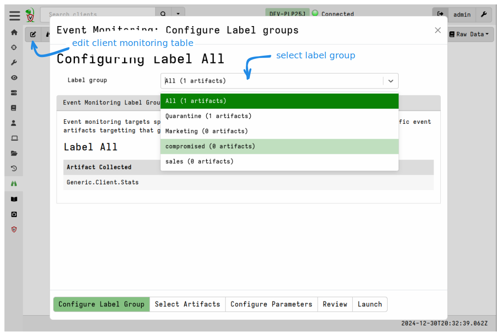
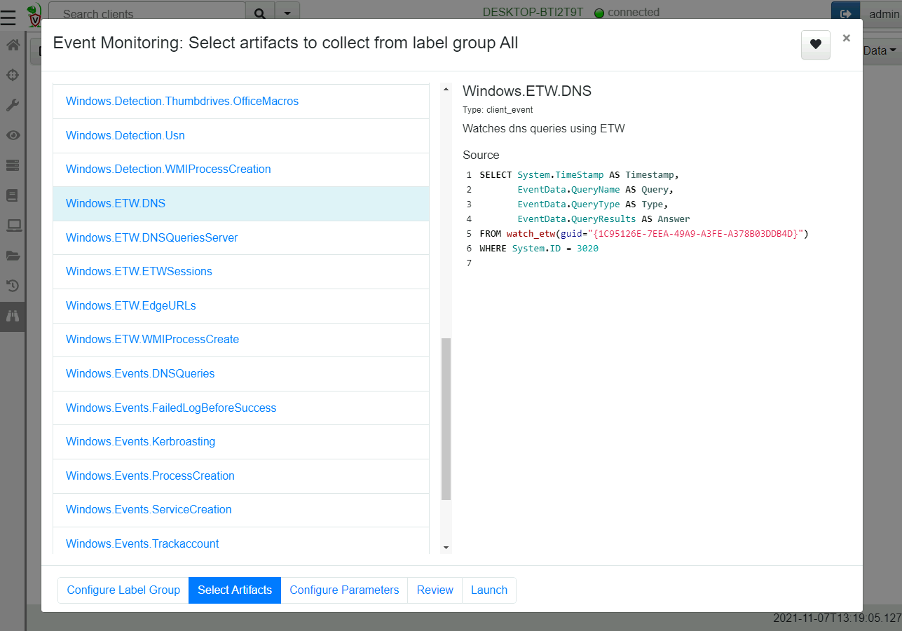
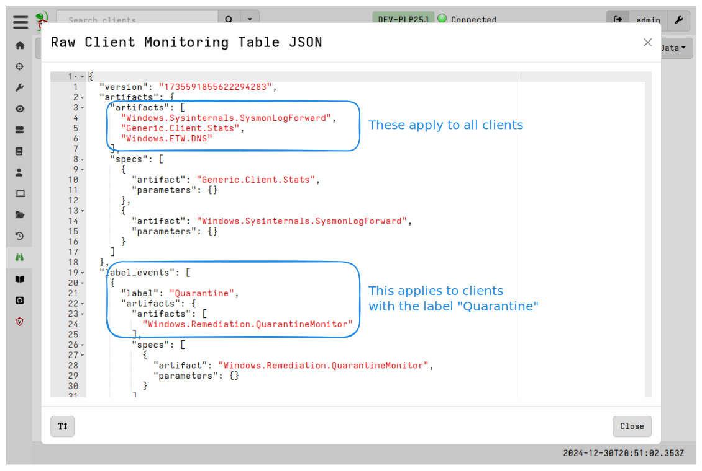
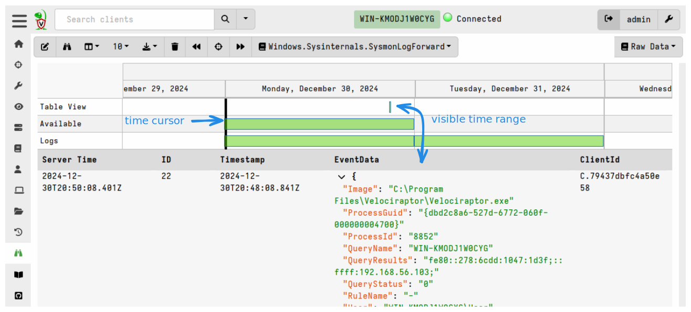
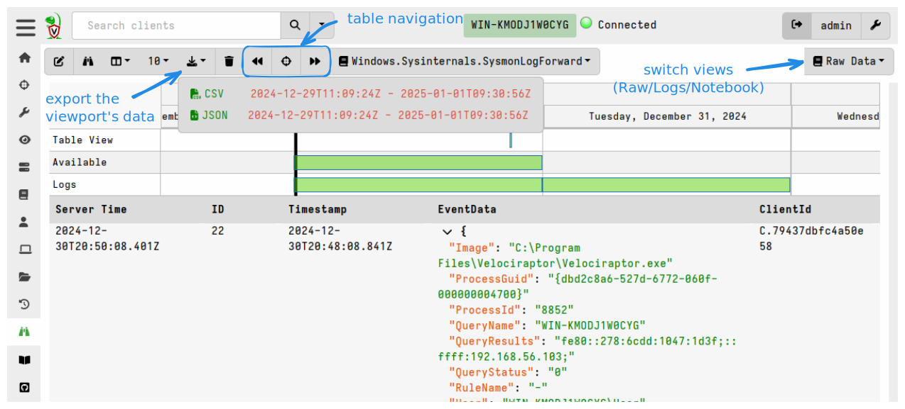

We have previously seen how VQL [Event Queries]() are simply VQL queries that never terminate,
generating a row for each event that occurs.

We can use this property to monitor for events on the endpoint. In
order to build an effective client monitoring framework we need three
components:

1. A number of event plugins that can detect events on the
   endpoint. For example:
   - `watch_etw()` allows Velociraptor to monitor ETW events on Windows
   - `watch_syslog()` allows following syslog events on Linux

2. Once events are detected and emitted by VQL plugins, we can use the rest of
   the VQL query to process these events, for example by applying further
   filtering or enriching with additional data.

3. Finally a client monitoring architecture must be used to ensure
   event queries are always running and forward these events to the
   server.

In this page we discuss the client monitoring architecture and
demonstrate how it can be used to feed events from the endpoint to the
server.

{}

VQL event plugins generally start with the word "watch" to indicate they are
event plugins (e.g. `watch_etw`, `watch_evtx`, `watch_usn` etc). Usually event
plugins will have a corresponding non-event plugin, for example `watch_etvx()`
is an event plugin that watches evtx files for new events and does not
terminate, while `parse_evtx()` is a non-event plugin which simply parses the
evtx files from beginning to end.

You can search for all available plugins in the
[VQL Reference](),
or browse the event plugins listed
[here]().

{}

## Client monitoring architecture

The client maintains a set of VQL Event Queries that are all run in parallel.
This is called the **client monitoring table** (or "event table" for short) and
it gets synced from the server when needed. The client stores these Event
Queries locally in it's **writeback file** so that they are available as soon as
the client starts - even when not online.

If the client is offline, the results of these queries will be queued in the
client’s local file buffer (defined in `Client.local_buffer` in the config),
until the client reconnects again, at which time they are sent to the server.
This architecture ensures that clients that are monitoring a data source do not
miss events, even when the host is offline. It also means that clients are able
to monitor for events autonomously - the server is only needed to occasionally
sync the client's monitoring table in the event that it changes.

The event queries in the client monitoring table start running when the client
starts and continue running indefinitely. When any of these event queries
produce rows, the client streams these events to the server which writes them to
the datastore.

## Installing client event queries.

To edit the client monitoring table you must first have a client selected. Then
from the sidebar choose **Client Events** and then click the "Update client
monitoring table" button.

Client monitoring queries can apply to all clients or be targeted based on
client labels. We refer to the set of all clients having a specific label as a
**label group**.

- Event Artifacts assigned to the the label group "All" apply to all clients
  regardless of label or OS type (although artifact preconditions are
  still honored).

- Event Artifacts can target specific label groups. If the client has
  that label applied then the event table for that client will include
  the event artifacts assigned to that label group.

{}

Note that label group membership is dynamic - clients may be added or
removed from label groups at any time by applying or removing the
relevant label. Applying a label to a client automatically updates the
client event monitoring queries as well.

In this way it is possible to assign clients to label groups that require
different sets of monitoring queries. For example perhaps you wish to monitor
only some of your end points for powershell or psexec executions some of the
time. This can be done by applying the relevant label to those clients and
removing the label when done.

{}

### Selecting event artifacts to apply

Velociraptor uses [Artifacts]() which package
VQL queries in a structured YAML file, and this applies to event queries too.
Event artifacts are identified by `type: CLIENT_EVENT` in the definition YAML.

In the steps that follow the artifact selection UI looks very similar to the new
collection UI or new hunt UI. The main difference is that the artifact selection
UI in the Event selection workflow only shows client event artifacts, that is
artifacts which have `CLIENT_EVENT` as their type.

If you create a new event artifact, be sure to mark it as a `CLIENT_EVENT` type
or else it will not appear in the artifact selection list for client events.

In the next step we can select which artifacts will be applied to this label
group.

For this example, we select the `Windows.ETW.DNS` artifact to collect
DNS lookup from clients.

### Inspecting the current monitoring table

The current configuration can be viewed by clicking the
**Update client monitoring table** button.

### Viewing collected events.

Once the client syncs its client monitoring table, it will start
forwarding events to the server. Events are simply rows returned by
the VQL query. The server simply stores these rows in the datastore
and provides a timeline based UI to inspect the data.

The view is split into two halves. The top half is the timeline view
while the bottom half is the table view. The events are viewed in
the table, while the timeline view provides a quick way to navigate
to specific time ranges.

The timeline view is split into three rows:

1. `Table View` visualizes the time range visible in the table currently.
2. `Available` shows the days which have any events in them.
3. `Logs` visualizes the days that have any logs in them (You can view query
   logs by selecting the `Logs` pull down on the top right).

You can zoom in and out of the visible time ranges using `Ctrl-Mouse
Wheel` or by clicking the timeline itself.

By clicking the tool bar it is possible to page through the table to
view visible events. If you need to export the data, simply click the
`Export` button and select either JSON or CSV format. The export
functionality applies to the visible time range only so you can fine-tune
which events should be exported (simply zoom the visible range in or
out to include only the desired data).

{}

Although VQL queries emit rows in real time, the Velociraptor client does not
immediately forward the event row to the server. This is done to avoid
too-frequent communications with the server. Instead, the client will batch rows
in memory (by default for 120 seconds) and send each batch in a single POST
upload. This means that it could take up to 2 minutes for events to appear at
the server once a new artifact is added to the client event table.

{}

### Further processing client monitoring events.

Client event queries simply run on the endpoint and forward rows to
the server. The event queries generally fall into two categories:

1. Those that collect real time data such as ETW logs, process executions logs,
   Sysmon logs etc. These are typically collected by Velociraptor and sent
   directory to an external system (e.g. Elastic or Splunk). Typically the VQL
   for such queries contains minimal filtering and the client acts mainly as an
   event forwarder for these event sources.

2. Selective and targeted queries. These artifacts contain refined detection and
   enrichment logic within the VQL query itself such that only high value events
   are actually forwarded. These more targeted queries send fewer rows, but each
   event is expected to have significant value, especially if it represents a
   detection.

In either case, the Velociraptor server does not do anything with the
events collected by default, other than write them to storage. If you want the
server to perform additional actions with the incoming events then you should
use [server side event queries]().
