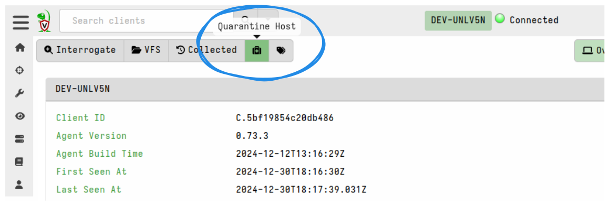
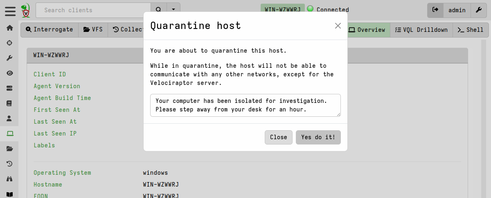
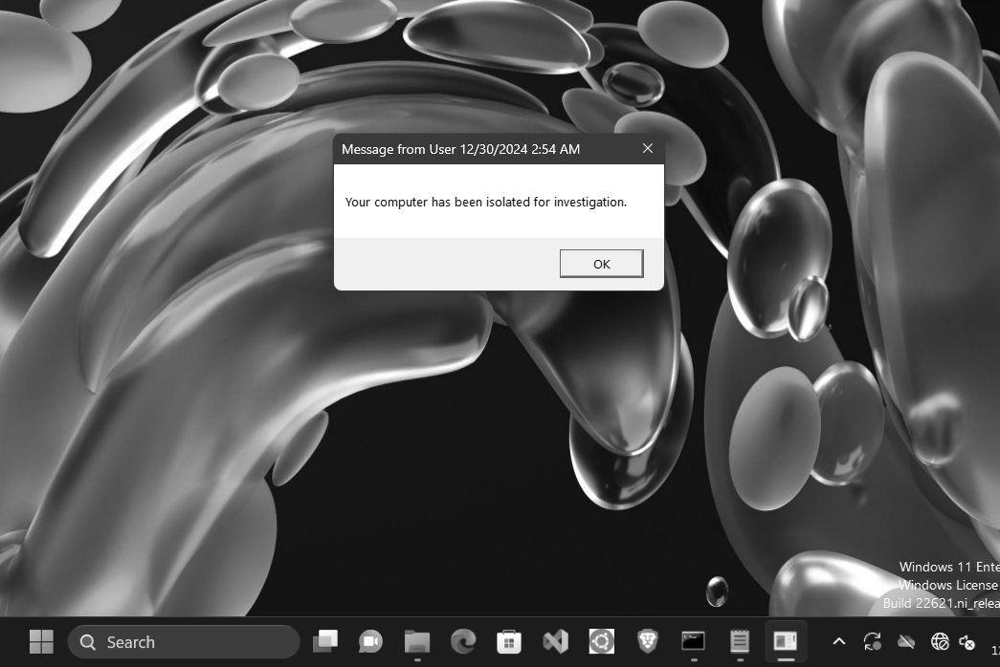

For Windows and Linux clients you can quarantine the host using the
**Quarantine Host** (<i class="fas fa-briefcase-medical"></i>) button.
Quarantining a host will reconfigure the hosts's network stack to only allow it
to communicate with the Velociraptor server. This allows you to continue
investigating the host remotely while preventing the host from making other
network connections.

When quarantining a host you can send a pop-up message to the logged on users.

{}

Velociraptor's quarantine artifacts rely on the operating system to perform the
quarantine action. If dependencies are not met (for example nftables is a
required dependency on Linux) or if the system is corrupted or severely
compromised, or for many other reasons, the quarantine action may not work.

We provide no guarantees or assurances for this functionality. You should
always check for issues in the logs and outputs for quarantine artifacts.

{}

The quarantine action is implemented by the following artifacts:

- [Windows.Remediation.Quarantine]()
- [Linux.Remediation.Quarantine]()

There is currently no quarantine artifact or capability for macOS.

On Windows and Linux the quarantine mechanism is specific to the OS but the
overall principles of operation are the same. For more details please see the
artifact descriptions included in each of the above artifacts.

A quarantined client will gain the label `Quarantine` so you can easily search
for all quarantined hosts using the
[label search]() feature.

## Windows-specific quarantine aspects

For Windows clients the quarantine process is label-driven.

A default client event monitoring query (implemented by the artifact
[Windows.Remediation.QuarantineMonitor]())
checks for the presence of the `Quarantine` label on Windows clients. If the
label is present then it runs the
[Windows.Remediation.Quarantine]()
artifact which applies the quarantine (IPSec policy-based network isolation).

The quarantine action is periodically reapplied which means it remains in
effect across reboots.

Removing the `Quarantine` label from a Windows host will cause the artifact
`Windows.Remediation.Quarantine` to be run again, but this time with it's
parameter `RemovePolicy` set which will unquarantine the host.
