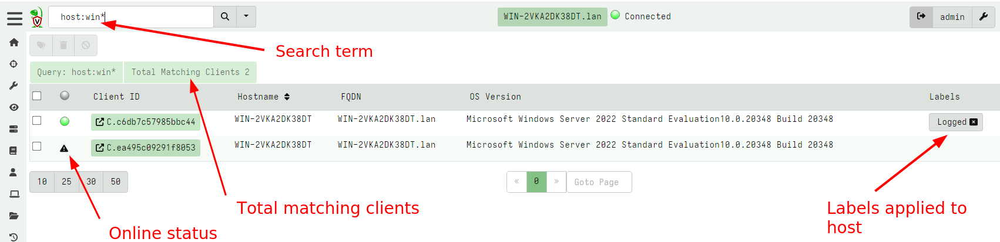
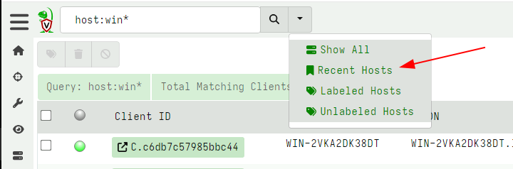
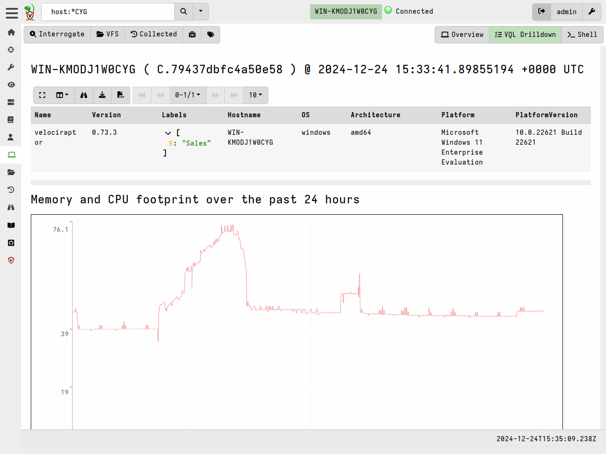

### Searching for a client

To work with a specific client, search for it using the
search bar at the top of the Admin GUI. Click the Search or Show All icon
to see all the clients.

{}
You can use the following prefixes as well:

* `all`: show all clients
* `label:` to search clients with a label
* `host:` to search for hostnames.
* `ip`: to search based on IP address
* `mac`: to search based on MAC addresses
* `recent`: see all the recent clients this user interacted with.

Clicking on the `online status` column header toggles the search
between all clients and only those that are currently online.

{}

The search function uses a client index so can quickly
identify clients by hostname in the GUI. More complex search
requirements should be done in a notebook using full VQL syntax.

The results from the search are shown as a table.

The table contains five columns:

1. The **online state** of the host is shown as a color icon. A green
   dot indicated that the host is currently connected to the server, a
   an exclamation icon indicates the host is not currently connected
   but was connected between 15 minutes and 24 hours ago. A warning
   triangle indicates that the host has not been seen for 24 hours or
   more.

2. The **client ID** of the host is shown. Clients have a unique ID
   starting with `C.`. Internally, the client ID is considered the
   most accurate source of endpoint identity. Velociraptor always
   refers to the client ID rather than the hostname because hostnames
   can change. A client ID is derived from the client's cryptographic
   key and is stored on the endpoint in the client `writeback
   file`. Clicking on the client id will take you to the host
   information screen.

3. The **hostname** and **Fully Qualified Domain Name** reported by
   the host.

4. The **operating system version**. This indicates if the host is a
   Windows/Linux/MacOS machine and its respective version.

5. Any **labels** applied to the host. Clicking on a label removes the
   label from this host.

{}

Once you view a particular host, the GUI will automatically remember it in a most recently used list (MRU). You can view your recent searches easily by selecting it from the gui.

{}

### Selecting a client

Click on any client in the search screen to view information relevant
to the selected client.

You can easily tell which client we are dealing with as the name of
the host, and the last time we connected with it are shown:

Velociraptor maintains some basic information about the host, such as
its hostname, labels, last seen IP, and last seen time. This is shown
in the `Host View` pane. Velociraptor uses this information to make it
possible to search for this host and target it for further
investigation. Velociraptor gathers this information constantly from
the endpoint and upon first enrollment, so this information should be
relatively up to date. You can refresh this information at any time by
clicking the `Interrogate` button.

Each client has arbitrary metadata so you can integrate it easily into
your procedures. You can use this metadata to implement more complex
procedures using VQL artifacts.

Ultimately, interrogation simply collects the `Generic.Client.Info`
artifact from the endpoint. The `VQL Drilldown` page shows more
information about the client, including telemetry of the client's
footprint on the endpoint and more information about the endpoint.

{}

You can quarantine a host from this screen. Quarantining a host will
reconfigure the hosts's network stack to only allow it to communicate
with the Velociraptor server. This allows you to continue
investigating the host remotely while preventing the host from making
other network connections.

Quarantining is implemented using an event monitoring query which
means it persists across client reboots. A quarantined client will
gain the label `Quarantine` so you can easily search for all
quarantined hosts using the label search feature above.

Removing the quarantine label from a host will immediately
unquarantine the host. Read further how to automatically apply and
remove labels based on various events - this allows you to
automatically quarantine a host too!

{}

### VQL drilldown

Selecting the `VQL drilldown` screen will display an overview of
information about a host.

